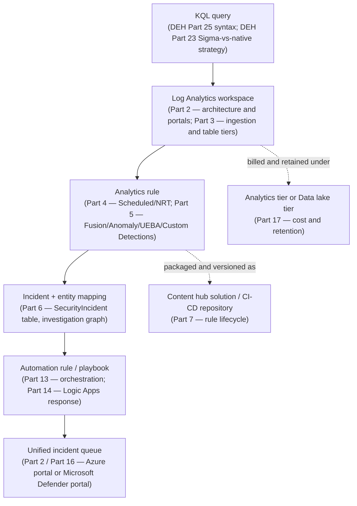

# Part 1 — Why This Book: From Query to Platform

## Why this part exists

*The Detection Engineering Handbook* (DEH) V2 ends a detection's story at the moment it becomes a
correct, tested query. DEH Part 25 teaches the Kusto Query Language (KQL) dialect that Microsoft
Sentinel and Microsoft Defender share — the pipe model, `where`/`join`/`summarize`, time-window
functions, the join-strategy hints that keep a query fast — and DEH Part 23 frames the decision
that produces that query in the first place: author it once in Sigma for portability across
backends, or write it natively against one platform's table catalog and accept the maintenance
cost of a single-platform rule. Both parts stop at a validated query. Neither part asks what
happens to that query the moment someone has to run it forever, on someone else's infrastructure,
under someone else's billing model, in front of an analyst who didn't write it.

That gap is this book. A KQL query that correctly matches DET-23-01 — DEH's own worked example, a
process opening a suspicious handle to `lsass.exe` — is not yet a detection a SOC can operate. It
has no workspace to run against, no rule type hosting its schedule, no entity mapping turning its
output columns into an investigable incident, no automation deciding what happens the moment it
fires, no assigned cost tier, and no settled answer to which of Microsoft's two portals the
analyst who triages it will actually be looking at. *Microsoft Sentinel Operations* covers exactly
that: the platform-operations layer sitting between a correct query and a durable, monitored,
cost-accounted piece of production SOC infrastructure. This part states what that means precisely,
names the one honesty constraint that governs every figure and claim in the other seventeen parts,
and maps the book so a reader can find the part that answers their actual question instead of
reading eighteen parts to find it.

## 1. Where the query stops and the platform starts

**[CONCEPT]** A validated query is a claim about telemetry: given this data, this logic correctly
identifies this behavior. A platform is a claim about operations: given this logic, running
continuously, at production volume, this organization can afford it, monitor it, respond to what
it finds, and keep doing all three after the person who wrote it has moved to a different team.
Those are different engineering problems, and treating them as one — writing a good query and
assuming the platform question answers itself — is the specific failure this book exists to head
off.

Microsoft Sentinel makes the distance between those two problems concrete in a way that's easy to
underestimate from the query side alone. A query that becomes a **Scheduled rule** (the most
configurable rule type — engineer-set query frequency and lookback window, full entity mapping and
alert-grouping control) runs on a frequency and lookback window an engineer chose, against a
workspace with its own retention and cost profile, producing alerts that a separate configuration
layer (entity mapping) has to convert into something an investigation graph can reason about. The
same query, packaged instead as a **Fusion** rule (Advanced multistage attack detection — single
instance, not customizable, unavailable once Defender XDR incident integration is on), doesn't
behave like a tunable detection at all — it's a single, non-deployable-by-you correlation engine
you either have available or don't, depending on a platform configuration choice made somewhere
else in the book (Part 16). The query's correctness never changes across that difference.
Everything about whether it's usable in production does.

> **Engineering Reality**
> A detection engineer who has only ever validated a query against a static dataset tends to treat
> "the query works" as the finish line. In Sentinel, the query is closer to the starting line: it
> still needs a workspace with retention that matches the investigation timeline it's meant to
> support, a rule type whose cadence and feature set actually fit the detection's latency
> requirement, entity mapping that survives the analytic's own edge cases (DEH Part 25 §4's
> shared-identifier problem shows up again here, not abstractly), an automation decision for what
> happens when it fires at 3 a.m. with no analyst watching, and a portal destination that, as of
> this writing, is actively changing under every workspace running the platform. None of that is
> optional infrastructure around the detection — it *is* the detection, in the only form that
> matters to the SOC actually running it.

**[SENTINEL ENGINEER]** The entity-mapping point above deserves a concrete illustration, because
it's the single most common place a query that behaved correctly in isolation starts behaving
differently once it's wired into a rule. A query that returns a `DeviceName` column is not, by
itself, a query that produces a usable Host entity in the resulting incident — entity mapping is a
separate configuration step on the rule object, one that decides which output column maps to which
entity type and which identifier field within it. Get that mapping wrong or leave it default, and
two alerts that are actually about the same host can land in two different incidents, or two alerts
about two different hosts that happen to share a mapped identifier can land in one — the same
failure mode DEH Part 25 §4 documents for a `DeviceId` that isn't actually a unique key on a
multi-user host, now expressed as a platform configuration choice rather than a query-logic one.
Part 6 covers the full mechanics; the point here is narrower: this is exactly the kind of decision
that doesn't exist yet at the moment a query is "just correct," and exists only once that query
becomes a platform object.

## 2. The honesty constraint, stated once, in full

**[CONCEPT]** This book's author has no real Microsoft Sentinel tenant, no real Log Analytics
workspace, and no Microsoft Defender portal license in their environment. Every claim in this
book's other seventeen parts traces back to Microsoft's own public documentation, not to a
screenshot taken from a live system or a result validated against production telemetry the author
controls. That is a materially different evidentiary position than DEH's, where the parent
handbook draws real captured evidence from a home-lab environment the author built and operates.
No equivalent lab exists here, and this book does not pretend otherwise.

The practical consequence, enforced throughout by this book's `STYLE-GUIDE.md` §9, is that every
figure in this book uses one of exactly two evidence-class tags: `OFFICIAL REFERENCE` (adapted from
a cited Microsoft Learn page, with a full source citation and retrieval date) or `CONCEPTUAL` (an
illustrative architecture or data-flow sketch that makes no claim of being captured from a real
system). The two evidence classes DEH also defines — `CONTROLLED LAB EXAMPLE` and `REAL LAB
EXAMPLE`, both meaning evidence captured from an environment the author actually built or observed
— are retained in this book's style guide only as a definition, never as a usable tag, because
using either one here would assert something false about where the evidence came from. If a future
edition of this book is written against a real tenant, that's a deliberate, recorded change to the
book's evidence base, not a tag quietly picked because it seemed to fit a given figure (see
`STYLE-GUIDE.md` §9.4).

This constraint shapes what this book can and can't do for a reader. It can tell you, with a
citation, what Microsoft's documentation says a feature does, what a published limit or default
is, and what a rule type's dependencies are. It cannot show you what your own workspace's specific
data volume does to a scheduled rule's actual runtime, what your own tenant's Defender-portal
onboarding does to an automation rule you already have deployed, or whether a documented default
still matches what you see in your own environment on the day you read this. Every part in this
book that makes a specific, checkable claim — a limit, a price, an availability rule, a retirement
date — is written to be re-verified against the cited source, not trusted indefinitely; that's what
this book's `PRODUCT VERSION NOTE` callout exists to force, and why it names a source and a
re-check date every time it appears rather than asserting a fact as settled.

## 3. Six layers between a KQL query and an incident an analyst can act on

**[CONCEPT]** Stated as a single pipeline, the distance this book covers looks like Figure 1.1: a
validated KQL query becomes a durable platform object by passing through a workspace, a rule type,
an incident, an automation layer, a cost tier, and a portal — in roughly that order, with the
content-packaging question (how the rule itself is versioned and distributed) wrapped around the
whole thing rather than sitting at one point in the sequence.

**Figure 1.1 — From KQL query to SOC-visible incident: this book's six-layer path.** *CONCEPTUAL.*
Illustrates the sequence of platform objects a validated query passes through before an analyst
sees its output as a working incident, and which part of this book covers each layer. This is a
structural sketch built from this book's own reading of Microsoft's Sentinel/Defender architecture
documentation cited in later parts' own reference lists — not a capture of any Sentinel UI screen,
and not a reproduction of an official Microsoft architecture diagram.

**[ENGINEERING]** Two things about Figure 1.1 are worth naming up front, because they're easy to
misread from the diagram's straight-line shape. First, the workspace layer isn't a passive
container — which tier a table lands in (the analytics tier versus the data lake tier, Part 3 and
Part 17) is itself a decision made before a rule ever runs, and it constrains what that rule can
query cheaply. Second, the last box in the chain — the portal — isn't a fixed destination. It's the
one layer in this diagram actively changing on a vendor timeline outside this book's or the
reader's control, which §5 below covers as this book's first `PRODUCT VERSION NOTE`.

## 4. Platform layer, operations layer: the split this book reuses from DEH

**[CONCEPT]** DEH organizes its own content into a **telemetry layer** (what data exists and how
it's structured) and an **analytic layer** (what a detection engineer builds on top of that data).
This book reuses the same shape under different names because the underlying problem — don't
conflate "what the substrate does" with "what you build on top of it" — is the same problem,
applied to a vendor platform instead of a telemetry source:

- **Platform layer.** What Microsoft Sentinel and Microsoft Defender actually are, how data moves
  through them, and what a given feature does and doesn't do regardless of who's operating it —
  workspace architecture, the two-portal split, connector mechanics, table tiering, the mechanics
  of UEBA's baselines, what Security Copilot is actually wired into. Parts 2, 3, 6 (the mechanics
  half), 11, 12, 15, and 17 sit mostly here.
- **Operations layer.** What a SOC builds and runs on top of that platform — rule authoring, entity
  mapping choices, watchlist curation, automation-rule and playbook design, tuning, content
  lifecycle management. Parts 4, 5, 7, 8, 9, 10, 13, 14, and 18 sit mostly here.

The split isn't a hard wall — Part 6 explicitly straddles it, and Part 16 (the Defender-portal
migration as a program-management problem) is operations layer content about a platform-layer
fact — but it's the same discipline DEH's own architecture notes name as a defect to avoid when
skipped: conflating "how ingestion billing works" with "how to write a good analytics rule"
produces shallow coverage of both, because the two questions have different audiences, different
failure modes, and different rates of change.

## 5. The two-portal fact, and the one date every later part has to account for

**[ENGINEERING]** Microsoft Sentinel is operated from one of two web experiences. **The Azure
portal** is Sentinel's original home — a Sentinel-enabled Log Analytics workspace surfaced as an
Azure resource inside the general Azure portal. **The Microsoft Defender portal** is the newer,
converged experience: a Sentinel workspace onboarded there has its incidents, hunting surface, and
(with caveats this book's Part 13 and Part 16 both treat as a first-class operational hazard, not
a footnote) automation-rule behavior moved into the same queue and correlation engine Defender XDR
already populates from Defender for Endpoint, Defender for Identity, Defender for Cloud Apps, and
Defender for Office 365. Which portal a given workspace uses is not a cosmetic UI preference — it
changes which menu paths exist, which incident fields are populated, and in some documented cases
which rule types are even available (Part 5's Fusion example above is one instance of this; Part
16 catalogs the rest).

> **PRODUCT VERSION NOTE (as of 2026-09-15)**
> Microsoft Sentinel in the Azure portal is scheduled for retirement on March 31, 2027; after that
> date, Sentinel is only available in the Microsoft Defender portal, and every workspace still in
> the Azure portal is redirected automatically. Microsoft's own "What's new in Microsoft Sentinel"
> page and its unified security operations platform overview documentation on Microsoft Learn
> carry this date as of this writing. If you're reading this after that date, or your organization
> has already migrated, treat every Azure-portal-specific menu path or procedure in Parts 2 and 16
> as historical context for understanding a migration that has already happened to you, not as a
> live how-to — and re-check Microsoft Learn directly rather than trusting this book's date
> indefinitely.

That date is why this book, starting in this part, never uses "Azure" or "Defender" alone to mean
a portal — both words are also product names, and in a book about a platform actively moving
between two experiences with those exact names, the ambiguity is precisely the kind of confusion
that produces a wrong menu path in a reader's own tenant. Every later part expands both portal
names in full on first mention and uses "the Defender portal" as the only acceptable short form
after that.

> **What Would Change My Mind**
> This book treats "plan for the Defender portal as the only long-term option, on a timeline tied
> to the published retirement date rather than an indefinite one" as the correct default
> recommendation for any team still running Sentinel in the Azure portal today (Part 16 gives this
> its full program-management treatment). If Microsoft reversed the retirement decision, extended
> the date substantially, or shipped a durable Azure-portal-parity commitment beyond March 31,
> 2027, that recommendation would need to soften from "migrate on a schedule tied to this date" to
> "migrate on your own schedule" — a materially different message to give a SOC manager planning a
> multi-quarter project around a date this book currently treats as fixed.

## 6. How the next seventeen parts are organized

**[CONCEPT]** The book runs in eight sections, eighteen parts total — deliberately fewer than the
full range a book like this could run to, because the scope is one vendor's platform-operations
layer, not a full detection-engineering curriculum DEH already owns by reference. The table below
is the map; use it to jump directly to the part that answers the question you actually have
instead of reading in sequence.

| Section | Parts | Scope |
|---|---|---|
| A — Platform Foundations | 1–3 | This framing part; workspace architecture and the two-portal split; connectors, Data Collection Rules, and table tiers |
| B — Detection Content Engineering | 4–7 | Scheduled/NRT rules; Fusion/Anomaly/UEBA/Custom Detections; entity mapping and the incident model; content packaging and CI/CD |
| C — Investigation, Hunting, and Reference Data | 8–10 | Workbooks and dashboards; hunting queries, bookmarks, and notebooks; watchlists and reference data |
| D — Behavioral Analytics and AI | 11–12 | UEBA baselines and scores; Security Copilot and agentic platform tooling |
| E — SOAR and Automation | 13–14 | Automation rules as incident-level orchestration; Logic Apps–based playbooks |
| F — Defender XDR Convergence | 15–16 | Signal convergence into one incident queue; migration and portal parity gaps as an operations problem |
| G — Cost, Retention, and Governance | 17 | Analytics tier vs. data lake tier, commitment pricing, retention |
| H — Tuning and Troubleshooting | 18 | Rule health, auto-disable, correlation-engine surprises, canary-query discipline |

Two things about that map are worth stating explicitly rather than leaving implicit. First,
Sections F and the Part 2/16 portal split are the parts most likely to date fastest, because they
describe an active platform migration with a published hard retirement date sitting inside this
book's own planning horizon — every unit in those parts carries a mandatory `PRODUCT VERSION NOTE`,
not an optional one. Second, Parts 11 and 12 look similar from a distance — both are "Microsoft's
machine-learning layer on top of Sentinel data" — but they're split because UEBA is a mature,
multi-year GA capability with a stable table schema, while Security Copilot and the platform's
newer agent-facing tooling are the fastest-changing surface in the entire book; merging them would
force one callout density onto content that mostly doesn't need it.

Three appendices sit behind the eighteen parts rather than inside them: `A1` collects the
quick-reference decision tables (connector family, rule type, entity type) that Parts 3 through 6
each build up piece by piece; `A2` is the cost-and-retention decision matrix behind Part 17, kept
separate specifically so it can be re-dated and re-verified on its own schedule as pricing changes
without touching Part 17's narrative prose; `A3` is a single lookup table collecting every
DEH cross-reference used anywhere in this book's Part Table, so a reader working from either book
can navigate to the other without re-deriving the mapping from prose each time.

The table below states, topic by topic, which book owns which half of the query-to-platform
pipeline this part introduced in §3 — a standing reference for whenever a later part in this book
points back to DEH instead of re-explaining something DEH already teaches.

| Topic | DEH's coverage | This book's coverage |
|---|---|---|
| KQL syntax — pipe model, `join`/`summarize`, time windows | DEH Part 25 — full syntax treatment against the Sentinel/Defender table catalog | Assumed known; cross-referenced on first use, never retaught |
| Sigma-vs-native authoring tradeoff, translation loss | DEH Part 23 — the general framing, using DET-23-01 as its canonical example | Referenced where a Sentinel-specific instance of the same tradeoff appears (Part 5, Part 7) |
| Analytics-rule YAML, CI/CD wrapper metadata, rule-repository structure | Explicitly excluded from DEH Part 25's own scope note | Part 7 — Detection Content Lifecycle owns this by name |
| Entity resolution and correlation theory | DEH `TERMINOLOGY.md` § Entity Key / Entity Resolution; DEH Part 30 | Part 6 — Sentinel's concrete entity-mapping implementation and where it fails the same way DEH's own example fails |
| Baselining technique, in general | DEH Part 31 | Part 11 — Sentinel's specific UEBA tables, peer-group scoring, and the two distinct anomaly scores |
| What a deployed rule costs, who sees it, and what portal it lives in | Out of scope for DEH by design | This book's core subject — Parts 2 through 18 |

## 7. What this book assumes you bring, and where to get it if you don't

**[CONCEPT]** This book assumes a working knowledge of KQL syntax and the Sigma-versus-native
authoring tradeoff — not platform-specific fluency, just the query-language fundamentals DEH Part
25 and DEH Part 23 already teach. If a later part's KQL fragment (this book shows fragments, not
full freestanding queries — see `STYLE-GUIDE.md` §3 for why a full detection query belongs in DEH,
not here) doesn't parse cleanly on first read, that's the signal to go read DEH Part 25 first, not
a gap this book will backfill; re-teaching KQL syntax here would duplicate content DEH already
owns and this book explicitly declines to duplicate, per this book's own structural decision to
cross-reference rather than re-teach.

What this book does not assume is access to a live Sentinel tenant. Every procedure, table
reference, and rule-type description in the following seventeen parts is written to be useful to a
reader with no workspace to test against — a SOC lead evaluating whether to adopt the platform, an
engineer preparing for a migration that hasn't started yet, an analyst who uses a tenant someone
else administers and needs to understand what they're looking at. That's a direct consequence of
this part's §2: since the book itself has no tenant to validate against, it's written the way any
reader without one would need it written — sourced, dated, and honest about which claims are a
documented fact versus this book's own structural or editorial judgment.

## 8. How to read a part in this book

**[CONCEPT]** Every part carries the same front-matter contract: `title`, `part`, `author`,
`reviewer`, `status`, `last_validated`, and `depends_on`. The last field is worth pausing on
because it means something slightly different here than it does in a book with no companion
volume — a `depends_on` entry can point at another part of this book by number, or at a DEH part
directly using the form `DEH-23`, `DEH-25`, and so on, so a reader can tell without guessing which
book a bare dependency number belongs to. `status` and `last_validated` matter more in this book
than they would in a book about stable architecture, precisely because of §5's retirement date and
the broader pattern it exemplifies: a part can be well-written and still be stale, and the
front matter is where a reader checks which is true before trusting a specific figure or limit.

Reading order matters less than the map in §6 suggests at first glance. A reader who already knows
why the two-portal split exists can skip straight to the section covering their actual question;
the callouts are built to make that safe. A `PRODUCT VERSION NOTE` always names its own source and
re-check date inline, so a reader who jumps into Part 17 cold for a retention number doesn't need
Part 1's framing to know whether to trust it — they need the callout itself, which is designed to
stand alone. The table below is a quick reference for what each recurring callout signals, useful
when a part's callout density (see `STYLE-GUIDE.md` §6.10) leaves a reader wondering why one box
appeared and another didn't.

| Callout | Signals |
|---|---|
| `PRODUCT VERSION NOTE` | A fast-moving platform fact — availability, price, retirement date — stated with a named source and a re-check date |
| `What Would Change My Mind` | A judgment call this book makes on top of a fact, plus the specific evidence that would reverse it |
| `Engineering Reality` | The operational cost hiding behind a feature that looks simple from the query side alone |
| `Blind Spot` | A documented gap in what a rule, entity map, or automation path actually covers |
| `False Positive Trap` | A platform- or logic-level noise source — in this book, as often a platform-behavior artifact as a legitimate user tripping a threshold |
| `Detection Autopsy` / `Detection Test` | Actual rule or automation logic — appears only in Parts 4, 5, 13, and 14, never elsewhere for the sake of quota |
| `SOC Management View` | A staffing, licensing, or risk-acceptance decision, not a technical one |

The six content tags (`[CONCEPT]`, `[ANALYST]`, `[SENTINEL ENGINEER]`, `[THREAT HUNTER]`,
`[ENGINEERING]`, `[SOC MANAGEMENT]`) work the same way across every part: they mark who the
paragraph is actually for, so an analyst working the unified queue can skip a `[SENTINEL ENGINEER]`
paragraph about watchlist curation without missing anything they needed, and vice versa. This part
leans almost entirely on `[CONCEPT]`, with `[ENGINEERING]` and `[SENTINEL ENGINEER]` appearing only
where a concrete platform or rule-configuration example was needed to ground the framing — later
parts carry a denser, more evenly distributed mix across all six tags, per the "which column does
this fall under" test `STYLE-GUIDE.md` §7 sets out.

---

**Cross-references:** DEH Part 23 (Query Language Strategy), DEH Part 25 (KQL — Sentinel/Defender).
