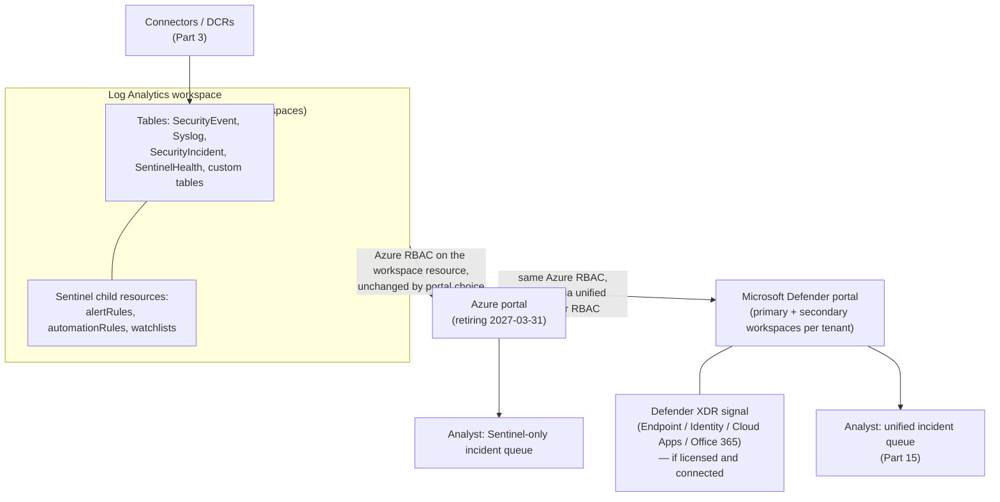

# Part 2 — Log Analytics Workspace Architecture and the Two Portals

## Why this part exists

DEH Part 25 §1 already draws the distinction a working Sentinel operator needs first: KQL queries against Microsoft Sentinel run against a Log Analytics workspace's own table catalog, and the same query language against Microsoft Defender's Advanced Hunting surface runs against a different catalog entirely, even when the syntax on screen looks identical. This part exists to answer the question DEH Part 25 deliberately leaves alone: what is the thing a Sentinel query actually runs against, how many of them should an organization have, who is allowed to read what inside one, and — the fact that makes all three of those questions time-sensitive — which of two portals does an operator actually use to ask.

The workspace itself is the foundation everything later in this book sits on. Part 3 covers how data gets into a workspace (connectors, Data Collection Rules, table tiers); Part 6 covers what happens to that data once an analytics rule turns it into an incident; Part 17 covers what a workspace costs to run and how long it keeps what it's been fed. This part covers none of that. It covers the workspace as an Azure resource — where it lives, what governs who can query it, and how many an environment should actually deploy — and the operational fact sitting on top of every one of those decisions: Microsoft Sentinel is reachable from two different portals as of this writing, one of them on a published retirement date that falls inside this book's own planning horizon, and every screenshot, menu path, and RBAC assumption in the rest of this book has to be read against that fact.

This part does not cover: connector families, Data Collection Rules, or table-tier placement (Part 3); entity mapping or the incident model (Part 6); retention and cost mechanics for the Analytics tier and the Data lake tier (Part 17); or the operational mechanics of actually running a Defender-portal migration as a program (Part 16, which inherits this part's retirement-date fact and turns it into a project plan). What follows is the architecture and the access model underneath all of it, plus the two-portal fact every later part has to assume a stance on.

## 1. A Log Analytics workspace is an Azure Monitor resource, not a Sentinel-native one

**[CONCEPT]** A Log Analytics workspace is a data store — an Azure resource of type `Microsoft.OperationalInsights/workspaces` — into which Azure Monitor collects log data from Azure and non-Azure resources alike (Microsoft Learn, "Log Analytics workspace overview," `learn.microsoft.com/azure/azure-monitor/logs/log-analytics-workspace-overview`, retrieved 2026-09-15). Nothing about that definition mentions Microsoft Sentinel. A workspace exists, and is billed, and is queried, as an Azure Monitor object first; Microsoft Sentinel is a capability you enable *on top of* an existing (or newly created) workspace, not a separate resource with its own storage. Microsoft's own documentation is explicit about this: "Microsoft Sentinel documentation uses the term *Microsoft Sentinel workspace*. This workspace is the same Log Analytics workspace described in this article, but it's enabled for Microsoft Sentinel" (same source). Once Sentinel is enabled, every table in that workspace — including tables Azure Monitor itself created for unrelated operational telemetry — is billed under Sentinel pricing, not Azure Monitor Logs pricing, whether or not the data in a given table has anything to do with security.

The practical consequence of "enabled on top of" rather than "a separate product": Sentinel's own configuration objects — analytics rules, automation rules, watchlists — are Azure resources scoped underneath the workspace resource, not independent top-level resources. An analytics rule is a `Microsoft.SecurityInsights/alertRules` resource; an automation rule is a `Microsoft.SecurityInsights/automationRules` resource; both live nested under the specific `Microsoft.OperationalInsights/workspaces` resource Sentinel was enabled on. Delete or move the workspace and every one of those child resources goes with it — there is no independent Sentinel resource to migrate separately. This is also why, once Sentinel is deployed on a workspace, that workspace cannot be moved to a different resource group or subscription afterward (Microsoft Learn, "Onboard to Microsoft Sentinel," `learn.microsoft.com/azure/sentinel/quickstart-onboard`, retrieved 2026-09-15) — the move restriction isn't an arbitrary Sentinel limitation, it falls directly out of the fact that Sentinel has no existence independent of the specific workspace resource it's attached to.

> **Engineering Reality**
> "You can run Microsoft Sentinel on more than one workspace, but data is isolated to a single workspace" (Microsoft Learn, "Onboard to Microsoft Sentinel," retrieved 2026-09-15) is easy to read past during a proof-of-concept and expensive to discover afterward. A team that enables Sentinel on a throwaway workspace to pilot one connector, likes what they see, and then wants to "just add the real data sources to the same workspace" has no problem — but a team that instead stands up a *second* workspace for production once the pilot looks good has just created two isolated data stores with no shared analytics-rule scope, no shared incident queue by default, and no path to consolidate the pilot's tuning work without re-deploying it. Decide the target workspace, and its resource group and subscription, before the pilot — not after — because the one thing you cannot do afterward is move the workspace to correct a placement decision made under pilot assumptions.

**[ENGINEERING]** A workspace's tables are where this architecture becomes concrete. DEH Part 25 §1 already lists the table catalog split by surface (`SecurityEvent`, `Syslog`, and the rest for Sentinel; `DeviceEvents`, `DeviceProcessEvents`, and the rest for Defender's Advanced Hunting) — this part adds only the container-level fact DEH's table didn't need: every one of those Sentinel-side table names lives inside one specific workspace resource, and a query, an analytics rule, or a workbook that references `SecurityIncident` or `SentinelHealth` by bare name is implicitly scoped to whichever workspace it's running against. There is no global, cross-tenant `SecurityIncident` — there is a `SecurityIncident` table inside *this* workspace, and a different one, with different rows, inside any other workspace an organization runs. Section 2 below is about deciding how many "this workspace" instances an environment actually needs.

Retention inside that container is a two-part model: an interactive retention period, during which queries, workbooks, and alerts read the data directly, and a long-term retention period — up to twelve years per table — from which specific data has to be pulled back into interactive retention through a search job before it's queryable again (same "Log Analytics workspace overview" source). A workspace with Sentinel enabled gets three months of free interactive retention by default rather than the 31-day default that applies to a workspace running only ordinary Azure Monitor workloads (Microsoft Learn, "Design a Log Analytics workspace architecture," `learn.microsoft.com/azure/azure-monitor/logs/workspace-design`, retrieved 2026-09-15) — one of several reasons, covered in full in Part 17, that combining or separating operational and security data in the same workspace is a cost decision as much as an architectural one.

## 2. Deciding how many workspaces to run

**[ENGINEERING]** Microsoft's own design guidance states the default plainly: "Your design should always start with a single workspace to reduce the complexity of managing multiple workspaces and in querying data from them. The amount of data in your workspace doesn't impose performance limitations" (Microsoft Learn, "Design a Log Analytics workspace architecture," retrieved 2026-09-15). A single workspace is not a starter-tier compromise a mature deployment outgrows on data-volume grounds alone — Microsoft explicitly disclaims a scale-driven reason to split. Every reason to run more than one workspace in the same environment is a *specific, named* requirement, not a general hedge against growth. The table below, adapted from the same source, supports one decision: whether a specific, named requirement is present in your environment, and if so, which side of the single-vs-multiple-workspace line it pushes you toward — not a general recommendation to split by default.

| Requirement | Pushes toward — | Notes |
|---|---|---|
| No specific requirement below applies | Single workspace | Microsoft's stated default; reduces cross-workspace query complexity and RBAC surface. |
| Security team needs data ownership separate from IT/operations | Separate workspaces | Trade-off: separating from operational data usually raises the operational side's effective cost, since a workspace without Sentinel gets the shorter 31-day default retention. |
| Multiple Microsoft Entra ID tenants | One workspace per tenant (minimum) | Most connectors can only send data to a workspace in the same tenant as the resource. |
| Regulatory/data-residency requirement pinning data to a specific geography | Separate workspace per region with that requirement | Each workspace resides in exactly one Azure region; there is no cross-region replication built into the workspace itself. |
| Different cost ownership needing separate billing or charge-back | Separate workspaces per cost owner | `Microsoft Cost Management + Billing` reports by workspace; a single shared workspace can't cleanly split its bill without table- or resource-level query workarounds. |
| Different retention requirements for the *same table* across different resources | Separate workspaces | Retention is configurable per table within one workspace, but not per resource within the same table — two resources needing different retention for the same table name need two workspaces. |
| Ingestion volume near or above 100 GB/day, aiming for a Commitment tier discount | Consolidate into fewer workspaces (or a dedicated cluster) | Commitment tiers discount ingestion *per workspace*; splitting volume across workspaces below the discount threshold gives up the discount unless a dedicated cluster pools it back together. |
| Legacy Log Analytics agent on Linux hosts | Constrains topology, doesn't drive it directly | The Linux Log Analytics agent can only connect to a single workspace at a time (unlike the Azure Monitor Agent); migrating off the legacy agent removes this constraint rather than resolving it by splitting workspaces. |
| Need for regional failover of monitoring data itself | Separate workspaces in different regions | Resilience requires deliberately duplicating ingestion into a second regional workspace; Microsoft is explicit that dependent resources like alerts and workbooks won't fail over automatically with the data. |

**[SOC MANAGEMENT]** Cross-workspace querying exists — `union`/cross-workspace query expressions, plus Sentinel's own workspace-manager and multi-workspace hunting features — but it has a real ceiling: "Running a query over a large number of workspaces is slow and can't scale above 100 workspaces" (Microsoft Learn, "Design a Log Analytics workspace architecture," retrieved 2026-09-15). A Managed Security Service Provider (MSSP) or a large enterprise security operations center (SOC) planning a distributed architecture — one workspace per customer or business unit, accessed centrally through Azure Lighthouse delegation — is planning against that ceiling from day one, not discovering it after the fortieth customer onboards. The same source lays out three named patterns for this exact situation — distributed (one workspace per tenant, accessed via Lighthouse or Entra B2B guest access), centralized (one workspace in the service provider's own tenant, collecting from customer resources directly), and hybrid (per-tenant workspaces with a scripted or Logic Apps–based rollup into a central workspace for cross-customer reporting) — each with a stated trade-off between per-customer isolation and central query performance. None of those three patterns is specific to Sentinel; they're general multi-tenant Log Analytics topology, and Sentinel's own multi-workspace posture (covered in §5 below) is layered on top of whichever one an organization already runs.

## 3. Who can see what: workspace-level and resource-level access control

**[ENGINEERING]** Access to a workspace's data is governed by an *access control mode* set on the workspace itself, and the default setting is more permissive than it looks. Under the default mode, "Use resource or workspace permissions," a user who has ordinary read access to an Azure resource — a virtual machine, an App Service — automatically inherits read access to that resource's own monitoring data once it lands in the workspace, without ever being granted workspace access directly (Microsoft Learn, "Design a Log Analytics workspace architecture," retrieved 2026-09-15). Microsoft calls this *resource-context* access; it's a deliberate convenience so that a resource owner doesn't need a separate workspace-permission grant just to see their own resource's logs. The alternative mode, "Require workspace permissions," turns that inheritance off entirely and forces every reader to hold an explicit role assignment on the workspace resource itself. A separate, narrower control — *table-level RBAC* — lets an administrator grant or deny read access to specific named tables regardless of which access control mode the workspace runs under, which is the mechanism Sentinel documentation points to for scoping an internal audit team's or an MSSP customer's visibility to only the tables they should see (see Microsoft Learn, "Manage access to Microsoft Sentinel data by resource," referenced from the same design guidance).

> **Blind Spot**
> A workspace combining ordinary Azure Monitor operational data with Sentinel security data, left on the default resource-context access control mode, gives every resource owner in the subscription implicit read access to that resource's own security-relevant telemetry — not because anyone granted it, but because nobody changed the default. A VM owner with ordinary Contributor or Reader rights on their own virtual machine, who was never given a Sentinel role of any kind, can query that VM's `SecurityEvent` rows in the shared workspace the moment Sentinel starts collecting them, unless the workspace has been switched to "Require workspace permissions" or the security-relevant tables have been separately restricted with table-level RBAC. This is precisely the cost-versus-isolation trade-off the combined-workspace row in §2's table names in the abstract — here it's the concrete access-control failure mode that trade-off produces if nobody revisits the default after the decision to combine is made.

**[SOC MANAGEMENT]** The choice to combine operational and security data in one workspace, from §2, and the choice of access control mode here, are not independent decisions — the second is the control that makes the first survivable from a security-standards standpoint. A security team asked to justify a combined workspace to an auditor or a compliance framework should be able to name which access control mode the workspace runs under and which tables carry table-level restrictions, not just point at the cost savings the combination produced. Reporting "we combined workspaces to hit a commitment tier" without reporting the access-control mode that decision now depends on is the same kind of incomplete cost story DEH Part 1 already warns against when a coverage number is quoted without the caveat that makes it honest.

## 4. Region and data residency

**[ENGINEERING]** Each workspace resides in exactly one Azure region, chosen at creation and not changeable afterward (Microsoft Learn, "Design a Log Analytics workspace architecture," retrieved 2026-09-15). For most environments this is a one-time decision with no further consequence, but two situations turn it into a recurring one: a regulatory or contractual requirement that specific categories of data stay within a specific geography, and a multinational deployment sending logs from virtual machines across regional boundaries into a single workspace, which can incur bandwidth (egress) charges on the VM-to-workspace path — charges Microsoft describes as "usually minor relative to data ingestion costs for most customers" but still worth checking against the Azure pricing calculator before assuming they're negligible in a specific deployment (same source). Monitoring data sent via Azure diagnostic settings, rather than an in-VM agent, does not incur this egress charge regardless of region — the cost applies to the agent-forwarding path specifically, not to cross-region monitoring in general.

## 5. The two portals: how Sentinel ended up in both, and why that's temporary

**[CONCEPT]** For most of Microsoft Sentinel's life as a product, there was one place to operate it: the Azure portal, alongside every other Azure resource. That changed with the introduction of a unified security operations experience inside the Microsoft Defender portal — the same portal Defender for Endpoint, Defender for Identity, Defender for Cloud Apps, and Defender for Office 365 customers already used — into which a Sentinel-enabled workspace can be *connected*, bringing Sentinel's incidents, hunting, and configuration surfaces into that portal alongside whatever Defender XDR signal the tenant already has. Connecting a workspace to the Defender portal does not require a Defender XDR license or an E5 subscription; Sentinel is generally available in the Defender portal on its own, for a tenant with no other Defender product at all (Microsoft Learn, "Microsoft Sentinel in the Microsoft Defender portal," `learn.microsoft.com/azure/sentinel/microsoft-sentinel-defender-portal`, retrieved 2026-09-15).

What changed the calculus from "an optional second way to see the same data" to "the destination" is the onboarding default and the published end date. As of this writing, in many cases, customers onboarding to Microsoft Sentinel after July 1, 2025 are automatically onboarded to the Defender portal rather than starting in the Azure portal at all (Microsoft Learn, "Connect Microsoft Sentinel to the Microsoft Defender portal," `learn.microsoft.com/azure/sentinel/microsoft-sentinel-onboard`, retrieved 2026-09-15) — specifically, a new customer with Owner or User Access Administrator permissions at the subscription level gets a workspace that's automatically onboarded, and those users work in the Defender portal exclusively from the start (Microsoft Learn, "Onboard to Microsoft Sentinel," `learn.microsoft.com/azure/sentinel/quickstart-onboard`, retrieved 2026-09-15). A workspace that isn't automatically onboarded can still be connected manually by an administrator with the right roles, and Microsoft's own onboarding guidance recommends doing so "for a unified experience in managing security operations (SecOps) across both Microsoft Sentinel and other Microsoft security services" (same source) — a recommendation this book treats as the reasonable default, not because the Azure portal is deficient today, but because of the date below.

> **PRODUCT VERSION NOTE (as of 2026-09-15)**
> After March 31, 2027, Microsoft Sentinel will no longer be supported in the Azure portal and will be available only in the Microsoft Defender portal; every customer still running Sentinel in the Azure portal at that point is redirected automatically and uses Sentinel in the Defender portal from then on (Microsoft Learn, "Microsoft Sentinel in the Microsoft Defender portal," `learn.microsoft.com/azure/sentinel/microsoft-sentinel-defender-portal`, retrieved 2026-09-15). This is the single most consequential date in this book, because it determines which portal's menu paths, navigation labels, and RBAC behavior every later part should be read against. If you're reading this after March 31, 2027, or your organization has already completed its own migration, treat any Azure-portal-specific procedure or screenshot anywhere in this book as historical context for a transition that has already happened to you, not as a live how-to — and check Microsoft's "Transition your Microsoft Sentinel environment to the Defender portal" guidance directly rather than this book's description of the pre-retirement state.

> **What Would Change My Mind**
> This part treats "connect every Sentinel workspace to the Defender portal well ahead of March 31, 2027, and plan new deployments there from the start" as the correct default recommendation, matching Part 16's own program-management framing of the migration. If Microsoft reversed the retirement decision, published a durable Azure-portal-parity commitment extending meaningfully past that date, or the feature-comparison gaps named in §7 below turned out to block a specific, common workload from moving at all, the recommendation would need to soften — from "migrate proactively" to "migrate on a schedule driven by your own workload's parity gaps, not by the vendor's calendar" — a materially different message for a SOC manager currently building a multi-quarter migration plan around this date.

**[ENGINEERING]** Nothing about a workspace's own architecture — its resource ID, its region, its RBAC assignments, its tables — changes when it's connected to or disconnected from the Defender portal. Connecting is a relationship between the workspace and the Defender portal's tenant-level configuration, not a migration of the underlying data store; the same workspace resource is what both portals query. That single fact is what makes this part's placement in the book deliberate: everything in §§1–4 above is true regardless of which portal an operator happens to be looking through, and §6 below is about the specific, additional mechanics of establishing that relationship — not a second, parallel architecture.

## 6. Connecting a workspace to the Defender portal: roles, workspace topology, and two traps

**[ENGINEERING]** The Defender portal supports a single Microsoft Entra ID tenant per instance, connected to one *primary* workspace and any number of *secondary* workspaces; if a tenant has exactly one Sentinel-enabled workspace when it connects, that workspace becomes primary automatically (Microsoft Learn, "Connect Microsoft Sentinel to the Microsoft Defender portal," `learn.microsoft.com/azure/sentinel/microsoft-sentinel-onboard`, retrieved 2026-09-15). Only one workspace can be primary at a time, though the primary designation can be changed later — doing so automatically relinks the Defender XDR data connector from the old primary workspace to the new one (same source). The roles required to perform the connection itself are narrower than the roles required to use Sentinel day to day: onboarding needs either an unconditional Owner role assignment at the subscription scope, or User Access Administrator plus Microsoft Sentinel Contributor — and a tenant with more than one Sentinel-enabled workspace additionally requires at least a Microsoft Entra Security Administrator assignment to complete the connection (same source). Ordinary day-to-day use — reading incidents, querying tables, taking investigative action — continues to run on the same Sentinel Reader and Sentinel Contributor roles already in use before the connection, since "after you connect Microsoft Sentinel to the Defender portal, your existing Azure role-based access control (RBAC) permissions allow you to work with the Microsoft Sentinel features that you have access to," and any subsequent Azure RBAC change is reflected in the Defender portal automatically (same source) — this is the specific claim that makes §3's access-control-mode discussion above just as relevant after a workspace connects to the Defender portal as before.

One cross-tenant detail matters enough to name explicitly for any MSSP reading §2's distributed-architecture pattern: granular delegated admin privileges (GDAP) through Azure Lighthouse — the standard cross-tenant access mechanism named in §2 — is *not* supported for Sentinel data once it's viewed through the Defender portal. Microsoft's guidance for that scenario is to use Microsoft Entra B2B guest access instead (same source). An MSSP whose entire cross-tenant operating model was built on Lighthouse delegation into the Azure portal needs a genuinely different access mechanism for the Defender portal side of the same customer relationship, not a like-for-like swap — Part 16 covers what that means for a service-provider migration plan in full; this part exists so the underlying RBAC fact is on the record before that planning conversation starts.

> **Engineering Reality**
> Disconnecting a workspace from the Defender portal has a side effect worth checking for before doing it: "If your workspace has the Microsoft Defender XDR connector configured, offboarding the workspace from the Defender portal also disconnects the Microsoft Defender XDR connector" (Microsoft Learn, "Connect Microsoft Sentinel to the Microsoft Defender portal," retrieved 2026-09-15), which means Defender signal stops flowing into Sentinel's own incident data until someone reconnects that connector deliberately. A team troubleshooting an unrelated Defender portal issue by "just disconnecting Sentinel and reconnecting it" can silently create a gap in Defender-sourced incident correlation that has nothing to do with whatever they were actually debugging, and nothing on the Sentinel side announces that the connector went with it.

## 7. What actually differs between the two portals, and what doesn't

**[CONCEPT]** Most of what a workspace *is* — everything in §§1–4 — is identical regardless of which portal displays it. What differs is what each portal builds on top of the same data, and how much of that difference matters depends heavily on whether the tenant also runs Defender XDR products. The table below summarizes the differences most relevant to workspace-level planning; Part 16 covers the full navigation-path mapping and the migration-as-a-project version of this same comparison, and Part 5 covers the specific analytics-rule-type availability gap (Fusion and certain Microsoft-security incident-creation rules) this table only gestures at.

| Capability area | Azure portal (retiring 2027-03-31) | Defender portal |
|---|---|---|
| Core SIEM functionality (ingestion, analytics rules, workbooks, hunting) | Full, unchanged | Full, same underlying workspace and rule engine |
| Incident queue | Sentinel's own queue, separate from any Defender XDR incident queue | One unified incident queue combining Sentinel and Defender XDR incidents, with automatic cross-domain correlation |
| RBAC model | Azure RBAC only | Same Azure RBAC continues to govern permissions (§6), surfaced through a unified Defender RBAC layer with row-level RBAC support |
| Cross-tenant / MSSP access | Azure Lighthouse (GDAP) | Native multi-tenant management (MTO); Lighthouse/GDAP not supported for Sentinel data — use Microsoft Entra B2B instead (§6) |
| AI-assisted investigation (Security Copilot) | Not available | Available natively — incident summarization, guided response, KQL generation, and (subscription-dependent) autonomous agents |
| Capabilities requiring a Defender XDR/E5 license even inside the Defender portal | Not applicable | Security Exposure Management, Defender-provided custom detection rules, and the Action center are limited or unavailable when a workspace is connected to the Defender portal without Defender XDR or an equivalent license (Microsoft Learn, "Microsoft Sentinel in the Microsoft Defender portal," retrieved 2026-09-15) |
| Ongoing feature investment | Maintenance and parity only, per Microsoft's own stated roadmap framing | Primary innovation surface — new Sentinel capabilities land here first |
| Support timeline | Supported until March 31, 2027 | Long-term home for Sentinel |

**Table 2.1 — Azure portal vs. Defender portal, workspace-planning-relevant rows.** *OFFICIAL REFERENCE.* The rows above are adapted from Microsoft Learn, "Microsoft Sentinel in the Microsoft Defender portal" (`learn.microsoft.com/azure/sentinel/microsoft-sentinel-defender-portal`), retrieved 2026-09-15, condensed to the subset relevant to workspace-level architecture decisions rather than reproduced in full; the source page's own tables cover hunting, automation, and cost-model differences in more detail than workspace planning needs at this stage.

**[ANALYST]** The unified incident queue row deserves one forward pointer rather than a full treatment here: an analyst working a Sentinel-sourced incident in the Defender portal, on a tenant that also runs Defender XDR products, sees that incident automatically enriched with related Defender signal and an "attack story" investigation graph spanning both sources — a materially different triage surface than the Azure portal's log-centric incident view, not just the same incident behind a different navigation menu. Part 15 covers what that convergence means for investigation practice in full; the point worth banking here is narrower: which portal an analyst is trained on is not a cosmetic preference, and a SOC that trains analysts against Azure-portal screenshots today is training them against an interface with a fixed, published end date.

**[SOC MANAGEMENT]** None of the rows above are reasons to delay a Defender-portal connection — every one of them is either neutral (the underlying workspace and RBAC are unchanged) or a net addition (unified queue, native multi-tenant management, Security Copilot) for a tenant that already runs other Defender products. The one row that is a genuine planning constraint is the licensing-gated row: a Sentinel-only tenant with no Defender XDR license connecting to the Defender portal should expect Security Exposure Management, Defender-provided custom detection rules, and the Action center to stay unavailable regardless of the connection, and should not budget a migration plan around capabilities that require a license the organization hasn't bought. Reporting the migration to leadership as "moving portals" understates what's actually happening — it's a licensing and RBAC-surface review, timed against a vendor-controlled date, and the SOC management-facing version of the plan should say so explicitly rather than framing March 31, 2027 as a UI refresh.

## 8. Architecture at a glance

**[CONCEPT]** Figure 2.1 below ties §§1–7 together as one data-flow sketch: a single Log Analytics workspace resource, with Sentinel enabled on top of it, sitting underneath both portals at once for as long as both exist.

**Figure 2.1 — One workspace, two portals, until 2027-03-31.** *CONCEPTUAL.* Illustrates the architecture argued for in §§1–7: a single Log Analytics workspace resource holds the tables and the Sentinel child resources regardless of which portal is used to view them, and the same Azure RBAC assignments govern access in both. This is a structural sketch built from this part's own reading of the cited Microsoft Learn pages — not a capture of any Azure portal or Defender portal screen, and not a reproduction of an official Microsoft architecture diagram.

## 9. A decision checklist for a new or re-evaluated deployment

**[SOC MANAGEMENT]** Four questions, in order, cover the ground this part has argued for: First, does any requirement in §2's table apply — if not, one workspace is the correct starting point, and every additional workspace beyond that should be justified against a specific named row, not against a general instinct to isolate. Second, is the workspace's access control mode and table-level RBAC configuration actually documented and reviewed, especially if operational and security data share the workspace — §3's Blind Spot is a default, not an edge case, and it is trivially avoidable once someone checks it. Third, is the workspace already connected to the Defender portal, and if not, is there a specific, current parity gap (§7's licensing-gated row, or a rule-type gap Part 5 documents) actually blocking that connection today, or is the delay just inertia against a date that isn't moving. Fourth, for any organization running cross-tenant access via Azure Lighthouse, has the Entra B2B alternative required for Defender-portal Sentinel data (§6) actually been provisioned, or is that discovery still waiting for the day someone tries to use Lighthouse against a connected workspace and finds it doesn't reach.

None of these four questions require re-litigating this part's underlying architecture claims on a recurring basis — the workspace model in §§1–4 is stable, unlikely-to-change Azure Monitor plumbing. The fourth question, and the retirement date behind the third, are the parts of this checklist worth re-running on a schedule, not just once.

---

**Cross-references:** DEH Part 25 §1 (table catalog differs by surface — this part supplies the workspace container that catalog lives inside); Part 3 (connectors, Data Collection Rules, and table tiers — how data actually reaches the tables named in §1); Part 5 (analytics rule-type availability gaps between the two portals, referenced in §7); Part 6 (entity mapping and the incident model that runs on top of this workspace); Part 15 (Defender XDR signal convergence and the unified incident queue referenced in §7); Part 16 (the Defender-portal migration as a program-management problem, building directly on §5's retirement date and §6's RBAC mechanics); Part 17 (cost models and retention tiers, extending §1's retention note and §2's commitment-tier row in full).
