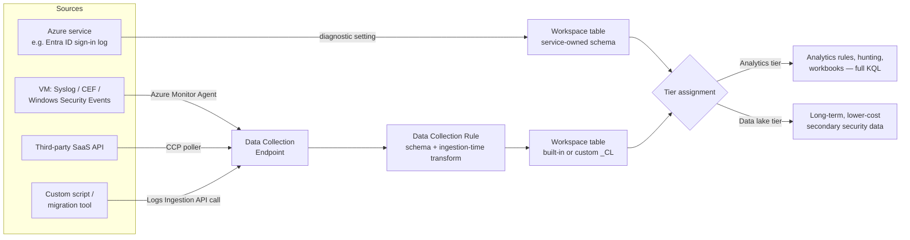

# Part 3 — Data Ingestion: Connectors, Data Collection Rules, and Table Tiers

## Why this part exists

**[CONCEPT]**
DEH Part 25 starts from a working `SecurityEvent` or `SigninLogs` row already sitting in a table and teaches the query language that reads it. Part 2 of this book started one layer below that — the Log Analytics workspace the table lives in, and the two portals an analyst uses to see the result. This part sits between the two: it is about how a row gets into the table in the first place, what shape it's in when it arrives, and which of two billing-and-retention tiers it lands in — three decisions a Sentinel engineer makes once, per data source, that every later part in this book quietly assumes were made correctly. A rule that runs a perfect KQL query against a table nobody actually populates, or against a table that dropped the one column the query filters on during ingestion-time transformation, is not a detection gap you find by reading the rule. You find it here, in the connector and Data Collection Rule (DCR) configuration the rule never shows you.

Microsoft's own documentation lists a genuinely large number of ways data gets into a workspace — the current Microsoft Sentinel data connectors catalog documentation lists well over 100 connectors, spanning several distinct underlying mechanisms. This part groups those mechanisms into a small number of connector families, walks through the Data Collection Rule and Data Collection Endpoint objects that most of them now depend on, and treats "which tier does this table land in" as the ingestion-time decision it actually is rather than a retention-policy afterthought.

This part deliberately does not re-teach Advanced Security Information Model (ASIM) normalization or parser mechanics — DEH Part 6 (Normalisation) already covers how a raw event gets mapped into a common schema across ECS, OCSF, UDM, and ASIM, and DEH Part 5 (Parsers) already covers how parser drift silently breaks a detection. What follows assumes both and stays focused on the plumbing that exists *before* a parser or a normalization function ever runs: getting a raw record from a source into a workspace table at all.

## 1. The ingestion decision surface

**[ENGINEERING]**
Onboarding any new data source to a Microsoft Sentinel workspace involves four separable decisions, and treating them as one decision ("turn on the connector") is where most avoidable ingestion problems start:

1. **Connector family** — which mechanism actually moves the data (a first-party Azure service integration, an agent-based pipeline, a codeless polling definition, a Logic App, or a direct API call).
2. **Transformation** — whether anything happens to the record between the source and the table it lands in (column filtering, redaction, reshaping), and where that transformation is defined.
3. **Destination table** — a built-in table with an existing schema Microsoft owns, or a custom table (suffixed `_CL`) this workspace owns and can alter.
4. **Tier** — whether that table's data is billed and retained under the Analytics tier or the Data lake tier (see §4).

The rest of this part works through these four decisions in order, because a connector family's technical limits (§2) constrain what transformation is even possible (§3), and the transformation and destination-table choice together constrain the tier decision (§4).

## 2. Connector families

**[ENGINEERING]**
Microsoft Sentinel's connector catalog is large, but nearly every entry in it is an instance of one of five underlying mechanisms. Knowing which mechanism a given connector uses tells you what you can and can't configure — transformation support, latency, authentication model, and troubleshooting surface all follow from the family, not from the individual connector's marketing name in the Content Hub tile.

### Azure-native (service-to-service) connectors

**[ENGINEERING]**
The simplest family: an Azure service writes its own logs directly into a Log Analytics workspace, either because Sentinel's connector page enables a diagnostic setting on your behalf or because the service already supports Azure Monitor as a log destination. Azure Activity, Microsoft Entra ID sign-in and audit logs, Microsoft Defender for Cloud alerts, and most first-party Microsoft 365/Azure service connectors fall here. There is typically no agent, no DCR to author by hand for the basic case, and minimal ongoing maintenance — the tradeoff is that you generally can't reshape or filter the record before it lands; you get the service's own schema, in the service's own table, on the service's own delivery cadence.

### Azure Monitor Agent, Data Collection Rules, and Data Collection Endpoints

**[ENGINEERING]**
The dominant family for VM-resident telemetry — Windows Security Events, Syslog, Common Event Format (CEF) from a syslog-forwarding appliance, custom text-file logs, and Windows Firewall logs all move through the Azure Monitor Agent (AMA) today. AMA is a single agent, installed once per machine, whose behavior is entirely defined by the Data Collection Rules (DCRs) associated with it — a DCR is the Azure Resource Manager object (`Microsoft.Insights/dataCollectionRules`) that specifies what to collect, how to transform it, and which workspace and table to send it to. One machine can be associated with multiple DCRs; one DCR can be associated with many machines, which is how a fleet-wide "collect Sysmon Operational log" policy is expressed without touching each machine individually.

A Data Collection Endpoint (DCE, `Microsoft.Insights/dataCollectionEndpoints`) is a separate, optional-but-often-required resource that gives AMA (or a direct API caller — see below) a specific network ingestion point. A DCE is required when the agent needs to reach the ingestion service through Azure Private Link rather than the public endpoint, and it is unconditionally required for the direct Logs Ingestion API path described below, regardless of networking model.

> **PRODUCT VERSION NOTE (as of 2026-09-15)**
> The legacy Log Analytics agent (also called the MMA or OMS agent) and the older Azure diagnostics
> extension were Microsoft's stated retirement targets for VM-based log collection, with Microsoft's
> Azure Monitor Agent migration guidance naming August 31, 2024 as the retirement date for the
> legacy Log Analytics agent. If you are reading this after that date and still find a workspace
> or a solution's setup documentation referencing the legacy agent, treat that documentation as
> stale and check the current Azure Monitor Agent overview and migration pages on Microsoft Learn
> before building anything new against it — new deployments should be AMA/DCR-based by default.

### The Codeless Connector Platform (CCP)

**[ENGINEERING]**
Not every source is an Azure service or a machine you can install an agent on. For a third-party SaaS API, a REST-based threat feed, or any source reachable only over HTTP on a polling schedule, Sentinel's Codeless Connector Platform (CCP — an actively developed connector-authoring surface, so treat any specific tooling detail below as worth re-checking against Microsoft Learn's "Create a codeless connector for Microsoft Sentinel" page before committing a design to it) lets an engineer define a connector declaratively — a JSON connector definition describing the authentication model (API key, OAuth2, Basic), the polling/pagination behavior against the source's REST endpoint, and the destination table — instead of writing and hosting custom collection code. CCP is the mechanism behind a large and growing share of newer Content Hub solution connectors, and it's also directly usable to build a connector for a source Microsoft hasn't shipped a template for.

### Logic Apps–based connectors

**[ENGINEERING]**
Before CCP existed, and still in use for a meaningful share of Content Hub solutions today, a data connector can simply be an Azure Logic Apps workflow: a playbook triggered on a recurring schedule that calls a third-party API, reshapes the response, and writes it into the workspace (historically via the legacy HTTP Data Collector API described below, and increasingly via the Logs Ingestion API). Because this is an ordinary Logic Apps resource, it inherits everything Part 14 covers about playbooks — managed-identity permissions, per-action billing, and Logic Apps' own reliability profile — as operational baggage a "connector" name doesn't suggest it has.

### Direct ingestion: the Logs Ingestion API

**[ENGINEERING]**
The most general mechanism, and the one every other custom-source path ultimately reduces to: the Logs Ingestion API is an Azure Monitor REST API that accepts a batch of JSON records and writes them to a specified table, using a DCR to define the target table's schema and any ingestion-time transformation, and a DCE to provide the network endpoint the caller sends to. Anything that can make an authenticated HTTPS call — a custom script, a SIEM-migration tool, a Logic App, an on-prem collector with no Sentinel-specific integration at all — can use this path, which is why it underlies both the Logic Apps family above and most custom, non-catalog integrations engineers build themselves.

> **PRODUCT VERSION NOTE (as of 2026-09-15)**
> The Logs Ingestion API is the current, DCR-based replacement for the older Azure Monitor HTTP
> Data Collector API (the mechanism that historically wrote directly to a custom `_CL` table with
> no transformation step available), and Microsoft's own Azure Monitor documentation has flagged
> the Data Collector API as legacy, steering new work toward the Logs Ingestion API. This book
> could not confirm a specific, final retirement date for the Data Collector API against a source
> current as of this writing — check the Azure Monitor "Data Collector API" and "Logs Ingestion
> API" pages on Microsoft Learn directly before relying on either the older API's continued
> availability or any retirement timeline you find elsewhere. Either way, default new work to the
> Logs Ingestion API: it is the actively developed path regardless of exactly when the legacy one
> goes away.

Table 3.1 summarizes the five families side by side.

**Table 3.1 — Connector family comparison.** Supports an engineer deciding which mechanism fits a new source, based on what onboarding actually requires and what it allows afterward.

| Connector family | Typical sources | Transformation available? | Auth/onboarding model | Ongoing maintenance surface |
|---|---|---|---|---|
| Azure-native (service-to-service) | Azure Activity, Entra ID sign-in/audit, Defender for Cloud | Rare — usually the service's own schema as-is | Portal toggle / diagnostic setting, Azure RBAC | Minimal — Microsoft owns the pipeline |
| Azure Monitor Agent (AMA) + DCR/DCE | Windows Security Events, Syslog, CEF, custom text logs | Yes — ingestion-time transformation in the DCR | Agent install (VM extension) + DCR association | Agent health per machine, DCR association drift |
| Codeless Connector Platform (CCP) | Third-party SaaS APIs, REST-based threat feeds | Yes, within the connector definition's mapping | API key / OAuth2 / Basic per connector definition | Connector-definition maintenance as the source's API evolves |
| Logic Apps–based | Legacy Content Hub solutions, custom scheduled pulls | Depends on the underlying write path (Data Collector vs. Logs Ingestion API) | Managed identity + API credentials in the Logic App | Full Logic Apps resource — see Part 14 |
| Direct Logs Ingestion API | Custom scripts, migration tooling, anything with an HTTPS client | Yes — ingestion-time transformation in the DCR | Azure AD app registration/managed identity, DCE endpoint | Caller-side code and DCR/DCE lifecycle |

## 3. Ingestion-time transformation: shaping data before it lands

**[ENGINEERING]**
A DCR isn't only a routing instruction. It can carry a transformation — a KQL-like expression evaluated once per incoming record, before the record is written to the table — that filters columns, drops rows, computes a new column, or redacts a value. This is distinct from, and runs earlier than, ASIM normalization: a DCR transformation reshapes the raw record on its way into a table your workspace owns; ASIM (DEH Part 6) maps an already-landed record into a common schema so a query can treat many source tables uniformly. Confusing the two leads to trying to do full cross-table enrichment in a DCR transform, which the model doesn't support — a transformation operates on one incoming record at a time, with no join against other tables.

The two transformation use cases that come up most often in practice:

- **Cost and noise control** — dropping columns a source always sends but no rule or hunt ever queries, before they're billed as ingested volume.
- **Compliance and data minimization** — redacting or hashing a column that carries sensitive data (a full email body, a raw credential-adjacent field) so the sensitive value never persists in the workspace at all, rather than persisting it and relying on RBAC/access control to protect it after the fact.

The following ARM template excerpt exports a Data Collection Rule (`Microsoft.Insights/dataCollectionRules`) and illustrates only the `transformKql` property — the fragment that actually performs the shaping described above. The surrounding stream declarations, RBAC assignments, and DCR-to-DCE association a real deployment needs are omitted for brevity.

```json
{
  "type": "Microsoft.Insights/dataCollectionRules",
  "apiVersion": "2023-03-11",
  "name": "dcr-custom-app-logs",
  "properties": {
    "dataFlows": [
      {
        "streams": ["Custom-AppEvents_CL"],
        "destinations": ["workspace-primary"],
        "transformKql": "source | project-away RawRequestBody | extend UserEmail = tostring(hash_sha256(UserEmail))",
        "outputStream": "Custom-AppEvents_CL"
      }
    ]
  }
}
```

*`CONCEPTUAL SAMPLE — illustrative DCR transform, not a captured export`.* The `transformKql` line does two things in one pass: `project-away` drops a column the workspace never needs to store at all, and `extend` overwrites `UserEmail` with a one-way hash instead of the original address. Both edits are permanent at the point this transform runs — there is no "transform lightly now, decide later" option, which is exactly the Blind Spot named above stated as syntax rather than prose. The limitation worth stating plainly: `transformKql` supports a single incoming record's own columns and a fixed set of KQL operators suitable for row-level shaping (`project`, `extend`, `where`, `parse`, and similar) — it is not a general-purpose KQL surface, and DEH Part 25's join and cross-table `summarize` patterns have no equivalent here.

> **Engineering Reality**
> An ingestion-time transformation is evaluated per-record, with no state and no cross-record
> context — it cannot deduplicate against yesterday's data, cannot join against a watchlist, and
> cannot look at a second event to decide what to do with the first. If a transformation idea
> needs "compare this to something else," that's a job for a KQL query at read time (an analytics
> rule, DEH Part 25) or a summary/aggregation job, not for the DCR. What a transformation actually
> buys you is narrower and cheaper than that: shape and volume control on data you already know,
> in isolation, you don't need in full.

> **Blind Spot**
> A column dropped at ingestion time is not recoverable later by any query, however clever —
> the data was never written to the table. This is a materially different failure mode from a
> detection gap in a rule's `where` clause, which a rule author can find and fix without touching
> historical data. If an investigation six months from now needs a field a transformation dropped
> on day one, there is no backfill; the record as stored simply doesn't have it. Treat every
> "drop this column, we'll never need it" decision in a DCR transform with the same scrutiny as a
> retention-period decision, because functionally it is one — for that column, retention is zero.

## 4. Where a table lands: Analytics tier vs. Data lake tier

**[ENGINEERING]**
Every table in a workspace is billed and retained under one of two tiers, and — this is the point this section exists to make — which tier a given table's data lands in is a decision made at ingestion configuration time, per source, not a retention setting applied uniformly after the fact. The **Analytics tier** is the interactive, full-featured tier: data here is immediately queryable with the full KQL surface, can drive analytics rules and workbooks, defaults to 90 days of retention and is extensible to two years, and is what every earlier example in this part has implicitly assumed. The **Data lake tier** is built for high-volume, lower-per-record-value secondary security data — cost-effective long-term retention, with ingestion, processing, storage, and query billed as separate components rather than folded into one per-GB analytics-tier rate.

> **PRODUCT VERSION NOTE (as of 2026-09-15)**
> Microsoft's current documentation describes this two-tier model (Analytics tier and Data lake
> tier) as the present retention framework, per Microsoft Learn's "Log retention tiers in Microsoft
> Sentinel" page ([learn.microsoft.com/azure/sentinel/log-plans](https://learn.microsoft.com/azure/sentinel/log-plans)), retrieved 2026-09-15 for this
> book. Training material and some older published guidance still circulate an earlier
> four-tier framing (Analytics / Basic / Auxiliary / Archive) that this two-tier model has
> superseded. If you encounter that older four-tier terminology in a vendor deck, a certification
> guide, or a colleague's notes, treat it as describing a prior version of this same retention
> concept, not a parallel option still on the menu — re-check the Log retention tiers page for the
> current mapping before designing around either the old or new terminology. Part 17 of this book
> covers the full cost-and-retention decision in depth; this part only establishes that the tier
> choice is made at the source, not discovered later.

**[SOC MANAGEMENT]**
The practical consequence for this part's scope: when you configure a DCR (or accept an Azure-native connector's default), you are choosing — sometimes explicitly, sometimes by accepting a default you didn't examine — which tier that table's incoming data is billed and retained under. A high-volume, rarely-queried source (bulk firewall traffic logs kept for compliance, not active hunting) is a candidate for the Data lake tier from day one; a source that feeds an analytics rule's scheduled query cannot go there, because Data lake tier data is not currently structured to drive analytics-rule alerting the way Analytics tier data is.

> **PRODUCT VERSION NOTE (as of 2026-09-15)**
> The Data lake tier is a newer, still-evolving surface, and its relationship to analytics-rule
> alerting is exactly the kind of capability boundary Microsoft could extend later. As of this
> writing, Microsoft Learn's Sentinel data lake documentation describes data lake tier data as
> queried through search/KQL jobs and the data lake's own exploration surface, not as a source
> an analytics rule can alert on directly. Check the current "Microsoft Sentinel data lake"
> overview on Microsoft Learn before treating this as a permanent architectural limit rather
> than a snapshot of where the tier stands today.

Getting this backward — landing an actively-queried detection source in the wrong tier, or discovering months later that a compliance-retention source has been paying full Analytics tier rates the whole time — is exactly the kind of ingestion-time decision this part opened by naming as easy to treat as an afterthought and expensive to unwind later.

Table-management for existing tables (moving a table's plan, viewing tier assignment) also has portal-specific surface differences once a workspace is onboarded to the Microsoft Defender portal, covered in full in Part 16 — this part flags that dependency without duplicating it.

A second, easily missed consequence: tier is a property of the table's data as ingested, not a property you can trivially reassign after the fact for data already written. Moving a table's *plan* going forward is a supported operation, but re-tiering data that already landed under the old plan is a different and more constrained operation than adjusting a setting — so the ingestion-time decision this section describes really is the point where the choice mostly locks in for that batch of data, not merely the point where a default first applies.

### A note on retention vs. tier — two different knobs

**[ENGINEERING]**
It's worth naming a distinction this part's scope requires but doesn't own: retention *period* (how many days a given table's data is kept before deletion or archival) and retention *tier* (Analytics vs. Data lake) are two different knobs, and a table's tier does not by itself tell you its retention period — each tier has its own retention defaults and extension mechanics, which Part 17 documents in full. This part's job is narrower: make sure the tier decision happens deliberately at ingestion configuration time, per source, rather than being discovered later as whatever the workspace default happened to be.

## 5. Putting it together: a data-flow view

**[ENGINEERING]**
Figure 3.1 traces one record from source to query-ready table, showing where each of this part's four decisions (connector family, transformation, destination table, tier) actually happens in the pipeline.






**Figure 3.1 — Ingestion pipeline from source to tier.** *CONCEPTUAL.* Illustrates, at a structural level, how the connector families in §2 converge on a Data Collection Rule and a destination table, and how that table's tier assignment (§4) determines what can be done with the data afterward. This is this book's own structural sketch built from the connector, DCR/DCE, and tier documentation cited throughout this part — not a reproduction of any official Microsoft architecture diagram, and not a capture of a live workspace, per this book's evidence-classification constraint.

## 6. Connector sprawl as a cost and ownership problem

**[SOC MANAGEMENT]**
Every connector enabled is a source someone has to keep healthy — DEH's own SOC Management framing applies directly here: a connector nobody owns is a silent detection-coverage claim nobody is actually maintaining. Part 18 covers the health-monitoring mechanics (the `SentinelHealth` table, rule auto-disable) in depth; the point to make here, at the ingestion-design stage, is that connector count and table count are not free even before any rule runs against them. Each Azure-native connector adds an ingestion cost line; each AMA/DCR-based source adds an agent-health and DCR-drift surface to monitor; each CCP or Logic Apps connector adds a credential and an API-dependency to rotate and watch for breaking changes upstream. A SOC that enables a Content Hub solution's full connector bundle because it shipped as a bundle, without deciding whether every table it lands is going to be queried by anything, is choosing ingestion cost and maintenance surface it hasn't actually budgeted — a decision this part's four-question framing (§1) exists to force into the open before onboarding, not after the first monthly bill.

> **What Would Change My Mind**
> This part treats "decide connector family, transformation, table, and tier deliberately, per
> source, before onboarding" as the correct discipline, on the assumption that ingestion cost and
> maintenance debt compound quietly if skipped. If Microsoft shipped a workspace-level default that
> reliably auto-assigned an appropriate tier and transformation per source type — something more
> than today's per-DCR manual choice — the specific four-step checklist in §1 would need to soften
> from "do this deliberately every time" to "verify the default, override only when it's wrong," a
> real reduction in the operational burden this part currently describes.

## Cross-references

DEH Part 3 (Telemetry Engineering I: Host & Identity Sources), DEH Part 4 (Telemetry Engineering II: Network, Application & AI Sources), DEH Part 5 (Parsers), DEH Part 6 (Normalisation) — Part 17 (Workspace Cost Models and Retention Tiers) — Part 16 (Operating the Unified Security Operations Platform: Migration and Parity Gaps) — Part 18 (Sentinel-Specific Tuning, Health Monitoring, and Troubleshooting) — Part 14 (Playbooks: Logic Apps–Based Response and Remediation).
