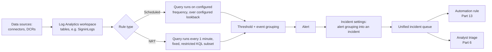

# Part 4 — Analytics Rules I: Scheduled and Near-Real-Time (NRT) Rules

## Why this part exists

DEH Part 25 already teaches the query language a Sentinel analytics rule runs — the KQL pipe
model, `where`/`join`/`summarize`, time-window functions, and the join-strategy and performance
concerns that apply once a query gets big — and DEH Part 23 already frames the decision that
produces a query worth deploying in the first place: what an Analytic states versus what a
Detection Rule literally evaluates. This part assumes both and starts exactly where DEH Part 25 §3
leaves off, at the one sentence its own Engineering Reality callout devotes to Sentinel: a
scheduled analytics rule's "lookback" and "run frequency" are two independent settings, and
mismatching them creates a real coverage gap. This part is that sentence's full platform-operations
treatment — the rest of the rule wizard around that one setting, what each surrounding control
actually does, and what an engineer trades away by getting one of them wrong.

This part does not re-teach KQL syntax (DEH Part 25) or the Sigma-versus-native-query tradeoff that
precedes rule authoring (DEH Part 23). It also does not cover Fusion, ML Behavior Analytics,
Anomaly rules, or Custom Detections — Part 5 owns every rule type that is single-instance,
non-customizable, or ML-driven. This part covers the two rule types a Microsoft Sentinel
`SENTINEL ENGINEER` builds and tunes by hand, from a query they already wrote: **Scheduled**
rules, the default and most flexible type, and **Near-real-time (NRT) rules (fixed one-minute
evaluation cadence, limited subset of scheduled-rule features)**, a constrained scheduled-rule
subtype for the handful of detections where minutes matter more than customizability.

## 1. Rule types at a glance, and what this part actually covers

**[CONCEPT]** Microsoft Sentinel's rule-creation surface offers more than one rule type, and
knowing the full set — even the ones this part defers — matters for orienting anything built later
in this book. The table below is orientation only; every row past the first two gets its full
treatment in Part 5.

| Rule type | Distinguishing operational fact | Covered in |
|---|---|---|
| `Scheduled` | Fully customizable query, run frequency, and lookback; the default, most common rule type. | This part, §2–§3 |
| `NRT` (Near-real-time) | Fixed one-minute run cadence, not configurable; a restricted subset of scheduled-rule query features and settings. | This part, §4 |
| `Fusion` | Single built-in instance per workspace, ML-driven multistage-attack correlation across multiple low-fidelity signals; not customizable rule-by-rule. | Part 5 |
| `Microsoft security` | Auto-creates incidents from alerts already raised by other Microsoft security products (for example Defender for Endpoint, Defender for Identity); not a query you write. | Part 5 |
| `ML Behavior Analytics` | Single-instance, Microsoft-maintained ML models for anomalous SSH/RDP sign-in behavior; not customizable. | Part 5 |
| `Anomaly` | ML-baselined, writes to the `Anomalies` table; does not raise its own alert without additional configuration. | Part 5 |
| Custom Detections (Defender XDR) | Microsoft's KQL-based rule-authoring surface inside the Microsoft Defender portal, spanning Sentinel and Defender XDR tables together; a distinct authoring surface from the Sentinel analytics-rule wizard. | Part 5 |

**[SENTINEL ENGINEER]** Scheduled and NRT rules share almost everything about their internal
anatomy — a KQL query, entity mapping, alert grouping, incident-creation behavior, and an
automated-response attachment point. The difference that actually matters operationally is
narrow: NRT trades away configurable frequency and lookback, and a portion of the KQL feature
surface, for a fixed one-minute cadence no scheduled rule can match without running a query every
sixty seconds indefinitely — which Microsoft Sentinel does not let a Scheduled rule do; five
minutes is its fastest configurable frequency (see the PRODUCT VERSION NOTE in §2.2). Everything
in §2–§3 below describes the Scheduled rule wizard in full; §4 then describes NRT purely as a delta
against that same wizard, rather than repeating the shared ground twice.

## 2. Scheduled rules: anatomy of the rule wizard

### 2.1 General: naming, severity, and MITRE mapping

**[SENTINEL ENGINEER]** Both the Azure portal (in the Sentinel resource's own "Analytics" blade)
and the Microsoft Defender portal (once a workspace is onboarded — see Part 2 for what that
onboarding changes and the March 31, 2027 retirement date governing which portal is the long-term
target) expose the same rule-creation wizard, built from a fixed sequence of steps: General, Set
rule logic, Incident settings, Automated response, and Review and create. The Defender portal is
the acceptable short form after this first full mention in this section.

The General step fixes the rule's identity independent of its query: a display name and
description, a severity (`Informational`/`Low`/`Medium`/`High`), a status (enabled or disabled at
creation), and one or more MITRE ATT&CK tactics and techniques the rule maps to — technique
identifiers drawn from MITRE's own vendor-neutral knowledge base of adversary tactics and
techniques, not a Sentinel-specific taxonomy Microsoft invented for this wizard (MITRE, "MITRE
ATT&CK®," [attack.mitre.org](https://attack.mitre.org/), retrieved 2026-09-16). This mapping is
not decorative — it is the field that later populates an incident's own tactic/technique display
in the unified queue, and the field a coverage exercise (DEH Part 41) reads to answer "which
techniques does this workspace actually have a rule for."

### 2.2 Set rule logic: query scheduling, threshold, and grouping

**[SENTINEL ENGINEER]** The Set rule logic step holds the query itself (a KQL query exactly like
the ones DEH Part 25 teaches — this book supplies no new syntax here) plus four settings groups
that decide how that query becomes an alert:

- **Query scheduling** — *run frequency* (how often the rule fires the query) and *lookback
  period*, usually labeled "lookup data from the last" (how far back each run's query window
  extends). These are independent controls, not one setting expressed two ways.
- **Alert threshold** — the condition applied to the query's result count before an alert fires,
  commonly expressed as an operator (greater than, fewer than, equal to, not equal to) and a
  number, defaulting to "greater than 0" — any non-empty result set alerts.
- **Event grouping** — whether every matching row becomes its own alert, or the whole result set
  for a given run becomes a single alert. This setting, not the query's own `summarize` logic, is
  what most directly determines whether a noisy query becomes a noisy analyst experience.
- **Suppression** — an optional "stop running the query for a period after this rule generates an
  alert" control, distinct from both alert grouping and the incident-level grouping in §2.4; it
  pauses the rule's own execution, not just the display of its results.

> **PRODUCT VERSION NOTE (as of 2026-09-15)**
> Microsoft's documentation for creating a scheduled analytics rule states a run-frequency range
> from 5 minutes up to 14 days, with the lookback period independently configurable up to the same
> 14-day ceiling — see Microsoft Learn, "Create scheduled analytics rules in Microsoft Sentinel"
> ([learn.microsoft.com/azure/sentinel/create-analytics-rules](https://learn.microsoft.com/azure/sentinel/create-analytics-rules)), retrieved 2026-09-16. Treat the
> exact numbers as the specific fact to re-check: Microsoft has adjusted rule-wizard bounds and
> defaults before, and a value this book states as a hard ceiling is exactly the kind of detail
> that page will show as current if this one has drifted.

> **Engineering Reality**
> Setting the lookback period exactly equal to the run frequency looks efficient and is the most
> common mistake in this whole step: if a run fires every 15 minutes with a 15-minute lookback, any
> event whose ingestion into the workspace lags evaluation time by even a few minutes — which
> ingestion delay does routinely, not as an edge case — falls into the gap between when the
> previous run's window ended and when the event actually became queryable. The standard fix is a
> lookback period wider than the run frequency, commonly two to three times as wide, relying on the
> rule's own suppression or the incident-grouping logic in §2.4 to avoid re-alerting on an event a
> prior run already actioned. A rule authored once with matched values and never revisited degrades
> silently: the query still runs, still returns rows, and the gap only becomes visible during an
> incident retrospective that finds an event the rule should have caught but never did.

### 2.3 Entity mapping and custom details

**[SENTINEL ENGINEER]** Entity mapping — assigning specific query-result columns to typed
entities such as Account, Host, IP, or URL — is what lets a scheduled rule's alert participate in
Sentinel's investigation graph and in the entity-based alert grouping described in §2.4. Part 6 of
this book owns the full mechanics of how entity types, identifiers, and the incident model interact
and where that mapping breaks down on a shared or ambiguous identifier; this part only needs the
operational fact that entity mapping is configured per rule, in this same wizard step, and that the
rule wizard documents a per-rule cap on how many entity types and identifiers a single rule can map
— treat the exact cap as another value to check against the current rule-creation documentation
rather than a number this book fixes here, since Microsoft has raised entity-mapping limits before.

A separate, simpler mechanism in the same step — **custom details** — surfaces specific
query-result columns directly onto the alert and resulting incident as labeled key/value fields,
without requiring an entity type at all. Custom details are the more direct choice when a query
result carries context worth showing an analyst (a resource ID, a rule name, a scan target) that
doesn't cleanly fit Sentinel's entity schema.

### 2.4 Incident settings: alert grouping and incident creation

**[SENTINEL ENGINEER]** The Incident settings step controls two related but distinct decisions.
First, whether this rule's alerts automatically create incidents in the unified queue at all — a
toggle a rule feeding another automation path (for example, a playbook triggered directly off the
alert, covered in Part 14) might reasonably leave off. Second, if incident creation is on, how
alerts from *this rule* group into incidents: a matching method (commonly, all alerts from this
rule into one incident; alerts matching on selected entities; or no grouping — an incident per
alert) and a time window bounding how far apart two alerts can be and still group together. A
"reopen matching closed incidents" toggle decides whether a new matching alert reopens an incident
an analyst already closed, or starts a fresh one.

**[ANALYST]** What these settings produce in the unified queue is the practical thing to hold onto:
a rule grouped too loosely (all alerts, no entity match, a long time window) produces one incident
that keeps absorbing unrelated matches for days, diluting its own investigation history; a rule
grouped too tightly (per-alert, no grouping) produces an incident per match, burying a real pattern
across many separate queue entries an analyst has to notice are related manually. Neither failure
mode is visible from the rule's query alone — both are entirely a function of this step's settings,
which is why a rule review that only reads the KQL misses half of what determines the analyst's
actual experience of that rule.

> **False Positive Trap**
> Grouping "all alerts triggered by this rule into a single incident," the most permissive matching
> method, is attractive because it minimizes queue clutter — but it also means a rule with a broad
> query (say, a login-anomaly rule scoped to an entire tenant rather than a specific entity) can fold
> two genuinely unrelated attacker sessions, days apart, into the same open incident, because
> "unrelated" isn't a concept this matching method evaluates. Grouping by matched entities is
> usually the safer default for anything but a genuinely single-purpose rule, precisely because it
> keeps the incident's own scope aligned with what the query result actually says happened, not with
> "which rule produced it."

### 2.5 Automated response

**[SENTINEL ENGINEER]** The final configuration step attaches automation rules (Part 13) that run
when this rule's alert or incident fires — assigning an owner, applying a tag, or invoking a
playbook (Part 14). This part treats that attachment point as the boundary of scheduled-rule
anatomy: everything past it is orchestration logic that Part 13 owns in full, including the
batching-window hazard that automation rule scope specifically names as a first-class operational
risk once a workspace onboards to the Defender portal.

## 3. Worked example: from naive threshold to tuned scheduled rule

**[SENTINEL ENGINEER]** The example below tracks one rule through the exact failure the
Engineering Reality box in §2.2 describes in the abstract, using Microsoft Entra ID (formerly
Azure Active Directory) sign-in activity — ingested into the `SigninLogs` table by the Entra ID
data connector — as the telemetry. It is shown as two ARM template excerpts, both exporting the
`Microsoft.SecurityInsights/alertRules` resource type, `kind: "Scheduled"`. Per this book's own
code-block rule (STYLE-GUIDE.md §3), the embedded KQL is a short fragment inside a larger rule
definition, not a freestanding detection query — the fragment itself leans on DEH Part 25 for
syntax, not the other way around.

The naive first draft below shows the failure mode directly.

```json
// CONCEPTUAL SAMPLE — illustrative ARM excerpt of a Microsoft.SecurityInsights/alertRules
// resource, kind "Scheduled." Property and enum spellings shown here are illustrative of the
// documented schema shape, not exported from a live tenant — verify exact field and enum names
// against the current Microsoft.SecurityInsights/alertRules ARM template reference before
// treating this as a deployment template.
{
  "type": "Microsoft.SecurityInsights/alertRules",
  "kind": "Scheduled",
  "properties": {
    "displayName": "Any failed sign-in",
    "severity": "Medium",
    "enabled": true,
    "query": "SigninLogs | where ResultType != 0",
    "queryFrequency": "PT1H",
    "queryPeriod": "PT1H",
    "triggerOperator": "GreaterThan",
    "triggerThreshold": 0,
    "suppressionEnabled": false,
    "eventGroupingSettings": { "aggregationKind": "AlertPerResult" },
    "tactics": ["CredentialAccess"],
    "techniques": ["T1110"]
  }
}
```

**MITRE:** T1110 (Brute Force).

> **Detection Autopsy — "alert on any failed sign-in"**
>
> **The rule:** Alerts on any row where `ResultType != 0` (a failed sign-in), one alert per
> matching row (`AlertPerResult`), on an hourly run, with no query-side thresholding — the alert
> threshold is left at `GreaterThan 0`, so a single matching row alerts.
>
> **Why it shipped:** It reads as the obvious first-draft brute-force detection — flag failed
> sign-ins, alert on anything that matches — and both the query and the wizard settings behind it
> are trivial to write and to defend in a design review.
>
> **How it failed:** It is a mistyped-password counter running at organization scale, not a
> brute-force detection. A single traveling employee who fat-fingers a passphrase twice produces
> two alerts; an organization of any real size produces alerts by the dozens to hundreds per run,
> every run, none of them distinguishing a legitimate typo from an actual guessing campaign — the
> rule's own threshold and grouping are doing all of the damage; the query itself is syntactically
> fine.
>
> **The fix:** Widen the lookback past the run frequency (closing the ingestion-lag gap the
> Engineering Reality box in §2.2 describes), move `aggregationKind` to `SingleAlert`, and push the
> actual thresholding into the query itself with `summarize` and a `FailCount >= 10` filter — shown
> in the tuned rule below.

> **Detection Test**
> **Setup:** A Microsoft Sentinel workspace with the Entra ID sign-in-logs connector enabled and a
> test account available to sign in with a deliberately wrong password.
> **Action:** Attempt sign-in with the test account and an incorrect password three times within a
> few minutes, from the same client.
> **Expected result:** Against the naive rule above, three separate alerts, one per failed attempt,
> each carrying `Medium` severity and no volume context — indistinguishable in the queue from three
> unrelated single-attempt failures on three unrelated accounts. Against the tuned rule below, run
> the same test with at least ten attempts within one 15-minute window (the tuned rule's own
> threshold) and expect a single alert carrying a `FailCount` custom detail, not ten separate ones.

```json
// CONCEPTUAL SAMPLE — same resource type and kind as above, tuned. Enum and property spellings
// remain illustrative; verify against the current ARM template reference before deployment.
{
  "type": "Microsoft.SecurityInsights/alertRules",
  "kind": "Scheduled",
  "properties": {
    "displayName": "Sign-in failure burst against a single account",
    "severity": "Medium",
    "enabled": true,
    "query": "SigninLogs\n| where ResultType != 0\n| summarize FailCount = count(), IPList = make_set(IPAddress) by UserPrincipalName, bin(TimeGenerated, 15m)\n| where FailCount >= 10",
    "queryFrequency": "PT15M",
    "queryPeriod": "PT30M",
    "triggerOperator": "GreaterThan",
    "triggerThreshold": 0,
    "suppressionEnabled": true,
    "suppressionDuration": "PT1H",
    "eventGroupingSettings": { "aggregationKind": "SingleAlert" },
    "incidentConfiguration": {
      "createIncident": true,
      "groupingConfiguration": {
        "enabled": true,
        "reopenClosedIncident": false,
        "lookbackDuration": "PT5H",
        "matchingMethod": "Selected"
      }
    },
    "tactics": ["CredentialAccess"],
    "techniques": ["T1110.001"]
  }
}
```

**MITRE:** T1110.001 (Password Guessing).

Three changes carry the whole fix, and each maps to a setting named in §2.2–§2.4, not to any change
in query sophistication beyond a `summarize`: the `queryPeriod` (30 minutes) is now wider than the
`queryFrequency` (15 minutes), closing the exact ingestion-lag gap the Engineering Reality box in
§2.2 warns about; `aggregationKind` moved from `AlertPerResult` to `SingleAlert`, so one run
produces at most one alert per matching account/window pair, not one per row; and the query itself
now does the thresholding work (`FailCount >= 10`) that the naive version left entirely to the
rule's own `triggerThreshold: 0`.

> **Blind Spot**
> The tuned rule's threshold (10 failures in 15 minutes) is tuned against a guessing campaign that
> announces itself through volume. A low-and-slow attacker making two or three attempts per account
> per hour across a large number of accounts never crosses this threshold for any single account,
> and the `by UserPrincipalName` grouping means the query never aggregates *across* accounts to
> notice that the same source IP is doing this to fifty of them — a T1110.003 (Password Spraying)
> shape this account-scoped rule is structurally blind to regardless of how the threshold number is
> tuned. Catching that shape needs a second rule grouped by `IPAddress` (or source ASN) instead of
> by account, not a lower threshold on this one.

## 4. Near-real-time (NRT) rules

### 4.1 What's fixed versus configurable

**[SENTINEL ENGINEER]** An NRT rule shares the same General, entity-mapping, custom-details,
incident-settings, and automated-response surface described in §2 and §2.3–§2.5. What it removes
is exactly the query-scheduling group in §2.2: there is no run-frequency or lookback field to set,
because Microsoft Sentinel runs an NRT rule's query once every minute, fixed, with no configuration
path to change that cadence. In ARM terms, an NRT rule's `alertRules` resource uses
`kind: "NRT"` and simply has no `queryFrequency` or `queryPeriod` properties for that kind, rather
than those properties existing with a locked value.

```json
// CONCEPTUAL SAMPLE — illustrative ARM excerpt, kind "NRT." No queryFrequency/queryPeriod
// properties exist for this kind; cadence is fixed by the platform, not by a settable field.
// Verify current field presence against the Microsoft.SecurityInsights/alertRules ARM template
// reference before treating this as authoritative.
{
  "type": "Microsoft.SecurityInsights/alertRules",
  "kind": "NRT",
  "properties": {
    "displayName": "Impossible travel — same account, two distant sign-ins within minutes",
    "severity": "High",
    "enabled": true,
    "query": "SigninLogs | where ResultType == 0",
    "triggerOperator": "GreaterThan",
    "triggerThreshold": 0,
    "tactics": ["InitialAccess"],
    "techniques": ["T1078"]
  }
}
```

**MITRE:** T1078 (Valid Accounts).

Microsoft's own NRT documentation also states that NRT queries run against a restricted subset of
KQL relative to what a scheduled rule's query can use — specific unsupported operators and
constructs, and constraints on join complexity, that Microsoft's current NRT-limitations reference
page lists explicitly. This book does not reproduce that list here, because it is exactly the kind
of fast-moving enumeration a printed or long-lived page shouldn't freeze in place; port a scheduled
rule's query to NRT by checking the current list, not by assuming syntactic parity.

> **PRODUCT VERSION NOTE (as of 2026-09-15)**
> Microsoft documents both a maximum number of NRT rules permitted per workspace (separate from the
> overall cap on scheduled rules) and a specific list of KQL constructs NRT queries don't support —
> see Microsoft Learn, "Detect threats quickly with near-real-time (NRT) analytics rules in
> Microsoft Sentinel." This book intentionally does not restate either number or list here: the
> per-workspace NRT rule cap in particular has changed at least once as the feature matured from
> template-only toward general availability, and a specific figure quoted in a book chapter is far
> more likely to go stale than a live documentation page an engineer can check at deployment time.
> If you're building against a specific NRT rule count today, check that page directly rather than
> trusting a number from this or any other secondary source.

> **Engineering Reality**
> NRT rules run once every minute, fixed — there is no lookback-vs-frequency tuning knob the way
> there is for a scheduled rule (§2.2, and DEH Part 25 §3 for why that mismatch matters at all).
> What this actually costs you: an NRT rule's query has to be cheap enough to finish comfortably
> inside a one-minute window on every run, forever, and a query that's "slow but fine" as an hourly
> scheduled rule can start missing its own cadence as data volume grows — silently degrading toward
> something closer to a scheduled rule's latency while still being billed and reasoned about as if
> it were near-real-time.

### 4.2 Choosing scheduled versus NRT

**[SENTINEL ENGINEER]** The decision is narrower than it first appears, because NRT's only real
advantage is cadence and its costs are all subtraction — less configurability, a smaller KQL
surface, and (per the PRODUCT VERSION NOTE above) a workspace-level cap most scheduled rules never
have to think about.

The table below supports one decision: whether a specific detection candidate justifies NRT's
tradeoffs or is better served by a scheduled rule with the shortest sensible frequency instead.

| Consideration | `Scheduled` | `NRT` |
|---|---|---|
| Run cadence | Configurable, 5 minutes to 14 days | Fixed at 1 minute, not configurable |
| Lookback period | Configurable independently of cadence | Not applicable — no lookback setting |
| KQL feature surface | Full surface DEH Part 25 teaches | Restricted subset; some operators and join shapes unsupported |
| Per-workspace rule count | Governed by the general scheduled-rule limit | Governed by a separate, smaller NRT-specific limit |
| Best fit | Most detections — anything not latency-critical to the minute | Detections where a 5–15 minute delay materially changes the outcome (active session hijack, mass credential exposure) |
| Query cost discipline | Matters, but a slow run mostly just runs long | Matters acutely — a query that can't finish in well under a minute degrades the rule's own reason for existing |

## 5. Operating rule volume: tuning, health, and cost signal

**[SOC MANAGEMENT]** Every setting in §2–§4 is also a volume lever, and the aggregate effect across
a workspace's full rule set is a SOC management problem, not just a per-rule tuning exercise. A
handful of rules each grouped too loosely (§2.4) or thresholded too low (§2.2) compounds into an
incident queue an analyst team can't keep current with — the platform-operations version of alert
fatigue, produced entirely by rule configuration rather than by any actual increase in attacker
activity. Reviewing a new or changed rule's scheduling, threshold, and grouping settings before it
ships belongs in the same approval gate as reviewing its query logic, for the same reason DEH Part
25 §8's SOC Management View callout gives for query cost: the bill (here, analyst attention rather
than ingestion dollars) arrives whether or not anyone reviewed the setting that caused it.

**[ENGINEERING]** A rule that fails repeatedly — most often from an expired or insufficiently
scoped access token, or a permission change upstream of the query's source table — gets
`(auto-disabled)` appended to its display name rather than continuing to fail silently forever.
The `SentinelHealth` table is the queryable audit trail for that and other rule-health events; Part
18 owns the full troubleshooting treatment of both. The operational point worth carrying into this
part specifically: a rule that stops firing because it's disabled looks, from inside the incident
queue, identical to a rule that's still enabled and simply has nothing to report — a second,
platform-level instance of the same "zero rows means nothing happened, or means something's broken"
ambiguity DEH Part 25 §8 names for query schema drift.

> **SOC Management View**
> A rule inventory review that only counts rules ("we have 140 analytics rules enabled") without
> also sampling their scheduling, threshold, and grouping settings is counting coverage that may not
> exist in practice — a rule enabled with a threshold and grouping combination that floods or a
> query that silently exceeds an NRT cadence isn't contributing detection value proportional to its
> presence on the list. Budget tuning review time proportional to rule count, not just deployment
> time; a rule that took an afternoon to author and never gets revisited is the most common source
> of both the false positive volume analysts complain about and the auto-disabled rules nobody
> notices went dark.

> **What Would Change My Mind**
> This part treats "default to Scheduled; reach for NRT only when a specific, named latency
> requirement justifies its narrower feature set and its own per-workspace rule cap" as the correct
> default guidance. If Microsoft closed the KQL feature gap between Scheduled and NRT and
> substantially raised or removed the NRT-specific rule-count ceiling named in §4.1's PRODUCT
> VERSION NOTE, that guidance would need to soften toward "NRT is a reasonable default for any
> genuinely time-sensitive detection," since the remaining reason to prefer Scheduled — more
> configurability, not lower cost or lower reliability — would have mostly disappeared.

## 6. Data flow: from telemetry to incident

**[CONCEPT]** The diagram below places both rule types in the same data-flow position relative to
ingestion and the incident queue — the difference between them is entirely in the cadence and
feature-surface box, not in what happens before or after it.






**Figure 4.1 — Scheduled and NRT rule data flow into the unified incident queue.** *CONCEPTUAL.*
Illustrates where a Scheduled rule's configurable cadence and an NRT rule's fixed one-minute
cadence sit in an otherwise shared pipeline — the same ingestion layer, the same threshold and
grouping mechanics, and the same downstream incident and automation surface described in §2–§5.
This is a structural sketch built from this book's own reading of the rule-creation documentation
cited throughout this part, not a capture of any Sentinel UI screen and not a reproduction of an
official Microsoft architecture diagram. Rendering to a static image is pending a later production
pass; the Mermaid source above is the editable version of record in the meantime.

---

**Cross-references:** DEH Part 25 §3 (lookback vs. frequency, the callout this part expands
in full), DEH Part 25 §8 (query cost and schema-drift framing this part's §5 applies to rule
volume instead of query volume), DEH Part 23 (Analytic vs. Detection Rule, and the canonical
`lsass.exe` example this part's brute-force worked example parallels in structure); Part 2 (the
Azure-portal-retirement date governing which portal hosts this wizard long-term); Part 5 (Fusion,
Anomaly, ML Behavior Analytics, and Custom Detections — every rule type this part deferred); Part 6
(entity mapping and the incident model, full treatment); Part 13 (automation rules, the orchestration
layer beyond §2.5's attachment point); Part 18 (rule health, auto-disable, and `SentinelHealth`).
