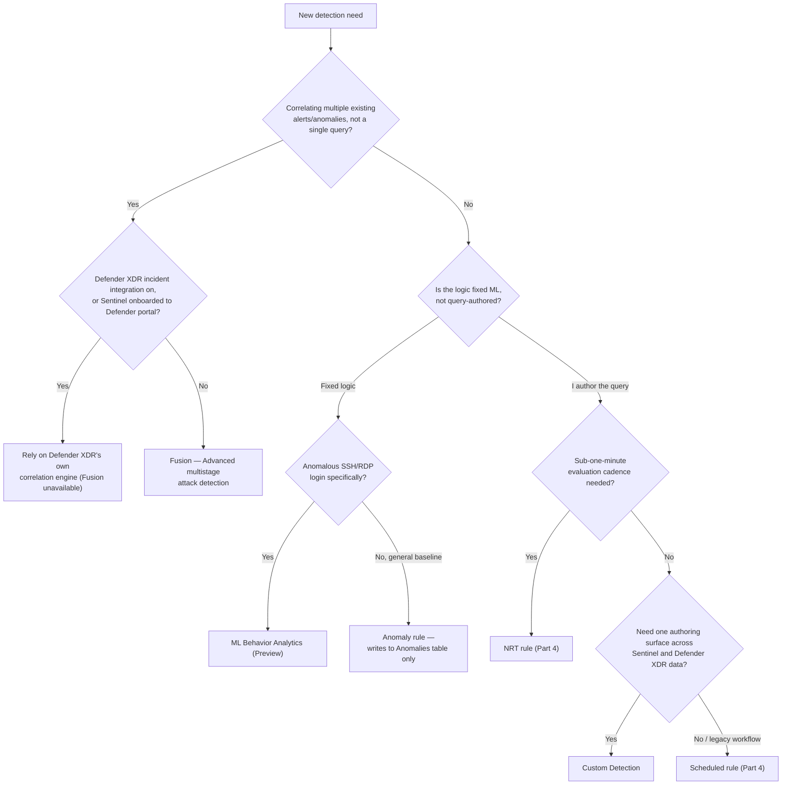

# Part 5 — Analytics Rules II: Fusion, Anomaly, ML Behavior Analytics, and Custom Detections

## Why this part exists

**[CONCEPT]** Part 4 covered the two analytics rule types where the detection logic is a query you write and own: Scheduled rules (an analyst-authored KQL query running on a configurable cadence and lookback) and Near-real-time (NRT) rules (the same idea, fixed to a one-minute evaluation cadence with a narrower feature set — see Part 4). This part covers the rule types where that isn't true. Fusion and ML Behavior Analytics ship with the query hidden entirely — Microsoft's own documentation states plainly that Fusion's "logic is hidden and therefore not customizable." Anomaly rules sit one step less locked-down: the algorithm is fixed, but the thresholds it alerts on can be tuned without touching a query. And Custom Detections, the newest entrant, is a query you write again — but authored against a different, merged data surface that didn't exist when Parts 1 through 4 of this book's own outline was drafted.

**[CONCEPT]** DEH Part 23 frames a general problem: one analytic, expressed once, has to survive translation across however many query-language backends a detection engineering program actually runs. This part is that same problem's platform-operations mirror, and arguably a sharper version of it. DEH Part 23's translation loss happens once, at authoring time, and then holds still. The rule types in this part can have their *availability* — not just their translation fidelity — flipped off by a decision made in a completely different part of the organization: a Defender XDR licensing change, a portal-migration project with no connection to detection engineering, or simply the passage of a calendar date this book's Part 2 already named. A Fusion rule that was live and working yesterday can be gone today with no change to the rule itself, because the workspace it runs in was onboarded to the Microsoft Defender portal for an unrelated reason. That is this part's actual subject: which rule types exist, what's genuinely configurable about each one, and the specific, dated conditions under which four of them stop existing out from under you.

This part does not cover: KQL syntax itself (DEH Part 25); Scheduled and NRT rule anatomy, which Part 4 already owns; the `BehaviorAnalytics`/`IdentityInfo`/`UserPeerAnalytics` schema and peer-group baselining mechanics behind User and Entity Behavior Analytics (UEBA), which Part 11 owns in full — this part touches the `Anomalies` table only as far as Anomaly rules populate it, not as UEBA's own detection layer; or the CI/CD mechanics for deploying rules as code, which Part 7 owns and which §6 below points to for Custom Detections specifically.

## 1. The rule-type landscape: authored logic vs. fixed logic

**[CONCEPT]** Microsoft's own analytics-rule documentation splits its rule-type catalog into two groups, and this part follows that same split because it maps directly onto what an engineer can actually change. The first group — Scheduled rules, NRT rules, Anomaly rules, and Microsoft security rules (rules that automatically create Microsoft Sentinel incidents from alerts generated in other Microsoft security solutions, in real time) — are described as regular rule types you configure through the normal analytics-rule surface. The second group — Fusion (Advanced multistage attack detection — single instance, hidden logic, unavailable once Defender XDR incident integration is on or the workspace is onboarded to the Defender portal), Machine learning (ML) behavior analytics (currently in Preview, also single-instance and non-customizable), and the Microsoft Threat Intelligence Analytics rule — are described as "specialized template types that can each create one instance of a rule, with limited configuration options" (Microsoft Learn, "Threat detection in Microsoft Sentinel," retrieved 2026-09-15). Anomaly rules are the interesting middle case: Microsoft groups them with the configurable rules on that page, but the underlying algorithm is exactly as fixed as Fusion's — what's configurable is a threshold, not the logic, and only after you duplicate the template (§4).

**[SENTINEL ENGINEER]** Table 5.1 supports one decision: given a detection need, which of these rule types can actually deliver it, and what does "configurable" mean for each one in practice.

**Table 5.1 — Analytics rule types beyond Scheduled and NRT.** Supports deciding which rule type fits a given detection need and what "configurable" actually buys you for each.

| Rule type | Who owns the logic | Instance limit | Result lands in | Status (as of 2026-09-15) |
|---|---|---|---|---|
| `Microsoft security` | You (severity/text filter only, not detection logic) | One per Microsoft source service, more than one allowed if filters don't overlap | Incident directly, no separate alert | GA — unavailable once Defender XDR incident integration or Defender portal onboarding is on (§5) |
| Microsoft Threat Intelligence Analytics | Microsoft (fixed matching logic) | One | Alert, then incident | GA |
| Fusion (`Advanced multistage attack detection`) | Microsoft (fixed correlation; source-signal inclusion/exclusion configurable) | One | `SecurityIncident` directly, no `SecurityAlert` row | GA overall; several scenario-based detections in Preview (§2) — unavailable once Defender XDR incident integration or Defender portal onboarding is on |
| ML Behavior Analytics | Microsoft (fixed logic) | One per supported protocol | Alert, then incident | Preview |
| Anomaly | Microsoft (fixed baseline; thresholds tunable via a duplicated copy) | Many templates; each is single-instance until you duplicate it | `Anomalies` table only — no alert, no incident | GA |
| Custom Detection | You (advanced hunting KQL) | Tenant-level quota, not a single-instance cap | Alert, then incident; unified across Sentinel and Defender XDR data | GA as a Defender XDR feature; Sentinel-data scope and as-code deployment are newer (§6) |

## 2. Fusion — advanced multistage attack detection

**[CONCEPT]** Fusion is a correlation engine, built into Microsoft Sentinel, that uses machine learning to detect multistage attacks by identifying combinations of anomalous behaviors and suspicious low-fidelity signals across different stages of the kill chain and, by design, across different products (Microsoft Learn, "Advanced multistage attack detection in Microsoft Sentinel," retrieved 2026-09-15). It ships enabled by default as a single analytics rule literally named **Advanced multistage attack detection**, and because its correlation logic is hidden, there can only ever be one instance of it. A successful Fusion detection doesn't behave like a normal analytics-rule output: it's written directly to the `SecurityIncident` table as a Fusion incident, not to `SecurityAlert` as an alert that later gets grouped into an incident — Fusion skips the alert stage entirely. The stated design goal is low-volume, high-severity, high-fidelity incidents: each one is required to comprise at least two correlated alerts or activities, which is the mechanism behind "low-volume" — a single suspicious event, however severe, cannot become a Fusion incident on its own.

**[SENTINEL ENGINEER]** "Not customizable" doesn't mean "not configurable." You can enable or disable the rule, choose which source signals feed the Fusion ML model, and exclude specific detection patterns that don't apply to your environment — none of which touches the correlation logic itself (Microsoft Learn, "Advanced multistage attack detection in Microsoft Sentinel," retrieved 2026-09-15). Two named sub-capabilities extend Fusion beyond its default scenario library. **Fusion for emerging threats** (Preview) applies broader ML analysis across a wider signal set — out-of-the-box anomaly detections, alerts from a named list of Microsoft services (Microsoft Entra ID Protection, Defender for Cloud, Defender for IoT, Defender XDR, Defender for Cloud Apps, Defender for Endpoint, Defender for Identity, Defender for Office 365), and alerts from your own scheduled analytics rules — to surface threats with no pre-built scenario. **Fusion for ransomware** is narrower: it correlates alerts from Defender for Cloud, Defender for Endpoint, Defender for Identity, Defender for Cloud Apps, and scheduled analytics rules, specifically around the Execution and Defense Evasion stages, into an incident named **Multiple alerts possibly related to Ransomware activity detected**.

> **Blind Spot**
> Both Fusion for emerging threats and Fusion for ransomware only consider your own scheduled analytics rules if those rules carry kill-chain (tactics) information and mapped entities (Microsoft Learn, "Advanced multistage attack detection in Microsoft Sentinel," retrieved 2026-09-15) — the same entity-mapping mechanics Part 6 covers in depth. A scheduled rule that fires constantly, with no tactic tagged and no entity mapped, is invisible to Fusion's cross-signal correlation even though it's generating alerts the entire time. This is a second, independent reason (beyond the False Positive Trap of an unfiltered rule) to treat entity mapping and tactic tagging as mandatory rule-authoring steps, not optional metadata — an unmapped rule doesn't just investigate worse on its own; it also can't contribute to the one correlation layer designed to catch what it misses.

> **Detection Test**
> **Setup:** A workspace with Fusion enabled (its default state) and at least two of the data sources Fusion for ransomware consumes — for example, Microsoft Defender for Endpoint and Microsoft Defender for Cloud — actually connected and ingesting.
> **Action:** Trigger, or wait for, two or more distinct alerts from different connected sources on the same host within a short window, consistent with the Execution/Defense Evasion pattern Fusion for ransomware watches for — this is most reliably exercised with a scoped, approved simulation rather than live malware.
> **Expected result:** A single incident titled **Multiple alerts possibly related to Ransomware activity detected**, stored in `SecurityIncident`, distinct from — and not duplicating — the individual `SecurityAlert` rows each source alert produced on its own.

## 3. ML Behavior Analytics — anomalous SSH and RDP login detection

**[CONCEPT]** ML Behavior Analytics rules (currently in Preview) use Microsoft's own machine learning to flag anomalous SSH and RDP login behavior, scored against IP address, geolocation, and user history information (Microsoft Learn, "Threat detection in Microsoft Sentinel," retrieved 2026-09-15). Like Fusion, the logic isn't customizable, and each protocol gets its own single-instance rule — you enable it, you don't tune its query.

**MITRE:** T1021.001 (Remote Services: Remote Desktop Protocol), T1021.004 (Remote Services: SSH).

> **PRODUCT VERSION NOTE (as of 2026-09-15)**
> Microsoft's "Threat detection in Microsoft Sentinel" page states ML Behavior Analytics rules are "currently in Preview." Unlike Fusion and Microsoft security rules (§5), this same page's explicit unavailability callouts — the ones naming Defender XDR incident integration and Defender portal onboarding as disabling conditions — do not name ML Behavior Analytics. Treat that as "not documented as disabled," not as a confirmed guarantee: a Preview feature's availability list is exactly the kind of fact that can change between this chapter's last-validated date and whenever you're reading it. Re-check the same page before depending on ML Behavior Analytics rules surviving a Defender-portal migration unchanged.

**[SENTINEL ENGINEER]** The practical consequence of hidden, fixed logic is that there's no partial remedy for a bad fit. A scheduled rule with a threshold that's too sensitive for your environment gets a lookback or trigger-threshold adjustment; an ML Behavior Analytics rule that flags a distributed, frequently-traveling workforce's routine geolocation variance has exactly two states available to you — enabled, generating alerts you may not trust, or disabled, generating nothing.

> **Engineering Reality**
> A fixed-logic rule's tuning surface is binary by design, not by an oversight Microsoft might eventually fix. The tradeoff you're accepting by enabling ML Behavior Analytics is: you get a detection you didn't have to build, tested by Microsoft against baseline attacker SSH/RDP behavior at a scale no single SOC's own dataset reaches — at the cost of not being able to adjust it when your own environment's normal doesn't match the assumption baked into the model. If that mismatch produces alert volume your team can't absorb, disabling the rule and building an equivalent, tunable Scheduled rule against `SigninLogs`/`DeviceLogonEvents` (Part 4) is a legitimate response, not a failure to use the built-in feature correctly.

## 4. Anomaly rules — tunable thresholds on a fixed ML baseline

**[CONCEPT]** Anomaly rules observe a specific type of behavior over an observation period to establish a baseline, then flag any occurrence that exceeds the boundaries that baseline sets (Microsoft Learn, "Threat detection in Microsoft Sentinel," retrieved 2026-09-15). Each out-of-the-box template ships with its own parameters and thresholds already tuned by Microsoft Sentinel's data science team — and, critically, anomaly rules do not generate their own alerts. A single anomaly is deliberately treated as weak evidence on its own; results are written to the `Anomalies` table, a dedicated tab on the Analytics page distinct from Active rules and Rule templates, for you to query, correlate, and act on deliberately rather than have surfaced as an incident automatically.

**[SENTINEL ENGINEER]** The out-of-the-box configuration of a template "can't be changed or fine-tuned" directly — the tuning path is to duplicate the template, then run the duplicate in **Flighting** mode alongside the unmodified original in **Production** mode, compare results, and promote the duplicate to Production once its performance satisfies you (Microsoft Learn, "Use customizable anomalies to detect threats in Microsoft Sentinel," retrieved 2026-09-15). This is the same underlying discipline as an A/B test: the original keeps running the whole time, so tuning the duplicate never leaves you with zero anomaly coverage for that behavior. A subset of anomaly detections comes specifically from the UEBA engine's peer-group and organizational baselining (Part 11 owns this scoring model in depth) — those rows land in the same `Anomalies` table alongside anomalies from Sentinel's other ML templates, distinguishable by template name, not by table.

```kql
// CONCEPTUAL SAMPLE — illustrative pivot on the Anomalies table, not validated against a
// live tenant. Verify the exact column set against your own workspace's Log Analytics
// schema browser before relying on field names here — this book has no live tenant to
// confirm them against (see Part 11 for the table's documented schema).
Anomalies
| where TimeGenerated > ago(7d)
| where AnomalyTemplateName has "Sign-in"
| project TimeGenerated, AnomalyTemplateName, Description, Score, CompromisedEntity
```

This query targets a workspace with Anomaly rule templates enabled and is meant as a threat-hunting pivot (Part 9), not a detection in itself; its main limitation is the one the section above already names — a row here is context for a hunt or an existing alert, not, by Microsoft's own design intent, a standalone verdict.

> **False Positive Trap**
> Microsoft's own documentation is blunt about this: "Anomalies can be powerful tools, but they are notoriously noisy. They typically require a lot of tedious tuning for specific environments" (Microsoft Learn, "Use customizable anomalies to detect threats in Microsoft Sentinel," retrieved 2026-09-15). Treating a raw `Anomalies` row as an incident-worthy finding on its own reproduces exactly the noise problem the table's design already anticipates. The intended pattern is additive: use an anomaly to raise or lower confidence in a separate, already-triggered detection, or as a starting thread for a hunt — not as a rule that alerts by itself, which is a state Microsoft deliberately didn't build for the out-of-the-box templates.

> **Detection Autopsy — "we turned on the anomaly templates and got zero incidents"**
> A team enables several out-of-the-box Anomaly rule templates expecting the usual outcome of turning on an analytics rule: alerts, then incidents, then something to triage. Nothing shows up in the incident queue. The postmortem conclusion isn't "the feature is broken" — it's that Anomaly rules were never going to produce an incident on their own; that's the one behavior explicitly and permanently designed out of this rule type (§4 above). The fix isn't debugging the rule; it's building the missing second half of the pipeline — a scheduled analytics rule or a hunting query that reads `Anomalies` and decides, deliberately, which combinations of anomaly plus something else should become an incident. Skipping that second half and expecting the anomaly template alone to carry the workload is the actual defect, not anything in Sentinel's configuration.

## 5. The availability trap: Defender XDR integration and Defender portal onboarding

**[SOC MANAGEMENT]** Two of the rule types this part covers can stop existing for reasons that have nothing to do with the rule. Microsoft's documentation states, for both Microsoft security rules and Fusion, the identical condition: each is "not available" if you have enabled Microsoft Defender XDR incident integration, *or* onboarded Microsoft Sentinel to the Microsoft Defender portal (in full: the Azure portal and Microsoft Defender portal are the two surfaces for operating Sentinel; see Part 2 for the full architecture and the retirement timeline). These are two independent triggers — either one alone is sufficient — and neither requires touching the rule itself. In both cases, the stated reason is the same: "Microsoft Defender XDR creates the incidents instead" (Microsoft Learn, "Threat detection in Microsoft Sentinel," retrieved 2026-09-15), via its own correlation engine, making Sentinel's Fusion and Microsoft-security incident-creation redundant with a system that now sits upstream of it.

**Table 5.2 — Rule-type availability by portal.** Supports deciding which rule types survive a Defender-portal migration unchanged and which need a replacement built before the switch is flipped.

| Rule type | Azure portal (retiring 2027-03-31) | Defender portal |
|---|---|---|
| `Microsoft security` | Available; configurable per source service and severity filter | Not available — Defender XDR's correlation engine creates the incidents instead |
| Fusion (`Advanced multistage attack detection`) | Enabled by default | Not available — replaced by the Defender XDR correlation engine |
| ML Behavior Analytics | Preview, enabled | Not named in Microsoft's unavailability list as of 2026-09-15 (§3) — verify current status before relying on this |
| Anomaly | Available | Available — no correlation-engine overlap motivates disabling a rule type that never created incidents in either portal |
| Custom Detection | — (not a Sentinel Azure-portal rule type at all) | Available, including unified Sentinel and Defender XDR data (§6) |

> **PRODUCT VERSION NOTE (as of 2026-09-15)**
> Per Microsoft Learn's "Threat detection in Microsoft Sentinel" and "Advanced multistage attack detection in Microsoft Sentinel" pages, Microsoft security rules and the Fusion rule type are both unavailable once either Microsoft Defender XDR incident integration is enabled or the workspace is onboarded to the Defender portal — and "any such rules you had defined beforehand are automatically disabled." Both pages carry this fact as of this writing. If you're planning a Defender-portal transition (Part 16), re-check both pages for whether this list has grown or shrunk before you finalize a migration runbook.

> **Blind Spot**
> "Automatically disabled" is silent by design — there's no incident, no alert, no health-monitoring event that specifically flags "your Microsoft security rule just stopped working because someone else enabled Defender XDR integration." If your team built Microsoft security rules with real severity filters — for example, a rule that only creates an incident from a high-severity Microsoft Defender for Identity alert, deliberately suppressing lower ones — that specific filtering intent doesn't carry over anywhere. Defender XDR's correlation engine has its own logic for which alerts become incidents, and it wasn't built to reproduce your rule's filter. A team that onboards to the Defender portal for an unrelated reason (unified advanced hunting, single-queue investigation) can lose that filtering behavior without anyone deciding to lose it.

> **What Would Change My Mind**
> This book's default recommendation for a Sentinel-only shop planning a Defender-portal move is to treat the loss of Fusion and Microsoft-security auto-incident-creation as a migration task to complete *before* onboarding — rebuild the equivalent coverage as Scheduled rules or Custom Detections (§6), verify it fires the way the old rule did, and only then flip the switch — rather than a gap to discover afterward. If Microsoft reintroduced an equivalent, configurable incident-creation surface inside the Defender portal itself, instead of relying solely on the XDR correlation engine's own judgment, this recommendation would soften from "rebuild first" to "onboard, then evaluate parity" — a materially lighter migration-planning burden for the SOC manager owning Part 16's project.

## 6. Custom Detections — the unified rule-authoring surface

**[CONCEPT]** Custom detections are customizable detection rules, built from advanced hunting queries, that run at a configured interval and automatically trigger alerts and response actions (Microsoft Learn, "Overview of custom detections in Microsoft Defender XDR," retrieved 2026-09-15). They predate this book's subject matter — custom detection rules have existed in the Defender XDR advanced hunting experience for years — but what makes them belong in this part now is what changed once Microsoft Sentinel became reachable from the same Microsoft Defender portal.

> **PRODUCT VERSION NOTE (as of 2026-09-15)**
> Microsoft's own documentation for Fusion, Anomaly rules, Microsoft security incident-creation rules, and the general "Threat detection in Microsoft Sentinel" overview all now carry an identical banner: "Custom detections is now the best way to create new rules across Microsoft Sentinel SIEM Microsoft Defender XDR. With custom detections, you can reduce ingestion costs, get unlimited real-time detections, and benefit from seamless integration with Defender XDR data, functions, and remediation actions with automatic entity mapping" (Microsoft Learn, retrieved 2026-09-15, appearing consistently across the pages cited elsewhere in this part). Strip the adjective and the falsifiable claim underneath is: for new detection content, Microsoft is now steering authors toward one rule-authoring surface that spans both platforms, rather than toward the older, platform-specific rule types this part otherwise documents. Nothing in any page cited in this part states that Scheduled or NRT rule creation (Part 4) is deprecated or scheduled for removal — the banner is a positioning statement about *where to build new detections going forward*, not a documented removal of the older surfaces. Re-check this banner's wording at the cited pages before treating it as a permanent policy rather than current guidance.

**[SENTINEL ENGINEER]** The mechanism behind that positioning is unified advanced hunting: once a Sentinel workspace is onboarded to the Microsoft Defender portal, the advanced hunting Schema tab shows that workspace's own tables — organized by solution, alongside the standard Defender XDR tables (`DeviceProcessEvents`, `IdentityLogonEvents`, and the rest of the catalog DEH Part 25 already documents) — and its saved functions and queries appear in the same interface, in folders marked **Sentinel** (Microsoft Learn, "Advanced hunting with Microsoft Sentinel data in Microsoft Defender," retrieved 2026-09-15). A custom detection rule authored from that unified query surface can therefore span both data worlds in one rule, with two documented limitations as of this writing: near-real-time detection frequency isn't available for a custom detection whose query includes Microsoft Sentinel data, and custom KQL functions created and saved in Microsoft Sentinel aren't supported inside a custom detection rule (same source). Both limitations disappear if the query stays entirely inside Defender XDR's own tables — the constraint is specifically about crossing the two data worlds inside one rule, not about custom detections generally.

> **PRODUCT VERSION NOTE (as of 2026-09-15)**
> The two cross-data-world limitations named above — no near-real-time frequency tier for a custom detection that references Sentinel data, and no support for Sentinel-saved custom KQL functions inside a custom detection rule — and the schema/folder integration mechanics they follow from are drawn from Microsoft's "Advanced hunting with Microsoft Sentinel data in Microsoft Defender" page as cited. This is the unified Sentinel/Defender-XDR advanced hunting surface Part 5's own scope note already flags as the fastest-changing ground in this book. Re-check that page directly before relying on either limitation still holding — a documented gap on an integration this new and this actively worked on is a likely candidate to shrink or disappear entirely on a future release, not a stable architectural boundary.

> **Engineering Reality**
> Custom detection queries carry the same "keep it cheap" discipline DEH Part 25 §3 already establishes for a scheduled rule running on a tight cadence, plus one additional wrinkle this part's data adds: a query that blends Sentinel and Defender XDR tables doesn't just risk running slow — it forecloses the near-real-time frequency tier outright, by documented design, the moment it references a Sentinel table. A detection that genuinely needs sub-hour latency and also needs a Sentinel-only table has no custom-detection path to that combination as of this writing; it needs either a Sentinel-side NRT rule (Part 4) restricted to Sentinel data, or a redesign that keeps the time-sensitive half of the logic inside Defender XDR's own tables.

**[ENGINEERING]** Custom detection rules can also be managed as code — currently in Preview — using the Microsoft Security Bicep extension, deployed either through Microsoft Sentinel's own Repositories feature for automatic sync or through the Bicep CLI for a custom pipeline (Microsoft Learn, "Overview of custom detections in Microsoft Defender XDR," retrieved 2026-09-15). Part 7 owns the CI/CD and rule-repository depth this implies; this part's job is only to flag that the path exists and that it's the same underlying deployment mechanism Part 7 already builds its detection-as-code case around, applied to a rule type this part covers.

## 7. Choosing a rule type

**[SENTINEL ENGINEER]** Collapsing §§1–6 into a single decision sequence: start from what the detection actually needs — a correlation across signals you already have, a fixed ML behavior you didn't have to build, a tunable baseline you're willing to query rather than alert on directly, or a query you author yourself — and let the portal and latency constraints already covered above narrow the remaining choice.






**Figure 5.1 — Analytics rule type decision tree.** *CONCEPTUAL.* Illustrates the decision sequence an engineer walks through when choosing among the rule types this part and Part 4 cover, based on latency need, customizability need, and Defender-portal onboarding status. This is a structural sketch built from this book's own reading of the official rule-type documentation cited throughout this part — not a capture of any Sentinel UI screen, and not a reproduction of an official Microsoft diagram.

**[SOC MANAGEMENT]** The one branch this diagram can't resolve on its own is the availability trap (§5): a decision made outside detection engineering entirely — onboarding to the Defender portal, turning on Defender XDR incident integration — can retroactively remove the Fusion and Microsoft-security branches from a workspace that was already relying on them. Walking this decision tree once, at authoring time, is necessary but not sufficient; Part 16's migration-planning discipline is what keeps the answer from silently going stale.

---

**Cross-references:** DEH Part 23 (one analytic, many backends — this part's availability trap is the platform-operations version of the same problem, where the "backend" is a portal-and-correlation-engine choice rather than a query language); Part 2 (the two-portal architecture and the March 31, 2027 Azure-portal retirement date this part's availability facts depend on); Part 4 (Scheduled and NRT rules — the authored-query baseline every rule type in this part departs from in one direction or another); Part 6 (entity mapping and tactic tagging, required for a scheduled rule to be visible to Fusion for emerging threats and Fusion for ransomware); Part 7 (detection-as-code and the Repositories/Bicep deployment mechanics behind custom-detection-as-code); Part 9 (hunting mechanics behind the `Anomalies`-table pivot in §4); Part 11 (UEBA's `BehaviorAnalytics`/`IdentityInfo`/`UserPeerAnalytics` schema and scoring model behind the subset of `Anomalies` rows this part attributes to it); Part 16 (the Defender-portal migration as a program-management problem, not a toggle).
