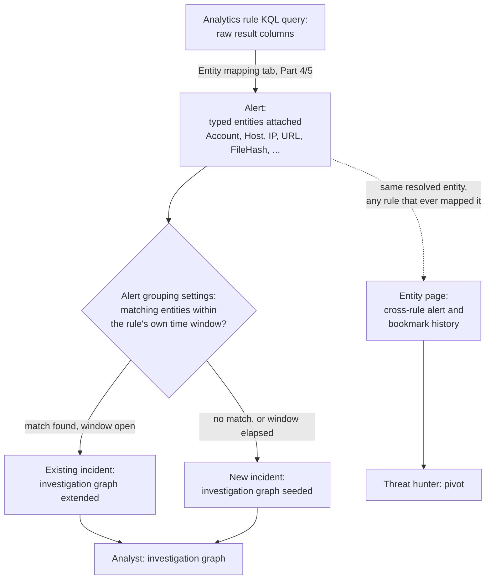

# Part 6 — Entity Mapping and the Incident Model

## Why this part exists

An analytics rule's KQL query, once it runs, produces rows and columns — `AccountName`,
`SourceIP`, `Computer`, `SHA256`, whatever the query happens to `project`. None of those columns
mean anything to Microsoft Sentinel's incident layer until something tells the platform which
column represents which kind of real-world thing. That "something" is entity mapping: a
per-rule configuration step, sitting between a query that matches and an alert that a human or
an automation rule can act on, that turns an arbitrary result column into a typed entity —
`Account`, `Host`, `IP`, and the rest of a defined schema Sentinel's incident-grouping,
investigation-graph, and (where enabled) UEBA layers all read from.

This part covers the mechanics of that step and the incident model built on top of it: how a
query column becomes a typed entity, how entities drive alert grouping into a single incident,
what an analyst or threat hunter actually sees once entities are attached, and — the part of this
that fails most often, and most quietly — what happens when the field chosen to represent an
entity turns out not to uniquely identify it. This last problem is not new to this book. The
*Detection Engineering Handbook* (DEH) names it as **Entity Resolution** in the abstract
(TERMINOLOGY.md § Entity Key / Entity Resolution) and gives it a concrete, worked failure in DEH
Part 25 §4, where a KQL join keyed on `DeviceId` alone silently misattributes an alert on a
multi-user host. Entity mapping in Sentinel is that same problem, deployed as a standing
platform feature rather than written by hand into one query — which makes it more convenient and,
when curated carelessly, more consequential, because the same weak key now shapes every incident
the rule ever produces, not just one query's output.

This part does not re-teach KQL join syntax (DEH Part 25) or correlation-window mechanics in the
abstract (DEH Part 30) — it assumes both and covers the Sentinel-specific layer built on top of
them: the entity schema itself, the rule-configuration surface that populates it, and the
incident model that consumes it.

---

## 1. From query column to typed entity

**[CONCEPT]** A KQL query's result set is, to Kusto, just a table of columns with names and data
types — a string here, a datetime there. Microsoft Sentinel's incident layer does not
automatically infer that a column named `AttackerIP` holds an IP address entity any more than it
infers that `AccountName` holds an `Account` entity; without an explicit mapping, both are just
strings that happen to render in an alert's details pane. Entity mapping is the configuration
step — performed once per analytics rule, on the rule's **Entity mapping** tab in the rule
wizard — that names which output column corresponds to which entity type, and which of that
entity type's identifier fields the column actually populates.

Once a column is mapped, every alert instance the rule produces carries structured entities
alongside its raw column values, and those entities become the join key Sentinel's own platform
logic uses for the rest of this part: alert grouping into incidents (§3), the investigation graph
an analyst pivots through (§4), and — where the UEBA behaviors layer covered in Part 11 is
enabled — behavioral baselining keyed on the same resolved entity across rules. Put in DEH's own
vocabulary: entity mapping is the practical, per-rule implementation of Entity Resolution
(TERMINOLOGY.md § Entity Key / Entity Resolution) — the field or field combination asserting that
two events, possibly from two different alerts or two different rules entirely, concern the same
real-world `Account`, `Host`, or `IP`.

This configuration surface exists in **the Azure portal** and, once a workspace is onboarded,
**the Microsoft Defender portal** — both terms given in full here on first mention, per this
book's own notation convention, because "Azure" and "Defender" alone are also product names and
the ambiguity matters more in this book than almost anywhere else. The Azure portal's rule wizard
is the version described through this part; Part 16 covers what changes about rule configuration
surfaces specifically once a workspace operates from the Defender portal instead.

**[SENTINEL ENGINEER]** Entity mapping applies to Scheduled and Near-real-time (NRT) rules
(fixed one-minute evaluation cadence, limited subset of scheduled-rule features) — the rule types
built directly on a KQL query, covered in Part 4 — the same way, through the same tab. Fusion
(Advanced multistage attack detection — single instance, not customizable, unavailable once
Defender XDR incident integration is on) and Anomaly rules, covered in Part 5, do not expose this
tab at all: their entities are generated internally by Microsoft's own correlation or ML logic,
not mapped by a rule author, which is one more reason Part 5 treats those rule types as a
materially different authoring surface rather than a variant of the same one.

---

## 2. Sentinel's entity schema

**[SENTINEL ENGINEER]** Microsoft documents a defined set of entity types an analytics rule can
map to, each with its own set of identifier fields — Microsoft Learn's "Map data fields to
entities in Microsoft Sentinel" page and the companion entities reference page are the
authoritative source for the full list; this part reproduces only the handful this book's
examples return to most often.

**Table 6.1 — Entity types this book's examples map to most often.** The table below supports a
Sentinel engineer's first decision when writing an entity mapping: which entity type a given
query column actually represents, and which identifier field name Sentinel's own schema expects
to receive it under. This is not the complete type or field list — `Azure resource`, `Cloud
application`, `DNS`, `File`, `IoT device`, `Mailbox`, `Mail cluster`, `Mail message`, `Malware`,
`Registry key`, `Registry value`, and `Security Group` all exist as mappable entity types beyond
the six below — see the Microsoft Learn pages cited above for the rest.

| Entity type | Typical source column | Representative identifier field(s) |
|---|---|---|
| `Account` | `AccountName`, `UserPrincipalName` | `Name`, `NTDomain`, `UPNSuffix`, `Sid`, `AadUserId` |
| `Host` | `Computer`, `DeviceName` | `HostName`, `NetBiosName`, `DnsDomain`, `AzureID` |
| `IP` | `SourceIP`, `RemoteIP`, `CallerIpAddress` | `Address` |
| `URL` | `RequestURL`, `Url` | `Url` |
| `FileHash` | `SHA256`, `MD5`, `InitiatingProcessSHA256` | `Algorithm`, `Value` |
| `Process` | `NewProcessName`, `InitiatingProcessFileName` | `ProcessId`, `CommandLine` |

Microsoft's own documentation distinguishes identifier fields that are sufficient, on their own,
to assert two rows concern the same entity (commonly called **strong identifiers** — an `IP`
entity's `Address`, or an `Account` entity's `Sid`) from fields that only become reliable when
combined with at least one other identifier for the same entity (an `Account` entity's bare
`Name`, which needs `NTDomain` or `UPNSuffix` alongside it before Sentinel treats the match as
trustworthy). Exactly which fields on which entity types currently carry which designation is a
detail worth re-checking directly against the live rule wizard or the current Entities reference
page before relying on it operationally — this book has no live tenant to confirm the current,
complete strong/weak marking against (STYLE-GUIDE.md §9's honesty constraint), so treat the
concept above as reliably real and the specific per-field marking as something to verify rather
than take from this page alone.

> **PRODUCT VERSION NOTE (as of 2026-09-15)**
> Microsoft's entity-mapping documentation ("Map data fields to entities in Microsoft Sentinel,"
> part of the Microsoft Sentinel documentation on Microsoft Learn) has long described a per-rule
> cap on entity mapping built through the Azure portal's rule wizard — historically five entity
> mappings per rule, each carrying up to three identifier fields. This book has no live tenant to
> re-verify that cap against the current wizard, so treat "five entities, three identifiers each"
> as this book's best-documented recollection, not a confirmed-today number — check the live rule
> wizard or the current Learn page before designing a rule that assumes it sits exactly at the
> limit. If the cap has since changed, note that the rule's underlying ARM template already
> supports a JSON-based entity-mapping definition distinct from the wizard's own form fields; a
> rule that runs out of mapping slots in the portal UI may still be extendable by editing that
> definition directly rather than concluding the behavior can't be mapped at all.

---

## 3. Entity mapping and alert grouping into incidents

**[SENTINEL ENGINEER]** Mapped entities do more than decorate an alert's details pane — they are
the join key Sentinel's own alert-grouping logic uses to decide whether a new alert extends an
existing incident or opens a new one. Each analytics rule's **Incident settings** tab carries its
own alert-grouping configuration: whether alerts this rule produces get grouped into incidents at
all, and if so, whether grouping requires **all** mapped entities to match across two alerts or
only a **selected subset**, within a bounded time window the rule itself defines. A rule with
grouping turned off produces one incident per alert; a rule grouping on, say, a matching `Account`
entity within a multi-hour window collapses every alert naming that same account inside the window
into one incident instead of many.

**[ANALYST]** This matters directly to how an incident reads in the unified queue: two entirely
different alert titles, from the same rule, sharing a grouped incident because they matched on
entity, is normal and expected — it is the platform doing exactly what its grouping configuration
told it to do, not a correlation-engine anomaly. What's worth checking, when an incident looks
unexpectedly large or unexpectedly narrow, is which entity type the rule actually grouped on and
how wide its matching window is — both are visible on the rule's own configuration, not just
inferable from the incident.

**[SENTINEL ENGINEER]** This grouping mechanism is scoped to alerts from the *same* analytics
rule. Combining alerts from *different* rules — or, once Defender XDR incident integration is on,
from different Microsoft security products entirely — into one incident is a separate mechanism:
Fusion's own multistage correlation (Part 5) on the Sentinel side, or Defender XDR's correlation
engine once a workspace is onboarded to the Microsoft Defender portal (Part 15). Entity mapping
still matters to both of those broader mechanisms — they still need a reliable entity to
correlate on — but the per-rule Incident settings tab covered here is not the layer doing that
wider correlation.

> **Engineering Reality**
> Alert grouping into a single incident happens within a bounded time window the rule's own
> Incident settings define, not indefinitely. An intrusion that revisits the same entity after
> that window has already elapsed opens a *second* incident rather than extending the first,
> unless the rule's grouping configuration is also set to reopen a matching closed incident. This
> is the same class of silently-wrong-window problem DEH Part 30 §2 names for a correlation window
> measured against the wrong clock: the platform raises no error and drops no data — it simply
> produces two incidents where a human reviewing the underlying alerts side by side would see one
> continuous campaign.

---

## 4. The investigation graph and entity pages

**[ANALYST]** Once an incident carries entities, Sentinel's incident page offers an
**investigation graph** — opened from the incident's own investigate action — that renders the
incident's alerts and their mapped entities as a connected graph, with expandable relationships
an analyst can follow outward from any node: which other alerts, bookmarks, or related entities
touch the same `Account`, `Host`, or `IP` this incident already named. This is the practical
payoff of everything in §§1–3: an analyst working the incident is not reading a flat alert list
and manually re-querying every entity by hand — the graph already reflects the entity resolution
the rule author configured when they built the mapping.

Selecting an individual entity from that graph — or from any place in the portal where Sentinel
renders an entity value as a link rather than plain text — opens an **entity page**: a dedicated
view of that specific `Account`, `Host`, or `IP`'s own activity history, independent of any one
incident. Where the UEBA behaviors layer covered in Part 11 is enabled, an entity page also
surfaces behavioral insights for that entity; where it isn't, the page still shows the entity's
alert and bookmark history drawn from ordinary entity-mapping data alone.

**[ENGINEERING]** Two tables carry the underlying data this experience is built from, and they
carry it differently, which matters if a query ever needs to reach entity data directly instead
of through the graph UI: `SecurityAlert` carries each alert's mapped entities as a JSON-encoded
column on the alert row itself, while `SecurityIncident` aggregates alerts by reference (an
incident row names the alert IDs it contains) rather than duplicating each alert's entity payload
onto the incident row directly. A KQL query reaching for "every entity on every alert in this
incident" generally has to start from `SecurityIncident`, resolve to the alert IDs it references,
and pull entities from the corresponding `SecurityAlert` rows — not read them off the incident row
in one step. Confirm current field names against the live table schema or Microsoft's data
reference before building automation against this join directly; this book states the shape of
the relationship with confidence and the exact column names with somewhat less.

> **PRODUCT VERSION NOTE (as of 2026-09-15)**
> The investigation graph and entity pages described above are Azure portal features as
> documented on Microsoft Learn's "Investigate incidents with Microsoft Sentinel" page. The
> Microsoft Defender portal presents its own incident-investigation surface once a workspace is
> onboarded, and this book has not verified feature-for-feature parity between the two — Part 16
> owns that comparison in the depth it deserves. If you're reading this after that comparison
> exists, treat this part's description of the investigation graph as accurate to the Azure
> portal experience specifically, not as a claim about what an analyst sees after a
> Defender-portal migration.

---

## 5. Where entity mapping breaks: identifiers that aren't actually keys

**[SENTINEL ENGINEER]** Every mapping in §2's table is a bet that the chosen identifier field
actually, uniquely ties two events to the same real-world entity — and every entity-mapping
failure this part cares about follows from that bet being wrong in a way that produces no error,
no warning, and an incident that still looks entirely plausible.

> **Blind Spot**
> Entity mapping only asserts that two alerts share an entity if the mapped identifier field
> genuinely, uniquely identifies that entity — and the field most conveniently already present in
> a query's result set is often exactly the kind of field DEH Part 25 §4's `DeviceId`-on-a-
> multi-user-host example already names as unreliable for this purpose (see also
> TERMINOLOGY.md § Entity Key / Entity Resolution). Mapping a `Host` entity to a bare `Computer`
> or `DeviceName` value, with no `HostName` + `DnsDomain` combination or resource-scoped
> identifier behind it, means every alert that ever touches a shared jump box, a Citrix or VDI
> host, or a heavily multiplexed container node resolves to the *same* `Host` entity regardless of
> which of that host's several concurrent sessions or users actually produced each alert. The
> incident-grouping logic in §3 then has no way to distinguish "the same intrusion touched this
> host twice" from "two unrelated users happened to trigger unrelated alerts on the same shared
> machine" — both collapse into one incident, identically, once the entity key collapses them
> together. The same failure shape applies to `Account` entities mapped on a bare `Name` with no
> `NTDomain`/`UPNSuffix` alongside it: two different domains, or a cloud tenant and an on-prem
> forest, can genuinely have two different real people both named `jsmith`.

**[THREAT HUNTER]** This is not purely a Sentinel-engineering problem to fix once and forget —
it's also a standing reason a hunter should not trust an entity page's activity history as
automatically complete or automatically precise, without checking which identifier field actually
produced the resolution.

> **Hunter's Note**
> An entity page is a genuine hunting pivot, not just an incident-triage convenience — it surfaces
> every alert, bookmark, and (where Part 11's UEBA behaviors layer is enabled) behavioral insight
> tied to that resolved entity across *every* rule that ever mapped to it, not only the rule whose
> incident a hunter started from. A hunter chasing a single suspicious account or host across a
> suspected multi-stage intrusion generally gets further starting from that entity's own page than
> re-running the same filter by hand against each table Part 9 covers separately. The same §5
> caveat applies while doing this: before treating a quiet entity page as evidence that "nothing
> else happened," confirm the entity was mapped on a genuinely unique identifier for the resource
> in question — a quiet page for a shared jump box's `Host` entity may just mean the actual attacker
> session never got a distinct identifier to resolve against in the first place.

---

## 6. The operational cost: over-merged and under-merged incidents

**[SENTINEL ENGINEER]** Section 5's failure mode has two directions, and they feel opposite to an
analyst even though both come from the same underlying cause — an identifier that doesn't
actually uniquely key the entity it's mapped to.

> **False Positive Trap**
> Alert grouping by matching entities (§3) is a platform behavior, not a detection-logic decision,
> and it produces its own platform-shaped false-positive pattern: a shared service account, a
> NAT'd corporate egress IP, or a heavily used jump box, mapped as the matching entity across
> alerts with no real relationship to each other, pulls those alerts into one incident anyway,
> because the platform only evaluates "same entity, same time window" — it has no independent way
> to know the underlying activity isn't actually connected. The incident itself isn't wrong about
> what fired; its *shape* overstates how connected the underlying activity is, and an analyst
> opening it inherits a graph muddied with alerts that only ever shared a weak identifier, not a
> cause. Narrowing the rule's alert-grouping match from "any shared entity" to one specific,
> deliberately chosen entity type — the same allowlist-style discipline DEH's own False Positive
> Trap guidance already applies to detection logic — is the direct mitigation.

The opposite direction produces no dramatic single incident to point at, which is exactly why it's
easier to miss: a rule whose entity mapping is too narrow, or missing entirely, groups nothing,
so an intrusion that trips the same rule five times becomes five separately opened, separately
owned incidents with no shared context connecting them — each one individually unremarkable,
collectively the same story DEH's own Correlation entry (TERMINOLOGY.md § Correlation) describes
for events, now playing out one level up at incident scale.

> **SOC Management View**
> Entity-mapping quality is easy to treat as a one-time rule-authoring checkbox, but its downstream
> cost shows up in analyst hours, not in the rule itself. An under-mapped rule produces five
> disconnected incidents for one intrusion, multiplying triage effort with no analyst realizing
> they're working the same event five times; an over-broadly-mapped rule produces one bloated
> incident that buries the one alert that mattered among unrelated activity riding along on a weak
> shared identifier. Neither failure shows up on a deployed-rule-count dashboard or a MITRE-coverage
> percentage — both describe whether a detection exists, not what shape its incidents take once it
> fires — so a SOC manager auditing platform quality has to ask about entity-mapping discipline
> explicitly, as its own review item, rather than trusting rule-count or coverage metrics to reflect
> it by proxy.

---

## 7. Data-flow summary

**[CONCEPT]** Figure 6.1 collects §§1–6 into one path: a query column becomes a typed entity
through the rule's own entity-mapping configuration; that entity becomes the join key for
alert-grouping into an incident, bounded by the rule's own grouping window; the resulting
incident's entities populate the investigation graph an analyst pivots through; and the same
resolved entity, independent of any one incident, is what a threat hunter reaches through an
entity page.

**Figure 6.1 — From query column to incident entity graph.** *CONCEPTUAL.* Illustrates the path
an entity takes from a raw analytics-rule query column, through the entity-mapping configuration
covered in §§1–2, into the alert-grouping and investigation-graph mechanics covered in §§3–4, and
onward into the entity-page pivot a threat hunter uses independently of any single incident
(§5–6's Hunter's Note). This is a structural sketch built from this book's own reading of the
Microsoft Learn pages cited throughout this part — not a capture of any Sentinel portal screen,
and not a reproduction of an official Microsoft diagram.

---

## 8. What this means for a rule built earlier in the book

**[SENTINEL ENGINEER]** Part 4 and Part 5's scheduled and NRT rule examples exist upstream of
everything in this part: a query that returns a clean `AccountName`, `Computer`, or `SourceIP`
column is doing the necessary but not sufficient work — the entity mapping tab is the step that
actually connects that column to the incident model described here, and skipping it (or mapping a
column to the wrong identifier field, per §5) is invisible at rule-authoring time and only
surfaces later, as an incident that groups oddly or an entity page that returns less than
expected. Reviewing a new rule's entity mapping belongs in the same authoring checklist as
reviewing its query logic, not as an afterthought applied once an analyst first complains that two
obviously related alerts landed in separate incidents.

---

**Cross-references:** DEH TERMINOLOGY.md § Entity Key / Entity Resolution; DEH Part 25 §4
(the `DeviceId`-on-a-multi-user-host join example this part's Blind Spot box mirrors at incident
scale); DEH Part 30 (Correlation Engineering — entity keys and correlation windows, the
event-level version of this part's incident-level problem); Part 4 (Analytics Rules I — the
Scheduled/NRT rules entity mapping attaches to); Part 5 (Analytics Rules II — Fusion/Anomaly rules'
internally-generated entities); Part 9 (Hunting in Sentinel and the Defender Portal); Part 11
(UEBA — the behaviors layer entity pages surface when enabled); Part 15–16 (Defender XDR Signal
Convergence / portal migration — the broader, cross-product correlation and portal-parity
questions this part explicitly defers).
