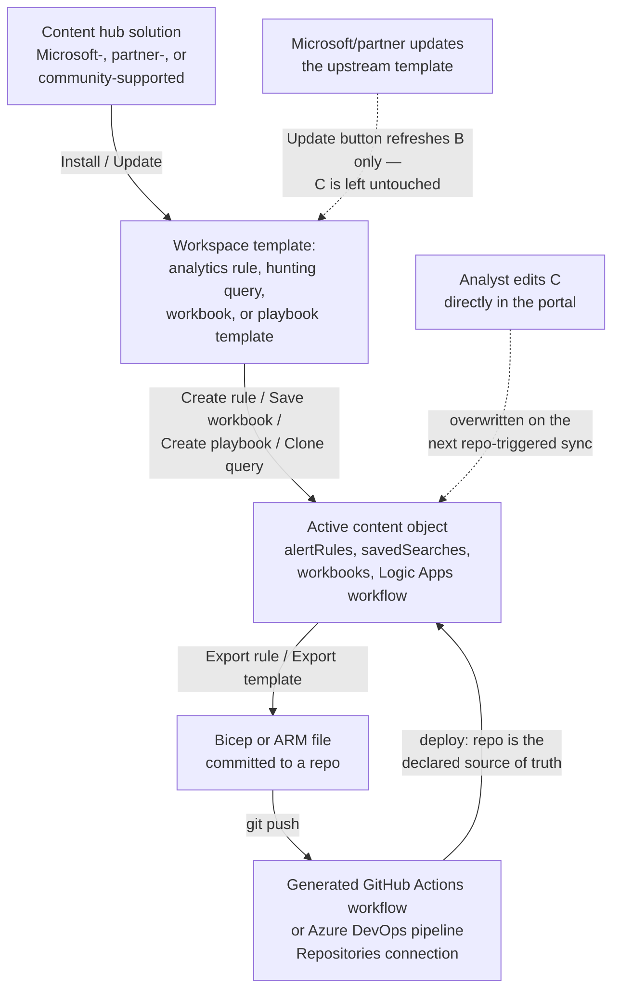

# Part 7 — Detection Content Lifecycle: Content Hub, Solutions, and Detection-as-Code for Sentinel

## Why this part exists

DEH Part 25's own scope note is explicit about what it leaves out: "Sentinel analytics-rule YAML, CI/CD wrapper metadata, or rule-repository structure" — naming this part as where that detail belongs. DEH Part 22 already made the general case for Detection-as-Code: a Detection Rule is software with a lifecycle, and every failure mode application engineering solved decades ago (an untested change shipping broken, no record of who changed what, no rollback path) happens to a detection rule too, usually with less visibility, because a broken rule doesn't crash — it just goes quiet. This part does not re-argue that case. It answers the platform-specific question DEH Part 22 leaves open on purpose: what does author, reviewer, CI, CD, and rollback actually look like once the rule in question is a Microsoft Sentinel analytics rule, automation rule, workbook, or playbook, sitting in a Log Analytics workspace instead of an abstract repository?

Two distinct lifecycles converge in this part, and confusing them is the single most common source of the "why did my rule change" question a Sentinel engineer eventually asks. The first is **Content Hub**: Microsoft's and its partners' packaging system for out-of-the-box content, where installing a solution gives a workspace templates, not running detections, and updating that solution later touches the templates without touching anything an engineer already built from them. The second is **Repositories**: Sentinel's own native implementation of a source-controlled CI/CD pipeline, where a connected GitHub or Azure DevOps repository becomes the declared source of truth for custom content, and the platform's own sync mechanism — not a locked UI — is what keeps a portal-side edit from surviving past the next deployment. This part treats both as first-class, then gives a Sentinel engineer the specific ARM/Bicep resource types, portal terminology, and drift mechanics needed to reason about which lifecycle a given piece of content is actually living in.

**Scope boundary:** this part does not re-teach KQL (DEH Part 25) or the generic CI/CD case for detection-as-code (DEH Part 22) — it assumes both and supplies the Sentinel-specific mechanics on top. It does not cover the rule-type decision itself (Scheduled vs. NRT vs. Fusion vs. Custom Detection) — that's Part 4/5's territory; a rule template installed from Content Hub can be any of those types, and this part's packaging and versioning story applies uniformly across them.

## 1. Content hub and solutions: the packaging model

**[CONCEPT]** The Microsoft Sentinel **Content hub** is the in-portal catalog for out-of-the-box (OOTB) content, reachable from **Content management > Content hub** in both the Azure portal and the Microsoft Defender portal. Content arrives in one of two shapes: a **solution** — a packaged bundle of related content that supports one product, domain, or industry-vertical scenario — or a **standalone item** — an individual piece of content installed and kept current on its own, outside any bundle. The solutions experience itself is built on Azure Marketplace, the same mechanism Azure uses to distribute managed applications generally, which is why a solution's detail pane shows a publisher, a support model, and a plan ID the way a marketplace listing does (Microsoft Learn, "Microsoft Sentinel Content and Solutions Overview," `learn.microsoft.com/azure/sentinel/sentinel-solutions`, retrieved 2026-09-15).

A solution can bundle any combination of eight content types Microsoft's own documentation enumerates: analytics rules, data connectors, hunting queries, parsers, playbooks (and their Logic Apps custom connectors), watchlists, workbooks, and summary rule templates (a newer content type for pre-built, cost-reducing aggregation rules — see Part 17 for what a summary rule is actually solving). The table below states, per content type, what installing a solution actually deposits into the workspace and whether a further step is needed before that content does anything.

| Content type | What installation deposits | Needs a separate activation step? |
|---|---|---|
| Analytics rules | A read-only rule template in the analytics template gallery | Yes — `Create rule` |
| Data connectors | A connector configuration page | Yes — connect/configure credentials |
| Hunting queries | A read-only query template | Runnable as-is; `Clone` to customize/persist |
| Parsers | A workspace-scoped KQL function in Log Analytics | No — usable immediately as a function |
| Playbooks | A Logic Apps workflow template | Yes — `Create playbook` |
| Watchlists | A watchlist template/schema | Yes — populate or connect the data source |
| Workbooks | A gallery template | Yes — `Save` to create an editable instance |
| Summary rule templates | A summary rule template | Yes — deploy as an active summary rule |

**[SOC MANAGEMENT]** Every piece of content also carries a **support model** — Microsoft-supported, partner-supported, or community-supported — visible on its detail pane, and this is a real operational fact, not a label: partner- and community-supported content is maintained by whoever authored it, and an issue with it goes to that party's support channel or the Microsoft Sentinel GitHub community's issue tracker, not to an Azure support ticket the way Microsoft-supported content does (same source). Most Content Hub solutions ultimately trace back to the public `Azure/Azure-Sentinel` GitHub repository, which is also where an engineer who wants to see a template's raw YAML/JSON before installing it, or convert one into a Repositories-managed file (§4), goes looking first.

### Content sources: the label the portal actually uses

**[SENTINEL ENGINEER]** The portal itself tags every piece of content with one of four **content source** values, and this table is the one worth memorizing before touching anything in §2 or §4, because it's the fastest way to answer "who owns this object, and what will silently change it next."

| Content source | How it got there | What updates it |
|---|---|---|
| `Solution` | Installed as part of a Content Hub solution | The solution's own `Update` action in Content hub — refreshes the template, not any content already created from it |
| `Standalone` | Installed individually from Content Hub, outside a solution | Kept current automatically by the platform |
| `Custom` | Authored or edited directly in the workspace (portal or API) | Nothing but a person, until it's exported into a repository |
| `Repositories` | Deployed by a connected GitHub/Azure DevOps sync | The next commit-triggered deployment from that repository |

(Microsoft Learn, "Microsoft Sentinel Content and Solutions Overview," §"Content sources for Microsoft Sentinel content and solutions," same URL as above.)

## 2. From template to active object: instantiation and drift

**[SENTINEL ENGINEER]** Installing a solution is not the same act as turning on a detection, and the distinction matters more than it sounds like it should. An analytics rule template sits in the gallery, inert, until an engineer opens it and selects `Create rule`; a playbook template needs `Create playbook`; a workbook template needs `Save`. Each of those actions produces a genuinely independent object — a live `alertRules` resource, a `Logic Apps` workflow, a saved workbook instance — that the Content Hub tracks separately, under a `Created content` count on the template's own detail page, but no longer manages as the same thing as the template.

> **Blind Spot**
> "Installed" and "protecting you" are two different claims, and Content Hub's own UI is honest about the gap once you know where to look — the `Created content` column on a template can legitimately read zero on a solution that's shown as fully installed for months. A SOC that treats "we deployed the Insider Risk solution" as equivalent to "we have working detections for insider risk" without checking that count is reporting a coverage number the platform never actually claimed. The template gallery is a shelf, not a running rule; every solution rollout should end with someone confirming which templates in it were actually turned into `Create rule` objects, not just that the solution's own status column says installed.

**[SENTINEL ENGINEER]** The reverse gap is the one that causes more quiet damage over time. Microsoft's own documentation states the update behavior for a solution plainly: "Any active or custom content created based on solutions or standalone content installed from content hub remains untouched" by a solution update (Microsoft Learn, "Discover and deploy Microsoft Sentinel out-of-the-box content from Content hub," `learn.microsoft.com/azure/sentinel/sentinel-solutions-deploy`, retrieved 2026-09-15). That sentence is the entire drift story in this part in one line: when Microsoft or a partner ships a better version of a template — a fixed field reference, a tightened threshold, an added entity mapping — a rule an engineer already created from an earlier version of that template does not move. It sits exactly where it was tuned, permanently, unless a person notices and manually reconciles it.

> **Engineering Reality**
> The one durable trace of which template version a rule came from is its own `templateVersion` property (format `<major>.<minor>.<patch>`, alongside `alertRuleTemplateName` naming the template itself) — both real, documented fields on a `Scheduled` alert rule's ARM representation (Microsoft Learn, ARM template reference for `Microsoft.SecurityInsights/alertRules`, `learn.microsoft.com/azure/templates/microsoft.securityinsights/alertrules`, retrieved 2026-09-15). Nothing in the platform proactively compares that stamped version against the template's current version and pages anyone when they diverge — the comparison, if it happens at all, is a person opening the template gallery, noticing an `Update` indicator on the parent solution, and then separately checking whether any of their own created rules still reference the older version. A workspace with forty solution-derived rules and no scheduled review of this kind has, in practice if not in name, forty forked copies of upstream content that nothing keeps in sync.

## 3. Exporting and representing content as infrastructure

**[ENGINEERING]** Every content type a Content Hub solution or a hand-built rule produces is, underneath the portal, an ordinary Azure resource, and Sentinel supplies both a purpose-built export path and the generic Azure Resource Manager (ARM) tooling every Azure resource already has. Analytics rules have their own `Export` feature reachable from the analytics rule list (documented as "Import and export analytics rules in Microsoft Sentinel"), with an equivalent PowerShell path for scripted export; automation rules have the same pairing. Playbooks, being ordinary Logic Apps resources, export through a Logic Apps–specific ARM-template generator rather than a Sentinel-native button. Workbooks export through Azure Monitor Workbooks' own "automate" tooling, which produces the ARM template for a workbook instance or gallery template. The table below states the underlying resource type behind each content type — the piece of vocabulary that turns a portal screenshot into something version-controllable.

| Content type | ARM/Bicep resource type | Reference |
|---|---|---|
| Analytics rules | `` `Microsoft.SecurityInsights/alertRules` `` | Sentinel ARM template reference, `alertRules` |
| Automation rules | `` `Microsoft.SecurityInsights/automationRules` `` | Sentinel ARM template reference, `automationRules` |
| Hunting queries, Parsers | `` `Microsoft.OperationalInsights/workspaces/savedSearches` `` | Log Analytics ARM template reference, `savedSearches` — both content types deploy through the same Saved Searches API |
| Playbooks | `` `Microsoft.Logic/workflows` `` | Azure Logic Apps ARM template reference |
| Workbooks | An Azure Monitor Workbooks resource (commonly `` `Microsoft.Insights/workbooks` ``/`` `workbooktemplates` ``) | Azure Monitor Workbooks "automate" documentation |
| Custom detection rules (Preview) | `` `Microsoft.Security/detectionRules` `` | Requires the Microsoft Security Bicep extension — see §4.1 |

Table built from the content-type-to-resource-type mapping Microsoft Learn's "Manage custom content with repository connections" page states directly (`learn.microsoft.com/azure/sentinel/ci-cd-custom-content`, retrieved 2026-09-15). The hunting-query/parser row is worth reading twice: neither content type has a Sentinel-specific resource type of its own — both ride on the same generic Log Analytics saved-search mechanism, which is also why selecting either one as a Repositories content type (§4) silently deploys both if a connected branch contains files of both kinds.

**[SENTINEL ENGINEER]** The `alertRules` resource's `kind` discriminator (`Scheduled`, `Fusion`, `MicrosoftSecurityIncidentCreation`, and — in earlier API versions — `NRT`, among others Part 4/5 covers by behavior rather than by schema) is exactly the kind of fast-moving, version-specific detail this book flags rather than freezes into a table meant to outlive its own review date.

> **PRODUCT VERSION NOTE (as of 2026-09-15)**
> The `Microsoft.SecurityInsights/alertRules` resource's set of valid `kind` values, and the exact property shape under each kind, is defined per API version and has changed across the many versions Microsoft has shipped for this resource type (the ARM template reference page lists dozens, from `2019-01-01-preview` through `2025-09-01` as of this writing). A Bicep or ARM file written against one API version's schema is not guaranteed to deploy cleanly, or to expose the same `kind` values, against a different one. Before committing a rule definition to a repository (§4), pin an explicit `apiVersion` and check the live reference page at `learn.microsoft.com/azure/templates/microsoft.securityinsights/alertrules` for the `kind` values and property names that version actually supports — don't carry a `kind` value forward from an older sample without re-verifying it against the pinned version.

The following excerpt shows the `templateVersion` and `alertRuleTemplateName` fields from §2 in place on a `Scheduled` rule, targeting the `Microsoft.SecurityInsights/alertRules` resource type at API version `2025-09-01`:

```bicep
// CONCEPTUAL SAMPLE — illustrative property usage, not validated against a live workspace.
// Confirm apiVersion-specific property availability against the live reference before deploying.
resource driftAwareRule 'Microsoft.SecurityInsights/alertRules@2025-09-01' = {
  name: guid('det-07-01-suspicious-oauth-grant')
  kind: 'Scheduled'
  properties: {
    displayName: 'Suspicious OAuth app consent grant'
    enabled: true
    severity: 'Medium'
    query: '<KQL query body — see DEH Part 25 for syntax; omitted here per STYLE-GUIDE.md §3>'
    queryFrequency: 'PT1H'
    queryPeriod: 'PT1H'
    triggerOperator: 'GreaterThan'
    triggerThreshold: 0
    suppressionEnabled: false
    suppressionDuration: 'PT5H'
    alertRuleTemplateName: '<template GUID this rule was created from>'
    templateVersion: '1.2.0'
  }
}
```

Its main limitation, beyond the omitted query body: this snippet declares `templateVersion` as a static string, but nothing about writing that value here makes it self-updating — it only ever reflects the version that was true at the moment this file was authored or exported, which is precisely why §2's Engineering Reality box calls the comparison a manual one.

## 4. Microsoft Sentinel Repositories: the platform's own CI/CD

**[ENGINEERING]** DEH Part 22 built the generic case for a git-based rule repository: the console becomes a deployment target, not an editing surface, and the file in version control becomes the actual source of truth. **Repositories** — reachable from **Content management > Repositories** in both portals — is Sentinel's own native implementation of exactly that model, for custom content rather than Content Hub solutions. A connection binds one GitHub or Azure DevOps branch, a chosen subset of content types, and a target workspace together; creating the connection generates a GitHub Actions workflow or Azure DevOps pipeline directly inside the connected repository, and every subsequent push to that branch runs it (Microsoft Learn, "Deploy Custom Content from your Repository," `learn.microsoft.com/azure/sentinel/ci-cd`, retrieved 2026-09-15).

**[SENTINEL ENGINEER]** The direction of authority is stated as plainly as Content Hub's update behavior was in §2: "Updates you make to the content in your Microsoft Sentinel repositories are synchronized to your Microsoft Sentinel workspace and overwrite any changes you make to that content through the Microsoft Sentinel portal. Your Microsoft Sentinel repositories become your *single source of truth*" (Microsoft Learn, "Manage custom content with repository connections," `learn.microsoft.com/azure/sentinel/ci-cd-custom-content`, retrieved 2026-09-15).

> **Engineering Reality**
> "Single source of truth" here is a behavioral guarantee enforced by the sync itself, not a locked field in the portal UI — an analyst can still open a repository-managed analytics rule in the Azure portal or the Defender portal and change its threshold, save it, and see the change take effect immediately. What changes nothing about that fact: the next time the connected branch's workflow runs, the deployed definition in the repository file overwrites that edit with no warning dialog and no diff shown to the person it affects. The platform's own guidance is to edit repository-managed content only in the repository, and if a portal edit is unavoidable, to export it back into the repo before the next sync — a discipline problem the tooling makes possible to violate, not one it prevents.

Each connection is scoped to specific content types from the same list §1's solutions can bundle — analytics rules, automation rules, custom detection rules (Preview, see §4.1), hunting queries, parsers, playbooks, and workbooks — with one shared quirk: because hunting queries and parsers both ride the Log Analytics Saved Searches API (§3's table), selecting either one as a managed content type deploys both if the branch contains files of both kinds. A workspace supports at most five repository connections, and because every deployment is itself an Azure Resource Manager deployment, it counts against the hosting resource group's retained deployment-history limit of 800 — a high-volume content repository with frequent commits can exhaust that quota and surface a `DeploymentQuotaExceeded` error with no connection to anything obviously wrong in the content itself (same source, "Maximum connections and deployments"). Bicep is Microsoft's own recommended format over raw ARM JSON for this content, but Bicep support is gated on connection age: a connection created before a documented cutoff date has to be removed and recreated before Bicep files will deploy through it, and Bicep's own limitation — no `id` property — means an analytics rule exported from the portal (which includes `id`) needs that field stripped before it will decompile cleanly (same source, §"Deploy Bicep files").

> **PRODUCT VERSION NOTE (as of 2026-09-15)**
> Microsoft Learn's "Manage custom content with repository connections" page states the Bicep-deployment cutoff as a specific date (documented there as November 1, 2024 at last check) — any connection created before that date has to be removed and recreated before it will accept Bicep files. A fixed cutoff tied to a connection's creation timestamp is exactly the kind of narrow, easy-to-mis-copy fact that ages badly in a book with no live tenant to re-verify it against; re-check the live page's "Deploy Bicep files" section for the current cutoff (and whether it has been superseded or removed entirely) before treating a connection's Bicep eligibility as settled.

**[ENGINEERING]** By default, a connection runs **smart deployments**: the generated pipeline tracks which files actually changed since the last run (via an audit file in a `.sentinel` folder in the repository) and redeploys only those, both for performance and specifically to avoid clobbering a rule's own runtime state — resetting a dynamic schedule field on every sync, for instance — on content nothing in the commit touched. Turning this off forces a full redeploy of every managed file on every trigger, which is available as an explicit customization for a team that wants it, not the default (Microsoft Learn, "Manage custom content with repository connections," §"Improve performance with smart deployments").

### Custom detection rules as code (Preview)

**[SENTINEL ENGINEER]** Repositories' newest content type breaks from every other row in §3's resource-type table on purpose. Custom detection rules — Defender XDR's unified detection surface Part 5 covers in full — deploy through `Microsoft.Security/detectionRules`, a different resource provider entirely from `Microsoft.SecurityInsights`, and require the Microsoft Security Bicep extension — published at `br:mcr.microsoft.com/bicep/extensions/microsoftsecurity`, pinned to a specific version (`v1.0.1` as of this writing; see the paired PRODUCT VERSION NOTE below) — declared in a `bicepconfig.json` at the repository root. A minimal definition:

```bicep
// CONCEPTUAL SAMPLE — illustrative structure per Microsoft Learn's Preview documentation;
// not validated against a live workspace. Preview limitations apply — see prose below.
extension MicrosoftSecurity

resource driftDetectionRule 'Microsoft.Security/detectionRules@2026-06-01-preview' = {
  id: 'det-07-02-custom-rule'
  displayName: 'Example custom detection rule'
  status: 'enabled'
  queryCondition: {
    queryText: '<Advanced Hunting KQL — see DEH Part 25 for syntax>'
  }
  schedule: {
    frequency: 'PT1H'
  }
}
```

Deploying this either through a Repositories sync or directly via `az deployment group create` requires a Microsoft 365 E5 license (or an equivalent license that includes Microsoft Defender XDR) and a Sentinel workspace already onboarded to the Microsoft Defender portal (Microsoft Learn, "Manage custom content with repository connections," §"Deploy custom detection rules as code (Preview)").

```azurecli
az deployment group create \
  --resource-group <RESOURCE_GROUP> \
  --template-file detectionRule.bicep \
  --name detection-rule-deployment
```

This command targets a resource group containing a Defender-portal-onboarded Sentinel workspace; its main limitation, beyond Preview status itself, is that Microsoft's documentation names two specific gaps as of this writing — custom query frequency for Sentinel-sourced data isn't supported, and custom details aren't supported — either of which can silently make a ported rule behave differently from the Sentinel-native analytics rule it was meant to replace.

> **PRODUCT VERSION NOTE (as of 2026-09-15)**
> Custom detection rules support inside Repositories is Preview, governed by Azure's Supplemental Terms of Use for Previews, and depends on both an M365 E5-class license and Defender-portal onboarding — none of which is required for the `Microsoft.SecurityInsights`-based content types in §3's table. Separately, Microsoft has published that starting June 2026, older Repositories management API versions stop being supported; anyone managing connections through the API rather than the portal needs to be on API version `2025-09-01`, `2025-06-01`, or `2025-07-01-preview` by June 15, 2026 (existing connections themselves are stated as unaffected). Both facts are drawn from "Manage custom content with repository connections" (`learn.microsoft.com/azure/sentinel/ci-cd-custom-content`), retrieved 2026-09-15. The Microsoft Security Bicep extension's pinned version (`v1.0.1` above) is a third fast-moving detail from the same page and the same Preview surface — a Preview-stage extension gets version bumps on its own cadence independent of the API-version and GA-date facts above, so confirm the current extension version in `bicepconfig.json` examples on the live page rather than reusing the one printed here. If you're reading this after either date, re-check the Preview's GA status and the currently supported API version before relying on either claim.

> **What Would Change My Mind**
> This part treats Content Hub instantiation (§2) as the right starting point for baseline coverage and a Repositories-managed Bicep pipeline (§4) as the right home for an organization's genuinely custom, high-value detections — two different lifecycles, deliberately kept separate. If custom detection rules as code exits Preview and becomes Microsoft's primary unified authoring path across both Sentinel and Defender XDR, that separation weakens: a team writing net-new detection logic would have less reason to start from a Sentinel-specific `alertRules` template at all, and this part's guidance would need to shift toward "author as a Defender XDR custom detection rule from day one" rather than "start from a Content Hub template and repository-manage the ones worth keeping."

## 5. Choosing a content strategy for a SOC

**[SOC MANAGEMENT]** Nothing in §1 through §4 says a workspace has to pick exactly one lifecycle. In practice, the two coexist by design, and the decision that actually matters is which lifecycle a given piece of content should live in, not which one the workspace uses exclusively.






**Figure 7.1 — Detection content lifecycle: Content Hub instantiation and Repositories-managed CI/CD, side by side.** *CONCEPTUAL.* Illustrates two paths content takes into a running Sentinel workspace — installing and instantiating a Content Hub template, versus syncing Bicep/ARM files from a connected repository — and the two drift points (dashed edges) each path creates: a solution update that refreshes the template but never touches an already-created rule (§2), and a portal edit to a repository-managed object that survives only until the next sync (§4). This is a structural sketch built from this book's reading of the Microsoft Learn pages cited in §1–§4, not a capture of any Sentinel UI screen.

**[SOC MANAGEMENT]** A small team with limited detection-engineering headcount gets real, ongoing value from leaning on Content Hub for baseline coverage: Microsoft- and partner-maintained templates absorb the maintenance burden of keeping pace with a connected product's own schema and API changes, and a solution's `Update` button is materially cheaper than rebuilding equivalent logic in house. The cost that comes with it is exactly §2's drift problem — every `Create rule` click produces one more workspace-local object that nothing but a person keeps in sync with its upstream template, and a growing count of solution-derived rules with no review cadence is the same Documentation/Testing Debt problem DEH Part 22 §9 names for any detection repository, just without the pipeline that would normally surface it. A more mature program's answer is to graduate its highest-value, most heavily customized logic — the rules an incident response has actually depended on, or the ones tuned enough times that "what does this actually do now" is no longer obvious from the template it started as — into a Repositories connection specifically so DEH Part 22's lint, test, and two-role review gates apply to it going forward.

Budgeting for either path has real prerequisites worth naming rather than discovering mid-rollout: installing or updating Content Hub content requires the **Microsoft Sentinel Contributor** role at the resource-group level, while creating a Repositories connection requires an **Owner** role (or an equivalent custom role with permission to create role assignments) on the same resource group, plus write access on the GitHub or Azure DevOps side of the connection (Microsoft Learn, "Deploy Custom Content from your Repository," `learn.microsoft.com/azure/sentinel/ci-cd`, and "Manage custom content with repository connections," `learn.microsoft.com/azure/sentinel/ci-cd-custom-content`, retrieved 2026-09-15 — check the current page for the exact named role on each side of the connection, since Azure RBAC role names and required GitHub/Azure DevOps access levels are exactly the kind of detail that gets renamed without a version-note-worthy announcement). The custom-detection-rules-as-code path in §4.1 adds a licensing prerequisite (M365 E5-class) on top of the portal-onboarding one. None of these is a large ask individually, but a rollout plan that assumes whoever clicks "Create rule" today can also "just connect a repository" tomorrow, without checking who actually holds Owner on the resource group, is a common way a detection-as-code initiative stalls in its first week for a reason that has nothing to do with the content itself.

---

**Cross-references:** DEH Part 22 (Detection as Code — the generic pipeline this part's Repositories mechanics implement), DEH Part 25 (KQL syntax and its own scope note deferring rule-repository structure to this part), Part 4/5 (analytics rule types and the Custom Detection Rules surface §4.1 previews), Part 6 (entity mapping — the `entityMappings` property this part's ARM examples reference), Part 16 (Defender-portal onboarding, a prerequisite for §4.1), Part 17 (summary rule templates, mentioned in §1's content-type table).
