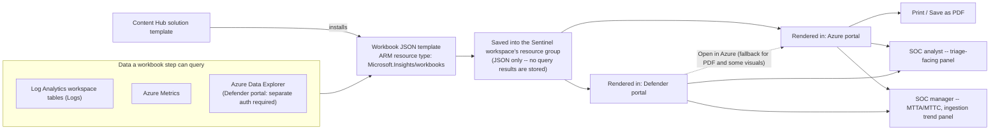

# Part 8 — Workbooks: Visualization, Reporting, and SOC Dashboards

## Why this part exists

DEH Part 25 already teaches the query surface a workbook's query steps are built from — the KQL
pipe model, `where`/`join`/`summarize`, and the Sentinel/Defender table catalog those operators
run against — and DEH Part 23 already frames the broader tradeoff between authoring a portable
analytic and authoring a native, backend-specific query. This part assumes both and does not
re-teach either one. What DEH Part 25 explicitly leaves alone is what happens to a KQL query once
it stops being a `where`/`summarize` chain typed into a query box and becomes a saved, shared,
parameterized report that a SOC runs every shift — the object that hosts it, where that object is
stored, who is allowed to change it, what breaks when it's viewed from a different portal than the
one it was built in, and where its usefulness as a metrics surface actually stops.

That object is a Microsoft Sentinel workbook. This part covers: what a workbook actually is
underneath Sentinel's own gallery view (§1–2); where a workbook's template comes from and what
Microsoft ships out of the box (§3); how a workbook differs from Sentinel's other built-in report
surface, the Overview dashboard (§4); the specific, documented behavior gaps between the Azure
portal and the Microsoft Defender portal that a workbook author has to plan around (§5); the
operational mechanics of running a workbook in production — refresh behavior and access control
(§6); and, following this book's own honesty constraint about evidence (see `STYLE-GUIDE.md` §9),
the honest limits of treating a workbook's rendered number as a validated metric rather than
whatever its underlying query happened to compute (§7).

## 1. A workbook is an Azure Monitor object wearing a Sentinel skin

**[CONCEPT]** Microsoft's own documentation states this directly: "Microsoft Sentinel workbooks
are based on Azure Monitor workbooks, and add tables and charts with analytics for your logs and
queries to the tools already available in Azure." (Microsoft Learn, "Visualize your Data by using
Workbooks in Microsoft Sentinel," [learn.microsoft.com/azure/sentinel/monitor-your-data](https://learn.microsoft.com/azure/sentinel/monitor-your-data),
retrieved 2026-09-15.) Sentinel does not have its own, separate dashboarding engine — every
Sentinel workbook is an Azure Monitor Workbooks resource that Sentinel's own **Threat management >
Workbooks** page filters, tags, and presents inside a Sentinel-specific gallery. The same
underlying resource is equally reachable from the general Azure Monitor gallery (**Monitor >
Workbooks** in the Azure portal, or the **Workbooks** tab on a Log Analytics workspace page) —
Sentinel's gallery is a curated view onto it, not a different product.

That shared lineage matters operationally in one specific way: "each workbook is an Azure resource
like any other, and you can assign it with Azure role-based access control (RBAC) to define and
limit who can access" it (same source). A workbook saved from inside Sentinel is stored *within
the Sentinel workspace's resource group* and tagged by the workspace it was created in — it does
not live inside the Log Analytics workspace resource itself, and it does not store any data of its
own. Saving a workbook "creates an Azure resource in the selected location based on the relevant
template. Only the workbook's JSON file is saved in this location, and no data" (same source). A
saved workbook is a template plus whatever parameter defaults it was last left with — every time
someone opens it, every query step re-runs live against the workspace. There is no cached
snapshot, no "as of" timestamp baked into the resource, and (see §6) no background refresh unless
someone is actively viewing it with auto-refresh turned on.

**Figure 8.1 — Where a Sentinel workbook's data comes from and where it's consumed.** *CONCEPTUAL.*
Illustrates the relationship between a workbook's query sources, the underlying Azure Monitor
resource, Content Hub packaging, and the two portals a rendered workbook can be viewed from — a
structural sketch built from this part's own reading of the Microsoft Learn pages cited throughout
§1, §3, and §5, not a capture of any Sentinel UI screen.






## 2. Anatomy of a workbook: steps, parameters, and the resource underneath

**[SENTINEL ENGINEER]** A workbook's editing surface is step-based: a text step for narrative
context, a query step (data source set to **Logs**, resource type **Log Analytics**, one or more
target workspaces) for a KQL result rendered as a grid, chart, or other visualization, a parameters
step (a time-range picker, a dropdown driven by its own query, a free-text filter) that later steps
can reference, and grouping constructs — groups and tabs — that let several steps sit inside one
collapsible section or one page of a multi-page report. Microsoft's own authoring guidance for a
custom query step is specific and worth repeating verbatim: "We recommend that your query uses an
[ASIM] parser and not a built-in table. A query that uses an ASIM parser supports any current or
future relevant data source rather than a single data source" (Microsoft Learn, "Visualize your
Data by using Workbooks in Microsoft Sentinel," cited above). That recommendation is the workbook
layer's version of the same normalization discipline DEH's own coverage of ASIM already argues for
at the detection-rule layer — a workbook query built against a single raw table (`SecurityEvent`,
say) silently stops updating the day that source is replaced or supplemented by another one,
while an ASIM-parser-backed query keeps rendering.

Saved, a workbook becomes an ARM resource of type `Microsoft.Insights/workbooks` — the same
resource type any Azure Monitor Workbook uses, confirmed by the specific permission string
(`microsoft.insights/workbooks/write`) Microsoft's RBAC documentation names as the write privilege
a custom role needs to edit and save one (Microsoft Learn, "Azure Workbooks overview,"
[learn.microsoft.com/azure/azure-monitor/visualize/workbooks-overview](https://learn.microsoft.com/azure/azure-monitor/visualize/workbooks-overview), retrieved 2026-09-15). The
sketch below shows that resource's outer shape — not a working template, and not the place to look
for KQL syntax, which DEH Part 25 already owns.

The following is a schematic excerpt of an ARM template exporting a `Microsoft.Insights/workbooks`
resource; the `serializedData` value is itself a JSON string holding the step array described
above, shown here only as a placeholder.

```json
// CONCEPTUAL SAMPLE -- illustrative shape only, not a deployable template.
{
  "type": "Microsoft.Insights/workbooks",
  "apiVersion": "2022-04-01",
  "name": "[parameters('workbookId')]",
  "location": "[resourceGroup().location]",
  "kind": "shared",
  "properties": {
    "displayName": "SOC shift handover",
    "category": "sentinel",
    "sourceId": "[parameters('workspaceResourceId')]",
    "serializedData": "{ ...step array as an escaped JSON string... }"
  }
}
```

The limitation this excerpt doesn't show, and that DEH Part 25 §3/§8 covers in full: whatever KQL
lives inside that `serializedData` string inherits every table-schema and query-performance concern
an ordinary hunting or detection query does — a workbook step is not exempt from a slow join or a
schema-drifted field just because it renders as a chart instead of a grid.

## 3. Where a workbook's template comes from

**[SENTINEL ENGINEER]** Most workbooks a SOC actually uses didn't start from a blank canvas. Three
paths, all documented on the same Microsoft Learn page cited in §1:

- **Bundled with a Content Hub solution.** Installing a connector solution (the Microsoft Entra
  solution, a firewall vendor's solution, and so on) frequently installs one or more workbooks
  alongside it — this is Part 7's Content Hub packaging model applied specifically to workbooks
  rather than to rules or playbooks.
- **Installed standalone from the Content Hub**, without the rest of a solution's connector or
  analytics-rule content.
- **Built from scratch**, using **Threat management > Workbooks > Add workbook**, then **Edit** to
  add text, query, and parameter steps directly.

For a template installed either way, the **Templates** tab on the Workbooks page surfaces a
**Required data types** field before you save it — a template built against Microsoft Entra sign-in
logs renders nothing useful in a workspace that never onboarded that connector, and this field is
the documented way to check that before wiring it in.

**[ANALYST]** The table below names a handful of workbooks and native views Microsoft's own
documentation confirms by name, to ground "a workbook exists for this" in something more specific
than a generic claim. It is not an exhaustive catalog — Content Hub's workbook gallery changes
solution by solution — and Appendix A1's quick-reference table is the place for a fuller,
independently re-verified list.

| Name | Ships with / access path | What it shows |
|---|---|---|
| **Microsoft Entra sign-ins** | Microsoft Entra solution (Content Hub) | Sign-in trends over time; failed sign-ins broken out by application, device, and location |
| **Microsoft Entra audit logs** | Microsoft Entra solution (Content Hub) | Admin activity — user and group creation, modification, and other directory changes |
| **SOC efficiency** | Built in; linked directly from the Overview dashboard's Incidents section (see §4) | Mean time to acknowledge and mean time to close incidents, and related incident-handling metrics |
| Vendor firewall workbooks (for example, Palo Alto) | Installed with the vendor's own Content Hub solution | Firewall traffic correlated against threat events — illustrative of the general per-connector workbook pattern, not specific to one vendor |
| MITRE ATT&CK view | Native Sentinel page, linked from the Overview dashboard's Analytics section — **not** a Workbooks-gallery template | Which ATT&CK tactics and techniques currently have at least one active analytics rule mapped to them |

Microsoft's own recommendation for how many workbooks a SOC should build is worth stating because
it cuts against the instinct to build one "master" dashboard: "create different visualizations for
each type of persona that uses workbooks, based on the persona's role and what they're looking
for" — a network admin's firewall-focused workbook is a different artifact from a Tier 1 analyst's
triage workbook, which is different again from the **SOC efficiency** workbook a manager checks
weekly (same source as above). The same guidance extends the split by cadence, not just by role:
build the workbook someone checks hourly (a live sign-in-anomaly view, say) separately from the one
someone checks daily or weekly, rather than cramming both refresh expectations into one canvas
whose auto-refresh interval (§6) can only be set once.

That last row is deliberately flagged as an exception: it looks like a workbook from a distance —
a rendered, ATT&CK-shaped visualization inside the same product — but it's a purpose-built page
Sentinel maintains itself, not a customizable template a SOC engineer edits the way they'd edit any
row above it. §4 draws that distinction out further, and §7 comes back to exactly what this view's
number does and doesn't prove.

## 4. Two different report surfaces: the Overview dashboard and a workbook

**[ANALYST]** Sentinel ships a second, non-workbook reporting surface: the **Overview** dashboard,
a fixed layout of precalculated widgets Microsoft's own documentation walks through section by
section (Microsoft Learn, "Use the Microsoft Sentinel Overview dashboard to view incidents, data,
and analytics," [learn.microsoft.com/azure/sentinel/get-visibility](https://learn.microsoft.com/azure/sentinel/get-visibility), retrieved 2026-09-15). Unlike
a workbook, its four sections — Incidents, Automation, Data, Analytics — are not editable steps;
they're a fixed set of rollups Microsoft computes and refreshes on its own schedule, with the last
refresh time shown per section and a manual **Refresh** available for the whole page. Where you
find it differs by portal, following the same two-portal split Part 2 covers in full: "If your
workspace is onboarded to the Microsoft Defender portal, select **General > Overview**. Otherwise,
select **Overview** directly" (same source).

The Incidents section shows new/active/closed counts over the last 24 hours, severity totals,
closing-classification counts, and — the figure most likely to end up on a manager's slide — mean
time to acknowledge (MTTA) and mean time to close (MTTC), linked directly to the **SOC efficiency**
workbook from §3. The Automation section states its own arithmetic openly: time saved by
automation is `(avgWithout - avgWith) * resolvedByAutomation`, where `avgWithout` and `avgWith` are
the average incident-resolution time without and with automation, and `resolvedByAutomation` is
the count of incidents automation resolved. The Analytics section shows analytics-rule counts by
status — enabled, disabled, and auto-disabled (the auto-disable mechanism itself, and why a rule
ends up in that state, is Part 18's territory) — with a direct link labeled **MITRE view** into the
ATT&CK page named in §3's table.

> **SOC Management View**
> The Automation section's time-saved formula is real arithmetic on real incident-resolution
> timestamps, not an invented number — but it is a *modeled* estimate (an average difference
> multiplied by a count), not a controlled before/after measurement of the same analyst doing the
> same incident with and without automation. Presenting `avgWithout - avgWith` to leadership as
> "hours of analyst time saved this quarter" is accurate to what the formula computes; presenting
> it as an audited, causally-isolated result is a claim the formula itself doesn't support. A SOC
> manager quoting this figure upward should say what it is: a documented estimate, not a controlled
> experiment.

## 5. Portal parity: what changes once a workspace is onboarded to the Defender portal

**[ENGINEERING]** Workbooks are one of the areas where the Azure portal and the Microsoft Defender
portal genuinely diverge in documented, specific ways — not just in menu layout. Four gaps
Microsoft's own workbook documentation states directly:

| Behavior | Azure portal (retiring 2027-03-31) | Defender portal |
|---|---|---|
| Print workbook / Save as PDF | Available, from the workbook's options menu | Not available — select **Open in Azure** to use it there instead |
| Full rendering of every visualization type | Supported | A subset of visualizations "can only be viewed in the Azure portal"; the workbook UI surfaces an **Open in Azure** link as the documented fallback |
| Overview dashboard navigation | Select **Overview** directly | Select **General > Overview** |
| Azure Data Explorer as a workbook data source | Configured in the Azure portal's own context | Must be separately configured and authenticated *from inside the Defender portal* before the step will run |

(All four rows: Microsoft Learn, "Visualize your Data by using Workbooks in Microsoft Sentinel,"
cited in §1, retrieved 2026-09-15.)

> **PRODUCT VERSION NOTE (as of 2026-09-15)**
> Microsoft Sentinel in the Azure portal is scheduled for retirement on March 31, 2027; after that
> date Sentinel is reachable only through the Microsoft Defender portal, and workspaces still on
> the Azure portal are redirected automatically (Microsoft Learn states this identically on the
> workbooks page, the Overview-dashboard page, and the roles page cited throughout this part — all
> retrieved 2026-09-15). For workbooks specifically, that date is the deadline for the **Open in
> Azure** fallback in the table above: print/PDF export and any visualization type that only
> renders in the Azure portal lose their escape hatch entirely once that portal is gone, not just
> their preferred path. If you're reading this after that date, treat this table as a historical
> record of a gap that no longer has a workaround, not as a live how-to.

> **What Would Change My Mind**
> This part treats "don't build a recurring PDF-export or Azure-portal-only-visualization workflow
> on top of Sentinel workbooks" as the right default for any team still relying on the Azure-portal
> fallback today. If Microsoft ships print/PDF parity or full visualization parity in the Defender
> portal before the March 31, 2027 retirement, that recommendation would soften from "migrate this
> workflow off workbooks now" to "the fallback simply moved portals, no separate action required" —
> a materially different message for a SOC manager planning around a fixed report a stakeholder
> already depends on.

## 6. Operating a workbook in production

### Auto-refresh — the fixed-interval, session-bound refresh model

**[ENGINEERING]** A workbook refreshes its query steps in one of two ways: a manual **Refresh**
button, or **Auto refresh**, configurable to "supported auto refresh intervals rang[ing] from 5
minutes to 1 day" (Microsoft Learn, "Visualize your Data by using Workbooks in Microsoft Sentinel,"
cited above). Two behaviors in that same documentation matter more than the interval range itself:
auto-refresh is off by default, and it "is turned off again each time you close the [workbook] to
optimize performance and prevent it from running in the background" — it has to be turned back on
explicitly the next time the workbook is opened, and it pauses while the workbook is being edited,
restarting only when the view switches back from edit mode (or on a manual refresh).

> **Engineering Reality**
> Treat a workbook the way a NOC wants to treat any wall-mounted dashboard — build it once, point a
> browser at it, and forget it — and the auto-refresh behavior above will quietly stop updating the
> display the first time someone closes that tab, restarts the browser, or the session times out.
> There's no server-side scheduled refresh independent of an open, in-view session: the workbook
> only recomputes while something is actively rendering it. A durable SOC video-wall workbook needs
> either a kept-alive, unattended browser session that nobody closes, or a different delivery
> mechanism entirely (a scheduled export, or a Power BI report built from the same underlying Log
> Analytics data) — not a workbook someone configured once and walked away from.

### Power BI — the scheduled, distributed alternative to a workbook

**[SOC MANAGEMENT]** The Engineering Reality box above names Power BI as the documented escape
hatch from the "someone has to keep a browser tab open" problem, and it's worth stating precisely
rather than leaving as a gesture. Log Analytics' own **Logs** query editor has an **Export** menu
with two Power BI options: "Power BI (as an M query)," which exports a query to a Power Query
(M-language) script for loading into Power BI Desktop, and "Power BI (new Dataset)," which creates
a dataset directly in the Power BI service — from which reports can be shared, refreshed on a
schedule, and (with a Power BI Pro or Premium license) refreshed incrementally rather than
re-pulling the full result set every time (Microsoft Learn, "Log Analytics integration with Power
BI," [learn.microsoft.com/azure/azure-monitor/logs/log-powerbi](https://learn.microsoft.com/azure/azure-monitor/logs/log-powerbi), retrieved 2026-09-15). This is a
genuinely different tool with a genuinely different job: a workbook is a live, interactive, ad hoc
canvas an analyst edits and re-queries in the moment; a Power BI report built this way is a
scheduled, distributable artifact for stakeholders who never touch the Sentinel portal at all. A
SOC reporting to a monthly leadership meeting should be building that report in Power BI, not
screenshotting a workbook — the export path above is the documented bridge between the two, not a
workaround this book is inventing.

### RBAC — who can see a workbook, and who can change it

**[ENGINEERING]** Workbook access rides on top of two independent role layers, both Azure RBAC.
The first is Sentinel's own built-in role set, which grants workbook visibility as part of a
broader Sentinel permission set:

| Role | Workbook-relevant grant |
|---|---|
| `Microsoft Sentinel Reader` | View data, incidents, workbooks, recommendations, and other resources |
| `Microsoft Sentinel Responder` | All Reader permissions, plus incident management — no additional workbook-editing rights on its own |
| `Microsoft Sentinel Contributor` | All Responder permissions, plus install/update Content Hub solutions and create/edit resources |
| `Workbook Contributor` | Not a Sentinel role — an Azure Monitor role granting `microsoft.insights/workbooks/write`; layered on top of whichever Sentinel role a user already holds |

(Microsoft Learn, "Roles and permissions in the Microsoft Sentinel platform,"
[learn.microsoft.com/azure/sentinel/roles](https://learn.microsoft.com/azure/sentinel/roles), retrieved 2026-09-15.) The documented task-to-role
mapping on that same page is worth stating precisely rather than paraphrasing: **creating or
deleting a workbook requires `Microsoft Sentinel Contributor` (or a lesser Sentinel role) *and*
`Workbook Contributor`** — the two roles are additive, not substitutes for each other. The same page
notes the inverse case explicitly, with a footnote on its role-to-task table: a `Microsoft Sentinel
Reader` can still edit analytics rules, workbooks, and similar resources if that same user is
separately granted `Workbook Contributor` — the Reader role alone is read-only, but it isn't a
hard ceiling on what a narrower, additional grant can unlock. Part 2 covers the broader
resource-context-vs-workspace-context RBAC model these roles sit inside; this section states only
the workbook-specific slice of it.

## 7. The honest limits of a workbook as a metrics surface

**[SOC MANAGEMENT]** Everything in §1–6 describes mechanics — how a workbook is stored, rendered,
refreshed, and access-controlled. None of it says anything about whether the number a workbook
renders is a *good* number, and that gap is where this part's scope stops and DEH's own coverage,
quality, and debt model (DEH Parts 41–43) picks up. A workbook — or the MITRE ATT&CK view named in
§3 — can render "38 of 200 ATT&CK techniques have an active analytics rule mapped to them" with
complete technical accuracy: the count is real, the query genuinely counted what it says it
counted. What that count cannot tell you, because it isn't designed to, is whether each of those
38 rules reliably fires when the technique it maps to actually happens (DEH Part 42's Detection
Quality concern), whether any of them have quietly rotted since the last time someone validated
them against current telemetry (DEH Part 43's Detection Debt concern), or whether "has a rule
mapped" is even the right bar for calling a technique covered at all (DEH Part 41's Detection
Coverage framing, which explicitly separates "a detection exists" from "the detection works"). A
workbook renders whatever its query computes, and it inherits every scoping mistake in that query
exactly the way any other KQL query does — DEH Part 25 §4's warning about a shared identifier that
isn't actually a unique key applies just as much to a workbook's `summarize` step as it does to a
detection rule's.

> **SOC Management View**
> A polished, auto-refreshing workbook is genuinely persuasive in a way a raw KQL result grid
> isn't — clean charts read as authoritative even when the underlying query hasn't been reviewed
> as carefully as the analytics rule it's summarizing. Before a coverage or quality metric goes
> into a leadership deck sourced from a Sentinel workbook, confirm it was built (or reviewed)
> against the same rigor DEH Parts 41–43 apply to a coverage claim made anywhere else — a
> dashboard rendering a number cleanly is not the same claim as a quality program having validated
> that number.

## Cross-references

DEH Part 25 (KQL syntax and the Sentinel/Defender table catalog underneath every workbook query
step) · DEH Part 23 (Query Language Strategy — why a workbook's ASIM-parser recommendation in §2
is the same portability tradeoff at a different layer) · DEH Part 41 (Detection Coverage) · DEH
Part 42 (Detection Quality) · DEH Part 43 (Detection Debt) — all three referenced in §7 · this
book's Part 2 (Log Analytics Workspace Architecture and the Two Portals — the RBAC and portal-split
model §5 and §6 apply specifically to workbooks) · this book's Part 3 (Data Ingestion — ASIM
parsers referenced in §2) · this book's Part 7 (Detection Content Lifecycle — Content Hub packaging
referenced in §3) · this book's Part 17 (Workspace Cost Models and Retention Tiers — what a
workbook query against a Data lake tier table costs beyond the Analytics tier's included query
capacity) · this book's Part 18 (Sentinel-Specific Tuning, Health Monitoring, and Troubleshooting —
the auto-disabled rule count the Overview dashboard surfaces in §4).
