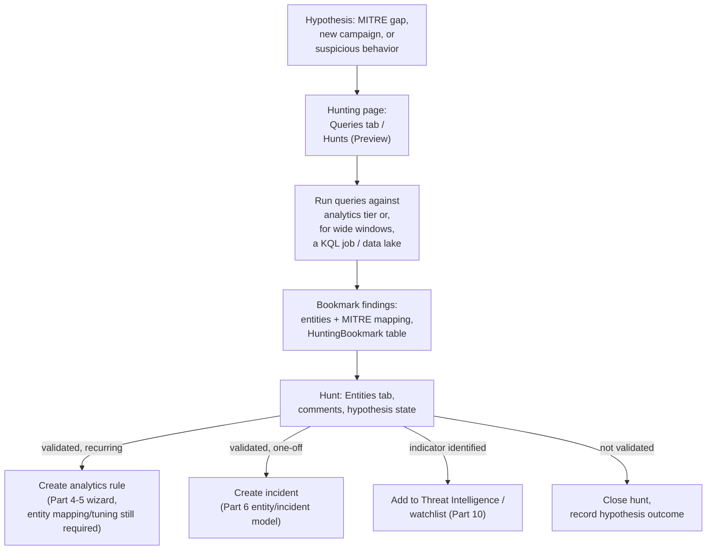

# Part 9 — Hunting in Sentinel and the Defender Portal

## Why this part exists

DEH Part 34 already teaches why a SOC hunts at all (the gap between "what a detection rule catches" and "what a rule was never written to catch"), and DEH Part 35 already teaches the taxonomy of hunt types (structured, unstructured, situational) that gives a hunt its shape before a single query runs. DEH Part 36 closes the loop DEH's own way, teaching how a validated hunt finding becomes a candidate detection rule as a general discipline, independent of any one platform. This part assumes all three and does not re-teach any of them. What it supplies instead is the platform mechanics underneath that lifecycle, specifically as Microsoft Sentinel and the Microsoft Defender portal implement it: where a hunting query actually lives and runs, what a bookmark actually preserves, what the newer **Hunts (currently in Preview)** feature adds on top of a bare query-and-bookmark workflow, where notebook-based hunting fits, and the literal button a hunter clicks to turn a hunting query into a Part 4/5 analytics rule.

This part does not cover hypothesis formation, hunt-type selection, or the abstract hunt-to-detection maturity model — that is DEH's territory, cited above, not repeated here. It also does not re-teach KQL syntax; every query fragment shown is either a short illustrative extension DEH Part 25 doesn't already cover, or a direct quotation from Microsoft's own documentation, framed and cited as such.

## 1. Hunting queries vs. analytics rules: the platform's own line

**[CONCEPT]** A hunting query in Microsoft Sentinel is a saved KQL query that an analyst runs on demand — or, per §6 below, schedules as a one-time or recurring job — against workspace data, and that returns a results table for a human to review. Running a hunting query never creates an alert and never creates an incident on its own; nothing "fires" the way a Part 4 scheduled analytics rule fires. A hunting query only enters the incident queue if a person, or an automation acting on that person's behalf, deliberately promotes a specific finding — a bookmark, or the query itself — into something the platform tracks (§3, §7). This is the operational meaning of DEH's "hypothesis-driven, not detection-driven" framing: the platform enforces the distinction structurally, not just by convention. The table below supports one decision — whether a piece of KQL logic belongs on the hunting side of that line or the detection side of it — by mapping the same five properties on each side:

| Property | Hunting query | Analytics rule (Part 4–5) |
|---|---|---|
| Trigger | Run on demand, or scheduled as a `KQL job` (§6) | Scheduled evaluation on a fixed cadence, or a Near-real-time (NRT) rule's fixed one-minute cadence |
| Output | Results table for review; no alert | Alert, then correlated into an incident |
| Entity/MITRE mapping | Optional, inherited by bookmarks that reference it | Mandatory design decision (Part 6) |
| Where it's authored | Hunting page `Queries` tab, or a Jupyter notebook (§5) | Analytics rule wizard (Part 4–5) |
| Typical source | Content hub solution, or hand-authored | Content hub solution, hand-authored, or promoted from a hunting query (§7) |

In practice: a query an analyst wants to *look at periodically* stays a hunting query; a query whose match should *interrupt someone* belongs in Part 4 or 5 instead.

### Hunting vs. Advanced Hunting — different pages, different capabilities

**[THREAT HUNTER]** The word "hunting" names two genuinely different surfaces in the Microsoft Defender portal, and the STYLE-GUIDE convention this book follows for portal terms exists precisely for cases like this one. **Advanced hunting** is Microsoft Defender XDR's own cross-product KQL query experience, unified across Defender for Endpoint, Defender for Identity, Defender for Office 365, Defender for Cloud Apps, and — once a workspace is connected — Microsoft Sentinel's own tables, functions, and saved queries, all queryable from one page (Microsoft Learn, "Advanced hunting with Microsoft Sentinel data in Microsoft Defender," retrieved 2026-09-15). **Hunting** — sometimes written as the Sentinel-specific hunting experience — is the older, narrower page reached via **Microsoft Sentinel > Threat management > Hunting** in the Defender portal, or **Threat management > Hunting** in the Azure portal, and it is the only one of the two that has a `Queries` tab tied to MITRE ATT&CK tactic/technique grouping, a `Bookmarks` tab, and (§4) the Hunts (Preview) feature. The two pages overlap in what data they can reach but not in what they let a hunter *do* with a result — most importantly, Advanced hunting does not support bookmarks at all (§3), and its custom-detection path has real gaps this chapter does not own (Part 5 covers custom detections directly). Get this distinction wrong and a procedure written for one page silently doesn't apply to the other.

## 2. The Hunting page: queries, results, and one retired feature

**[THREAT HUNTER]** The Hunting page's `Queries` tab lists every hunting query available to the workspace — built-in queries installed with a Content hub solution, plus any query an analyst wrote or cloned — grouped by MITRE ATT&CK tactic, with a `Techniques` column for the specific sub-technique each query targets. A hunter typically starts a session with **Run all queries** (or a selected subset) and then sorts the results by one of three columns: `Results` (raw match count for the selected time range), `Results delta`, or `Results delta percentage` — the latter two comparing the last 24 hours of matches against the previous 24-to-48-hour window to surface what changed recently (Microsoft Learn, "Hunting Capabilities in Microsoft Sentinel," retrieved 2026-09-15). A query with `N/A` in the `Results` column, rather than a `0`, specifically flags that the query's required data source isn't connected — Microsoft's own filter separates that state from a genuine zero-match run, and hovering the info icon next to `N/A` names which connector to enable.

> **Blind Spot**
> The `Results delta` sort is a day-over-day comparison by construction — the last 24 hours against the 24-to-48-hours-ago window — which makes it excellent at surfacing a sudden spike and structurally blind to anything that isn't one. A low-and-slow campaign that holds a steady low volume for weeks never produces a large delta in either direction, because each day looks almost exactly like the day before it. A hunter who prioritizes a session purely by sorting on delta is, by the sorting mechanism's own definition, deprioritizing exactly the patient, steady-state intrusion behavior that many real credential-abuse and persistence techniques are designed to look like — the opposite of noisy and spiky.

> **False Positive Trap**
> A results column full of `0`s and `N/A`s invites the same misreading regardless of which value dominates: treating "we ran the sweep and it came back clean" as one state, when it's actually two very different ones collapsed together — a query that ran against real, connected data and matched nothing, and a query that never had real data to search because its data source was never onboarded. Microsoft's own `N/A` filter and per-query info icon exist specifically to separate these, but only for a hunter who opens that filter rather than skimming a mostly-blank `Results` column and concluding the environment is quiet.

> **PRODUCT VERSION NOTE (as of 2026-09-15)**
> Microsoft Sentinel's **livestream** feature — a continuously-running hunting query that generated a notification on new matches — is no longer available. Microsoft's own current "Hunting Capabilities in Microsoft Sentinel" page states this directly and points to three replacements depending on what livestream was actually being used for: `KQL job`s (§6) for a persisted, queryable result set; an analytics rule, including a Near-real-time (NRT) rule (fixed one-minute evaluation cadence, a narrower feature set than a standard scheduled rule — see Part 4) where the goal was closer to alerting than hunting; or a playbook for the notification/messaging behavior livestream provided. If you're reading this after livestream has been gone long enough that no team in your organization remembers configuring one, treat this note as historical context for why an older runbook or training deck might still mention it — check the cited page directly if a procedure you're following references livestream at all, since the feature it describes no longer exists to configure.

## 3. Bookmarks: preserving a pivot mid-hunt

**[THREAT HUNTER]** A bookmark preserves three things at once from a moment inside a hunt: the specific row or rows of query results the hunter marked, the KQL query and time range that produced them, and whatever entity and MITRE ATT&CK mappings apply — inherited by default from the hunting query that produced the results, but editable per bookmark (Microsoft Learn, "Hunt with bookmarks in Microsoft Sentinel," retrieved 2026-09-15). A bookmark needs at least one mapped entity before it can be opened in the investigation graph — the same entity-graph-and-timeline view Part 6 covers for incidents generally — so a hunter who wants to pivot visually from a bookmarked finding has to confirm the entity mapping carried over correctly, not just that the bookmark saved.

Every bookmark, across the whole workspace, is also a row in the `HuntingBookmark` table in the underlying Log Analytics workspace — queryable directly with KQL, including joins against other tables, exactly like the `HuntingBookmark`-table pattern DEH Part 25 §9's HUNT-25-01 example builds on for LSASS-access hunting. Deleting a bookmark from the UI doesn't remove its row; it sets that row's `SoftDelete` field to `true` on a new entry, so a query against the raw table has to account for soft-deleted bookmarks explicitly rather than assuming every visible row is still active.

> **Hunter's Note**
> Querying `HuntingBookmark` directly is the fastest way to answer a question the `Bookmarks` tab's UI doesn't expose well: "which of my last 90 days of bookmarks touched this specific host or account." The UI caps the `Bookmarks` tab display at 1,000 entries and expects interactive filtering; a direct KQL query against `HuntingBookmark`, joined against the entity fields a hunt cares about, doesn't share that cap and can be saved as its own hunting query for reuse in a later session.

**[THREAT HUNTER]** Bookmark handling is one of the places where the two-portal split (Part 2, Part 16) is not yet symmetric, and it's worth naming precisely here because it sits inside this chapter's own workflow rather than being a distant migration concern:

Bookmark creation and incident-escalation are not available in both portals today, which matters directly for a hunting workflow this chapter otherwise treats as portal-agnostic:

| Azure portal (retiring 2027-03-31) | Defender portal |
|---|---|
| Create a new bookmark from the Hunting page's `Queries` or `Bookmarks` tab | View bookmarks already created — no creation |
| Add one or more bookmarks to a new or existing incident directly | — |
| Delete or edit a bookmark's tags, notes, and mappings | — |

> **PRODUCT VERSION NOTE (as of 2026-09-15)**
> Per Microsoft Learn ("Hunt with bookmarks in Microsoft Sentinel," retrieved 2026-09-15): "You can only create bookmarks in the Azure portal... In the Microsoft Defender portal, you can view bookmarks that were already created, but you can't add new ones," and the same page's incident-escalation section is explicitly scoped "(Azure portal only)." Advanced hunting (§1) never supported bookmarks at all, in either portal — its documented alternative there is the **Link to incident** action against a query result. Given Part 2's March 31, 2027 retirement date for Sentinel in the Azure portal, this is not a cosmetic gap: as written today, the path to creating a *new* bookmark or escalating one to an incident by hand runs through the exact portal surface scheduled to stop working.

> **What Would Change My Mind**
> This part currently tells a hunting team to expect a real workflow change, not just a menu relocation, once Azure-portal access to Sentinel actually ends — either Defender-portal bookmark creation ships before March 31, 2027, or teams need a documented interim substitute (the bookmarks page itself suggests incident tags, saved queries, or a custom hunting table as alternatives) built into their runbooks well ahead of the deadline. If Microsoft ships full bookmark-creation and incident-escalation parity in the Defender portal — plausible, given how actively the two-portal gap is being closed elsewhere (Part 16) — this stops being an operational risk worth flagging on its own and folds back into Part 16's general parity-tracking guidance instead of needing its own warning here.

## 4. Hunts (Preview): turning a pivot into a tracked investigation

**[THREAT HUNTER]** **Hunts (currently in Preview)** is a structured container built on top of the queries-and-bookmarks workflow above, not a replacement for it. Creating a hunt clones the hunting queries selected into it — the clones are independent of the workspace's shared query library, so editing a query inside one hunt doesn't touch any other hunt or the original — and gives that hunt its own name, description, owner, and a `Hypothesis` state the analyst updates as evidence accumulates (Microsoft Learn, "Conduct End-to-end Threat Hunting with Hunts," retrieved 2026-09-15). A hunt's detail page carries three tabs scoped to that specific investigation:

| Tab | Contents | Typical action from this tab |
|---|---|---|
| `Queries` | Cloned hunting queries for this hunt only | Run, edit, clone, delete, or **Create analytics rule** (§7) |
| `Bookmarks` | Findings bookmarked specifically within this hunt | View source query, view raw bookmark logs, escalate to incident |
| `Entities` | Deduplicated entities pulled from every bookmark in the hunt | Open the UEBA entity page; add an IP to threat intelligence; run an entity-scoped playbook |

A metrics bar at the top of the `Hunts (Preview)` tab tracks validated hypotheses, new incidents created, and new analytics rules created across the hunting program over time — a genuine, if still simple, way to report hunting output as more than "queries were run," which matters directly to the kind of program-level accounting DEH's own coverage-and-debt framing (cross-referenced from Part 8) already argues a SOC needs.

> **PRODUCT VERSION NOTE (as of 2026-09-15)**
> Microsoft Learn's "Conduct End-to-end Threat Hunting with Hunts" page labels Hunts "(preview)" throughout, and lists its prerequisite as either the built-in Microsoft Sentinel Contributor role or a custom Azure RBAC role scoped to the `Microsoft.SecurityInsights/hunts` resource action — a narrower permission surface than the workspace-wide access a hunter might already have for the plain `Queries`/`Bookmarks` experience. A Preview label carries no committed GA date and no SLA; check that page before depending on Hunts for anything a SOC's incident-response runbook would call load-bearing, and confirm the RBAC assignment separately if a hunter can see the Hunting page generally but reports the `Hunts (Preview)` tab or its actions are unavailable.

## 5. Notebooks and MSTICPy: code-based hunting workflows

**[THREAT HUNTER]** Microsoft Sentinel's own `Notebooks` page integrates Jupyter Notebooks directly, giving a hunter a persistent, shareable environment that holds raw query results, the code run against them, and their visualizations together, rather than the query-at-a-time model the Hunting page's `Logs` search pane offers (Microsoft Learn, "Hunting Capabilities in Microsoft Sentinel," retrieved 2026-09-15). A notebook earns its overhead specifically where the Hunting page's model runs out of room: reusing a parameterized query across many dates without rebuilding it by hand, joining workspace data against something that genuinely isn't in the workspace at all — an HR system's VIP list, a geolocation lookup, a case-management API — or running a procedural, multi-step analysis (anomalous-session scoring, time-series decomposition) that KQL's own operators don't express directly.

**MSTICPy**, maintained by the Microsoft Threat Intelligence Center (MSTIC), is the Python library built specifically to make that workflow practical inside a Sentinel-connected notebook: querying several log sources at once, enriching results with threat intelligence and geolocation data, extracting indicators of activity from raw log text, and rendering interactive timelines and process-tree visualizations MSTIC's own investigators use day to day (same source). Notebooks support mixed-language cells within one notebook via Jupyter's "magics" — a PowerShell cell retrieving data, a Python cell processing it, a JavaScript cell rendering it — which is a genuine capability difference from the Hunting page's KQL-only query box, not a stylistic one.

**[ENGINEERING]** A notebook's authentication and connectivity are workspace plumbing distinct from the Hunting page's built-in session: MSTICPy needs its own configured connection to the target Log Analytics workspace (an Azure AD app registration or interactive sign-in, plus workspace ID) before its first query runs, and that configuration — not the KQL inside the notebook — is usually where a "the notebook doesn't return anything" support request actually traces back to, the notebook equivalent of the field-mapping-silently-returns-nothing failure mode DEH Part 25 §8 names for a live query.

## 6. Hunting at data-lake scale: KQL jobs and federated tables

**[ENGINEERING]** An interactive hunting query against the analytics tier is bounded by the query timeout the portal enforces and by whatever retention that specific table carries. A hunt that genuinely needs to reach back months, or that needs to join workspace data against **federated tables** — external sources such as Microsoft Entra ID, Microsoft 365, or Azure Resource Graph data queryable alongside data lake tables without first ingesting them into the workspace — is the scenario `KQL job`s exist for: a one-time or scheduled KQL query against the Microsoft Sentinel data lake and federated tables, run for investigation and analysis rather than for alerting (Microsoft Learn, "Create jobs in the Microsoft Sentinel data lake," retrieved 2026-09-15). A job can promote qualifying rows into the analytics tier — where the advanced hunting KQL editor and analytics-tier machine-learning tooling can reach them — or write back into the data lake tier to speed up a later investigation, and Microsoft ships built-in job templates explicitly categorized `Hunting`, `Anomaly detection`, and `Baseline`, which is a direct signal that KQL jobs are meant as a hunting-lifecycle feature, not merely a data-movement utility.

The following KQL fragment is adapted directly from Microsoft's own documentation for handling data lake ingestion latency inside a scheduled job, not an invented example:

```kql
let lookback = 15m;
let delay = 15m;
let endTime = now() - delay;
let startTime = endTime - lookback;
CommonSecurityLog
| where TimeGenerated between (startTime .. endTime)
```

This fragment targets a KQL job scheduled against the Microsoft Sentinel data lake; its stated purpose is to avoid querying rows that were ingested but not yet visible, since the data lake tier's cold storage carries a typical latency of up to 15 minutes before new rows are queryable. Its limitation, stated by the same source: this pattern only helps a job with a short lookback and frequent schedule — a job with a wide lookback window absorbs that same 15-minute latency as noise, and doesn't need the extra `delay` variable at all.

> **PRODUCT VERSION NOTE (as of 2026-09-15)**
> The Sentinel data lake tier and KQL jobs are recent additions to the platform, and several of the exact numbers governing them are the kind of figure this book's PRODUCT VERSION NOTE convention exists to flag rather than quote as permanent. As of Microsoft Learn, "Create jobs in the Microsoft Sentinel data lake": a tenant may run at most 5 KQL jobs concurrently, a single job's query is subject to a 1-hour execution timeout, at most 100 enabled jobs are permitted per tenant, and a job's queryable time range can span up to 12 years. `adx()`, `arg()`, `externaldata()`, and `ingestion_time()` are explicitly unsupported inside a data-lake job's KQL, and user-defined functions aren't supported either — a job that leans on any of those, copied from an ordinary hunting query, fails rather than silently degrading. Re-check that page's own limits table before sizing a hunting program's dependence on jobs; this is one of the fastest-moving numeric surfaces in the book, on a feature still young enough that these limits should be expected to move. Part 17 owns the analytics-tier-versus-data-lake-tier cost and retention tradeoff this feature sits on top of — this note covers the job mechanism's own limits, not the billing model underneath it.

## 7. From hunt finding to detection candidate: the graduation path

**[SENTINEL ENGINEER]** DEH Part 36 already frames "hunt to detection" as a maturity model: a validated, recurring finding earns a permanent home as a detection rule instead of staying a manual, person-dependent sweep. The platform mechanic underneath that decision, in Sentinel, is a single context-menu action. From a hunting query's results — or, inside a specific hunt, from that hunt's own `Queries` tab — selecting **New alert rule > Create Microsoft Sentinel alert** (or, from within a hunt, **Create analytics rule** on a specific query) opens the analytics rule wizard (Part 4–5) with the query's name, description, and KQL body already populated. If the action was launched from inside a hunt, Microsoft Sentinel also records a link back to the new rule under that hunt's **Related analytics rules** list, so the hunt's own record shows which of its queries actually graduated (Microsoft Learn, "Conduct End-to-end Threat Hunting with Hunts," retrieved 2026-09-15).

What that wizard hands you is a starting point, not a finished rule. Entity mapping (Part 6) has to be added deliberately — a hunting query's own entity mappings, if it has any, don't automatically become the rule's alert-grouping keys. The rule's lookback and run frequency need the same deliberate tuning DEH Part 25 §3's lookback-versus-frequency Engineering Reality already covers, since a hunting query was never written with a fixed evaluation cadence in mind. And any allowlist logic the hunting query used informally to cut noise during manual review (Part 10 covers watchlists as the durable home for that allowlist) needs to be re-examined as production suppression logic, not carried over unexamined.






**Figure 9.1 — Hunt lifecycle and its platform graduation paths.** *CONCEPTUAL.* Illustrates how a single hypothesis moves through Sentinel's own hunting surfaces — queries, bookmarks, and a Hunt's tracked state — to one of four platform-recorded outcomes, one of which (a promoted analytics rule) is this chapter's link back to Part 4–5. This is a structural sketch of the book's own reading of the cited Microsoft Learn pages, not a capture of any live Hunting or Hunts page.

> **Detection Test**
> **Setup:** A hunter arrives independently, via the low-and-slow-friendly hunting workflow above, at the same pattern DEH Part 25 §6 already finishes as DET-25-02 — repeated SSH `Failed password` entries from one source against one account — without having seen that worked example first, purely from sorting hunting-query results by `Results delta` and bookmarking a suspicious cluster.
> **Action:** Promote the bookmarked hunting query to an analytics rule using **Create analytics rule**, then deliberately add the entity mapping (source IP, target account) and a `bin()`-based grouping window the original hunting query never needed, before enabling the rule.
> **Expected result:** The promoted rule reproduces DET-25-02's alerting behavior — firing once a `SourceIP`/`Account` pair crosses the failure-count threshold inside the chosen time bucket — and, crucially, does *not* alert on the hunting query's own broader, unthresholded result set, confirming the graduation step actually added detection logic rather than just relocating the hunting query into the rule wizard unchanged.

**MITRE:** T1110.001 (Password Guessing) — the same mapping DEH Part 25 §6 assigns DET-25-02, carried forward here because this section reuses that analytic as its worked graduation example rather than defining a new one.

## 8. Where else a hunt's output lands

**[THREAT HUNTER]** An analytics rule is not the only destination a validated hunt finding has. From a hunt's `Entities` tab, an entity can be added directly to threat intelligence as an indicator; from the `Bookmarks` tab or the hunt's own action menu, one or more findings can be escalated straight to a new or existing incident without ever becoming a standing rule, which is the right choice for a genuinely one-off finding that doesn't warrant permanent detection logic. Both paths are intentionally brief here: Part 6 owns how an incident's entity graph actually works once a finding lands there, and Part 10 owns watchlists and threat-intelligence-as-reference-data as a durable platform object, including the allowlist-curation discipline DEH Part 23 §1 argues belongs "at the analytic level" rather than bolted on per rule. This part's job was narrower — showing that a hunt has more than one legitimate ending, and where the button for each one actually lives.

**Cross-references:** DEH Part 34 (Threat Hunting Fundamentals), DEH Part 35 (Hunt Types), DEH Part 36 (Hunt to Detection), DEH Part 25 §6, §9 (KQL hunting/detection worked examples this chapter reuses); this book's Part 4–5 (Analytics Rules), Part 6 (Entity Mapping and the Incident Model), Part 10 (Watchlists and Reference Data), Part 16 (portal parity), Part 17 (Workspace Cost Models and Retention Tiers).
