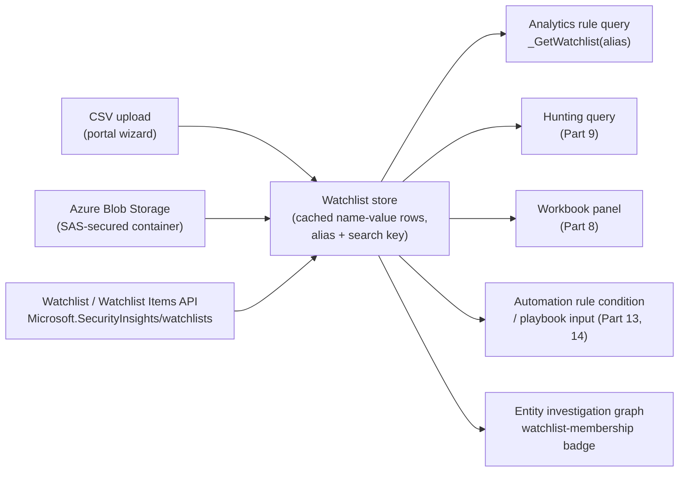

# Part 10 — Watchlists and Reference Data

## Why this part exists

Every SOC accumulates a body of knowledge that isn't telemetry: the list of accounts that belong to executives and therefore deserve a lower alert threshold, not a higher one; the list of accounts that belong to people who no longer work here and should never authenticate again; the subnet ranges that belong to the vulnerability-scanning platform and will otherwise light up every anomaly rule in the workspace once a month, forever. DEH Part 23 §1 already made the architectural case for where this kind of exclusion belongs: "at the analytic level, not bolted on independently" — a maintained allowlist that a rule's own logic references, not an ad hoc `NOT` clause added under deadline pressure and never looked at again. This part is where that argument lands in a running Microsoft Sentinel workspace. A **watchlist** is Sentinel's own object for exactly this kind of reference data: an uploaded or query-driven table of name-value rows, cached in the workspace, joinable from a KQL query the same way any other table is.

This part does not re-teach the KQL required to actually join a watchlist into a query — DEH Part 25 already owns the pipe model, `join`, `where`, and `summarize` mechanics this part assumes throughout. What it covers instead is the platform-specific part DEH deliberately leaves to this book: how a watchlist gets created and kept current, the one function that reads it back inside a query, how it differs from Sentinel's separate threat-intelligence-indicator system, who is allowed to see or change one, and the operational discipline a watchlist needs to keep being an asset instead of becoming its own source of false positives and false negatives.

---

## 1. What a watchlist actually is

**[CONCEPT]** A watchlist is a named set of rows — a header row plus data rows, the same shape as a spreadsheet or a CSV export — that you load into a Microsoft Sentinel workspace and that Sentinel then caches for fast lookup from a KQL query. Microsoft's own reference page for the feature, "Use watchlists in Microsoft Sentinel" (learn.microsoft.com/azure/sentinel/watchlists), describes watchlists as a way to correlate data you provide with the events already flowing through your workspace — VIP user lists, terminated-employee lists, known-good service accounts, high-value asset inventories, or any other organization-specific reference table that isn't itself security telemetry but that a detection, a hunt, or a workbook needs to know about.

Two things a watchlist is not, stated up front because both are easy to assume incorrectly:

- **A watchlist is not a live view of its source.** Once loaded, it is a workspace copy, not a standing connection back to the CSV file, spreadsheet, or system that originally produced it. Updating the source does nothing to the workspace copy until the watchlist is explicitly refreshed — the Engineering Reality box in §3 below covers exactly how this bites a rule that assumes otherwise.
- **A watchlist is not the same object as a Sentinel threat intelligence indicator.** Both are reference data an analytic can join against, and it is genuinely easy to reach for the wrong one, so §6 below draws the distinction in full. The short version: a watchlist holds data your organization produced about itself; a threat intelligence indicator holds data an external party produced about the outside world.

**[SENTINEL ENGINEER]** Every watchlist has, in addition to its data rows, a small set of metadata that governs how it's referenced: a display **name**, an **alias** (the short string a KQL query actually calls by name — see §3), a description, and a designated **search key** — one column chosen, at creation time, as the primary field a lookup or join is expected to match on. Choosing the search key matters the same way choosing a join key matters for any table: a watchlist of terminated employees keyed on a full display name will match inconsistently against a `SigninLogs` field populated with a user principal name, while one keyed on the UPN itself will not.

---

## 2. Building a watchlist: sources, aliases, and the search key

**[SENTINEL ENGINEER]** A watchlist can be populated from more than one source, and the choice of source is really a choice about who owns keeping the list current:

**Table 10.1 — Watchlist creation and update methods.** The table below supports choosing a source based on who maintains the underlying list and how often it changes.

| Method | Driven from | Typical use | Update model |
|---|---|---|---|
| Local file upload (CSV) via the portal wizard | Whatever file an engineer has on hand | Small, infrequently-changing lists — a VIP roster, a short high-value-asset list | Manual: re-uploading replaces the watchlist's content |
| Azure Blob Storage source (SAS-secured container) | A blob another pipeline already maintains | Lists generated by a system of record — an HR export, a CMDB feed | Sentinel reads the blob on your own refresh cadence, not continuously |
| Watchlist and Watchlist Items REST API (`Microsoft.SecurityInsights/watchlists` resource type) | Any script or pipeline with the right workspace permissions | Programmatic, incremental updates — add or remove a single row without a full re-upload | Item-level create/update/delete calls |
| Built-in template gallery | A Microsoft-authored starting schema | Bootstrapping a common list shape (see §8) before populating your own values | Same upload paths above, seeded with a template's column layout |

The REST API path matters more than a one-line table entry suggests: it's the difference between "someone remembers to re-upload the CSV" and "the HR offboarding workflow calls an API and the terminated-employee watchlist updates itself the same day." A watchlist maintained entirely by manual upload inherits every risk of any manually-maintained list — see the False Positive Trap in §7.

**[SENTINEL ENGINEER]** The built-in template gallery ships with a set of pre-shaped starting points — commonly cited examples include a VIP-users template and a terminated-employees template, each pre-defining the column layout a corresponding scenario expects. The exact set of templates on offer, and the specific columns each one pre-populates, is exactly the kind of detail Microsoft updates independently of this book's release cycle.

> **PRODUCT VERSION NOTE (as of 2026-09-15)**
> The built-in watchlist template gallery, the exact upload workflow (local-file vs. Azure Blob Storage source), and the numeric limits on watchlist size, row count, and refresh cadence are documented on Microsoft Learn's "Use watchlists in Microsoft Sentinel" page (learn.microsoft.com/azure/sentinel/watchlists) as of this writing. Both the template list and the specific limit figures have changed across past Sentinel releases, and this book has no live tenant to re-verify current numbers against. If a specific row-count or file-size figure matters to a design decision, check that page's current limits table yourself before building around a number quoted anywhere else — including, if it ever appears, a specific number in this book.

---

## 3. Reading a watchlist back: the lookup function

**[SENTINEL ENGINEER]** A watchlist is read back inside a KQL query through one function: `_GetWatchlist("alias")`, which returns the watchlist's rows as an ordinary tabular result — the same shape a `where`, `join`, or `project` operator can act on exactly as if it were querying any other table. DEH Part 25 owns the full pipe-model, join-syntax, and time-window mechanics that operator chain relies on; the fragment below shows only the Sentinel-specific extension DEH Part 25 doesn't cover — the watchlist call itself — not a complete, freestanding detection.

```kql
// CONCEPTUAL SAMPLE — the watchlist-specific extension only, not a complete detection query.
// Full join/where/summarize syntax and filtering mechanics: DEH Part 25.
SigninLogs
| join kind=leftouter (_GetWatchlist("VIPUsers")) on UserPrincipalName
```

Note what this fragment is doing and not doing: it isn't suppressing anything, and it isn't itself a complete analytics rule body. The join alone hands the rest of the query — whatever filtering, classification, or automation-rule condition (Part 13) comes next, using the join/where mechanics DEH Part 25 owns — a per-row signal of whether the account matched the watchlist, which is the more common role a watchlist plays in an analytic than outright suppression. The allowlist-shaped use of the same mechanism (excluding rather than elevating) is covered in §7.






**Figure 10.1 — Watchlist ingestion and lookup data flow.** *CONCEPTUAL.* Illustrates how a watchlist's three creation paths (Table 10.1) feed one cached workspace object, and the five surfaces that object can then be read from. This is a structural sketch built from this book's own reading of the watchlist and platform-surface documentation cited throughout this part — not a capture of any Sentinel UI screen, and not a reproduction of an official Microsoft architecture diagram.

> **Engineering Reality**
> A watchlist is not a live view of its source file or query — as §1 already stated, it's loaded into the workspace and cached for query performance, and an update to the underlying CSV or blob does not retroactively change the workspace copy until the watchlist itself is re-imported or refreshed through whichever path in Table 10.1 you're using. A scheduled rule calling `_GetWatchlist("TerminatedEmployees")` five minutes after an offboarding event is only as current as the watchlist's own last import — not as current as the query's own lookback window. Treat "the watchlist" and "the system of record it's supposed to mirror" as two objects with an update lag between them, the same discipline Part 18 asks you to apply to ingestion delay generally.

---

## 4. Watchlists across the two portals

**[ENGINEERING]** A watchlist is stored as one underlying object regardless of which portal created or last edited it — the same `Microsoft.SecurityInsights/watchlists` resource is what both the Azure portal and, once a workspace is onboarded, the Microsoft Defender portal surface. There is no separate Defender-portal-native watchlist type and no conversion step: a watchlist built before onboarding continues to exist and continues to be readable through `_GetWatchlist()` exactly as before.

**Table 10.2 — Watchlist behavior by portal.** The table below supports predicting what changes, and what doesn't, when a workspace moves between the two operating surfaces (Part 2, Part 16).

| Aspect | Azure portal (retiring 2027-03-31) | Defender portal |
|---|---|---|
| Where configured | Microsoft Sentinel > Configuration > Watchlists | Microsoft Sentinel navigation node, once the workspace is onboarded |
| Underlying resource | `Microsoft.SecurityInsights/watchlists` | Same resource — no separate object type |
| KQL lookup function | `_GetWatchlist("alias")` | Identical — the function is a Log Analytics/KQL capability, not a portal feature |
| Entity investigation view | Watchlist-membership indicator on the entity graph | Corresponding indicator on the unified incident's entity panel |
| Creation/edit permissions | Standard Sentinel RBAC (§5) | Same RBAC model — onboarding does not introduce a separate permission set for watchlists specifically |

> **PRODUCT VERSION NOTE (as of 2026-09-15)**
> Sentinel-in-the-Azure-portal is scheduled for retirement on March 31, 2027 (Part 2); after that date, watchlist configuration is only reachable from the Microsoft Defender portal. The exact menu placement inside the Defender portal's Microsoft Sentinel navigation node has already moved more than once during the unified-portal rollout, per Microsoft's own "Microsoft Sentinel in the Microsoft Defender portal" documentation. If a menu path in this section doesn't match what you see, use the portal's own search box rather than assuming this book is describing a hidden or removed feature — the underlying object and the `_GetWatchlist()` function are the stable parts of this table; the click path to reach the configuration screen is not.

---

## 5. Who can see and change a watchlist

**[SOC MANAGEMENT]** Watchlist content is frequently more sensitive than the telemetry it's joined against. A terminated-employee list names people who no longer work at the organization, sometimes alongside a separation date or reason code someone thought was useful context; a VIP-user list is, by definition, a list of the people an attacker would most want to know are flagged as high-value targets. Both are worth handling with the same access discipline as the incident data they support, not as harmless configuration metadata.

Microsoft Sentinel's own role-based access control model — documented under "Roles and permissions in Microsoft Sentinel" — applies to watchlists the same way it applies to analytics rules and incidents: the built-in **Microsoft Sentinel Reader** role can view a watchlist's content, while creating, editing, or deleting one requires **Microsoft Sentinel Contributor** (or a broader role that includes those permissions, such as Owner on the resource). There is no watchlist-specific role that narrows access to just this feature — a user with Contributor-level Sentinel access has that access across rules, automation, and watchlists alike, which is worth naming explicitly to whoever is deciding how broadly to grant Contributor in the first place, since it is not a "just for editing rules" grant.

Because watchlist rows can carry personal data about current or former employees, treat populating one the same way you'd treat any other system that stores that data: know who's allowed to export it, whether it needs to be included in a data-retention or right-to-erasure process, and whether HR or legal has a view on a security team independently maintaining a list of terminated staff. None of that is Sentinel-specific — it's the same governance question any internally-sourced PII table raises — but a watchlist is easy to overlook as "just configuration" precisely because it lives in a security tool's settings screen rather than a system an organization already has a data-handling policy for.

---

## 6. Watchlists vs. threat intelligence indicators

**[CONCEPT]** Sentinel has two distinct systems for reference data that an analytic can match against, and conflating them leads to reaching for the wrong tool. A watchlist holds data your organization produced about itself. A **threat intelligence indicator** — ingested via a TI feed, a TIP connector, or a TAXII feed and typically landing in the `ThreatIntelligenceIndicator` table — holds data an external party produced about the outside world: a hash, domain, IP, or URL that some other organization's collection process observed and judged malicious. DEH Part 32 covers how to consume that second category responsibly (confidence scoring, indicator age, infrastructure role, prevalence) in far more depth than this part needs to repeat; what matters here is knowing which of the two objects a given piece of reference data actually is before deciding how to store and join it.

**Table 10.3 — Watchlists vs. threat intelligence indicators.** The table below supports choosing the right object for a given piece of reference data before building a query against it.

| Aspect | Watchlist | Threat intelligence indicator |
|---|---|---|
| What it holds | Organization-defined reference rows you author | Structured indicator objects (IP, domain, hash, URL) an external party produced |
| Typical source | CSV upload, blob storage, or API — data you or an internal system produced | A TI feed, TIP, or TAXII connector — data an external party produced |
| Primary access path | `_GetWatchlist("alias")` | `ThreatIntelligenceIndicator` table, plus dedicated TI-matching analytics rule templates |
| Confidence/age scoring | Not scored by the platform — every row is equally authoritative; scoring is your analytic's own job | Indicators carry source-supplied confidence and validity metadata (DEH Part 32) |
| Typical analytic role | The allowlist/context layer joined into a rule you wrote (§7) | The indicator-match signal a rule consumes and then has to weigh, not trust outright |

A watchlist of "IP ranges belonging to our own vulnerability scanner" and a threat intelligence indicator for "an IP address a feed reported as a Cobalt Strike C2 node" are structurally similar — both are a list of IPs an analytic can join against — but they answer opposite questions, and building one where the other belongs produces predictable failures: a scanner-range watchlist accidentally uploaded as a TI feed would get scored for confidence and prevalence it was never designed to carry, and a genuine threat feed treated as a flat watchlist loses every piece of source-confidence metadata DEH Part 32 §2 explains why you need.

---

## 7. The allowlist that actually lives here

**[SENTINEL ENGINEER]** DEH Part 23 §1 states the general principle this section operationalizes: an allowlist "belongs at the analytic level, not bolted on independently." A watchlist is the concrete Sentinel object that principle points to. Instead of a `SourceImage !in ("known-tool-a.exe", "known-tool-b.exe")` literal list buried inside a rule's own query text — invisible to anyone who isn't reading that specific rule, and duplicated by hand into every other rule that needs the same exclusion — a maintained watchlist referenced by `_GetWatchlist()` is one object, visible in its own configuration screen, reusable across every rule, hunting query, and workbook that needs the same exclusion, and RBAC-controlled independently of the rules that consume it (§5).

This is the same shape DEH Part 42's exception-ledger pattern already uses a Sentinel watchlist for — a named, dated, justified entry per exclusion, auditable for staleness — applied here specifically to the allowlist case: a watchlist of known-good service accounts, sanctioned scanner IP ranges, or approved administrative tools, joined into a rule's `where` clause as an exclusion rather than an elevation.

> **False Positive Trap**
> A watchlist-driven allowlist degrades the same way DEH Part 15's mail-relay watchlist example does: every account that changes role, every asset that gets decommissioned and reissued, and every scanner that gets a new IP range keeps generating false positives — or, in the terminated-employee case, false negatives, since a stale list is the one place "no alert" is the wrong outcome — until someone updates the list. Expect a watchlist-driven allowlist's real-world accuracy to track how well its owning team's offboarding, reissuance, or asset-inventory process feeds it, not how well the KQL join is written. The join is rarely where this actually fails.

> **Blind Spot — the allowlist is only as strong as its match key**
> A VIP-user or terminated-employee watchlist keyed on a display name or a user principal name protects the analytic exactly as well as that string resists reuse. A terminated employee's UPN reassigned to a new hire before the corresponding watchlist entry is retired — or an on-premises AD account renamed post-departure while a synced cloud identity still carries the old UPN in cached telemetry — reproduces the same failure DEH Part 23's process-image allowlist Blind Spot names for a different kind of exclusion: the match is against an identity string, not against the state that identity is meant to represent, and closing the gap needs a compensating control (reconciling the watchlist against the identity source of record on a schedule) rather than a better string match.

---

## 8. Analyst and hunter use of watchlists

**[ANALYST]** From an incident-triage perspective, a watchlist most often shows up passively rather than as something an analyst goes and queries directly: when an entity (an account, a host, an IP) appears in the unified incident queue's investigation graph or entity panel, and that entity's identifying value also appears on a watchlist, the entity view surfaces that membership as context — "this account is on the VIP-users watchlist," for instance — without the analyst having to separately go check. That context should change triage behavior in both directions: a VIP-flagged account raises the priority of an otherwise-routine alert, while a scanner-range or known-good-service-account flag is a reason to close faster, not a reason to skip verification entirely — a watchlist entry is context for a human decision, not itself a verdict, the same caution DEH Part 32 §2 applies to a threat-intelligence match.

**[THREAT HUNTER]** A watchlist is equally useful as an input to a hunt that hasn't produced an incident yet. Part 9 covers the mechanics of hunting queries and bookmarks in Sentinel and the Defender portal directly; a watchlist slots into that workflow as a join target the same way it does in an analytics rule — narrowing a broad hunting query to "activity involving an entity on this specific list" (a known-privileged-account watchlist, a high-value-asset inventory) without hardcoding the list of interest into the hunting query's own text every time it's run. DEH Part 34–36's hunt-to-detection lifecycle applies unchanged: a hunting query that repeatedly proves useful against a watchlist-scoped population is itself a candidate to graduate into a scheduled rule, at which point the same watchlist reference simply carries forward into the rule's own query.

> **Hunter's Note**
> A watchlist built for one purpose is frequently reusable for a hunt that has nothing to do with why the list was originally created. A high-value-asset inventory maintained for elevated-severity alerting is also exactly the population you want to scope a lateral-movement hunt to first, since that's where the impact of a successful hunt finding is highest — check whether a watchlist relevant to your hunt's hypothesis already exists before building a new reference list from scratch.

---

## 9. What to verify before you trust a specific number here

**[ENGINEERING]** This part has deliberately avoided stating specific numeric limits — maximum watchlist size, maximum row count, exact refresh cadence — because this book has no live Sentinel tenant to confirm current figures against, and those figures have changed across past Sentinel releases. Stating a specific number with confidence this book can't back up would be a worse outcome than not stating one at all.

> **What Would Change My Mind**
> This part treats "check Microsoft Learn's current limits table before designing a control around a specific watchlist row count or file size" as the only responsible default, given the honesty constraint stated in Part 1 and `STYLE-GUIDE.md` §9 — this book has no tenant to verify a current number against directly. If a future edition of this book is written against a real Sentinel tenant, the responsible default changes to citing a specific, lab-verified number directly in the prose. The caution here is a function of what this book's author can currently verify, not a claim that watchlist limits are inherently unknowable or unstable in practice.

What is stable enough to state without that hedge: a watchlist is cached, not live (§3's Engineering Reality); it is read back through `_GetWatchlist()` regardless of portal (§4); it inherits Sentinel's standard Contributor/Reader RBAC split rather than a feature-specific permission model (§5); and it is a categorically different object from a threat intelligence indicator (§6). Those are architectural facts, not release-cadence numbers, and they're the ones this part is willing to state plainly.

---

**Cross-references:** DEH Part 23 §1 (allowlist-at-the-analytic-level framing), DEH Part 25 (KQL join/where/summarize syntax), DEH Part 31 (Baselining), DEH Part 32 (Threat Intelligence in Detection), DEH Part 34–36 (Hunt lifecycle), DEH Part 42 (exception-ledger watchlist pattern); this book's Part 2 and Part 16 (the two-portal split and Azure-portal retirement date), Part 6 (entity mapping — what an entity panel's watchlist badge is built on), Part 9 (hunting mechanics), Part 13 (automation-rule conditions consuming a watchlist), Part 18 (ingestion/refresh delay, the same discipline applied to watchlist staleness).
