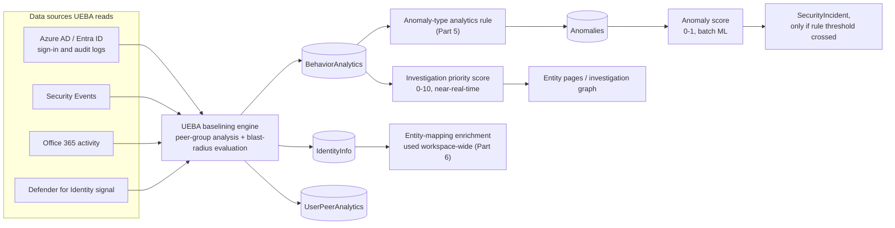

# Part 11 — UEBA: User and Entity Behavior Analytics

## Why this part exists

**[CONCEPT]** Every analytics rule discussed in Parts 4 and 5 answers a question about a single event or a single query result: did this pattern occur? UEBA (User and Entity Behavior Analytics) — a named security-capability category outside Sentinel specifically, not a Microsoft coinage; NIST's own guidance on enterprise network security architecture describes UEBA functionality as detecting anomalies in a user's access behavior to help stop insider threats and advanced cyberattacks (NIST, "Guide to a Secure Enterprise Network Landscape," NIST Special Publication 800-215, November 2022: [csrc.nist.gov/pubs/sp/800/215/final](https://csrc.nist.gov/pubs/sp/800/215/final)) — answers a different question that no single-event rule can: is this normal *for this entity*? A sign-in from a new country is not inherently suspicious — it's suspicious relative to where that specific user, or their peers, normally sign in from. That relative judgment requires a standing baseline, built over time, per entity, and Sentinel's UEBA feature is the platform component that builds and maintains it. DEH Part 31 already covers baselining as a general detection-engineering technique — why a static threshold rule and a baseline-relative rule solve different problems, and what a baseline actually needs to stay valid (enough history, enough peers, a refresh cadence shorter than attacker dwell time). This part doesn't re-derive that theory. It covers what Microsoft Sentinel specifically does with it: which data sources UEBA reads, which tables it writes, which two numeric scores it produces, and why those two scores answer different questions that this part explicitly refuses to collapse into one.

UEBA also sits downstream of a fact DEH Part 12–13 already establishes about identity as a detection surface: an authentication event (a token issuance, a sign-in) is thin evidence on its own, because a valid credential and a stolen credential produce the identical event. Behavioral context — where this account usually signs in from, what it usually accesses, who its peers are and what they do — is one of the few practical ways to add signal to an otherwise-clean authentication event. UEBA is Sentinel's implementation of that context layer, and it is a mature, GA capability: Microsoft ships it at no incremental license cost beyond the ingestion cost of the underlying tables it reads, and its core table schema has been stable for multiple years. That maturity is exactly why this part is split from Part 12 — UEBA is settled architecture with occasional additions (covered explicitly, and hedged, in §7 below); Security Copilot and agentic tooling are not, and get their own part precisely because a stable feature and a fast-moving one shouldn't share one callout density.

**MITRE:** T1078 (Valid Accounts) — the technique UEBA's baselining is most directly aimed at making harder to hide behind.

## 1. What UEBA is, and what it is not

**[CONCEPT]** UEBA is a workspace-level setting, not a rule. Enabling it (Microsoft Sentinel > Settings > Entity behavior analytics is the Azure portal path as of this writing — spelled out here on first mention, but a left-nav path is exactly the kind of detail that shifts between portal releases, so verify the current location against Microsoft Learn rather than trusting this sentence indefinitely; the equivalent surface exists in the Microsoft Defender portal under its own, separately-verified left-nav path, which may not match the Azure portal's) turns on a background process that reads identity and activity signal already flowing into the workspace and builds per-entity behavioral baselines from it. It does not, by itself, create incidents. What it produces is enrichment and scoring that other parts of the platform consume: entity pages display it, hunting queries can join against it, and a specific rule type — Anomaly rules (a rule type that is ML-baselined, doesn't alert on its own until a duplicated template's threshold is tuned, and writes its output to the `Anomalies` table; full rule-type treatment in Part 5) — consumes it directly to decide whether to fire.

This distinction matters because it's easy to conflate "UEBA is on" with "UEBA will alert me." It won't, on its own. UEBA is the baseline; Anomaly rules (and, less directly, some Fusion and Custom Detection logic) are what turn a baseline deviation into something that shows up in the incident queue. A workspace can have UEBA enabled with zero Anomaly rules active, in which case UEBA is quietly building baselines and enriching entity pages with no effect on the incident queue at all — a common, and often unintentional, deployment state worth checking for during any Part 18-style health review.

> **Engineering Reality**
> UEBA needs history before its baselines mean anything. A newly enabled UEBA feature, or a newly onboarded entity with no prior activity in the workspace, doesn't have a peer-relative or self-relative baseline yet — it has to accumulate enough activity first. Microsoft's own UEBA documentation describes this as a learning period rather than an instant switch-on; treat the first stretch of any onboarding as "baselines are still forming," not "UEBA is broken," when investigation priority scores look thin or absent for entities that were only recently added to the data sources UEBA reads.

## 2. Data sources: what UEBA actually reads

**[ENGINEERING]** UEBA doesn't ingest its own telemetry — it reads tables the workspace is already collecting through ordinary connectors, and it lets you toggle which of those sources it draws behavioral signal from independently of whether the underlying connector itself is on. The sources Microsoft documents as UEBA inputs center on identity and access activity: Azure Active Directory (Entra ID) sign-in and audit logs, Windows Security Events, Office 365 activity, and signal from Microsoft Defender for Identity where that product is connected. Each source has its own toggle in the UEBA settings surface, separate from the connector's own on/off state, so a workspace can be collecting Security Events for other purposes while explicitly excluding that source from UEBA's baselining — useful if a particular data source is noisy or not yet trustworthy enough to baseline against.

**[SENTINEL ENGINEER]** The scope description for this part also names multi-cloud connectors as a UEBA input, reflecting Microsoft's stated direction of extending entity-behavior baselining beyond the Entra ID–centric core. Treat the specific current list of supported multi-cloud sources as unsettled rather than memorize a list here — this is precisely the kind of enumerable fact (which connectors currently feed UEBA) that changes as Microsoft adds sources, and the authoritative, current answer is Microsoft Learn's UEBA data-sources reference, not this paragraph.

The table below is a decision aid for what to check before assuming UEBA is baselining an entity type — not an exhaustive schema reference.

| Entity type | Primary baseline signal | Data sources typically required | Practical check |
|---|---|---|---|
| Account (user) | Peer-group deviation, sign-in geography/device/app novelty, activity volume | Azure AD sign-in and audit logs, Office 365 activity | Confirm the account's Azure AD object has group-membership data synced — a peer group can't be computed for an identity with no group attributes |
| Host | Sign-in target novelty, first-time account-to-host pairing | Security Events, Azure AD sign-in logs | Confirm the host emits Windows Security Events into the workspace, not just endpoint telemetry that bypasses that table |
| IP address | Geography and ASN novelty relative to the account's history | Azure AD sign-in logs, Defender for Identity | IP-based insight quality depends on sign-in logs carrying resolved geolocation — check for gaps behind corporate VPN egress, which flattens genuine geography signal |

## 3. Peer-group analysis and blast radius

**[CONCEPT]** UEBA's baselining rests on two distinct methods, and conflating them is a common source of confusion when reading an entity page. Peer-group analysis compares an account's activity to a computed group of peers — accounts Microsoft's algorithm judges similar based on Azure AD attributes such as group membership, manager, and department — and flags activity that's unusual relative to that group even if it's routine for the individual account. Blast-radius evaluation is a different question entirely: not "is this normal," but "how much could go wrong if this specific account were compromised right now," based on what the account can reach — group memberships, role assignments, resource access. A help-desk account with broad reset-password rights can have a perfectly normal, unremarkable sign-in pattern and still carry a high blast radius, because the damage a compromise of that account could do is high regardless of how boring its day-to-day behavior looks. UEBA computes both and feeds both into the investigation priority score covered in §5.

> **False Positive Trap**
> Peer-group analysis needs an actual peer group to be meaningful, and small organizations, unique job functions, and newly created roles routinely don't have one. A sole database administrator, a newly hired specialist with no comparable Azure AD group siblings yet, or a service account with a one-of-a-kind naming pattern can register as behaviorally anomalous simply because Microsoft's peer-grouping algorithm can't find enough genuinely comparable accounts to build a stable baseline from. The fix isn't to disable UEBA for that account — it's to recognize that a thin-peer-group anomaly carries less evidentiary weight than the same anomaly flagged against an account with dozens of legitimate peers, and to weight investigation priority accordingly rather than treating every high score as equally strong evidence.

**[THREAT HUNTER]** Peer-group membership itself is worth hunting on independently of any anomaly score. A hunt built on `UserPeerAnalytics` — asking "who does Sentinel currently consider this account's peers, and has that peer set changed recently" — can surface a role change, a group-membership drift, or a stale peer computation before it ever produces a scored anomaly. This is the kind of exploratory, hypothesis-driven pivot that belongs in a hunting notebook (Part 9) rather than a standing rule; the peer-set itself is reference data about the baseline, not an alert.

## 4. The table set

**[SENTINEL ENGINEER]** UEBA's output lives in four tables, and each answers a different question a rule author or hunter might ask.

`BehaviorAnalytics` is UEBA's primary output table — one row per scored activity, carrying the investigation priority score (§5), the peer-analysis and blast-radius insights that fed it, and identifiers for the entities involved. This is the table an Anomaly rule or a hunting query reads when the question is "show me scored behavioral activity for this entity."

`IdentityInfo` is broader than UEBA's own alerting purpose. It's a normalized, UEBA-populated table of identity attributes — UPN, group membership, manager, enabled/disabled state, and similar Azure AD context — that other parts of the workspace draw on for entity enrichment well beyond UEBA's own scoring. An analytics rule anywhere in the workspace that wants to know "is this account a member of a privileged group" without writing its own Azure AD lookup can query `IdentityInfo` instead, which is one reason enabling UEBA has enrichment value even for rules that have nothing to do with behavioral anomaly detection. This is the same identity-normalization role Part 6's entity-mapping mechanics and Part 10's watchlist-driven reference data both partly overlap with — `IdentityInfo` is UEBA's contribution to that shared reference-data layer, not a UEBA-exclusive silo.

`UserPeerAnalytics` records the peer-group computation itself — which accounts UEBA currently considers peers of a given account, and on what basis. This is the table the hunt in §3 reads.

`Anomalies` is written by Anomaly-type analytics rules, not by UEBA directly — it's downstream of UEBA's baselines but is a rule-type output table, one row per rule execution that judged an activity anomalous enough to record. This is the table that feeds the anomaly score covered next.

> **Blind Spot**
> `BehaviorAnalytics` scores individual activities against a baseline; it does not, on its own, tell you whether that activity ever became an incident. A high-investigation-priority row in `BehaviorAnalytics` with no corresponding row in `SecurityIncident` means exactly what it looks like — Sentinel judged the activity behaviorally unusual and nothing in the rule layer acted on it. That's not necessarily a platform failure; it can just as easily mean no Anomaly rule's threshold was tuned to catch it, or the workspace has UEBA enabled with no Anomaly rules turned on at all (§1). Don't read the presence of scored anomalies in `BehaviorAnalytics` as evidence that the incident queue reflects them.

## 5. Two scores, two different questions

**[ANALYST]** This is the section Section D's own framing in `BOOK-INDEX.md` calls out by name, and it's worth stating as plainly as possible: Sentinel's UEBA and Anomaly-rule layer produces two numeric scores that look superficially similar — both are "how anomalous is this" numbers — and answer genuinely different questions. Reading one as if it were the other is a common analyst mistake.

The **investigation priority score** is a 0–10 value UEBA computes per scored activity in `BehaviorAnalytics`, combining peer-analysis deviation, blast-radius context, and (per Microsoft's documentation of the feature) prior investigation and incident history for the entity. It's evaluated close to the activity itself — near-real-time relative to the underlying sign-in or access event — and its purpose is triage prioritization: given a large number of scored activities on an entity page or in a hunting result set, which ones deserve an analyst's limited attention first. It answers "how much should I care about this specific entity right now."

The **anomaly score** is a 0–1 value written to the `Anomalies` table by an Anomaly-type analytics rule's underlying ML model, evaluated on the rule's own execution cadence rather than per-activity in real time — closer to a batch judgment than a near-real-time one. Its purpose is rule-triggering: an Anomaly rule template ships with a default sensitivity, and duplicating that template (never editing the built-in original directly — Part 5 covers why) and adjusting its threshold changes how high an anomaly score has to be before that specific rule instance creates an alert. It answers "should this specific rule fire on this specific model output."

The table below summarizes which of the two scores to consult for a given question, since the prose distinction above is easy to lose track of once both numbers are on screen at once.

| Attribute | Investigation priority score | Anomaly score |
|---|---|---|
| Range | 0–10 | 0–1 |
| Computed by | UEBA baselining engine | Anomaly-type analytics rule's ML model |
| Written to | `BehaviorAnalytics` | `Anomalies` |
| Cadence | Near-real-time, per scored activity | Batch, per rule execution cycle |
| Answers | How much should an analyst care about this entity right now | Should this specific rule instance fire on this model output |
| Tunable by an engineer | No — it's a UEBA-computed enrichment value | Yes — via a duplicated rule template's threshold (Part 5) |

> **Engineering Reality**
> These two scores were built by different parts of the platform to serve different consumers — one for a human scanning an entity page, one for a rule deciding whether to create an alert — and Microsoft has never documented a fixed conversion between them. An investigation priority score of 9 does not imply any particular anomaly score, and a low anomaly score on one Anomaly rule doesn't mean the same activity has a low investigation priority. Treat a workbook or dashboard that tries to plot both on the same axis with the same skepticism you'd apply to averaging two unrelated units.

## 6. The UEBA behaviors layer — a newer, separately enabled capability

**[CONCEPT]** Beyond the mature `BehaviorAnalytics`/`IdentityInfo`/`UserPeerAnalytics`/`Anomalies` table set covered above, Microsoft has been extending UEBA with an additional, separately enabled behaviors layer referenced in this book's own part scope as writing to `SentinelBehaviorInfo` and `SentinelBehaviorEntities`. Treat this section with more caution than any other in this part: it describes recently introduced, opt-in surface area, and this book has no lab tenant to validate its current behavior against (the honesty constraint stated in Part 1 applies with particular force here). What follows is a deliberately conservative description, not a full schema reference — verify every specific detail against Microsoft's current UEBA documentation before building anything against it.

> **PRODUCT VERSION NOTE (as of 2026-09-15)**
> Microsoft documents an additional entity-behavior surface beyond the classic UEBA table set, opt-in and separate from the core UEBA toggle covered in §2, with `SentinelBehaviorInfo` and `SentinelBehaviorEntities` as its table names. This book treats its scope, maturity, and exact enablement path as unsettled rather than describing specific fields or query patterns against it, because the feature has been under active development and this book has no tenant to confirm current behavior against. Check Microsoft Learn, "Identify advanced threats with User and Entity Behavior Analytics (UEBA)" ([learn.microsoft.com/azure/sentinel/identify-threats-with-entity-behavior-analytics](https://learn.microsoft.com/azure/sentinel/identify-threats-with-entity-behavior-analytics)) — checked 2026-09-15 for this note — directly before relying on any specific claim about this layer — including whether the table names above are still current — and treat anything below this note as a description of *that a newer layer exists*, not *how it currently works*.

> **What Would Change My Mind**
> This part's stance is "describe the newer behaviors layer's existence and purpose, but don't teach its mechanics without lab evidence." If a future edition's author gains access to a real Sentinel tenant with this layer enabled (the no-real-tenant honesty constraint lifting, per `STYLE-GUIDE.md` §9.4's provision for that day), the right move is to replace this hedge with a walkthrough validated against that real, captured evidence, documented per whatever evidence-class rules govern that future edition — not to keep hedging out of habit once real evidence exists.

**[SOC MANAGEMENT]** The practical takeaway for a SOC deciding whether to enable this newer layer today: treat it as you would any preview or recently-GA'd capability elsewhere in this book — pilot it against a non-production workspace or a limited scope first, and don't build a standing detection or workbook dependency on its exact table schema until Microsoft's own documentation describes it as stable. The classic UEBA table set in §4 is the safe, multi-year-stable foundation to build production content against; this layer is not yet that, on the evidence available to this book.

## 7. Investigating with UEBA: the analyst's view

**[ANALYST]** UEBA's output surfaces in three places an analyst actually looks. First, entity pages (opened from an incident's investigation graph, or searched directly) show behavioral insights for Account, Host, and IP address entities — peer-group membership, blast-radius context, and any scored activity from `BehaviorAnalytics` relevant to that entity, alongside the ordinary activity timeline. Second, the built-in UEBA workbook (shipped with the Sentinel content solution set, not something you build from scratch) visualizes anomalous activity trends, geographic sign-in distribution, and investigation-priority-scored entities over a selected time window — a starting triage view rather than a replacement for entity-level investigation. Third, any incident whose triggering alert came from an Anomaly rule carries the anomaly score and the specific model insight that fired it directly in the alert details, which is the fastest way to answer "why did this specific incident happen" without cross-referencing `Anomalies` manually.

**[ANALYST]** The practical triage discipline this part recommends: don't open an entity page and treat the investigation priority score alone as a verdict. Read the insights that produced it — which peer-group deviation, which blast-radius factor, whether the underlying activity has independent corroboration elsewhere in the incident (an IP reputation hit, a correlated alert from Defender for Identity, a watchlist match against a known-risky asset). A high score with thin supporting insight (§3's thin-peer-group trap) deserves a different level of confidence than a high score with three independent corroborating signals.

## 8. Hunting against the UEBA tables

**[THREAT HUNTER]** Syntax fundamentals — the pipe model, `join`, `summarize`, time-window functions — are DEH Part 25's scope, not this book's; what follows assumes that foundation and shows only the Sentinel-specific extension: joining a UEBA table into an identity-context lookup. The fragment below illustrates the shape of a peer-context hunt, not a complete, deployable query — see DEH Part 25 for the join-strategy and performance guidance that applies to any join like this at scale.

```kql
// CONCEPTUAL SAMPLE — illustrative peer-context hunt fragment, not a complete query
BehaviorAnalytics
| where ActivityInsights has "New Location"
| join kind=leftouter (
    UserPeerAnalytics
    | project UserName, PeerGroup
) on UserName
| where isnull(PeerGroup) or PeerGroup == ""
```

The specific pattern this fragment surfaces — a scored "new location" activity for an account with no computed peer group at all — is exactly the §3 thin-peer-group trap made queryable: it separates "genuinely novel behavior against a real peer baseline" from "novel-looking behavior against no baseline at all," which is the distinction an analyst needs before trusting the investigation priority score's face value.






**Figure 11.1 — UEBA data flow: sources, engine, tables, and the two scores.** *CONCEPTUAL.* Illustrates how UEBA's four inputs feed a single baselining engine that writes three tables, and how those tables diverge into two differently-scoped, differently-scaled scores — one consumed directly by analysts on entity pages, one consumed by an Anomaly-type analytics rule before it can ever reach the incident queue. This is a structural sketch built from this part's own reading of Microsoft's UEBA documentation, not a reproduction of an official Microsoft architecture diagram and not a capture from a running tenant.

## 9. Cost and program placement

**[SOC MANAGEMENT]** UEBA carries no separate license fee. What it costs is the ingestion cost of the underlying tables it reads (Azure AD sign-in and audit logs, Security Events, Office 365 activity, and whatever else is enabled as a source per §2) — cost a workspace collecting those sources for other detection purposes is very likely paying already. That makes UEBA one of the more straightforwardly justifiable additions in this book's whole platform for a SOC weighing where to spend tuning effort: turning it on adds identity-context enrichment and two new scoring signals without a separate billing line, and the actual cost center is the analyst time spent learning to read investigation priority and anomaly scores correctly (§5's conflation risk) rather than any additional spend.

> **SOC Management View**
> A program-management framing worth giving a director asking "why hasn't UEBA produced any incidents": the honest answer might be that it's working exactly as designed, with zero Anomaly rules currently tuned to act on its output (§1). That's a rule-layer gap, not a UEBA failure, and the fix is a Part 5 rule-tuning conversation — duplicating and thresholding an Anomaly rule template — not a request to re-evaluate whether UEBA itself is worth keeping enabled.

## 10. Putting it together

**[CONCEPT]** UEBA's contribution to a Sentinel deployment is best understood as a context layer, not a detection layer in its own right. It doesn't replace the analytics rules covered in Parts 4 and 5; it makes the entities those rules fire on legible in a way a bare event never is on its own — this account's peers, this account's reach, whether this specific activity has ever happened before for this specific entity. The two scores it feeds (§5) exist because triage prioritization and rule-triggering are genuinely different jobs, and the newer behaviors layer (§6) is a reminder that even a mature, multi-year-stable feature like UEBA still has an actively developing edge — one this book describes honestly as unsettled rather than pretending to have validated it against evidence that doesn't exist in this author's environment.

**Cross-references:** DEH Part 31 (Baselining — the general technique UEBA's peer-group and blast-radius analysis operationalizes against identity data); DEH Part 12–13 (Identity Detection Engineering — the thin-evidence authentication-event problem UEBA's behavioral context exists to address); DEH Part 25 (KQL syntax fundamentals underlying the hunting fragment in §8); Part 5 (Anomaly-type analytics rules, the rule layer that consumes `BehaviorAnalytics` and writes `Anomalies`); Part 6 (entity mapping and the incident model, which `IdentityInfo` enrichment feeds); Part 10 (Watchlists and reference data, the adjacent reference-data layer UEBA's peer groups complement); Part 9 (Hunting in Sentinel and the Defender portal, for the notebook-based hunt workflow the §3 peer-set hunt belongs in).
