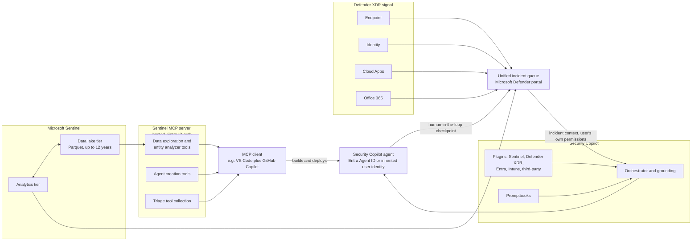

# Part 12 — AI-Assisted Operations: Security Copilot and Agentic Platform Tooling

## Why this part exists

This part covers three things Microsoft ships on top of Sentinel and Defender data rather than inside a rule or a workspace setting: Microsoft Security Copilot itself (the standalone experience and its embedded panes), the newer Security Copilot agents that act on a trigger instead of a prompt, and Microsoft Sentinel's own agent-facing tool surface built on the Model Context Protocol (MCP). Every one of those three things shipped, changed shape, or moved out of prerelease status on a timeline measured in months, not years — this is, deliberately, the least stable ground in the book, and the part says so up front rather than dressing a snapshot up as settled architecture.

That instability changes how this part is written. Every specific claim about what a capability does, what it costs, or what release stage it's in carries a dated citation to a Microsoft Learn page, and most carry a **PRODUCT VERSION NOTE** rather than treating the fact as background knowledge. Where Microsoft's own documentation flags something as prerelease or preview, this part repeats that flag rather than smoothing it into confident prose.

This part does not re-teach KQL. When Security Copilot generates a Kusto Query Language (KQL) query from a natural-language prompt, the output is still KQL, and it still has to be read and validated against the same syntax fundamentals DEH Part 25 already teaches — a generated query that parses is not the same thing as a generated query that means what the analyst intended. This part also isn't the AI-security part of this library: DEH Part 20 (AI Systems Telemetry and Audit Trail Engineering) and DEH Part 21 (AI Security Detection Engineering) cover the inverse problem — treating an AI system as something to monitor and defend. This part covers the problem the other direction: using an AI system as a tool inside a SOC's own platform operations.

## 1. Security Copilot: what it is and where it lives

**[CONCEPT]** Microsoft Security Copilot is a generative-AI security-analysis product with a standalone web experience (at `securitycopilot.microsoft.com`) and a set of embedded panes inside other Microsoft security products. As of Microsoft's own current overview documentation, Security Copilot connects into Microsoft Defender XDR, Microsoft Sentinel, Microsoft Intune, and Microsoft Entra, along with third-party products including ServiceNow and Jamf (Microsoft Learn, "What is Microsoft Security Copilot?", [learn.microsoft.com/en-us/copilot/security/microsoft-security-copilot](https://learn.microsoft.com/en-us/copilot/security/microsoft-security-copilot), retrieved 2026-09-15). This part follows Part 2's framing of the platform's two-portal split and treats the Microsoft Defender portal as Copilot's durable home for anything Sentinel-relevant to an incident; whether a Copilot pane still ships inside the classic Azure portal's Sentinel blade by the time you're reading this is exactly the kind of fact Part 16's migration guidance already tells a reader to re-check rather than assume.

Microsoft's own use-case list for Security Copilot, stripped of its marketing framing, comes down to a short set of falsifiable jobs: turning an incident's alerts and entities into an actionable summary with step-by-step remediation suggestions, translating a plain-language question into a KQL query or reverse-engineering a suspicious script, summarizing posture and policy information across a tenant, and — the newest addition — letting a developer build and add agents to the Copilot ecosystem (same source). The mechanism behind all of these is a fixed request/response cycle Microsoft calls grounding: a user's prompt is preprocessed through plugins that add organizational context, the modified prompt goes to the underlying language model, and the model's response is post-processed through plugins again before it's shown to the user (same source). Section 2 below is about what that plugin layer actually is and, more importantly, what it can't do.

## 2. Grounding, plugins, and the permission boundary

**[CONCEPT]** A plugin is the mechanism by which Security Copilot reaches into a specific Microsoft or third-party product's data — event logs, alerts, incidents, and policies — instead of answering purely from the underlying language model's general training (Microsoft Learn, "What is Microsoft Security Copilot?", retrieved 2026-09-15). Built-in plugins exist for the major Microsoft security products; Copilot's own usage-monitoring dashboard logs which plugin backed a given session, with `Microsoft Entra` and `Microsoft Defender XDR` given as the documented example plugin names (Microsoft Learn, "Manage security compute unit usage in Security Copilot," [learn.microsoft.com/en-us/copilot/security/manage-usage](https://learn.microsoft.com/en-us/copilot/security/manage-usage), retrieved 2026-09-15). Building a custom plugin is a developer-facing task with its own manifest format that this book doesn't reproduce — the same "don't re-teach what another document already owns" discipline this book applies to KQL applies here too.

The operational fact worth internalizing is a permission boundary, not a feature list: Microsoft's own privacy and data-security documentation states plainly that "Security Copilot runs queries as the user, so it never has elevated privileges beyond what the user has" (Microsoft Learn, "Privacy and data security in Microsoft Security Copilot," [learn.microsoft.com/en-us/copilot/security/privacy-data-security](https://learn.microsoft.com/en-us/copilot/security/privacy-data-security), retrieved 2026-09-15). Concretely, that means an incident summary Copilot writes is built from incident, alert, and entity data — including the `SecurityIncident` table's own columns where a Sentinel-connected workspace backs the incident — that the signed-in analyst could already see without Copilot's help. Copilot doesn't grant a junior analyst visibility into a workspace their role can't already query, and it doesn't quietly widen an investigation's scope beyond what the user's own Microsoft Entra role and Sentinel/Defender RBAC assignment already permit.

> **Engineering Reality**
> Because grounding runs as the signed-in user, the same prompt asked by two analysts with different RBAC scopes over the same incident can come back with two different Copilot summaries — one may see cross-workspace context the other's role doesn't expose, and there is no separate "Copilot-level" permission to reconcile the difference. A SOC that treats a Copilot summary as *the* record of an incident, rather than *one analyst's own access reflected back through a summarizer*, will eventually get surprised when a second analyst's summary doesn't match — not because Copilot is wrong, but because the two analysts were never looking at the same underlying dataset to begin with.

## 3. What an analyst sees: capabilities inside the unified incident queue

**[ANALYST]** Inside the unified incident queue this book describes in Part 15, an analyst working an incident that includes Sentinel-sourced alerts encounters Copilot as an embedded pane rather than a separate destination. The capabilities that pane exposes track directly to Microsoft's documented use cases: an auto-generated incident summary, guided step-by-step response suggestions, a natural-language-to-KQL translator for building an Advanced Hunting query, and script- or code-analysis for a submitted artifact (Microsoft Learn, "What is Microsoft Security Copilot?", retrieved 2026-09-15). Layered on top of individual prompts, promptbooks package a fixed multi-step prompt sequence — Microsoft's own SCU usage documentation names "Script Analysis" as one example, describing it as a promptbook that calls five underlying prompts in sequence (Microsoft Learn, "Manage security compute unit usage in Security Copilot," retrieved 2026-09-15).

Table 12.1 lays out what an analyst actually sees, what each capability is grounded on, and — the part that matters most for this book's own scope — what the analyst still owns after Copilot responds.

| Capability | What it produces | Grounded on | Analyst still owns |
|---|---|---|---|
| Incident summarization | Narrative summary of an incident's alerts, entities, and timeline | Incident, alert, and entity data already visible to the signed-in user | Confirming the summary matches the entity graph, not just the prose |
| Guided response | Step-by-step remediation suggestions for the open incident | Plugin-mediated context from Defender XDR and connected products | Deciding whether to execute — the suggestion isn't the action |
| Natural-language KQL generation | A draft KQL query translated from a plain-language question | The workspace's own accessible table schema, surfaced through grounding | Validating syntax and logic against DEH Part 25 before running it |
| Script or code analysis | Deobfuscation and a behavioral explanation of a submitted script | The script content itself, plus threat-intelligence plugins | Independently confirming any verdict before acting on it |
| Promptbooks | A saved, reusable multi-step prompt sequence for a recurring task | Whatever plugins the promptbook's individual prompts call | Reviewing the steps at least once before trusting the output blindly |

> **False Positive Trap**
> This one is a platform-behavior trap, not a query-tuning one. A Copilot-generated incident summary and an automation-rule comment added to the same incident (Part 13) can both restate the same underlying alert fields in slightly different words. A second-shift analyst who reads both and treats them as two independent pieces of corroborating evidence — rather than two paraphrases of one dataset — can walk away with false confidence in a finding that was never actually cross-checked against anything.

> **Blind Spot**
> Summarization is a smoothing function by design: it turns a mix of populated, empty, and unresolved fields into confident-sounding prose. An entity that failed to resolve, a field that came back null, or an alert that's still enriching in the background can all disappear into a fluent sentence that reads as more complete than the underlying data actually is. Reading only the summary, and never the entity graph or the raw alert it was built from, is how that gap stays invisible.

## 4. Licensing and Security Compute Units

**[SOC MANAGEMENT]** Security Compute Units (SCUs) are the billing and capacity unit for every Security Copilot workload — the standalone portal, embedded panes, Microsoft-built agents, partner-built agents, and any other Copilot feature all draw against the same SCU pool (Microsoft Learn, "Microsoft Security Copilot Security Compute Units and capacity," [learn.microsoft.com/en-us/copilot/security/security-compute-units-capacity](https://learn.microsoft.com/en-us/copilot/security/security-compute-units-capacity), retrieved 2026-09-15). Eligible Microsoft 365 E5 and E7 customers get a default capacity auto-provisioned; every other customer has to provision SCUs before using Security Copilot at all (same source).

Two capacity types apply once SCUs are provisioned. Provisioned capacity is a baseline allocation billed per hour: it refreshes on fixed clock-hour blocks (9:00–10:00, 10:00–11:00, not a rolling 60-minute window from whenever it was set up), and unused units in a given hour simply expire rather than rolling over (same source). Overage capacity absorbs demand above the provisioned baseline and is billed on consumption, to one decimal SCU rather than rounded to a whole unit (Microsoft Learn, "Manage security compute unit usage in Security Copilot," retrieved 2026-09-15). Whether a given capability's usage is billed at all depends on that capability's own release stage, not on the SCU model in general — Table 12.2 reproduces Microsoft's own breakdown.

| Capability release stage | SCU consumption charge |
|---|---|
| Generally available (GA) | Yes |
| Public preview | Yes |
| Private preview | No |

*(Source: Microsoft Learn, "Manage security compute unit usage in Security Copilot," retrieved 2026-09-15.)*

> **Engineering Reality**
> The clock-hour refresh is a cost-planning trap disguised as a billing footnote. Microsoft's own documentation gives the example directly: provision three SCUs, and you get three SCUs every full clock hour — set up at 9:05, and you still only had until 10:00 before that hour's allocation expired unused, with no rollover into the next hour (Microsoft Learn, "Microsoft Security Copilot Security Compute Units and capacity," retrieved 2026-09-15). A SOC that sizes provisioned capacity by peak-hour demand and assumes idle hours "bank" unused units for a later burst will find the bill doesn't work that way — idle capacity is capacity paid for and thrown away, every single hour, by design.

> **PRODUCT VERSION NOTE (as of 2026-09-15)**
> Microsoft's public pricing page lists an example rate of $4 per provisioned SCU-hour and $6 per overage SCU as of this writing, with an explicit disclaimer that these are estimates, not quotes, and that actual pricing varies by agreement, purchase date, currency, and applicable tax (`microsoft.com/en-us/security/pricing/microsoft-security-copilot/`, retrieved 2026-09-15; see also the Azure pricing calculator linked from Microsoft's own capacity documentation). If you're budgeting against this figure, run it through the calculator against your own agreement and region rather than citing this book's number — SCU pricing is exactly the kind of fact this callout exists to flag as provisional.

## 5. From assistant to agent

**[CONCEPT]** Everything in Sections 1–4 is Copilot responding to something a human typed. Security Copilot agents are a different shape: an agent runs on a trigger — a schedule, or a system event — rather than waiting for a prompt, and it keeps running with a defined scope of permissions rather than a one-off answer (Microsoft Learn, "Microsoft Security Copilot agents overview," [learn.microsoft.com/en-us/copilot/security/agents-overview](https://learn.microsoft.com/en-us/copilot/security/agents-overview), retrieved 2026-09-15). Microsoft's own agents-overview page names threat-intelligence briefings and Conditional Access optimization as example resource-intensive tasks agents are meant to absorb (same source) — useful as illustrations of the shape of the work, not as a promise that either example still exists as a named, installable agent by the time you're reading this.

### Security Copilot agents

An agent needs an identity to authenticate when it runs. Microsoft's documentation describes two models: a dedicated identity created through Microsoft Entra Agent ID — currently available only for Microsoft-built agents — or the agent simply running under the credentials of the user who set it up, inheriting that user's own access for as long as it's active (same source). The second model is the direct extension of Section 2's permission-inheritance principle into agentic territory: an agent running as a human's inherited identity is bounded by exactly that human's own RBAC scope, no wider. Agents draw against the same SCU pool as every other Copilot workload (same source), and — per Table 12.2 — whether a given agent's usage is even billed depends on whether that agent's underlying capability has left private preview.

> **PRODUCT VERSION NOTE (as of 2026-09-15)**
> Microsoft's own agents-overview and custom-agent-development pages both open with the same disclaimer: "Some information in this article relates to a prereleased product which may be substantially modified before it's commercially released" (Microsoft Learn, "Microsoft Security Copilot agents overview" and "Security Copilot Agent Development Overview," [learn.microsoft.com/en-us/copilot/security/developer/custom-agent-overview](https://learn.microsoft.com/en-us/copilot/security/developer/custom-agent-overview), both retrieved 2026-09-15). Treat every named agent, permission model, and identity mechanism in this section as subject to change without a deprecation notice resembling the kind Part 2 documents for the Azure-portal retirement — check the cited URLs directly before assuming any of this has stabilized.

> **What Would Change My Mind**
> This book's default recommendation — chained directly from the PRODUCT VERSION NOTE above — is to require a human-in-the-loop approval step before any Security Copilot agent, Microsoft-built or custom, takes an action with an external effect (isolating a host, disabling an account, sending a notification outside the SOC). Microsoft's own framing already leans this way, describing agents as something that "keep you in control on the actions it takes" rather than something that acts unsupervised by default (Microsoft Learn, "Microsoft Security Copilot agents overview," retrieved 2026-09-15). If a durable, audited track record of unsupervised agent actions with a mature rollback mechanism becomes the documented norm rather than the exception, this recommendation should soften from "approve every external-effect action" to "approve the agent's scope once and audit its actions after the fact" — a materially different governance posture for a SOC manager to sign off on.

## 6. The Sentinel data lake's agent-facing surface

**[ENGINEERING]** Part 17 owns the cost and retention depth of the Sentinel data lake tier; this section covers only the piece relevant to AI tooling. The data lake tier mirrors data already in the analytics tier into an open Parquet format, supports retention of up to twelve years, and is queried through a KQL query editor (including scheduled or one-time jobs that promote data back into the analytics tier) and through Jupyter notebooks for Python-based analysis (Microsoft Learn, "Microsoft Sentinel data lake overview," [learn.microsoft.com/en-us/azure/sentinel/datalake/sentinel-lake-overview](https://learn.microsoft.com/en-us/azure/sentinel/datalake/sentinel-lake-overview), retrieved 2026-09-15). All lake activity — KQL queries, notebook runs, job management — is captured in an audit log enabled by default (same source).

### The Sentinel MCP server

The Model Context Protocol (MCP) is an open, vendor-neutral protocol — not a Microsoft invention — that standardizes how an AI application connects to external tools and data through a client-server architecture: an MCP host (the AI application), an MCP client (the connection the host maintains), and an MCP server (the program that actually provides context and tools) ([modelcontextprotocol.io](https://modelcontextprotocol.io); Microsoft Learn, "What is Microsoft Sentinel's support for MCP?", [learn.microsoft.com/en-us/azure/sentinel/datalake/sentinel-mcp-overview](https://learn.microsoft.com/en-us/azure/sentinel/datalake/sentinel-mcp-overview), retrieved 2026-09-15). Microsoft's own documentation gives Visual Studio Code as the example MCP host, connecting as a client to the Sentinel MCP server (same source).

That Sentinel MCP server is documented as a unified, fully hosted interface requiring no infrastructure deployment on the customer's part, authenticating through Microsoft Entra, and organized into scenario-focused tool collections rather than one undifferentiated tool list (same source). As of the cited retrieval date, three collections are documented:

- **Data exploration** — natural-language querying over the data lake without requiring the caller to already know table schema or write well-formed KQL, plus an "entity analyzer" sub-tool for retrieving and reasoning over an entity (a URL, a user) across the organization's security data for enrichment during triage (same source).
- **Agent creation** — the same MCP-tool-driven agent-building path referenced in Section 7 below, letting a developer describe an agent's intent in natural language from inside an MCP-compatible IDE and have the tooling generate and iterate on the resulting agent (Microsoft Learn, "Security Copilot Model Context Protocol," [learn.microsoft.com/en-us/copilot/security/developer/mcp-overview](https://learn.microsoft.com/en-us/copilot/security/developer/mcp-overview), retrieved 2026-09-15).
- **Triage** — tools that integrate an AI model with APIs supporting incident triage and threat hunting directly, aimed at reducing mean time to resolution (Microsoft Learn, "What is Microsoft Sentinel's support for MCP?", retrieved 2026-09-15).

This is, in practical terms, an MCP-mediated alternative front door onto the same territory DEH Part 34–36 and this book's own Part 9 already cover as native in-portal hunting — the data exploration and triage collections exist so an AI agent (or a developer working from an IDE) can do a version of the same enrichment and triage work a human hunter does natively in the Defender portal.

> **PRODUCT VERSION NOTE (as of 2026-09-15)**
> Microsoft's own MCP documentation for Security Copilot notes that "Creating an agent using natural language (NL2Agent) is in Private Preview, but globally available" (Microsoft Learn, "Security Copilot Model Context Protocol," retrieved 2026-09-15) — read that literally: available in every supported region, but still a gated, actively-changing preview feature, not a stable capability every tenant can assume it has. Both the Sentinel MCP server and the NL2Agent capability it supports are, by Microsoft's own framing, the newest and least settled surface described anywhere in this book. If you're reading this more than a few months after 2026-09-15, treat every tool-collection name, and the client/server architecture description itself, as something to re-verify against the cited URLs rather than something this book has locked in for you.






**Figure 12.1 — How Security Copilot, Security Copilot agents, and the Sentinel MCP server sit on top of Sentinel/Defender data.** *CONCEPTUAL.* Illustrates the relationship between the analytics and data-lake tiers and Defender XDR signal (Part 2, Part 15, Part 17), the unified incident queue an analyst already works in, Security Copilot's plugin-mediated grounding into that same data under the signed-in user's own permissions (Section 2), and the separate, developer-facing Sentinel MCP server surface used to build agents from an MCP-compatible IDE (Section 6). This is a structural sketch built from this book's own reading of the Microsoft Learn pages cited in this part's text — not a reproduction of an official Microsoft architecture diagram, and not a capture of any live tenant.

## 7. Building custom agents

**[SENTINEL ENGINEER]** A custom Security Copilot agent is assembled from five documented components: tools (skills) the agent can call, triggers that initiate it, an orchestrator that decides how tasks execute, instructions the agent follows, and feedback stored to guide later runs (Microsoft Learn, "Security Copilot Agent Development Overview," retrieved 2026-09-15). Microsoft documents three ways to reach that structure — describing the agent in natural language (NL2Agent), building it interactively in an agent-builder interface, or authoring a YAML manifest directly in an IDE and uploading it — all three converging on the same YAML manifest format that actually gets deployed (same source). The MCP-based path described in Section 6 is a fourth entry point onto that same convergence point: an MCP-compatible IDE client calling the Sentinel MCP server's agent-creation tools to generate that YAML from a natural-language description (Microsoft Learn, "Security Copilot Model Context Protocol," retrieved 2026-09-15).

Publishing a custom agent is gated by Security Copilot's own role model, which Microsoft documents as distinct from Microsoft Entra and Azure RBAC roles: a Copilot contributor can build, test, and publish an agent at user scope, while a Copilot owner can additionally publish at workspace scope, making the agent visible to anyone in that Security Copilot workspace (Microsoft Learn, "Security Copilot Agent Development Overview," retrieved 2026-09-15).

The following sketch illustrates the shape of a manifest's contents, not a validated schema — build against Microsoft's own developer documentation, not this block, when authoring a real one.

```yaml
# CONCEPTUAL SAMPLE — illustrative shape of a Security Copilot custom-agent manifest,
# not a validated or deployable manifest. Field and value names are simplified for
# teaching purposes; the real manifest schema is Microsoft's developer documentation
# to own, not this book's.
name: compromised-account-triage
description: Triages a suspected compromised-account incident and drafts a summary.
trigger:
  type: schedule
  interval: 15m
tools:
  - skill: get-incident-entities
  - skill: run-data-lake-query
  - skill: draft-incident-comment
orchestrator:
  type: sequential
instructions: >
  When a new high-severity identity incident appears, gather its entities,
  check sign-in risk history, and draft (but do not post) a triage summary
  for human review.
```

The limitation that block can't show: a real manifest's `skill` references bind to actual registered tools with their own permission and plugin dependencies, and the orchestrator field governs actual execution semantics (sequential versus something more branching) that this sketch only names, not implements.

## 8. Where AI assistance stops and platform operations resume

**[ANALYST]** The discipline this whole part comes down to is a boundary, not a checklist: Copilot and its agents produce drafts — a summary, a suggested response, a translated query, a generated manifest — and something else in the platform has to turn a draft into an effect. A Copilot-generated KQL query has to pass the same validation any hand-written query would, against the syntax fundamentals DEH Part 25 already teaches, before it's trusted inside a scheduled rule or a hunt. A guided-response suggestion isn't itself an action; Part 13's automation rules and Part 14's playbooks are what actually execute a remediation step, and an agent's "keep you in control on the actions it takes" framing (Microsoft Learn, "Microsoft Security Copilot agents overview," retrieved 2026-09-15) is only true in practice if a SOC's own runbooks make that human checkpoint explicit rather than assumed.

**[SOC MANAGEMENT]** That boundary is a governance decision, not a per-analyst judgment call. Deciding which agents get an Entra Agent ID with standing permissions versus which run only under an inherited user identity, deciding which capabilities are approved for use while still in preview (and therefore, per Table 12.2, potentially free to run but also potentially about to change shape), and deciding who reviews an agent's activity log for drift from its original instructions are all questions that belong at the same level as the Defender-portal migration decision this book's Part 16 already frames as a program-management problem, not a toggle a single engineer flips.

**Cross-references:** DEH Part 20 (AI Systems Telemetry and Audit Trail Engineering) and DEH Part 21 (AI Security Detection Engineering) — the inverse problem of securing an AI system rather than using one; DEH Part 25 (KQL syntax underlying any Copilot-generated query); this book's Part 2 and Part 16 (the Microsoft Defender portal as Copilot's durable home, and the Azure-portal retirement this part deliberately doesn't re-litigate); this book's Part 9 (native in-portal hunting, the workflow the MCP triage and data-exploration collections mirror); this book's Part 13 and Part 14 (automation rules and playbooks — where a guided-response suggestion actually becomes an executed action); this book's Part 15 (the unified incident queue Copilot's embedded pane sits inside); this book's Part 17 (Sentinel data lake cost and retention depth this part deliberately left out).
