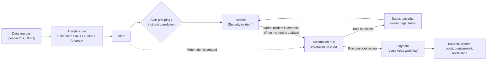

# Part 13 — Automation Rules: Incident-Level Orchestration

## Why this part exists

**[CONCEPT]** Parts 4 through 6 covered how an analytics rule — Scheduled, Near-real-time (NRT) (fixed one-minute evaluation cadence, limited subset of scheduled-rule features), Fusion (advanced multistage attack detection — single instance, not customizable, unavailable once Defender XDR incident integration is on), or Anomaly (ML-baselined, writes to the `Anomalies` table, doesn't alert on its own) — turns a KQL query into an alert, and how alerts group into an incident through entity mapping. None of that answers the next question a running SOC actually has to answer: once an incident exists, what happens to it in the seconds and minutes before a human looks at it?

Automation rules are Microsoft Sentinel's answer. An automation rule is a workspace-level, no-code orchestration object that watches for an alert or incident event and applies a defined set of actions — change status, change severity, assign an owner, add a tag, add a task, or hand off to a playbook — without requiring a Logic Apps workflow for the common cases. Before automation rules existed as a distinct object, this logic lived inside individual playbooks wired one-to-one to individual analytics rules; automation rules exist specifically to pull that logic out of Logic Apps and into a layer that can apply across many analytics rules at once, in a defined order, with conditions a SOC engineer can read without opening a workflow designer.

This part covers what an automation rule is made of, how triggers/conditions/actions/order interact, the specific batching behavior that can make an "incident updated" trigger miss an intermediate state, and the behavior changes this book's Part 16 treats as a full migration project once a workspace onboards to the Microsoft Defender portal. It does not cover playbook internals (Part 14), entity-mapping mechanics (Part 6), or KQL syntax (DEH Part 25) — an automation rule's conditions reference entities and fields that Part 6 already explains how they got there, and this part assumes that groundwork rather than re-deriving it. The governance angle here parallels DEH Part 22's separation-of-duties argument for detection rules, applied to the layer that can auto-close a real incident just as easily as a noisy one.

---

## 1. What an automation rule is, and where it sits in the pipeline

**[CONCEPT]** An automation rule is an Azure resource — `Microsoft.SecurityInsights/automationRules` — scoped to a Log Analytics workspace's Sentinel instance, not to a single analytics rule. That workspace scope is the point: one automation rule's conditions can select "any analytics rule," a named subset, or a specific alert provider, so a SOC that used to maintain a dozen playbook-per-rule bindings can instead maintain a handful of automation rules that each apply a policy across many rules at once.

Every automation rule is built from four parts:

- **Trigger** — the event that causes the rule to evaluate (§2).
- **Conditions** — the filter that decides whether this specific alert or incident matches the rule (§3).
- **Actions** — what happens if the conditions match, executed in the order specified inside the rule (§4).
- **Rule order and expiration** — where this rule sits relative to other automation rules in the same workspace, and an optional date after which the rule stops evaluating (§4).

Figure 13.1 places automation rules in the pipeline that starts with an analytics rule and ends with either a resolved incident or a handoff to a playbook.






**Figure 13.1 — Automation rules in the alert-to-incident pipeline.** *CONCEPTUAL.* Illustrates where automation-rule evaluation sits relative to alert creation, incident correlation, and playbook handoff. This is a structural sketch built from this book's own reading of Microsoft's automation-rules and analytics-rule documentation (cited in §2 and §9 below) — not a capture of any Sentinel or Defender portal screen, and not a reproduction of an official Microsoft architecture diagram.

Microsoft's own documentation on this feature — "Automate incident handling in Microsoft Sentinel with automation rules" ([learn.microsoft.com/azure/sentinel/automate-incident-handling-with-automation-rules](https://learn.microsoft.com/azure/sentinel/automate-incident-handling-with-automation-rules)) — is the load-bearing source for the trigger/condition/action model described through §4 of this part; re-check that page directly before relying on any specific field name below, since the automation-rule editor's exact condition list has grown since the feature's initial release.

---

## 2. Trigger types

**[SENTINEL ENGINEER]** An automation rule fires on exactly one of three trigger types, chosen when the rule is created:

- **When alert is created** — fires on a new alert, before Sentinel's alert-grouping logic has decided which incident (new or existing) the alert joins. Conditions on this trigger evaluate the alert's own properties; there is no "current incident owner" or "current incident status" to condition on yet, because the incident this alert will belong to may not exist at the moment the rule runs.
- **When incident is created** — fires once, the first time an incident is created from one or more grouped alerts. This is the highest-frequency trigger in most workspaces and the one that carries the default triage action set (owner, severity, initial tags) most SOCs configure first.
- **When incident is updated** — fires on a subsequent change to an existing incident: a new alert grouped in, a manual status change, a severity change, a tag added. This trigger can be scoped to fire only on specific field changes rather than every update.

> **PRODUCT VERSION NOTE (as of 2026-09-15)**
> All three trigger types described above are documented as generally available in Microsoft's current automation-rules reference. The alert-level trigger ("When alert is created") is the newer of the three relative to the original incident-only design and its exact action set (what you can do to an alert before it's grouped into an incident) has been the most actively extended part of the feature over time. If you're building against a workspace and the available conditions or actions for the alert trigger don't match what's described in §3–§4 below, treat the live editor as current and this part as the thing to re-check, not the other way around — this is exactly the kind of fast-moving, rule-availability detail this book flags rather than treats as settled.

**[SOC MANAGEMENT]** The practical reason to reach for the alert-level trigger instead of always using incident-created is timing: if you need a playbook to run against every single alert regardless of how alerts eventually get grouped — enriching an indicator, for example, before three related alerts merge into one incident — the alert trigger runs early enough to do that. If your action only makes sense once an incident exists (assigning an owner, setting an incident-level tag), incident-created is the correct trigger and using the alert trigger for it just adds an extra evaluation with no benefit.

---

## 3. Conditions

**[SENTINEL ENGINEER]** A condition narrows which alerts or incidents a triggered automation rule actually acts on. Most of the condition surface below belongs to the two incident triggers (When incident is created, When incident is updated); the alert-creation trigger's condition surface is much narrower — Microsoft's documentation describes the analytics-rule scope as the only condition currently configurable there, so an alert-triggered rule cannot condition on an entity value or an incident property the way an incident-triggered rule can:

- **Analytics rule scope** — restrict to a named analytics rule (or a small set), or leave unscoped to apply to every rule in the workspace. This is the condition that makes the "one rule instead of a dozen playbook bindings" consolidation in §5 possible, and the one condition available on every trigger type, including the alert trigger.
- **Alert provider / alert details** — the source product an alert came from (Microsoft Sentinel's own scheduled analytics vs. a connected Microsoft Defender product's native alert), or specific alert fields. Available on the incident triggers.
- **Entity conditions** — match on a mapped entity's value (an account name, a host, an IP), using the entity types Part 6 covers in depth. Available on the incident triggers.
- **Incident property conditions** — current severity, status, title, tags, owner, or custom details. Available on the incident triggers.
- **Updated-field conditions** (incident-updated trigger only) — restrict evaluation to updates that changed a specific property, rather than every update, including who or what made the change (a user, an app, a playbook, another automation rule, or alert-grouping logic).

Microsoft's editor groups multiple conditions with AND/OR logic rather than a single flat AND-only list; treat the exact grouping UI as something to confirm in your own workspace, since this is one of the areas the automation-rules documentation has revised since the feature's original release.

---

## 4. Actions, order, and expiration

**[SENTINEL ENGINEER]** When an automation rule's conditions match, its actions run in the order listed inside that rule. Built-in actions include changing incident status, changing severity, assigning an owner, adding or removing tags, adding an incident task (a checklist-style item for whoever picks up the incident), and adding an incident comment. The action set available differs slightly by trigger type — an alert-level trigger can act on the alert itself but not on incident-level fields that don't exist yet at that point in the pipeline.

Two properties apply to the rule as a whole rather than to an individual action:

- **Order** — a number that determines the sequence automation rules in the same workspace evaluate against a matching event. A later-ordered rule can observe the effects of an earlier one (a severity change from rule 1 is visible to a condition in rule 2), which makes rule order a real design decision, not administrative housekeeping.
- **Expiration date** — an optional date after which the rule stops evaluating automatically. This is the built-in mechanism for a deliberately temporary rule (suppressing a known-noisy source during a planned maintenance window, for example) without leaving a stale rule active indefinitely.

> **Engineering Reality**
> Rule order matters most exactly where it's easiest to overlook: two automation rules that each independently look correct in isolation can produce a different combined result depending on which runs first. A rule that reassigns owner based on current severity, placed *before* a rule that raises severity on the same incident, assigns based on the old severity every time — not a bug in either rule individually, but a sequencing defect visible only when you read both rules together in order. Review automation rules as an ordered list, not as a set of independent objects, every time you add or reorder one.

### Run playbook — the action that hands off to Part 14

**[SENTINEL ENGINEER]** "Run playbook" is the action that connects this layer to Part 14: instead of (or alongside) a built-in action, an automation rule can invoke a Logic Apps playbook and pass it the triggering alert or incident. Everything about what the playbook does once invoked — its own triggers, its connectors, its managed-identity permissions — belongs to Part 14; this part's concern stops at the handoff. One detail that does belong here because it affects which rules can call which playbooks at all: an automation rule can invoke a playbook built on either Logic Apps hosting plan, Consumption or Standard — the hosting-plan choice does not by itself block the automation-rule handoff. The trigger types must still match (an incident-trigger automation rule can only run an incident-trigger playbook, and likewise for the alert trigger); see Part 14 for the fuller cost/reliability comparison between the two hosting plans.

> **PRODUCT VERSION NOTE (as of 2026-09-15)**
> Microsoft's "Automate threat response in Microsoft Sentinel with automation rules" page ([learn.microsoft.com/azure/sentinel/automate-incident-handling-with-automation-rules](https://learn.microsoft.com/azure/sentinel/automate-incident-handling-with-automation-rules)) states that playbooks built on either version of Azure Logic Apps — Standard or Consumption — are available to run from automation rules. Older guidance and some training material describe Consumption as the only well-supported path for this specific integration; if you're working from one of those sources, treat the current Learn page as authoritative and re-check it directly, since hosting-plan parity for this integration is exactly the kind of platform detail Microsoft has actively extended over time.

The following illustrates the shape of an automation rule's ARM export — the resource type is `Microsoft.SecurityInsights/automationRules`, distinct from the `Microsoft.SecurityInsights/alertRules` type an analytics rule exports as.

```json
{
  "type": "Microsoft.SecurityInsights/automationRules",
  "apiVersion": "2023-11-01",
  "properties": {
    "displayName": "Triage and escalate: high-severity identity incidents",
    "order": 10,
    "triggeringLogic": {
      "isEnabled": true,
      "triggersOn": "Incidents",
      "triggersWhen": "Created",
      "conditions": [
        {
          "conditionType": "Property",
          "conditionProperties": {
            "propertyName": "IncidentSeverity",
            "operator": "Equals",
            "propertyValues": ["High"]
          }
        }
      ]
    },
    "actions": [
      {
        "order": 1,
        "actionType": "AddIncidentTask",
        "actionConfiguration": {
          "title": "Confirm identity provider MFA logs for the affected account"
        }
      },
      {
        "order": 2,
        "actionType": "RunPlaybook",
        "actionConfiguration": {
          "logicAppResourceId": "/subscriptions/<subId>/resourceGroups/<rg>/providers/Microsoft.Logic/workflows/<playbookName>"
        }
      }
    ]
  }
}
```

**CONCEPTUAL SAMPLE — illustrative `automationRules` ARM export; field and action-type names shown at the confidence level of documentation review, not verified against a live tenant export.** The stated limitation this book's honesty constraint requires: treat the exact casing, nesting, and available `actionType` values as something to confirm against a real export or the current ARM template reference before using this as a deployment source, not as a validated schema.

---

## 5. The consolidation payoff — and how it breaks

**[SENTINEL ENGINEER]** The reason automation rules exist as their own object, rather than living inside every playbook, is consolidation: one automation rule, unscoped or scoped to a category of analytics rules, replaces what used to require a separate playbook trigger wired to each rule individually. That consolidation is real and worth having — but the same breadth that makes one rule powerful also makes one bad condition powerful in the wrong direction.

> **Detection Autopsy — "close everything from the noisy scanner rule"**
>
> **The rule:** An automation rule scoped to a single analytics rule (a detection that fires on traffic from a known vulnerability-scanner IP range), triggered on incident creation, with one action: set status to Closed, classification "benign positive."
>
> **Why it shipped:** Scanner-triggered incidents were a known, high-volume nuisance, and auto-closing them by matching on the analytics-rule name looked like a clean way to keep the incident queue readable without editing the underlying query.
>
> **How it failed:** The automation rule's only condition was the analytics-rule-name match — it never re-checked the source IP against the scanner's current address range. When the scanning vendor rotated its egress addresses (routine, and not announced to the SOC), the same analytics rule kept firing under the same name, now sometimes triggered by genuinely unrelated external activity that happened to match the same query logic. The automation rule closed every one of those incidents exactly as automatically as the real scanner traffic, with no analyst ever seeing the difference.
>
> **The fix:** Move the IP-range check into the automation rule's own condition, ideally referencing a watchlist (Part 10) the scanner-operations team keeps current, rather than trusting an analytics-rule-name match alone to imply "this is definitely the scanner." A rule-name match that stops being true stays silent; a watchlist that stops matching produces an incident an analyst actually sees.

---

## 6. The batching window

**[SENTINEL ENGINEER]** An automation rule triggered on "When incident is updated" evaluates the incident's state at the moment it runs — not a guaranteed record of every intervening change that happened to get it there.

> **Blind Spot**
> Incidents can receive several updates in quick succession — most commonly, a short-frequency scheduled analytics rule re-running and grouping a new alert into an already-open incident every few minutes. Microsoft's own automation-rules documentation describes the incident-updated trigger's conditions as evaluating current incident state at the moment the rule runs, not a replay of every individual change — so a condition written to catch one specific transition (severity moving from Medium to High, say) can miss it if a later update moves severity again before the rule finishes evaluating. Once a workspace is onboarded to the Microsoft Defender portal, this stops being a subtle evaluation-timing detail and becomes an outright data-loss mechanic: Microsoft documents that if multiple changes land on the same incident within a 5–10 minute period, only a single update — carrying the most recent change — is sent to Microsoft Sentinel, and the intermediate changes are dropped, not merely superseded (see §9 for the fuller set of Defender-portal-onboarding behavior changes this belongs alongside). Either way, design conditions around the state that needs to be true right now (current severity, current status, current owner), not around the assumption that a specific change just happened a moment ago and is still the most recent thing that happened.

> **PRODUCT VERSION NOTE (as of 2026-09-15)**
> The 5–10 minute batching figure above is documented specifically for workspaces onboarded to the Microsoft Defender portal, in Microsoft's "Automate threat response in Microsoft Sentinel with automation rules" page ([learn.microsoft.com/azure/sentinel/automate-incident-handling-with-automation-rules](https://learn.microsoft.com/azure/sentinel/automate-incident-handling-with-automation-rules)), in its execution-order guidance. The general "evaluates current state, not a replay" behavior applies regardless of portal; the specific window and the outright loss of intermediate updates are described there as Defender-portal-onboarding-specific — re-check that page directly before assuming the same figure applies to a workspace still running Sentinel in the Azure portal.

---

## 7. A platform-behavior false positive

**[SENTINEL ENGINEER]** Part 6 discusses false positives as a detection-logic problem — legitimate activity that looks like an attack. This layer produces a different kind: a platform mechanic firing a response action for reasons that have nothing to do with the incident's actual severity.

> **False Positive Trap**
> An automation rule conditioned on "status changed to Active" to trigger a paging playbook will re-fire every time a frequently re-triggering scheduled rule adds a new alert to an incident that had drifted back to "New," or that a different analyst manually reopened — not because a human judged the incident newly urgent, but because Sentinel's own alert-grouping logic touched the incident's status as a side effect of folding in one more alert. The fix mirrors Part 10's watchlist-allowlist pattern for detection logic: exclude the specific noisy analytics rule at the automation rule's condition level, or add a dedup/rate check before the paging action fires, rather than loosening the status condition until it stops paging on real re-opens too — that just moves the blind spot instead of closing it.

---

## 8. Verifying an automation rule actually ran

**[SENTINEL ENGINEER]** An automation rule that silently stops running — a deleted playbook it used to call, a permission change on its managed identity, a condition that no longer matches after an upstream field rename — fails the same way a broken analytics rule does: no error, just quiet absence.

> **Detection Test**
> **Setup:** A workspace with at least one enabled analytics rule and one automation rule scoped to it, with a condition set to something directly observable (adding a specific tag is the simplest choice to verify).
> **Action:** Trigger the underlying analytics rule under controlled conditions so it produces a real alert and incident (see Part 4's rule-specific test guidance for how to generate one safely), or use a rule template's built-in sample-alert generation where the template offers it.
> **Expected result:** The resulting incident carries the tag or status change the automation rule specifies. If it doesn't, check the `SentinelHealth` table before assuming the condition logic is wrong — a silent automation-rule failure (a deleted playbook, a lapsed permission) is recorded there before it shows up anywhere incident-side.

```kql
// CONCEPTUAL SAMPLE — illustrative SentinelHealth query for automation-rule run status.
// Exact column names and values should be confirmed against Microsoft's current
// SentinelHealth schema reference; full schema walkthrough is Part 18's, not this part's.
SentinelHealth
| where SentinelResourceKind == "AutomationRule"
| where Status == "Failure"
| project TimeGenerated, SentinelResourceName, Status, Description
```

`SentinelHealth` is Sentinel's own health-monitoring table, covering rule, connector, and automation-rule/playbook run status without additional configuration; Part 18 owns the full schema and troubleshooting workflow. The fragment above illustrates only that automation-rule health is queryable the same way rule health is — it is not a substitute for Part 18's schema-accurate reference, and the exact field names above should be treated as illustrative pending that verification, consistent with this book's `CONCEPTUAL SAMPLE` convention for unverified KQL fragments.

---

## 9. Automation rules once Defender XDR is in the picture

**[SENTINEL ENGINEER]** Onboarding a Sentinel workspace to the Microsoft Defender portal — and turning on Defender XDR incident integration — changes what an automation rule is actually reacting to, because the incident it's conditioned on may now be created by Defender XDR's own correlation engine instead of Sentinel's native logic. Four behavior changes are commonly described in this context, and this book treats them as hazards to check for rather than footnotes, because an automation rule's conditions are precisely the surface where a quiet platform change produces a quiet, hard-to-notice functional change:

- **Provider condition collapse.** A condition built on "alert provider" distinguishes Sentinel-native scheduled-analytics alerts from alerts natively generated by Microsoft Defender for Identity, Defender for Endpoint, Defender for Cloud Apps, and Defender for Office 365. Once Defender XDR's correlation engine is producing the incident, alerts from all of those sources can arrive inside a single Defender XDR incident, and a provider-scoped condition written for the pre-onboarding world may stop discriminating the way it used to.
- **Incident description field removal.** The `SecurityIncident` table no longer includes a `Description` field at all once a workspace is onboarded to the Defender portal — any automation-rule condition or ServiceNow-style integration keyed on it will fail every time, not just occasionally, per Microsoft's "Transition your Microsoft Sentinel environment to the Defender portal" page ([learn.microsoft.com/azure/sentinel/move-to-defender](https://learn.microsoft.com/azure/sentinel/move-to-defender)).
- **Incident title instability.** Defender XDR's correlation engine can rename an incident's title as it merges in additional alerts over the incident's life. An automation rule condition matching on incident title text is checking a string that can change while the incident is still open.
- **Sharper incident-update batching.** §6's batching window stops being a general "current state, not a replay" caveat and becomes a documented 5–10 minute window in which only the most recent change reaches Sentinel at all — everything else in between is dropped, not just superseded.

> **PRODUCT VERSION NOTE (as of 2026-09-15)**
> Microsoft Sentinel in the Azure portal is scheduled for retirement on March 31, 2027; after that date Sentinel operates only in the Microsoft Defender portal, and every workspace still in the Azure portal is redirected automatically. Microsoft's Sentinel overview and "what's new" documentation carry this date as of this writing. The four behavior changes listed above stop being "the Defender-portal case" and become simply "how automation rules work" once that migration is universal — verify them against your own workspace's current behavior, not against this section alone, since portal-integration mechanics are exactly the detail most likely to have shifted between this chapter's `last_validated` date and whenever you're reading it.

The author has not validated the four behaviors above against a live tenant — this book's honesty constraint (no Sentinel workspace in the author's environment) applies with particular force here, since portal-integration mechanics are easy to get subtly wrong from documentation review alone. Treat the list as a checklist to verify against your own workspace and against Microsoft's current onboarding and migration documentation before relying on any of it operationally.

The table below summarizes the same comparison for quick reference when deciding whether an existing condition needs rework before, or after, a Defender-portal migration.

| Automation-rule surface | Azure portal (retiring 2027-03-31) | Defender portal |
|---|---|---|
| Alert provider condition | Distinguishes Sentinel-native and each connected Defender product as separate provider values | Reported to collapse toward a single Defender XDR provider value once XDR incident integration is on — reverify against your own workspace |
| Incident description (`SecurityIncident.Description`) | Populated by Sentinel's native incident-creation logic | Field removed entirely — any condition or ServiceNow-style integration keyed on it fails every time |
| Incident title stability | Set at creation by the analytics-rule template; stable unless manually edited | Can be rewritten by the Defender XDR correlation engine as additional alerts merge in |
| Incident-update batching | Evaluates current state at run time; no documented fixed batching window | Documented 5–10 minute window — only the most recent of several rapid changes reaches Sentinel, intermediate changes dropped |
| Automation-rule editor location | Sentinel resource blade, Automation tab | Microsoft Defender portal automation settings for the onboarded workspace |

> **What Would Change My Mind**
> This section treats the provider-condition collapse and incident-title instability as hazards to design around now, on the assumption Microsoft will not reintroduce a fine-grained, per-source provider condition once every incident is a Defender XDR incident. If the Defender portal's automation-rule editor shipped a documented, stable equivalent — a condition keyed on originating product or detection source rather than the collapsed provider field — the recommendation would soften from "don't build conditions that depend on the old provider distinction" to "use the new source-specific condition instead," and the table above would need a refresh, not just a footnote.

---

## 10. Governance: who can build and change automation rules

**[SOC MANAGEMENT]** An automation rule is response logic wearing an incident-management interface, and it carries a blast radius most SOC managers underweight relative to a detection rule: a misconfigured detection rule fails by staying silent, but a misconfigured automation rule can actively close or reclassify real incidents at scale before an analyst ever opens the queue.

> **SOC Management View**
> Treat a new or edited automation rule — especially one whose action set includes changing status to Closed or changing classification — with the same change-control discipline DEH Part 22 describes for a detection rule: a named author, a second reviewer who tries to break the condition logic before it ships, and a documented rollback (disabling the rule, or reverting its condition, is the rollback here — there is no git history for a change made directly in a portal editor). Scope Microsoft Sentinel's built-in RBAC roles narrowly: per Microsoft's Sentinel RBAC documentation, `Microsoft Sentinel Contributor` is documented to include "create/edit resources," which covers authoring or editing a workspace-wide automation rule from the main Automation page. `Microsoft Sentinel Responder` is documented only as "all Reader permissions, plus manage incidents" — that reference doesn't spell out whether "manage incidents" extends to authoring an unscoped, workspace-wide automation rule versus only the narrower per-incident suppression-rule shortcut on the Incidents page; confirm which of those your workspace's Responder role can actually reach before assuming it carries the same blast radius as Contributor. The separate `Microsoft Sentinel Automation Contributor` role is documented as letting Microsoft Sentinel itself add playbooks to automation rules — explicitly not intended for user accounts — and should be scoped to the resource group holding the playbooks rather than granted at the subscription level.

---

## Cross-references

DEH Part 22 (Detection as Code — separation-of-duties model applied to response automation in §10 above); DEH Part 25 (KQL syntax underlying the `SentinelHealth` fragment in §8); DEH Part 23 (Query Language Strategy — the backend-portability tradeoff §9's provider-collapse hazard is a platform-operations instance of); Part 4 and Part 5 (analytics rule types feeding the alert/incident pipeline in Figure 13.1); Part 6 (entity mapping and the incident model automation-rule conditions reference); Part 10 (watchlists — the allowlist pattern used to fix §5's and §7's failures); Part 14 (playbooks — what the "Run playbook" action hands off to); Part 16 (the Defender-portal migration as a program-management problem, of which §9's behavior changes are one instance); Part 18 (`SentinelHealth` full schema and health-monitoring workflow).
