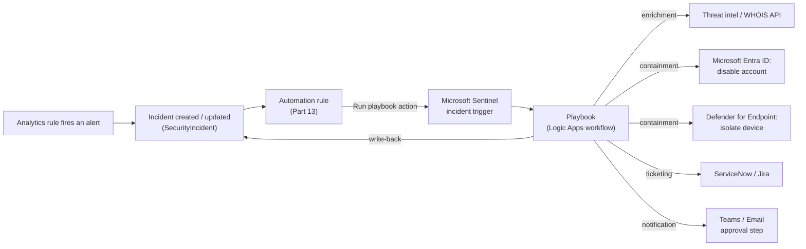

# Part 14 — Playbooks: Logic Apps–Based Response and Remediation

## Why this part exists

**[CONCEPT]** Part 13 covered automation rules — the ordered, incident-level layer that tags, assigns, and closes incidents, and that can invoke a playbook as one of its available actions. This part covers what actually happens once that invocation fires. A playbook is not a lightweight Sentinel setting the way an automation rule's "change severity" action is; it is a full Azure Logic Apps workflow, deployed as its own Azure resource, with its own trigger, its own connectors, its own execution history, its own throttling limits, and its own bill. Everything that makes Logic Apps a general-purpose integration platform — hundreds of connectors, conditional branching, human-approval steps, retry policies — is available to a Sentinel playbook, and everything that makes a general-purpose integration platform occasionally frustrating to operate (a connector authorized to a departed employee's account, a managed identity missing one specific API permission, a connector's own rate limit) is a Sentinel playbook's problem too. This part is about that second half: what a playbook actually is under the hood, the patterns that cover most real SOC response use cases, the specific permissions failure mode behind "the playbook ran but did nothing," and the cost and reliability profile that comes from being a real Azure resource rather than a Sentinel-native feature.

Two things this part does not do. It does not re-teach automation rules — see Part 13 for trigger types, ordering, and the Defender-portal behavior differences that apply there. And it does not walk through Logic Apps Workflow Definition Language syntax step by step; Microsoft's own Logic Apps documentation owns that in full, and this part cites it only where a Sentinel-specific detail sits on top of it.

---

## 1. What a playbook actually is

**[CONCEPT]** A playbook (an Azure Logic Apps workflow that Sentinel can trigger automatically from an automation rule or run manually against a selected alert, incident, or entity — not a Sentinel-native automation object the way an analytics rule or an automation rule is) is created and stored as an `Microsoft.Logic/workflows` resource in an Azure resource group, exactly like any Logic App built for a non-security integration scenario. Sentinel's Automation blade lists it under Active playbooks once it exists and carries the right trigger, but that listing is a view into the Logic App resource, not a separate copy of it. Opening a playbook from Sentinel's UI drops you into the same Logic Apps Designer (or code view) you'd use for any other Logic App, because it is the same product.

That has a direct, practical consequence covered by Microsoft's own Logic Apps documentation: a playbook is deployed on one of two hosting plans — **Consumption**, a fully serverless, per-execution-billed model with no dedicated compute to manage, or **Standard**, a dedicated-compute model (running on an App Service plan or in a container) that adds VNET integration, more predictable latency, and a flat compute cost regardless of how many times the workflow runs. Which plan a given playbook uses is a decision made once, at creation time, in the Logic Apps resource creation blade — not a Sentinel-specific toggle — and it shapes every later question in this part about cost and reliability (§6).

> **Engineering Reality**
> Sentinel does not give a playbook a dedicated monitoring surface, a dedicated SLA, or a dedicated support path distinct from Logic Apps' own. When a playbook misbehaves, the diagnostic trail — run history, per-action inputs/outputs, retry attempts, failure codes — lives in the Logic App resource's own **Overview → Runs history** blade in the Azure portal, not inside Sentinel's incident timeline. An analyst working an incident in Sentinel sees only that a "Run playbook" action was invoked and (depending on the automation rule's own logging) whether that invocation succeeded at the trigger level; whether every step *inside* the workflow actually completed is a separate question answered in a separate resource.






**Figure 14.1 — Playbook invocation and fan-out.** *CONCEPTUAL.* Illustrates the path from a fired analytics rule through an automation rule's "Run playbook" action into a Logic Apps workflow, and the workflow's typical fan-out to enrichment, containment, ticketing, and notification systems before writing a result back to the incident. This is a structural sketch of the mechanics described in §§1–4, not a capture of any deployed workflow's actual run graph.

---

## 2. Triggers: how a playbook starts

**[SENTINEL ENGINEER]** A Logic App built as a Sentinel playbook is distinguished from any other Logic App by which trigger sits at the top of its workflow. Microsoft documents three Sentinel-specific trigger types, and which one a given playbook uses determines what can invoke it and what data it receives.

### Microsoft Sentinel incident trigger

The current, recommended entry point for a playbook meant to be invoked from an automation rule. A workflow built on this trigger ("When Microsoft Sentinel incident creation rule is triggered" in the Logic Apps designer's trigger picker) receives the full incident object — its alerts, entities, tags, severity, and status — as its trigger payload, which is what lets a single playbook branch its logic on entity type or alert count rather than needing a separate workflow per analytics rule.

### Microsoft Sentinel alert trigger

An older trigger type, scoped to a single alert rather than the incident it belongs to. It predates automation rules' incident-level "Run playbook" action and is the trigger you'll still see on playbooks written before that feature existed. Microsoft's guidance is to build new playbooks on the incident trigger; an alert-triggered playbook can still be invoked manually against a specific alert but cannot be the target of an automation rule's incident-level action.

### Microsoft Sentinel entity trigger

Used for the "Run playbook" action available directly on an entity inside the investigation graph or entity page — an on-demand enrichment or lookup against one account, host, IP, or file hash, run by an analyst mid-investigation rather than fired automatically.

> **PRODUCT VERSION NOTE (as of 2026-09-15)**
> Microsoft's "Automate threat response with playbooks in Microsoft Sentinel" documentation is the authoritative source for which trigger types exist and which one automation rules can target — this is exactly the kind of platform-mechanics detail that has already changed once (the incident trigger was added after the alert trigger, specifically to support automation rules) and could change again. If you're building or auditing playbooks after this date, re-check that page for the current trigger list before assuming the two-trigger-plus-entity-trigger picture above is still complete.

**[SENTINEL ENGINEER]** A playbook can also be run manually from an incident or alert in the Azure portal by selecting "Run playbook" and choosing from the playbooks whose trigger type is compatible with what's selected. Manual run behavior for playbooks differs in some documented respects once a workspace is onboarded to the Microsoft Defender portal — Part 16 owns that migration-parity detail in full; this part flags only that the difference exists so a reader doesn't assume portal parity by default.

---

## 3. Invocation: automation rules versus a standing analytics rule action

**[SENTINEL ENGINEER]** Two things can start a playbook running against real incident data: an automation rule's "Run playbook" action (Part 13's ordered, incident-level orchestration layer — the action sits alongside tag/assign/close/status-change actions in the same rule, and the rule's own ordering determines whether the playbook runs before or after another action touches the same incident), or a manual "Run playbook" invocation from the portal. A playbook is never invoked directly by an analytics rule; the analytics rule creates the alert and incident, and everything downstream of that is automation-rule or manual-invocation territory.

Getting an automation rule to successfully invoke a playbook requires a permission grant that is easy to miss because it's separate from anything on the playbook itself: Sentinel's own service principal needs a role — documented as the **Microsoft Sentinel Automation Contributor** role — assigned on the resource group containing the target playbook, so that Sentinel's automation-rule engine is authorized to start someone else's Logic App on the incident's behalf. In practice, the Azure portal's automation-rule editor prompts for this grant the first time you add a "Run playbook" action pointing at a playbook in a resource group that hasn't been granted it yet, and accepting the prompt performs the role assignment for you. It is a separate concern from the managed-identity permissions covered in §5, which govern what the playbook can do once it's running, not whether it's allowed to start.

> **PRODUCT VERSION NOTE (as of 2026-09-15)**
> The exact built-in role name and the exact wording of the in-portal permission prompt are the kind of platform-mechanics detail Microsoft has renamed before during the Azure Sentinel–to–Microsoft Sentinel rebrand and could rename again. Verify the current role name against Microsoft's "Automate incident handling in Microsoft Sentinel with automation rules" documentation (the prerequisites section covering playbook permissions) before writing this into a runbook as a literal role name to search for in Azure RBAC.

---

## 4. Common playbook patterns

**[SENTINEL ENGINEER]** Most production playbooks fall into a small number of shapes, distinguished by what kind of connector call dominates the workflow and how reversible the resulting action is. The table below supports a design decision every new playbook forces: how much of this workflow can run fully automated, and where a human approval step belongs.

| Pattern | Typical trigger context | Representative connector / action | Operational note |
|---|---|---|---|
| Enrichment lookup | Alert or incident created | Threat-intelligence, WHOIS, or internal-API connector; generic `HTTP` action | Read-only against external state; the safest pattern to run fully automated |
| Ticket creation and sync | Incident created or updated | ServiceNow / Jira connector `Create record` action | Two-way status sync back into the incident usually needs a second, inbound-triggered playbook or a polling step, not one workflow |
| Notification and approval | High-severity incident created | Microsoft Teams / Outlook connector, adaptive card with a wait-for-response step | Human-in-the-loop by design; adds the latency discussed in §7 |
| User containment | High-confidence identity alert, usually automation-rule-driven | Microsoft Entra ID connector — disable account / revoke sign-in sessions action | Needs a Microsoft Graph API permission grant on the playbook's own managed identity, separate from any Sentinel role (§5) |
| Host containment | Endpoint alert, usually automation-rule-driven | Microsoft Defender for Endpoint connector — isolate device action | Needs a Defender for Endpoint API permission scope on the managed identity, entirely separate from both Sentinel RBAC and the Entra ID permission above |
| Network containment | Automation rule or manual, often paired with an approval step | Network Security Group / firewall connector — update or block-rule action | Often the least reversible action in this table; §7 covers why that argues for keeping a human in this specific loop |

**[SENTINEL ENGINEER]** An enrichment playbook occasionally needs to run a query against the workspace itself rather than call an external API — pulling recent sign-in activity for an account before deciding whether to contain it, for example. The connector for this is Azure Monitor Logs, and its "Run query and list results" action takes a literal KQL query as one of its inputs:

```kql
// CONCEPTUAL SAMPLE — illustrative enrichment fragment inside a playbook's
// Azure Monitor Logs connector action, not a freestanding detection query.
// Syntax fundamentals (where/join/summarize, time-window functions) are
// DEH Part 25's and DEH Part 23's territory, not re-taught here.
SigninLogs
| where TimeGenerated > ago(1h)
| where UserPrincipalName == "{account from trigger payload}"
| project TimeGenerated, IPAddress, AppDisplayName, ResultType
```

The query body itself is ordinary KQL — for the pipe model, join strategy, and time-window function choices behind a query like this, see DEH Part 25 (KQL for Sentinel/Defender) and DEH Part 23 (Query Language Strategy) rather than expecting this book to re-derive syntax it already covers. What's Sentinel-specific here is only the connector action wrapping it and the fact that its output becomes an input to a later step in the same workflow (a condition, a notification, a containment action) — that wiring is Logic Apps mechanics, not KQL.

---

## 5. Managed identities and the permissions problem behind "the playbook ran but did nothing"

### Managed identity versus a delegated user connection

**[SENTINEL ENGINEER]** Every connector a playbook uses — including the Microsoft Sentinel connector supplying its own trigger — needs an authenticated connection to whatever it's calling. Historically, the default way to authorize the Microsoft Sentinel connector was a delegated connection tied to whichever analyst's account happened to be signed in when the connection was created. Microsoft's current guidance favors authorizing the connector with the Logic App's own **system-assigned managed identity** instead, specifically because a managed identity's authorization doesn't depend on any one human's account staying enabled, licensed, and password-current. The tradeoff a managed identity introduces in exchange is that it needs its own, explicit role or API-permission grants for everything it's going to do — it doesn't inherit whatever access the analyst who built the workflow happened to have.

> **Detection Autopsy — the naive "add the analytics rule, add the containment step, ship it" playbook**
>
> **The rule:** On a high-confidence identity alert, an automation rule runs a playbook that calls the Defender for Endpoint connector's isolate-device action against the alert's host entity, then posts a Teams notification confirming isolation.
>
> **Why it shipped:** The workflow's own run history in the Logic Apps designer showed a green checkmark on every test run during build — the trigger fired, the Teams notification posted, and nothing in the designer's default view flagged a problem. It looked done.
>
> **How it failed:** The playbook's managed identity had been granted the Sentinel-side role needed to read the incident and post a comment back to it, but no one had separately granted it the Defender for Endpoint API permission scope the isolate-device action actually requires. The isolate-device action returned a permission-denied response, the workflow's default error handling caught that failure and continued to the next step anyway, and the Teams notification — which only confirmed that the *workflow* completed, not that isolation *succeeded* — posted exactly as designed. The host stayed fully connected through an incident everyone believed had been contained.
>
> **The fix:** Grant the specific Defender for Endpoint API permission scope to the managed identity directly (a Microsoft Entra ID application-permission grant, not a Sentinel role, and not something the Sentinel-side "grant permissions" prompt in §3 covers), and change the Teams step to fire only after checking the isolate-device action's actual response code — a condition step, not a fixed sequence — so a failed containment action produces a failure notification instead of a success one.

**[SENTINEL ENGINEER]** The general shape of that failure — a workflow that completes without error while one specific action inside it silently didn't do what it looked like it did — is the single most common reason a playbook "ran but did nothing" in practice. It is almost never a Sentinel-side problem once the automation rule has confirmed the playbook was invoked at all; it is a downstream connector's own authorization boundary, checked (or not checked) once per action, independently of every other action in the same workflow.

> **Engineering Reality**
> Individual connector actions (Defender for Endpoint's isolate-device action, Microsoft Entra ID's disable-account action, a third-party firewall connector's block-rule action) are each maintained and versioned by their own connector team, on their own release cadence, independent of Sentinel's. An action's required permission scope, its exact input schema, or its very existence in the connector's action list can change without a Sentinel-specific deprecation notice, because from the connector's point of view it isn't a Sentinel feature — it's one action among the connector's full catalog. Treat every containment action in a production playbook as something to re-validate against the connector's current documentation on a schedule, not as a fact fixed at build time.

---

## 6. Cost and reliability: inheriting a full Azure resource's profile

**[ENGINEERING]** A playbook on the Consumption plan is billed per action execution — every step in the workflow that actually runs on a given trigger, not just the trigger firing itself, counts toward the bill. A short enrichment workflow with three or four steps is inexpensive at almost any incident volume; a longer containment-and-notification workflow with conditional branches, a wait-for-approval step, and several connector calls costs more per run, and that cost scales linearly with how many incidents actually invoke it. A playbook on the Standard plan instead pays for its underlying compute (an App Service plan or container) at a flat rate regardless of how many times it runs that month, which changes the economics in the opposite direction — cheap at very high volume, and a fixed cost you pay even on a quiet month.

> **SOC Management View**
> The Consumption-versus-Standard choice is a capacity-planning question before it's a technical one: a small number of high-volume, latency-sensitive containment playbooks running against a busy Defender for Endpoint or Microsoft Entra ID tenant are the case for Standard's flat, predictable compute cost and VNET-integration option; a larger number of low-volume, occasionally-run enrichment or ticketing playbooks are the case for Consumption's pay-only-for-what-runs model. Mixing both plans across a playbook library is normal and often the cheaper overall outcome — it isn't an either/or decision made once for the whole automation program.

> **PRODUCT VERSION NOTE (as of 2026-09-15)**
> Per-action Consumption pricing and Standard plan compute pricing are both published on Azure's own Logic Apps pricing page and change on Azure's general pricing-update cadence, independent of anything Sentinel-specific. This book does not quote a per-action dollar figure or a free-tier action count here because either would likely be stale by the time this is read — check the current Azure Logic Apps pricing page directly before budgeting a playbook library, and re-check it again before assuming a cost model built a year earlier still holds.

**[ENGINEERING]** Reliability follows the same inherited-resource logic as cost. A Logic Apps workflow has a default retry policy on most connector actions — a fixed number of retries on a fixed or exponential interval before an action is marked failed — and a connector-specific throttling limit that governs how many calls per minute or per hour that connector's API will accept before returning a throttling error rather than executing the call. Neither of these is a Sentinel setting; both live on the action and the connector respectively, and both apply identically whether the workflow is a Sentinel playbook or an unrelated business-process Logic App. A containment playbook invoked simultaneously across a batch of incidents during a genuinely bad day can hit a connector's own rate limit purely from the volume of near-simultaneous calls, producing queued or retried — not failed outright, but delayed — actions at exactly the moment speed matters most.

Diagnosing any of this happens in the Logic App resource's own run history, per §1's Engineering Reality box — not in Sentinel's incident timeline. Part 18 covers the `SentinelHealth` table as a queryable audit surface for rule and connector health inside the workspace itself; automation-rule and playbook invocation events are among the record types that surface there, which makes `SentinelHealth` a useful first stop for "did this even get invoked," but it does not substitute for the Logic App's own run history when the question is "why did this specific action inside the workflow fail."

---

## 7. What a containment playbook is actually racing against

**[SENTINEL ENGINEER]** A detection-to-containment playbook exists to shorten the window between an analytics rule firing and an attacker losing the access that triggered it. DEH Part 44 (Adversary Behaviour for Defenders) walks the ATT&CK tactic sequence a real intrusion runs through, including how quickly an adversary already inside a network moves from one compromised identity to the next — T1078 (Valid Accounts) reused across hosts, T1021 (Remote Services) for the lateral hop itself. Every wait-for-approval step, every notification-before-action design choice, and every connector retry interval a playbook design adds is time added to that same window, on the defender's side, while the attacker's side of the clock keeps running regardless of how the playbook is built.

That isn't an argument for removing every human checkpoint from every containment playbook — §4's table already flagged network containment as often the least reversible action in a typical playbook library, and an automated firewall rule change that turns out to be wrong (a false positive disabling a production service, not just a user account) has its own cost. It's an argument for making the automation-versus-approval choice deliberately, action by action, rather than defaulting either to full automation everywhere or an approval step on everything because that feels safer.

> **What Would Change My Mind**
> This part treats "keep a human approval step on the least-reversible containment actions (network and production-account changes) and fully automate the cheaply-reversible ones (session revocation, device isolation)" as a reasonable default split. If an organization's own incident data showed that its actual mean time from alert to human approval consistently exceeded the attacker's own observed dwell time before lateral movement on the technique the playbook targets, the right conclusion would flip specifically for that technique — the approval step would be costing more in exposure window than it's saving in avoided false-positive containment, and the case for full automation on that one playbook would get stronger, not the reverse.

> **False Positive Trap**
> An automation rule configured to run a playbook on incident *update*, not just incident *create*, re-invokes that playbook every time a matching field changes — including an analyst adding an investigation comment, changing severity during triage, or a correlation engine merging in a new alert. A containment playbook wired to that trigger condition can re-isolate an already-isolated host or re-disable an already-disabled account on every one of those updates, which is harmless against the host itself but produces a burst of duplicate helpdesk tickets and Teams notifications that reads as "the playbook is broken" when the actual problem is the trigger condition. Scope the automation rule's trigger to incident creation (or a specific, narrow update condition) for any playbook whose action isn't idempotent, and note the idempotence question explicitly in the playbook's own documentation rather than assuming the next person configuring the automation rule will re-derive it.

---

## Cross-references

**Cross-references:** DEH Part 44 (Adversary Behaviour for Defenders — the tactic sequence and dwell-time behavior a containment playbook is racing against, §7); DEH Part 25 (KQL for Sentinel/Defender — syntax for any query a playbook's Azure Monitor Logs action runs, §4); DEH Part 23 (Query Language Strategy — the general translation-cost framing behind that same query); Part 13 (Automation Rules: Incident-Level Orchestration — the layer that invokes a playbook and the permission grant covered in §3); Part 16 (Operating the Unified Security Operations Platform — the Defender-portal manual-run difference flagged in §2); Part 18 (Sentinel-Specific Tuning, Health Monitoring, and Troubleshooting — the `SentinelHealth` table referenced in §6).
