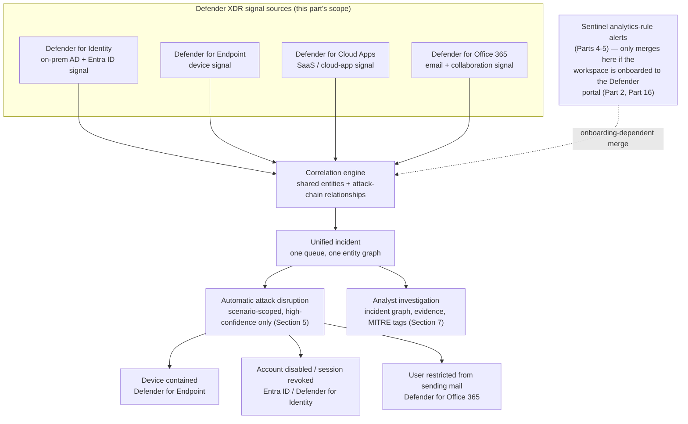

# Part 15 — Defender XDR Signal Convergence: Identity, Endpoint, Cloud Apps, and Email in One Incident

## Why this part exists

Parts 4 through 6 treat a Sentinel analytics rule's alert and the incident it produces as if they existed in a room by themselves — one query, one `SecurityIncident` row, one entity graph built from that rule's own entity mapping. That framing is correct as far as it goes, and it is also incomplete for almost any organization actually running Microsoft Sentinel today, because a Sentinel workspace rarely operates alone. Most production deployments sit next to at least one, and usually several, of Microsoft's other Defender workloads — Microsoft Defender for Identity, Microsoft Defender for Endpoint, Microsoft Defender for Cloud Apps, and Microsoft Defender for Office 365 — each generating its own alerts from its own signal, on its own detection logic, that this book's earlier parts never touch. Microsoft Defender XDR (the platform-wide correlation and incident layer that used to be branded Microsoft 365 Defender) is where those alerts, plus a Sentinel workspace's own analytics-rule alerts once that workspace is onboarded to the Microsoft Defender portal, stop being four or five separate stories and become one incident.

That convergence is a genuine operational payoff — an account takeover that started with a phishing email, moved through a cloud-app session, and ended with a device compromise shows up as one connected narrative instead of four unrelated alerts an analyst has to notice were related on their own. It is also a real investigative tradeoff, because the per-product incident boundary each workload used to draw around "its" alerts mostly disappears once everything lands in one queue, and knowing where a specific piece of evidence actually originated takes deliberate digging that a single-product console never required. This part covers both halves honestly: what actually correlates, what automatic attack disruption does with that correlation, and what an analyst gives up — and has to compensate for — once four products' alerts stop having their own separate front doors.

**MITRE:** T1078 (Valid Accounts) is the technique most of this part's worked scenarios return to, because a converged incident's most common shape is a single valid-looking credential moving across identity, endpoint, cloud-app, and email surfaces in turn — exactly the kind of multi-surface movement a single-product alert queue is structurally poor at telling one connected story about.

## 1. Microsoft Defender XDR: what it correlates, and what feeds it

**[CONCEPT]** Microsoft Defender XDR is Microsoft's cross-product detection, correlation, and incident layer, operated from the Microsoft Defender portal (the same portal Part 2 and Part 16 already establish as Sentinel's newer, converged operating surface — expanded here in full on first mention per this book's notation convention, "the Defender portal" as the acceptable short form afterward). It does not generate its own primary telemetry the way an analytics rule or an EDR sensor does. It ingests alerts already produced by Microsoft's individual Defender workloads and a connected Sentinel workspace's own analytics rules, and it runs a correlation layer on top of that combined alert stream to decide which alerts belong to the same underlying incident.

This part's scope — per this book's own Part Table — is the four workloads named in the part's title: Defender for Identity, Defender for Endpoint, Defender for Cloud Apps, and Defender for Office 365. Microsoft Defender XDR also correlates signal from Microsoft Entra ID Protection and Microsoft Defender for Cloud in a full deployment; this part doesn't cover those two in depth, both because the part's own scope is bounded and because Entra ID Protection's risk-signal role overlaps closely with the identity material Part 6 (entity mapping) and DEH Part 46 (Identity Compromise Model) already cover from adjacent angles.

> **Engineering Reality**
> Correlation only spans what's actually licensed and connected. A tenant with Defender for Endpoint and Defender for Office 365 active but no Defender for Identity license simply has no identity-workload alerts to correlate — Defender XDR doesn't synthesize a workload's signal from nothing, and an incident that "should" include an identity alert on the strength of the attack story alone won't, if that workload was never in the picture to begin with. Before treating a converged incident's silence on one signal type as reassuring, confirm the relevant workload is actually licensed, connected, and healthy — not just absent from this particular incident.

## 2. The four signal sources this part covers

**[CONCEPT]** Each of the four workloads below produces its own alerts from its own detection logic running against its own telemetry. What Defender XDR adds is not more detection logic of its own — it's the correlation step described in §3. The table after the four short descriptions is a decision aid for knowing which workload's evidence to go look at first, not a substitute for each product's own documentation.

### Defender for Identity — on-premises Active Directory and Entra ID signal

Defender for Identity monitors identity infrastructure through sensors deployed on domain controllers and, for federated environments, Active Directory Federation Services (AD FS) servers, correlating that on-premises signal with Entra ID sign-in and directory activity for hybrid identity environments. Its detections center on the kind of identity-attack techniques a network-layer or endpoint sensor structurally can't see well — reconnaissance against Active Directory (enumeration, directory-service queries at unusual volume), lateral-movement patterns that abuse legitimate authentication protocols, and privilege-escalation paths through group membership and delegation.

### Defender for Endpoint — device signal

Defender for Endpoint is Microsoft's EDR product: an agent-based sensor running on the device itself, producing process, file, network-connection, and behavioral telemetry, and the workload most likely to be already familiar to a reader coming from a general SOC background. Its alerts anchor to the Device entity, and its device timeline is the deepest per-asset investigation surface among the four workloads this part covers.

### Defender for Cloud Apps — SaaS and cloud-app signal

Defender for Cloud Apps (a Cloud Access Security Broker, or CASB, in Microsoft's own product category language) sees activity inside sanctioned SaaS applications through API connectors, session-level control through Conditional Access App Control, and shadow-IT discovery through firewall and proxy log ingestion. Its detections center on anomalous in-app activity — impossible-travel sign-ins, mass-download or mass-share events, risky OAuth app grants — that neither an endpoint agent nor an identity sensor observes directly, because the activity in question happens entirely inside the SaaS application's own session.

### Defender for Office 365 — email and collaboration signal

Defender for Office 365 inspects email and collaboration content directly — messages, attachments, and embedded URLs, evaluated both at time of delivery (Safe Links and Safe Attachments detonation) and after delivery, where a message judged benign at delivery time can still be pulled back from a mailbox (zero-hour auto purge) if later intelligence reclassifies it. Threat Explorer remains the deep, email-specific investigation surface for this workload even after an alert has already surfaced in a converged incident.

| Workload | Primary signal | Typical entity anchor | Portal note |
|---|---|---|---|
| `Defender for Identity` | Domain-controller and AD FS sensor telemetry, correlated with Entra ID sign-in/directory activity | Account, Device (domain controller) | Alerts and investigation surface in the Defender portal; sensor health and directory service account configuration use their own settings pages |
| `Defender for Endpoint` | Process, file, network, and behavioral sensor data from onboarded devices | Device | Alerts and the Device timeline live in the Defender portal |
| `Defender for Cloud Apps` | API-connected SaaS activity, session-control signal, discovery-log-derived shadow-IT signal | Account, Cloud app, IP address | Alerts flow into the Defender portal; app-connector and policy configuration largely stays in Defender for Cloud Apps's own administrative surface |
| `Defender for Office 365` | Email and collaboration content — messages, attachments, URLs, post-delivery re-classification | Mailbox/Account, URL, File | Alerts flow into the Defender portal; Threat Explorer remains the deep email-specific investigation tool |

## 3. How alerts become one incident: the correlation engine

**[ENGINEERING]** Defender XDR's correlation logic groups alerts into a single incident based on shared entities (the same account, device, mailbox, IP address, or cloud app appearing across two or more alerts) and known attack-chain relationships between the techniques those alerts represent, rather than on time proximity alone. Two alerts about the same user account — one an anomalous sign-in flagged by Defender for Identity, one a mass-download flagged by Defender for Cloud Apps twenty minutes later — correlate into one incident because they share the Account entity and fit a plausible sequential attack pattern, not merely because they happened close together in time.

The unified evidence backing this correlation is queryable directly: Microsoft's advanced hunting schema in the Defender portal includes `AlertInfo` and `AlertEvidence` as cross-product tables — `AlertInfo` carrying one row per alert regardless of which workload generated it, `AlertEvidence` carrying the entities and artifacts tied to each alert — so a hunt or a workbook built against these two tables sees every workload's alerts through one consistent schema rather than four product-specific alert formats. Each workload also contributes its own detailed event tables to the same advanced hunting surface — `IdentityLogonEvents` and `IdentityDirectoryEvents` for Defender for Identity, `DeviceEvents`/`DeviceProcessEvents`/`DeviceNetworkEvents` for Defender for Endpoint, `CloudAppEvents` for Defender for Cloud Apps, and `EmailEvents`/`EmailAttachmentInfo`/`EmailUrlInfo` for Defender for Office 365 — which is what makes a cross-product hunt (§8) possible without four separate query languages.

The incident itself carries a generated name and a visual attack-chain representation intended to summarize the correlated story rather than list alerts in arrival order. Exactly how that graph view is labeled and laid out in the current portal has shifted across recent UI updates; treat the existence of an incident-level attack-chain visualization as stable and its exact current tab name and layout as something to confirm against the live portal rather than something this part pins down permanently.






**Figure 15.1 — From four workloads' alerts to one Defender XDR incident.** *CONCEPTUAL.* Illustrates how alerts from the four workloads this part covers, plus Sentinel's own analytics-rule alerts when the workspace is onboarded to the Defender portal, feed a shared correlation engine that groups them into one incident by entity and attack-chain relationship, and how that incident in turn feeds both an automated-disruption path and the ordinary analyst-investigation path. This is a structural sketch built from this part's own reading of Microsoft's Defender XDR incident and correlation documentation — not a capture of any Defender portal screen, and not a reproduction of an official Microsoft architecture diagram.

## 4. Sentinel's own alerts joining the same queue

**[ENGINEERING]** Everything in §3 describes correlation among the four Defender workloads on their own. A Sentinel workspace's analytics-rule alerts join that same correlation engine and the same unified incident queue only once the workspace is onboarded to the unified security operations platform in the Defender portal — the specific mechanics and the retirement timeline driving that onboarding decision belong to Part 2 and get their full program-management treatment in Part 16, and this part assumes that context rather than re-deriving it. Before onboarding, a Sentinel workspace's incidents and a Defender XDR tenant's incidents are two separate queues that an analyst has to check independently; after onboarding, they're the same queue, and a Sentinel analytics rule's alert can correlate into an incident alongside a Defender for Identity or Defender for Cloud Apps alert on exactly the same shared-entity basis described in §3.

This matters for this part specifically because it changes what "a converged incident" can contain. A workspace not yet onboarded to the Defender portal can still see Defender XDR incidents that correlate across the four workloads this part covers — that correlation doesn't depend on Sentinel at all — but it won't see a Sentinel analytics-rule alert folded into one of those incidents until onboarding happens. Part 13's own documented hazard list (incident-provider condition collapsing to one value, `SecurityIncident.Description` behaving differently, incident-title instability from the correlation engine) is the automation-facing version of this same onboarding-dependent change; this part's version of the same fact is investigative rather than automation-facing — an analyst reading a converged incident needs to know whether the workspace they're looking at even can show a Sentinel alert in that incident before concluding one's absence means anything.

## 5. Automatic attack disruption — scenario-scoped automated containment

**[SENTINEL ENGINEER]** Automatic attack disruption is Defender XDR's capability for taking a containment action automatically, mid-attack, based on a high-confidence correlated signal rather than waiting for an analyst to act on an incident. It is the clearest payoff of the convergence this part describes: because the correlation engine already has the entity graph connecting an identity signal to a device to a mailbox, a disruption action can reach across workloads — isolating a device through Defender for Endpoint, disabling or suspending an account through Entra ID and Defender for Identity, or restricting a user's ability to send mail through Defender for Office 365 — in response to a single correlated incident, without requiring an analyst to separately open three product consoles and take three separate actions.

Microsoft documents automatic attack disruption as scoped to specific attack scenarios where the platform's confidence in the correlated signal is high enough to act without human review first, rather than as a general-purpose "contain anything Defender XDR sees" switch. As of this writing, the scenarios Microsoft's own attack-disruption documentation names most consistently are human-operated ransomware, business email compromise (BEC), and adversary-in-the-middle (AiTM) phishing — T1557 (Adversary-in-the-Middle) — each chosen because the attack pattern is well-characterized enough for high-confidence automated action, and because the cost of acting a few minutes late (ransomware detonation, a BEC wire-transfer instruction, a stolen session token being used) is severe enough to justify acting before an analyst has looked at the incident at all.

| Attack scenario (as Microsoft documents it) | Example automated containment action | Workload enacting the action |
|---|---|---|
| Human-operated ransomware | Device isolated from the network | Defender for Endpoint |
| Business email compromise (BEC) | Compromised user's ability to send mail restricted | Defender for Office 365 |
| Adversary-in-the-middle (AiTM) phishing | Compromised account disabled / session revoked | Entra ID / Defender for Identity |

> **PRODUCT VERSION NOTE (as of 2026-09-15)**
> Microsoft's automatic attack disruption capability is documented on Microsoft Learn's "Automatic attack disruption in Microsoft Defender XDR" page as scoped to a specific, named set of attack scenarios rather than general-purpose automated response, and that scenario list has grown since the capability's initial release. This part names ransomware, BEC, and AiTM phishing as the scenarios most consistently documented as of this writing; treat the exact current scenario list, the licensing prerequisites for each scenario, and the specific containment actions available per workload as subject to change, and re-check the current Learn page rather than treating this table as a permanent inventory. If the current list has grown or the licensing prerequisites have changed since this date, this table's scope — not its underlying mechanism — is what's out of date.

> **Blind Spot**
> Automatic attack disruption acting on an incident is not the same thing as an incident being handled. The capability is scenario-scoped by design (the table above), which means the majority of incidents in a typical converged queue — anything that isn't a high-confidence ransomware, BEC, or AiTM match — receive no automated action at all and still need an analyst to triage and respond manually. Reading a quiet incident queue as "disruption is handling things" without checking whether disruption actually fired on anything is a program-level version of the UEBA blind spot Part 11 §1 already names for a different feature: a capability being enabled and available is not evidence that it acted on the incident in front of you.

**[ANALYST]** An automated containment action is reversible and visible in the incident record — Defender XDR logs the specific action taken, when, and on what entity, and provides a way to undo an action an analyst determines was a false-positive-driven overreach (a legitimate but unusual admin sign-in pattern misclassified as AiTM, for instance). Treat a disruption action the same way you'd treat any other automated response in this book — Part 13 and Part 14's own automation-rule and playbook guidance applies here just as much as it does to a Sentinel-native automation path — verify the action fired for the reason the incident record claims, not just that something happened.

## 6. The investigative tradeoff: what a unified incident costs you

**[ANALYST]** The payoff described in §5 has a corresponding cost, and this part's own title exists specifically to name it rather than let it pass unstated: once alerts from four separate workloads stop having their own separate incident boundary, an analyst loses the built-in cue that used to say "this alert belongs to the email team's investigation, that one belongs to the endpoint team's." A converged incident's entity graph and attack-chain narrative are genuinely useful for seeing the whole story, but they don't automatically tell you which workload's detection logic actually judged which piece of evidence suspicious, or which product's own console has the deepest tooling for investigating that specific piece of evidence further.

In practice, that means an analyst working a converged incident still needs to open the alert-level detail — not just the incident-level summary — to find out which workload generated a given alert, and often still needs to pivot into that workload's own deeper investigation surface (Threat Explorer for an Office 365 email judgment, the Device timeline for an Endpoint process chain, Defender for Cloud Apps's own activity log for a cloud-app session) to get the level of product-specific context the unified incident view deliberately doesn't try to replicate. Some workloads also retain a genuinely separate administrative surface outside the Defender portal for configuration — Defender for Cloud Apps's own policy and app-connector administration is the clearest example among the four workloads this part covers — which means "everything about this workload is now in the Defender portal" is true for investigation and mostly untrue for configuration, a distinction worth confirming directly rather than assuming from the incident queue's own unified appearance.

> **Blind Spot**
> A converged incident's entity graph shows what correlated, not everything that happened. An alert that never fired — because a detection's threshold wasn't met, because a workload wasn't licensed (§1's Engineering Reality), or because the relevant telemetry simply wasn't collected — leaves no gap in the graph for an analyst to notice, because there's nothing there to notice. The unified incident view is strong evidence of what Defender XDR judged connected; it is not evidence that nothing else relevant happened across the four workloads, and DEH Part 44's own framing of adversary behavior spanning multiple kill-chain stages is worth re-reading here as a reminder that a real attack chain is frequently wider than what any one incident's correlated alert set captures.

> **What Would Change My Mind**
> This part treats the convergence described above as a net positive for investigative speed and automated-response reach, worth the per-product-boundary cost given deliberate compensating habits (opening alert-level detail, pivoting into a workload's own console when its evidence needs deeper scrutiny). If Microsoft's own incident view stopped surfacing which workload generated a given alert clearly enough for an analyst to find it without cross-referencing multiple screens, or if correlation false-positives (two alerts sharing an entity by coincidence rather than by genuine attack relationship — a shared service account touching unrelated systems, for instance) became common enough to regularly produce misleadingly broad incidents, that tradeoff would need re-evaluating: a queue that's faster to open but slower to actually resolve correctly is a worse trade than four separate, narrower queues.

## 7. Reading a converged incident as an analyst

**[ANALYST]** A practical triage sequence for a converged incident, building on the alert-level-detail habit §6 already names: start with the incident's overall severity and the entity list (which accounts, devices, mailboxes, and cloud apps are actually involved), then work through the individual alerts in roughly chronological order rather than reading the attack-chain summary as a substitute for that walk-through. For each alert, confirm which workload generated it and what that workload's own detection logic actually claims — a Defender for Identity alert flagging a lateral-movement pattern and a Defender for Cloud Apps alert flagging a mass-download are both "suspicious," but they're suspicious for entirely different reasons that a shared incident summary can flatten into sounding more similar than they are.

MITRE ATT&CK tags attached at the alert level are the fastest way to see which stage of an attack chain each correlated alert represents without re-deriving it from the raw evidence — a converged incident spanning initial access through impact typically carries a spread of technique tags across its constituent alerts rather than one, and that spread is itself useful triage signal: an incident with only early-stage tags (initial access, reconnaissance) is a different priority than one whose tags already include impact-stage techniques like T1486 (Data Encrypted for Impact).

**[ANALYST]** Watchlist context (Part 10) and UEBA entity enrichment (Part 11) both remain relevant inside a converged incident exactly as they would inside a Sentinel-only one — a device or account flagged high-value on a watchlist, or carrying a high investigation priority score from `BehaviorAnalytics`, is worth weighting more heavily regardless of which workload's alert brought that entity into the incident in the first place. Neither piece of context is workload-specific; both apply to any entity the incident's graph surfaces.

## 8. Hunting across the converged signal set

**[THREAT HUNTER]** The join-strategy and syntax fundamentals for a cross-table hunt — `join`, `summarize`, time-window functions — are DEH Part 25's scope, not this book's; what follows illustrates only the Sentinel/Defender-specific extension DEH Part 25 doesn't cover, joining the cross-product `AlertEvidence` table against a workload-specific event table. The fragment below is illustrative of the join shape, not a complete, deployable hunt — see DEH Part 25 for join-strategy and performance guidance that applies to any join like this at production data volume.

```kql
// CONCEPTUAL SAMPLE — illustrative cross-workload evidence join fragment, not a complete query
AlertEvidence
| where EntityType == "MailboxConfiguration" or EntityType == "Mailbox"
| join kind=inner (
    EmailEvents
    | where ThreatTypes has "Phish"
) on $left.RecipientObjectId == $right.RecipientObjectId
| project AlertId, Title, Timestamp, SenderFromAddress, ThreatTypes
```

A hunt built on this shape answers a specific question a converged incident's own summary doesn't directly surface: given an alert already correlated into an incident on the strength of a mailbox entity, what other phishing-flagged mail activity touched that same mailbox that didn't itself rise to alert severity. That's the same "look beyond what already correlated" discipline §6's Blind Spot names, made queryable rather than left as a general caution — a hunt against `AlertEvidence` alongside a workload-specific table is one concrete way to check for exactly the kind of relevant-but-uncorrelated activity a converged incident's own graph has no obligation to show.

## 9. Program and licensing considerations

**[SOC MANAGEMENT]** Convergence is a licensing story as much as a platform-mechanics one. Each of the four workloads this part covers is its own licensed product (typically bundled within Microsoft 365 E5 or available as a standalone add-on — Defender for Endpoint Plan 2, Defender for Identity, Defender for Cloud Apps, Defender for Office 365 Plan 2, in Microsoft's current naming), and a converged incident can only correlate across the workloads a given tenant has actually licensed and connected. A SOC evaluating why an incident "should have" included a workload's evidence and didn't needs to check the licensing and connection status of that workload before treating the gap as a correlation-engine failure — the same Engineering Reality point from §1, restated here as a program-management checklist item rather than a mechanics fact.

Automatic attack disruption (§5) carries its own licensing dependencies per scenario, tied to which workloads a given disruption action needs to be able to reach — a disruption action that restricts mail sending needs Defender for Office 365 licensed and connected; one that isolates a device needs Defender for Endpoint. A partial-workload deployment gets partial disruption coverage, scoped to whichever actions the licensed and connected workloads can actually perform, which is a genuinely different, more limited capability than a full four-workload deployment and worth stating plainly to a director who read about attack disruption as a single feature rather than a capability that scales with licensing breadth.

> **PRODUCT VERSION NOTE (as of 2026-09-15)**
> The plan/SKU names used above — Defender for Endpoint Plan 2, Defender for Office 365 Plan 2, and Microsoft 365 E5 bundling — reflect Microsoft's licensing documentation as of this writing. Microsoft has renamed and re-bundled Defender licensing tiers before, and Defender for Cloud Apps and Defender for Identity have each been sold under prior product names. Before using this section to answer a director's or procurement team's question, re-check the current licensing page rather than treating these SKU names as permanent — the underlying point (correlation and disruption scope are bounded by what's licensed and connected) is stable even when the specific plan names aren't.

> **SOC Management View**
> The staffing implication of this part's whole subject is real and worth naming directly: an analyst trained only on Sentinel-native incidents, or only on one Defender workload's own console, is under-prepared for a converged incident that spans four workloads' worth of detection logic and evidence formats. The training investment this part implies isn't "learn a fifth product" — it's learning to read one incident's evidence as coming from four different detection engines with four different confidence models, and knowing which workload's own deeper console to pivot into when the unified view's summary isn't enough (§6). Budgeting analyst ramp-up time for that skill, not just for the tools themselves, is the practical program cost of the convergence this part describes.

## 10. Putting it together

**[CONCEPT]** Defender XDR's convergence of identity, endpoint, cloud-app, and email signal — and, once a workspace is onboarded to the Defender portal, Sentinel's own analytics-rule alerts alongside them — turns what used to be four or five separately-triaged alert streams into one incident with one entity graph and, for a scoped set of high-confidence attack scenarios, one automated containment response reaching across all of them. That's a genuine capability gain over the pre-convergence world, and the automatic attack disruption scenarios in §5 are the sharpest illustration of what shared correlation actually buys a SOC that a single-product alert queue structurally couldn't.

It is not, however, a reason to stop asking which workload generated a specific piece of evidence, or to assume a quiet incident means disruption handled it, or to assume a converged incident's graph is a complete account of everything relevant that happened across four workloads' worth of telemetry. This part's honest position is the same one DEH Part 44 takes about adversary behavior generally: an attack chain spanning multiple domains is genuinely easier to see as one story once the platform correlates it for you, and that ease is exactly why it still needs the same skepticism, evidence-tracing discipline, and awareness of what the correlation engine didn't include that a single-alert investigation always required — just applied at incident scope instead of alert scope.

**Cross-references:** DEH Part 44 (Adversary Behaviour for Defenders — the multi-domain attack-chain framing this part's converged incidents make visible as one story); DEH Part 46 (Identity Compromise Model — the identity-specific compromise reasoning behind Defender for Identity's and Entra ID's contribution to a converged incident); DEH Part 18 (Cloud Identity & SaaS Detection Engineering — the detection logic underneath Defender for Cloud Apps's contribution to this part's signal set); DEH Part 25 (KQL syntax fundamentals underlying the §8 hunting fragment); Part 2 (Log Analytics Workspace Architecture and the Two Portals — the Defender-portal onboarding step this part's §4 depends on); Part 6 (Entity Mapping and the Incident Model — the entity-key mechanics the correlation engine in §3 depends on at Sentinel's own layer); Part 10 (Watchlists and Reference Data); Part 11 (UEBA — the entity-enrichment context §7 draws on); Part 13 (Automation Rules — the onboarding-dependent behavior changes this part's §4 parallels from an automation angle); Part 16 (Operating the Unified Security Operations Platform — the full migration and parity-gap treatment this part's portal dependency assumes).
