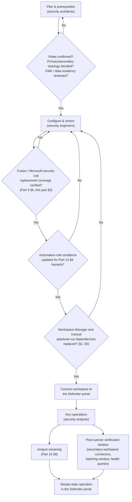

# Part 16 — Operating the Unified Security Operations Platform: Migration and Parity Gaps

## Why this part exists

**[CONCEPT]** Part 2 established the fact this whole book now operates against: the Azure portal (never bare "Azure" when the portal is meant, per this book's own notation convention) and the Microsoft Defender portal are, as of this writing, the two surfaces for operating Microsoft Sentinel, and the Azure portal carries a published retirement date — March 31, 2027 — that sits inside this book's own planning horizon. Part 5 turned that fact into a specific detection-content hazard: Fusion (Advanced multistage attack detection — single instance, hidden correlation logic, unavailable once Defender XDR incident integration is on or the workspace is onboarded to the Defender portal) and Microsoft security rules (rules that automatically create Microsoft Sentinel incidents from alerts generated in other Microsoft security solutions, in real time) both stop existing the moment either condition is true, silently, whether or not anyone planned for it. Part 13 turned the same fact into an automation-rule hazard list — provider-condition collapse, `SecurityIncident.Description` disappearing, incident-title instability, a documented 5–10 minute batching window that drops intermediate incident updates outright. Part 15 turned it into an investigative one — a unified incident queue that correlates more but tells an analyst less about which product generated which piece of evidence.

**[CONCEPT]** None of those four parts is wrong to stop where it stops. Each one owns a specific layer — workspace architecture, analytics-rule availability, automation-rule behavior, cross-product investigation — and each one correctly treats the Defender-portal transition as a fact that layer has to account for, not a project that layer has to run. This part is where the running happens. Three questions carry the rest of this chapter: what changes operationally, on Defender-portal onboarding, that the four parts above don't already own (administration surfaces that relocate, or conspicuously don't; the health-monitoring surface; playbook manual-run mechanics; multi-workspace and MSSP topology); how Part 5's rule-type gap turns from a feature-availability fact into a rebuild sequence with a deadline; and what a migration actually looks like as a staffed, phased project rather than a single onboarding wizard. DEH Part 23 frames the general version of this problem — one analytic, expressed once, surviving translation across however many backends a detection program runs. This part is that problem's sharpest platform-operations instance in the whole book: the "backend" here isn't a query-language target, it's an entire operating surface with its own retirement date, and DEH's own bridging part deliberately left the operational mechanics of that specific migration to this book — this part is where they land.

**[CONCEPT]** This part does not cover: the workspace architecture or the RBAC roles required to perform the connection itself (Part 2, in full, including §6's roles table); which rule types are or aren't available and why (Part 5); automation-rule trigger, condition, and batching mechanics (Part 13, in full — this part references its conclusions rather than re-deriving them); or the unified incident queue's investigative tradeoff and the analyst-training implications of convergence (Part 15, in full). What follows assumes all four and adds the layer none of them owns: the practical, day-to-day operating consequences of the transition, and the project-management discipline that keeps those consequences from arriving as surprises.

## 1. What still requires the Azure portal, even after full onboarding

**[ENGINEERING]** Microsoft's own framing of the transition is additive, and Part 2 §5 already established why that framing is accurate at the architecture level: connecting a workspace to the Defender portal changes nothing about the workspace's resource ID, region, RBAC assignments, or tables. "Additive" is not the same claim as "complete parity," though, and a team that assumes the Defender portal fully replaces the Azure portal for every operational task will find real gaps — most of them documented not as a single named list but scattered across several feature-specific pages, which is exactly why this section exists as one place to check before a team discovers a gap operationally instead of on paper.

**[ENGINEERING]** Four gaps are worth naming specifically, in ascending order of how much they cost to discover late:

- **Workspace Manager.** Microsoft's own transition guidance states plainly that "Microsoft Sentinel's Workspace Manager isn't available in the Defender portal" (Microsoft Learn, "Transition your Microsoft Sentinel environment to the Defender portal," [learn.microsoft.com/azure/sentinel/move-to-defender](https://learn.microsoft.com/azure/sentinel/move-to-defender), retrieved 2026-09-15), and names two alternatives for the job Workspace Manager did — deploying content as code from a repository (Part 7 owns this mechanism in full) or the Defender multitenant portal for cross-tenant content distribution. Neither is a like-for-like swap for a deployment that leaned on Workspace Manager specifically to push analytics rules, watchlists, or other content across a fleet of workspaces from one console; a team in that position has a content-distribution redesign to do, not a settings toggle to flip.
- **Workbook rendering.** Printing a workbook or saving it as a PDF is documented as an Azure-portal-only capability, and some workbook visualizations render only in the Azure portal at all — the Defender portal's own workbook view offers an "Open in Azure" link rather than full rendering parity (Microsoft Learn, "Visualize and monitor your data by using workbooks in Microsoft Sentinel," [learn.microsoft.com/azure/sentinel/monitor-your-data](https://learn.microsoft.com/azure/sentinel/monitor-your-data), retrieved 2026-09-15). A weekly leadership report built around a printed or PDF-exported workbook (Part 8) keeps working exactly as long as someone remembers to open that workbook in the Azure portal specifically to produce the export — the Defender portal's own toolbar simply doesn't offer the button.
- **`IdentityInfo` table-level RBAC.** This is the sharpest gap in this section, because it is a security-control loss rather than a UI inconvenience. Once a workspace transitions, "the `IdentityInfo` table becomes a native Defender table that doesn't support table-level role-based access control (RBAC)," and an organization that used table-level RBAC to restrict which analysts could query this table in the Azure portal finds that "this access control will no longer be available" after the transition (same "Transition..." source). A UEBA identity table (Part 11) an organization deliberately scoped down to a subset of analysts becomes queryable by anyone with ordinary hunting access the moment onboarding completes, with no separate warning at the moment access actually widens.
- **Similar incidents (Preview).** Sentinel's own similar-incidents feature for case investigations is documented as unsupported in the Defender portal, and the tab simply isn't present on an incident's details page once a workspace is onboarded (same source). A case-investigation habit built around that tab loses it at the same moment as everything else in this list — quietly, alongside the change, not as a separately flagged removal.

> **Blind Spot**
> Of the four gaps above, only the `IdentityInfo` RBAC loss is a genuine security-control regression rather than a workflow inconvenience, and it is the one most likely to go unnoticed, because nothing about the incident queue, the analytics rules, or the automation layer changes to announce it. A security team that built a defensible access-control story — "identity behavior data is restricted to the identity-investigations team, enforced with table-level RBAC" — around the Azure portal's own access model has that specific enforcement mechanism silently removed on the same day the workspace connects to the Defender portal, unless the underlying access requirement gets re-solved some other way (a narrower `Microsoft Sentinel Reader`/`Microsoft Sentinel Contributor` role assignment scoped more tightly than before, or a process control substituting for the removed platform control) before that day arrives, not after an auditor asks who can see the table now.

**[ENGINEERING]** Table 16.1 collects the four gaps above alongside one already covered in depth elsewhere in this book, to support one decision: which Azure-portal-only habits a team needs a documented replacement for before treating onboarding as complete, rather than discovering the gap the first time someone reaches for the missing capability.

**Table 16.1 — Capabilities that don't carry over cleanly to the Defender portal.** Supports deciding which Azure-portal-only habits need a documented replacement before onboarding, not after.

| Capability | Azure portal (retiring 2027-03-31) | Defender portal |
|---|---|---|
| Cross-workspace content distribution | Workspace Manager | Not available — use content-as-code from a repository (Part 7) or the Defender multitenant portal |
| Workbook PDF export / print | Available from the workbook toolbar | Not available — open the workbook in the Azure portal to export or print |
| Full workbook visualization rendering | All visualization types render | Some visualization types render only after selecting "Open in Azure" |
| `IdentityInfo` table-level RBAC | Supported, per-table access restriction | Not supported — the table becomes a native Defender table once onboarded |
| Similar incidents (Preview) | Available as an incident-details tab | Not supported — tab isn't present |
| Fusion / Microsoft security rule incident creation | Available (Part 5) | Unavailable — Defender XDR's correlation engine replaces both (§5 below) |

## 2. The health-monitoring surface after onboarding

**[ENGINEERING]** Sentinel's built-in health and audit monitoring writes to two tables in the workspace — `SentinelHealth`, which records automation-rule run results and on-demand playbook triggers (including who triggered them and whether they succeeded), and `SentinelAudit`, which records user actions taken within the service (Microsoft Learn, "Auditing and health monitoring in Microsoft Sentinel," [learn.microsoft.com/azure/sentinel/health-audit](https://learn.microsoft.com/azure/sentinel/health-audit), retrieved 2026-09-15). Microsoft's own guidance recommends querying both through pre-built functions — `_SentinelHealth()` and `_SentinelAudit()` — rather than the raw tables directly, specifically so a query survives a future schema change without rewriting; that's the same schema-drift discipline DEH Part 25 §8 already argues for against the Advanced Hunting catalog, applied here to Sentinel's own health telemetry instead of a third-party log source.

**[ENGINEERING]** One cost distinction is easy to miss: `SentinelHealth` is not billable — Microsoft states plainly that it "isn't billable and incurs no charges for ingesting health data" — while `SentinelAudit` is a billable table, with cost driven by activity volume on the rules and resources it's tracking (same source). Turning on verbose audit logging as a blanket "more visibility is always better" default is therefore a real, ongoing cost decision, not a free security-hygiene improvement, and Part 17's cost-model framework is the place to actually size that decision before switching it on tenant-wide.

> **Engineering Reality**
> Health data costs nothing to collect; audit data does. A team migrating its monitoring habits into the Defender portal often reaches for "turn everything on" as the safe default during the transition, on the reasonable assumption that more logging can only help a migration go smoothly. For `SentinelAudit` specifically, that default has a real, metered cost attached to it that scales with how much configuration activity the migration itself generates — ironically, the busiest period for enabling verbose audit logging (the migration project itself, full of configuration changes) is also the period that logging is most expensive to run.

**[ENGINEERING]** Where you go to query this data changes with the portal. In the Azure portal, the documented path is Microsoft Sentinel's own **Logs** page, plus the auditing-and-health-monitoring workbooks Microsoft ships for data-connector, automation, and analytics-rule health specifically (same "Auditing and health monitoring" source). Once a workspace is onboarded to the Defender portal, the equivalent general-purpose query surface for this same data is the unified **Advanced hunting** page rather than a separate Logs blade — both `SentinelHealth` and `SentinelAudit` are ordinary workspace tables, and Microsoft's own onboarding documentation is explicit that a connected workspace's existing tables, saved queries, and functions all surface inside that same unified hunting schema (Microsoft Learn, "Microsoft Sentinel in the Microsoft Defender portal," [learn.microsoft.com/azure/sentinel/microsoft-sentinel-defender-portal](https://learn.microsoft.com/azure/sentinel/microsoft-sentinel-defender-portal), retrieved 2026-09-15). The health-monitoring workbooks themselves are Azure resources under §1's general workbook-rendering caveat — most of what they show renders fine in the Defender portal's own Workbooks page, but confirm any specific visualization actually renders there before relying on it mid-incident rather than discovering the "Open in Azure" fallback during a live health investigation.

This section names where health and audit data lives and where the general query surface for it moves once a workspace is onboarded; it does not walk the `SentinelHealth`/`SentinelAudit` schema itself, the specific health-monitoring workbooks Microsoft ships per feature area, or the troubleshooting workflow built on top of either table — Part 18 owns that full depth, including the canary-query discipline this book uses as its direct answer to DEH Part 25 §8's schema-drift warning.

> **PRODUCT VERSION NOTE (as of 2026-09-15)**
> Where a workspace's health/audit query surface actually lives is itself a migration-dated fact, not settled architecture: Microsoft Learn's "Auditing and health monitoring in Microsoft Sentinel" ([learn.microsoft.com/azure/sentinel/health-audit](https://learn.microsoft.com/azure/sentinel/health-audit)) names the Azure portal's Logs page and its health-monitoring workbooks as the query surface, and Microsoft Learn's "Microsoft Sentinel in the Microsoft Defender portal" ([learn.microsoft.com/azure/sentinel/microsoft-sentinel-defender-portal](https://learn.microsoft.com/azure/sentinel/microsoft-sentinel-defender-portal)) names Advanced hunting as the equivalent surface once onboarded, both as of the retrieval dates cited earlier in this section. Re-check both pages and Part 18 directly before building a health-monitoring runbook on this section alone, since a query surface moving is exactly the kind of platform-navigation fact this part's broader migration subject matter puts on the active-change list.

## 3. Playbook manual-run restrictions

**[SENTINEL ENGINEER]** Part 14 owns playbook mechanics in full; this section names one specific, documented behavior change that belongs to the migration rather than to playbook design itself. Microsoft's own automation documentation lists, under "Running playbooks manually on demand," two procedures that are "not currently supported in the Defender portal": running a playbook manually on an alert, and running a playbook manually on an entity (Microsoft Learn, "Automation in Microsoft Sentinel," [learn.microsoft.com/azure/sentinel/automation/automation](https://learn.microsoft.com/azure/sentinel/automation/automation), retrieved 2026-09-15). Running a playbook manually against an incident as a whole is supported — but with its own sync-dependent wrinkle: if an analyst tries to run a playbook on an incident from the Defender portal before that incident has finished synchronizing to the underlying Sentinel workspace, the action fails with an error directing the analyst to wait and refresh, and the fix is exactly that — wait for sync, then retry (same source). This book paraphrases that error rather than reproducing it verbatim, since the book's no-tenant honesty constraint (`BOOK-INDEX.md`, "What this book is") means the exact on-screen wording hasn't been captured firsthand; check the cited Microsoft Learn page directly if a runbook needs the literal string.

> **Engineering Reality**
> A SOC that built its triage runbook around an analyst manually firing a specific enrichment playbook against one alert, or against one entity mid-investigation — "pull threat-intel context on this IP right now, without waiting for an automation rule's conditions to happen to match" — loses that specific manual action once operating from the Defender portal, even though the exact same playbook keeps running perfectly well when invoked automatically by an automation rule (Part 13's "Run playbook" action) or manually against the incident as a whole. The fix is not "the feature is broken, escalate a support ticket" — it's rebuilding the manual, per-alert or per-entity trigger as something the platform still supports: either an automation rule scoped narrowly enough that an analyst can trigger the same effect indirectly (adding a specific tag or comment that a condition watches for), or, for as long as the Azure portal exists, performing that one action there specifically. The second option is a stopgap with a countdown attached to it (Part 2's retirement date), not a durable answer.

**[SENTINEL ENGINEER]** The incident-level sync dependency is worth naming as its own operational fact, separate from the manual-run restriction: an incident that exists in the Defender portal is not instantly the same object the Sentinel-side automation and playbook layer can act on — there's a real, if usually brief, propagation delay, and the "up to 10 minutes" figure Part 13 §9 already documents for automation-rule execution latency is the general version of the same underlying mechanic this section's playbook-sync message is a symptom of. Treat both as evidence of one fact, not two unrelated quirks: the Defender portal's incident and the Sentinel workspace's automation/playbook layer are two systems kept in sync, not one system with two skins, and every "it didn't run yet" surprise in this part traces back to that same seam.

## 4. Multi-workspace and MSSP topology changes

**[ENGINEERING]** Part 2 §2 already laid out the distributed, centralized, and hybrid patterns a Managed Security Service Provider (MSSP) or large multi-business-unit enterprise chooses among for Log Analytics workspace topology, and Part 2 §6 already established the Defender portal's own primary-plus-secondary-workspaces model on top of that topology. This section adds the specific operational consequence a distributed deployment runs into the moment more than one of its workspaces connects to the same Defender portal tenant.

**[ENGINEERING]** To prevent duplicate tenant-based alerts landing in more than one workspace at once, Microsoft's transition guidance states that standalone data connectors for Microsoft Defender for Office 365, Microsoft Entra ID Protection, Microsoft Defender for Cloud Apps, Microsoft Defender for Endpoint, and Microsoft Defender for Identity "are automatically disconnected in secondary workspaces during onboarding," with the result that "tenant-based alerts from these Microsoft security products are available only in the primary workspace" (Microsoft Learn, "Transition your Microsoft Sentinel environment to the Defender portal," retrieved 2026-09-15). For a single-tenant deployment running one primary workspace, this is mostly invisible — there's only ever one workspace for that alert stream to live in anyway. For an MSSP running Part 2 §2's distributed pattern — one workspace per customer tenant, several of which might get connected under the same Defender multitenant setup, or a single tenant running more than one Sentinel-enabled workspace for internal reasons — this is a real, silent narrowing: a secondary workspace that used to independently ingest its own copy of, say, Defender for Endpoint alerts stops doing so the instant it becomes secondary, and those alerts now live only in whichever workspace holds the primary designation.

> **Blind Spot**
> "Which workspace is primary" already mattered, per Part 2 §6, for which workspace's Defender XDR connector stays live after a primary-designation change. This section adds that it now also determines which workspace actually receives a tenant's own Microsoft-product-native alerts at all, for every workspace in that tenant that isn't primary. A team that changes the primary designation for an unrelated operational reason — rebalancing ingestion cost, consolidating after an acquisition — can inadvertently relocate where a whole category of alerts lands, without touching a single data connector setting directly. Anyone with authority to change a tenant's primary workspace should treat that action with the same change-control weight Part 13 §10 already argues for around a high-blast-radius automation rule, because the two failure modes rhyme: an action that looks like relabeling something actually redirects real signal.

**[SOC MANAGEMENT]** Cross-tenant access for an MSSP is the other topology fact worth updating from Part 2 §6's own statement of it. Part 2 documents, correctly as of its own last-validated date, that granular delegated admin privileges (GDAP) through Azure Lighthouse is not supported for Sentinel data viewed through the Defender portal, and that Microsoft Entra B2B guest access is the documented alternative. Microsoft's own transition guidance, read alongside that same point, adds one more precision worth flagging here rather than silently correcting: it describes "Granular Delegated Admin Privileges (GDAP) for Microsoft Sentinel" as currently "in preview" for the Defender portal (Microsoft Learn, "Transition your Microsoft Sentinel environment to the Defender portal," retrieved 2026-09-15) — meaning the gap Part 2 names as a settled "use B2B instead" fact may already be narrowing on Microsoft's own roadmap, in preview form, at the time of this writing.

> **PRODUCT VERSION NOTE (as of 2026-09-15)**
> GDAP support for Microsoft Sentinel data in the Defender portal is documented, per Microsoft Learn's "Transition your Microsoft Sentinel environment to the Defender portal" ([learn.microsoft.com/azure/sentinel/move-to-defender](https://learn.microsoft.com/azure/sentinel/move-to-defender)), as being in preview as of this writing, which sits alongside — and may eventually revise — Part 2 §6's "use Microsoft Entra B2B instead of Lighthouse/GDAP" guidance. An MSSP planning a cross-tenant access model around this book's Part 2 recommendation should re-check the current GDAP-for-Sentinel documentation directly before finalizing that model, since a preview feature narrowing a documented gap is exactly the kind of fact this book's honesty constraint requires flagging rather than either asserting as resolved or ignoring as unchanged.

## 5. The Fusion and Microsoft security rule gap, revisited as a migration task

**[SOC MANAGEMENT]** Part 5 §5 already established the underlying fact in full: Fusion and Microsoft security rules are both unavailable once a workspace onboards to the Defender portal, because Defender XDR's own correlation engine creates the incidents instead. This part's job is not to re-argue that fact — it's to name what actually happens operationally at the moment onboarding completes, and to turn "unavailable" into a sequencing decision a migration project can plan around instead of discover.

**[SOC MANAGEMENT]** Microsoft's transition guidance states the mechanics plainly: "Any active Microsoft security incident creation rules are deactivated to avoid creating duplicate incidents," and separately, "The Fusion analytics rule, which in the Azure portal, creates incidents based on alert correlations made by the Fusion correlation engine, is disabled when you onboard Microsoft Sentinel to the Defender portal. You don't lose alert correlation functionality because the Defender portal uses Microsoft Defender XDR's incident-creation and correlation functionalities to replace those of the Fusion engine" (Microsoft Learn, "Transition your Microsoft Sentinel environment to the Defender portal," retrieved 2026-09-15). Both actions are automatic, immediate, and tied to the onboarding event itself — nobody schedules the deactivation separately, and nobody gets a grace period to verify replacement coverage first unless the migration plan deliberately builds that verification in before flipping the connection on.

**[SOC MANAGEMENT]** That's the sequencing point this section exists to make: the question that actually matters isn't whether Fusion and Microsoft security rules go away on onboarding — Part 5 already settled that they do — it's whether the replacement coverage (Defender XDR's own correlation engine picking up Fusion's job; rebuilt Scheduled rules or Custom Detections, per Part 5 §6, picking up whatever a Microsoft-security rule's severity filtering used to do) is verified as equivalent *before* that automatic deactivation happens, or discovered to be missing *after*. Part 5's own What Would Change My Mind box already recommends "rebuild first, verify it fires the way the old rule did, and only then flip the switch" as this book's default position; this part adds the specific tooling pointer for the alert-grouping and incident-creation half of that rebuild — Microsoft publishes dedicated guidance titled "Migrate Microsoft Sentinel incident creation rules and alert grouping settings to Defender XDR" ([learn.microsoft.com/azure/sentinel/migrate-sentinel-incident-creation-rules-alert-grouping](https://learn.microsoft.com/azure/sentinel/migrate-sentinel-incident-creation-rules-alert-grouping)) specifically for this transition. This book has not validated that migration tool's own workflow against a live tenant, consistent with its honesty constraint, so this section names the page rather than walking its steps — a migration project's engineering-phase checklist (§6 below) should include working through that page directly, not substituting this paragraph for it.

## 6. Planning the migration as a project

**[SOC MANAGEMENT]** Microsoft's own transition documentation is organized around three named audiences — security architects, security engineers, and security analysts — each with a distinct phase of work (Microsoft Learn, "Transition your Microsoft Sentinel environment to the Defender portal," retrieved 2026-09-15). That structure is worth adopting directly, not reinventing, because it already reflects the actual shape of the work: a plan-and-prerequisites phase that has to finish before onboarding, a configure-and-review phase that rebuilds and re-verifies content immediately around the onboarding event, and a run-operations phase that continues indefinitely afterward as the new steady state.

**[SOC MANAGEMENT]** Mapped onto this book's own parts, the three phases look like this:

- **Plan and prerequisites (security architects).** Confirm the roles required to perform the connection (Part 2 §6); decide primary-versus-secondary workspace topology and account for §4 above's secondary-workspace connector-disconnection consequence before, not after, designating a primary; check for customer-managed key (CMK) encryption in use on the workspace, because alerts and incidents lose CMK encryption on onboarding even though log data and Sentinel's own rule and automation-rule content stay CMK-encrypted (Microsoft Learn, "Transition your Microsoft Sentinel environment to the Defender portal," retrieved 2026-09-15) — a fact a regulated-industry SOC manager needs on record before, not after, a compliance review asks about it; and confirm which data-residency and privacy policy governs the data going forward, since Defender XDR's own data-handling policies apply to data viewed through the Defender portal in place of Sentinel's own data-residency policies, per the same source.
- **Configure and review (security engineers).** Rebuild Fusion and Microsoft-security-rule coverage before cutover (§5 above); update every automation-rule condition affected by Part 13 §9's hazard list (provider-condition collapse, `SecurityIncident.Description` disappearing, incident-title instability, the 5–10 minute batching window); identify any analyst workflow depending on §3 above's manual per-alert or per-entity playbook run and rebuild it as a supported pattern; confirm a Workspace-Manager-dependent content-distribution habit (§1 above) has a working as-code replacement; and review the alert-schema differences that follow from Microsoft-product alerts now routing through the Defender XDR connector rather than each product's own standalone connector — Microsoft documents this schema difference on a dedicated page ("Alert schema differences: Standalone vs. Microsoft Defender XDR connector"), which this section names rather than reproduces, since a field-by-field schema comparison belongs to that page's own currency, not this book's.
- **Run operations (security analysts).** Retrain analysts on the unified triage process Part 15 §9 already budgets staffing time for; retire any runbook step written against a Sentinel-only incident queue; confirm health-monitoring queries and workbooks still resolve the way §2 above describes; and treat the first several weeks of live operation as a verification window, not a victory lap — several of this part's hazards (the secondary-workspace connector disconnection, the batching window, the manual-playbook-run gap) are the kind of thing that surfaces only the first time someone actually needs the missing capability, not at cutover itself.

**Figure 16.1 — A Defender-portal migration as a gated, three-phase project.** *CONCEPTUAL.* Illustrates the plan/configure/run-operations structure Microsoft's own transition documentation organizes the migration around, mapped onto this book's own parts as gating checks rather than a single onboarding step. This is a structural sketch built from this part's own reading of the cited Microsoft Learn transition guidance and this book's own Parts 2, 5, 13, and 15 — not a capture of any Azure portal or Defender portal screen, and not a reproduction of an official Microsoft architecture diagram.

> **SOC Management View**
> The connection step itself — the wizard Part 2 §6 documents, roles and all — takes minutes. Everything named in this part's §§1–5 is the actual project: named owners for each gating check in Figure 16.1, a rebuild-and-verify pass on detection coverage before cutover rather than after, and a post-cutover verification window long enough to actually exercise the hazards that don't surface until someone needs the missing capability. A SOC manager who reports this migration to leadership as "we connected the workspace to the new portal" is reporting the five-minute step and omitting the project around it — the same underreporting Part 2 §7 already warns against when it calls the migration "a licensing and RBAC-surface review, timed against a vendor-controlled date," not a UI refresh. Report the phases, the gating checks, and the verification window as the actual scope, because that's what a leadership sponsor is actually approving staff time for.

> **PRODUCT VERSION NOTE (as of 2026-09-15)**
> Microsoft states directly that "transitioning to the Defender portal, even for non-E5 customers, has no extra cost for the customer. The customer continues to be billed as usual for their consumption on Sentinel only" (Microsoft Learn, "Transition your Microsoft Sentinel environment to the Defender portal," retrieved 2026-09-15). This is worth having on record verbatim, because it's the single fastest way to answer the leadership question this migration reliably generates — "does moving portals cost us anything beyond what we already pay" — without leaving room for the licensing-gated capabilities named in Part 2 §7 (Security Exposure Management, Defender-provided custom detection rules, the Action center) to be mistaken for a cost of the portal move itself, when they're actually a cost of a Defender XDR license this book treats as a separate purchasing decision.

## 7. Post-migration verification checklist

**[SOC MANAGEMENT]** Table 16.2 collects this part's own gaps into one verification pass, to support a single decision: is a specific workspace's migration actually complete, or does it only look complete because the connection succeeded and nobody has yet reached for one of the capabilities this part names.

**Table 16.2 — Post-migration verification checklist.** Supports confirming a workspace's Defender-portal transition is operationally complete, not just technically connected.

| Gap area | What to verify | Owning part for full mechanics |
|---|---|---|
| Fusion / Microsoft security rule coverage | Replacement correlation or rebuilt rule confirmed to fire equivalently, before cutover | Part 5 §5–§6, this part §5 |
| Automation-rule conditions | No condition depends on the removed `SecurityIncident.Description` field, a stable-provider assumption, or a stable incident title | Part 13 §9 |
| Manual playbook runs | Any analyst habit of running a playbook on a specific alert or entity rebuilt as a supported pattern | Part 14, this part §3 |
| Workspace Manager dependents | Cross-workspace content distribution has a working as-code or multitenant-portal replacement | Part 7, this part §1 |
| `IdentityInfo` table RBAC | Access-restriction requirement re-solved by role scoping or process control, if table-level RBAC was in use | Part 11, this part §1 |
| Secondary-workspace product connectors | Confirmed disconnection of standalone Microsoft-product connectors on every secondary workspace, and that primary-workspace ingestion actually captures what those connectors used to carry | Part 2 §2, §6, this part §4 |
| Health-monitoring queries and workbooks | `SentinelHealth`/`SentinelAudit` queries and health workbooks resolve via Advanced hunting and the Defender portal's Workbooks page | Part 18, this part §2 |
| Analyst training | Unified triage process training completed, not just scheduled | Part 15 §9 |

## 8. Putting it together

**[CONCEPT]** Nothing in this part is new architecture — every fact above traces back to Part 2's calendar, Part 5's rule-type availability trap, Part 13's automation-rule hazard list, or Part 15's investigative tradeoff. What this part adds is the operational discipline that keeps those facts from arriving as surprises: a named list of Azure-portal-only capabilities that need a documented replacement (§1), the health-monitoring surface's actual new location (§2), the specific manual-response action that has to be rebuilt rather than assumed to carry over (§3), the multi-workspace consequence a distributed or MSSP deployment specifically has to plan for (§4), a sequencing answer for Part 5's rule-type gap instead of just a restatement of the fact (§5), and a three-phase project structure with gating checks, mapped onto owners, instead of a single onboarding step (§6–§7).

> **What Would Change My Mind**
> This part treats every gap named above as temporary migration friction with a deadline attached to it — worth a rebuild task and a verification check now, because the Azure portal side of each comparison stops being an option at all on March 31, 2027 — rather than as a durable trade-off a team could reasonably choose to live with indefinitely. If Microsoft reversed the retirement decision, published a durable Azure-portal-parity commitment extending meaningfully past that date, or if enough of this part's gaps turned out to be permanent rather than closing over time, that framing would need to change from "rebuild this before the deadline" to a genuine cost-benefit comparison between two co-existing operating models — a materially different message for a SOC manager currently staffing a migration project against a fixed date rather than an open-ended choice.

---

**Cross-references:** DEH Part 23 (one analytic, many backends — the general problem this part's operational migration work is the sharpest platform-specific instance of, and the detail DEH's own bridging part deliberately deferred here); Part 2 (workspace architecture, the two-portal split, the retirement date, and the connection roles this part assumes throughout); Part 5 (the Fusion and Microsoft-security-rule availability trap this part's §5 turns into a rebuild sequence); Part 7 (detection-as-code and repository deployment — the Workspace Manager replacement named in §1); Part 8 (workbooks — the PDF/print and rendering gaps named in §1); Part 11 (UEBA and the `IdentityInfo` table — the RBAC loss named in §1); Part 13 (automation-rule trigger, condition, and batching mechanics this part's §6 configure-and-review phase updates against); Part 14 (playbook mechanics underneath the manual-run restriction in §3); Part 15 (the unified incident queue's investigative tradeoff and the analyst-training cost this part's §6 run-operations phase budgets for); Part 17 (cost models — the billing distinction behind `SentinelAudit`'s cost in §2); Part 18 (`SentinelHealth`/`SentinelAudit` full schema and troubleshooting workflow this part's §2 defers to).
