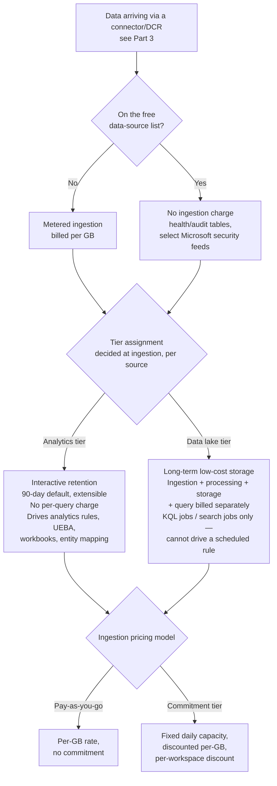

# Part 17 — Workspace Cost Models and Retention Tiers

## Why this part exists

**[CONCEPT]**
Part 3 named the tier decision — Analytics tier or Data lake tier — as the fourth of four choices an engineer makes once, per data source, at ingestion configuration time, and then moved on because that part's scope was the ingestion pipeline, not the bill. DEH Part 25 §8 went a step further from the query-writing side: its SOC Management View callout points out that a scheduled rule's query shape and its source table's billing tier interact, because a table billed by the gigabyte scanned on every query turns a missing leading time filter into a recurring cost line, not a one-time inefficiency. Both parts pointed at this one and moved on. This is where the pointing stops.

This part treats cost and retention as one connected decision surface, not two separate conversations — a finance conversation about the monthly bill and an engineering conversation about how long data survives. They're the same decision because Microsoft Sentinel bills ingestion, retention, and (for one tier) query and processing as separate, addable meters, and which tier a table sits in determines which of those meters actually run. Get the tier wrong for a given source and you either pay full interactive-tier rates for data nobody queries, or you park a genuinely detection-relevant source somewhere that can never drive an analytics rule at all — the second failure is a coverage gap wearing a cost-optimization disguise, and it is exactly the kind of thing DEH Part 43 (Detection Debt) exists to name: a decision that looks like it only costs money now, and costs detection coverage later, quietly, with no error message pointing at it.

Two structural notes before the detail. First, this part does not re-teach KQL performance discipline — DEH Part 25 §8 already covers filtering on the indexed time column, projecting down before a join, and the mechanics of why an unfiltered scan is expensive; this part is about which tier a table lives in, not how to write a cheap query against it. Second, per this book's honesty constraint (`STYLE-GUIDE.md` §9), every dollar figure, discount percentage, and tier threshold below is something Microsoft can and does change on its own pricing cadence, with no lab tenant here to validate against. Treat the specific numbers as a snapshot dated to this chapter's `last_validated` date, and the framework around them — two billing surfaces, two tiers, a per-source decision — as the durable part.

## 1. Two billing surfaces, not one

**[ENGINEERING]**
A Log Analytics workspace with Microsoft Sentinel enabled bills across at least two distinct dimensions, and conflating them is the single most common source of a cost surprise:

1. **Ingestion** — what it costs to get a gigabyte of data into a table at all, metered daily, per table, based on the data's uncompressed volume as analyzed at ingestion time.
2. **Retention and access** — what it costs to keep that data queryable over time, and (for one of the two tiers) what it costs to query, process, or search it at all, as a separate line from the storage itself.

Part 2 already established that once Sentinel is enabled on a workspace, every table in it — including tables Azure Monitor itself populates for unrelated operational telemetry — is billed under Sentinel pricing, not plain Azure Monitor Logs pricing, whether or not a given table's contents have anything to do with security. This part picks up from there: within that Sentinel-priced workspace, the tier a table is assigned determines which of the two billing dimensions above actually apply, and at what rate.

> **PRODUCT VERSION NOTE (as of 2026-09-15)**
> Microsoft Learn, "Plan costs and understand pricing and billing" for Microsoft Sentinel
> (`learn.microsoft.com/azure/sentinel/billing`, retrieved 2026-09-15), is the authoritative
> source for exactly how ingestion and retention are metered and priced, and it changes on
> Microsoft's own cadence — a new region rolling out different rates, a discount structure
> changing, or a tier's default retention window shifting are all things that have happened to
> this platform before and can happen again. This part states the *shape* of the billing model
> (which meters exist, what triggers them) as the durable content; check that page directly
> before building a budget or a business case on any specific number quoted here.

## 2. The Analytics tier

**[ENGINEERING]**
The **Analytics tier** is the tier every earlier part in this book has implicitly assumed a table lives in, because it's the tier that supports everything the rest of the platform does: full KQL querying, analytics rules (Parts 4–5), workbooks (Part 8), hunting (Part 9), UEBA (Part 11), and entity mapping into the incident model (Part 6) all run against Analytics-tier data. Its retention and cost shape, per Microsoft Learn's "Log retention tiers in Microsoft Sentinel" documentation (`learn.microsoft.com/azure/sentinel/log-plans`, retrieved 2026-09-15 for this book), is:

- **Interactive retention**, meaning the data is immediately queryable with no separate search or restore step, for a default period that Microsoft's documentation states as 90 days, extensible per-table up to two years (Microsoft Learn, "Log retention tiers in Microsoft Sentinel," `learn.microsoft.com/azure/sentinel/log-plans`, retrieved 2026-09-15).
- **No separate per-query charge.** Once a table's data is ingested and sitting in the Analytics tier, running a KQL query against it — however large the query's own scan, however many times an analyst re-runs it while triaging an incident — does not add its own line item the way it does for the Data lake tier's query mechanics (§3). This is the tier's central economic feature: cost is driven by what you ingest and how long you keep it, not by how hard you look at it afterward.
- **Full feature support.** Analytics rules, UEBA, entity mapping, and every other platform capability described earlier in this book assume an Analytics-tier source table. A table that isn't in the Analytics tier cannot back a scheduled or NRT analytics rule the way Parts 4–5 describe — this is the operational consequence, not just the cost consequence, of the tier choice, and it's the reason §6 below treats tier selection as a detection-design decision.

Extending retention beyond the default interactive window is a per-table setting, not a workspace-wide one — one table can carry a longer retention period than its neighbor in the same workspace, which matters for a source with a compliance-driven retention requirement that outlives the default the rest of the workspace runs on.

## 3. The Data lake tier

**[ENGINEERING]**
The **Data lake tier** exists for a different job: holding high-volume, lower-per-record-value secondary security data — bulk network flow logs, verbose firewall traffic, or any source you want to retain for long-horizon hunting or compliance without paying Analytics-tier rates on every gigabyte, forever. Per the same Microsoft Learn retention-tiers documentation cited above, the Data lake tier's cost and access model differs from the Analytics tier's in a way that matters operationally, not just financially:

- **Ingestion, processing, storage, and query are billed as separate components**, rather than folded into one blended per-GB rate the way Analytics tier's ingestion-plus-default-retention pricing is. A table sitting quietly in the Data lake tier, untouched, costs one thing; running a large search or KQL job against months of that table's history costs something additional, on top of what storing it already cost.
- **It is not currently structured to drive analytics-rule alerting.** A source landed in the Data lake tier is not available to a scheduled or NRT rule's query the way an Analytics-tier table is — Part 3 already flagged this constraint at the ingestion-decision stage; this part is where it becomes a cost-versus-coverage tradeoff instead of a plumbing fact.
- **Access happens through a different query surface.** Microsoft's platform-layer documentation describes reaching Data lake tier data through mechanisms built for that tier specifically — KQL jobs and search-job-style asynchronous queries rather than the always-interactive query experience the Analytics tier supports. This is genuinely one of the fastest-moving surfaces in the current model; treat the exact set of supported access methods as something to re-verify against current Microsoft Learn documentation rather than as settled the way this chapter's tier-versus-tier framing is.

> **Blind Spot**
> "Cheap to store" and "cheap to use" are not the same property, and the Data lake tier's pricing
> model separates them on purpose. A hunter who treats a Data lake tier table the way they'd treat
> an Analytics tier table — running the same kind of broad, exploratory, re-run-it-five-times-while-
> refining-the-filter query they'd run interactively against `SecurityEvent` — can generate a
> processing or query charge that a workspace owner never budgeted for, precisely because the
> Analytics tier's habit of "the query itself is free, only ingestion and retention cost anything"
> does not carry over. Anyone hunting against Data lake tier data needs to know that before they
> start, not after the job completes and the bill reflects it.

> **PRODUCT VERSION NOTE (as of 2026-09-15)**
> The two-tier model (Analytics tier and Data lake tier) described in §2–§3 is Microsoft's current
> framing, per the "Log retention tiers in Microsoft Sentinel" page cited above. This is a
> genuinely new-ish framing relative to a four-tier model (Analytics, Basic Logs, Auxiliary Logs,
> Archive) that circulated in Microsoft's own earlier documentation, training material, and
> certification content, and that four-tier language has not fully disappeared from the field —
> §4 below maps the two onto each other as best this book can, but a reader should treat that
> mapping as this book's own synthesis of the cited page, not as a claim Microsoft has published
> the mapping in exactly that form. Re-check the current retention-tiers page directly, especially
> if a vendor deck, a training course, or a colleague's notes still uses the older four-tier names.

## 4. The tier model this replaced

**[ENGINEERING]**
Anyone who learned Sentinel's cost model before the two-tier framing above became current is likely to still think in terms of four tiers: **Analytics**, **Basic Logs**, **Auxiliary Logs**, and **Archive**. That terminology hasn't vanished — DEH Part 25 §8's own SOC Management View callout, written from the query-performance side rather than the billing-architecture side, still refers to "Basic Logs and Auxiliary Logs tables" as the cheaper tiers some teams route high-volume, low-value sources into, because that callout is about the query-cost consequence of table choice and that consequence holds regardless of which generation of tier names a given workspace or a given reader's training used. Table 17.1 gives this book's best current understanding of how the two framings relate — read it as an orientation aid for a reader encountering both vocabularies, not as a Microsoft-published equivalence table.

**Table 17.1 — Legacy four-tier terminology mapped to the current two-tier model.** Supports a reader who learned Sentinel's cost model under the older naming and needs to translate it against this chapter's terms; not a claim that Microsoft has published this exact mapping, and not a claim that every property of a legacy tier carries over unchanged to its current-model counterpart.

| Legacy tier name | Rough current-model equivalent | What to verify before relying on the mapping |
|---|---|---|
| Analytics | Analytics tier | Largely a direct carryover — full interactive querying, analytics-rule support, default retention window. |
| Basic Logs | Closest in spirit to Data lake tier's low-cost-storage role | Basic Logs' specific per-scan query billing model and the Data lake tier's own processing/query billing are not necessarily priced or structured identically — check current documentation rather than assuming a 1:1 cost match. |
| Auxiliary Logs | Data lake tier | Auxiliary Logs was positioned as a precursor concept for very-low-touch, high-volume data; the Data lake tier is its current-model successor per Microsoft's retention-tiers documentation, but confirm feature parity for any workload built around the older tier's specific behavior. |
| Archive | Long-term cold-storage retention, whose exact current placement (a Data lake tier property vs. a separate mechanism) this book could not confirm with confidence | Do not assume Archive's old search/restore workflow carries over unchanged — verify directly against the current retention-tiers page. |

## 5. Pricing models: pay-as-you-go and Commitment tiers

**[SOC MANAGEMENT]**
Independent of which retention tier a table sits in, a workspace as a whole chooses between two pricing structures for ingestion:

- **Pay-as-you-go** — every gigabyte ingested is billed at a published per-GB rate, with no upfront commitment and no minimum volume. This is the default, and it's the right choice for a workspace whose ingestion volume is small, unpredictable, or still being measured.
- **Commitment tiers** — a workspace commits to a fixed daily ingestion capacity in exchange for a discounted effective per-GB rate versus pay-as-you-go, billed whether or not the workspace actually uses the full committed capacity on a given day. Part 2 already named the 100 GB/day range as the rough point where a Commitment tier discount becomes worth evaluating, and flagged that the discount applies **per workspace** — splitting ingestion volume across several workspaces to keep each one "manageable" can quietly forfeit a discount that consolidating into fewer workspaces (or pooling volume through a dedicated cluster) would have captured.

Two mechanics worth naming explicitly because they change how a Commitment tier decision should be planned, not just priced:

- **Commitment tiers exist at multiple discrete capacity levels**, not as a continuously adjustable dial — a workspace picks a published tier level (Microsoft's documentation lists a defined ladder of GB/day levels above the entry threshold), and moving between levels is a deliberate change, not an automatic adjustment that tracks daily volume.
- **Changing tier level is constrained, not instantaneous, and the constraint is asymmetric.** Per Microsoft Learn, "Reduce costs for Microsoft Sentinel" (`learn.microsoft.com/azure/sentinel/billing-reduce-costs`, retrieved 2026-09-15): increasing the Commitment tier takes effect immediately but restarts a 31-day commitment period; moving back down to a lower Commitment tier or to pay-as-you-go is only allowed once that 31-day commitment period has finished. A workspace that increases its tier to absorb a short-lived volume spike is committed to that higher rate for the full 31 days regardless of how quickly volume drops back down.

> **PRODUCT VERSION NOTE (as of 2026-09-15)**
> The specific Commitment tier capacity levels and their discount percentages relative to
> pay-as-you-go are published on Microsoft's Sentinel pricing page
> (`azure.microsoft.com/pricing/details/microsoft-sentinel`) and change on Azure's general
> pricing-update cadence — the same caution Part 14 already applies to Logic Apps per-action
> pricing applies here for the same reason. The 31-day commitment-period mechanic named above is
> documented on the "Reduce costs for Microsoft Sentinel" page cited above as of this writing, but
> is itself a policy Microsoft could change; this book does not quote a specific discount
> percentage or GB/day ladder above the published 100 GB/day entry point because either would
> likely be stale by the time it's read. Check the current Azure pricing calculator and Microsoft
> Sentinel cost-management documentation directly before sizing a Commitment tier decision, and
> re-check it again before assuming a cost model built even a few months earlier still holds.

> **SOC Management View**
> A Commitment tier decision is a program-management commitment, not a technical setting — it's a
> multi-week-minimum financial obligation sized against a volume forecast, and forecasting
> ingestion volume badly in either direction has a real cost: underestimating means paying
> pay-as-you-go overage on top of the commitment; overestimating means paying for committed
> capacity the workspace never uses. Treat a Commitment tier evaluation as needing the same kind of
> volume-trend data Part 18's health-monitoring discipline already produces, not a one-time
> guess made at onboarding and never revisited.

## 6. Free data sources

**[ENGINEERING]**
Some data ingests into a Sentinel-enabled workspace at no charge at all, regardless of which tier the rest of the workspace's tables are billed under — not a cheaper tier, but zero ingestion cost. Microsoft's own documentation maintains a specific, named list of free data sources, and that list has grown and changed over the platform's history, so this section names it as a category with representative, high-confidence examples rather than reproducing a list this book cannot guarantee is current:

- The workspace's own **health monitoring data** — the `SentinelHealth` table Part 18 covers in depth — is documented as free, on the reasoning that a SOC shouldn't have to pay to find out its own platform is broken.
- Several **Microsoft security-product alert and incident feeds** — Microsoft Defender for Cloud alerts and Microsoft's own cross-product incident data among them — have historically been documented as free or free-with-conditions, on the logic that Microsoft wants friction-free correlation of its own products' security signal into Sentinel rather than charging to bring in the alert stream that makes the unified incident queue (Part 15) work at all.
- **Azure Activity log** data has historically appeared on Microsoft's free-data-source list as well.

> **PRODUCT VERSION NOTE (as of 2026-09-15)**
> The authoritative, current free-data-sources list is the "Free data sources" section of
> Microsoft Learn, "Plan costs and understand pricing and billing" for Microsoft Sentinel
> (`learn.microsoft.com/azure/sentinel/billing`, retrieved 2026-09-15), and is exactly the kind of
> list that gains and loses entries as Microsoft adjusts its own product bundling strategy — this
> book names three representative categories above with moderate confidence, not a complete or
> guaranteed-current enumeration. Before assuming any specific connector or table ingests free,
> check that page's current free-data-sources list directly; treat a table's free status as
> something to verify per source, not something to infer from this list or from what was true in
> an earlier version of this book.

**[SOC MANAGEMENT]**
The practical design implication: a table that ingests free is an attractive place to put context and enrichment data that a detection query joins against — the join itself costs nothing extra in ingestion terms, only in the query-time cost the source table it's joined from already carries. This is a reason (among several — see Part 10 on watchlists specifically) to prefer a free or already-flowing table over standing up a new paid ingestion path purely to hold reference data a rule needs to look up.

## 7. Tier as a detection-design decision, not just a finance one

**[SOC MANAGEMENT]**
DEH Part 25 §8's SOC Management View callout makes the query-side half of this argument: a scheduled rule's query shape and its source table's billing tier interact, because an unfiltered scan against a per-query-billed table turns a query-writing habit into a recurring cost line. This part adds the other half, and it's the more consequential one: **which tier a source lives in determines whether an analytics rule can query it at all.** A table in the Data lake tier is not currently available to a scheduled or NRT rule the way an Analytics-tier table is (§3). That means every decision to park a source in the Data lake tier for cost reasons is simultaneously a decision that no automated analytics-rule alerting will ever fire against that source, directly, in its current form — full stop, regardless of how good the query would have been.

That tradeoff is sometimes exactly right: a bulk, low-signal, compliance-retention source that nobody was ever going to write a rule against anyway loses nothing by living in the Data lake tier. It's sometimes exactly wrong: a source with real detection value, routed to the Data lake tier purely because it's high-volume and someone was optimizing the ingestion bill without checking whether anything downstream needed to alert on it. The second case is a coverage gap that will not show up as a broken rule, a failed connector, or an error in `SentinelHealth` — there is no rule to fail, because no rule can exist against that table in the first place. It shows up only as an absence: an attack path nobody built a detection for, discovered the way most silent gaps are discovered, after the fact.

> **Engineering Reality**
> A tier decision made once, at onboarding, for cost reasons, doesn't announce itself again later
> when the source's detection relevance changes. A source that looked purely like bulk
> compliance data at onboarding can become genuinely detection-relevant six months later — a new
> threat model, a new hunt finding, a new regulatory driver — and nothing in the platform prompts
> anyone to revisit the tier decision when that happens. The tier assignment just keeps quietly
> being what it was, unless someone deliberately re-checks it.

This is precisely the mechanism DEH Part 43 (Detection Debt) names in the abstract: a decision that looked cheap and reasonable at the time it was made, compounding, unflagged, into a gap that costs more to discover and fix later than it would have cost to get right at onboarding. Appendix A2's decision matrix exists as the companion reference for making this call deliberately, per source, rather than by default.

## 8. A workspace's cost shape, end to end

**[CONCEPT]**
Figure 17.1 traces one workspace's billing surface from ingestion through the pricing-model choice, showing where each of this part's decisions — tier assignment, free-source exemption, and pay-as-you-go versus Commitment tier — actually sits in the model.

**Figure 17.1 — A Sentinel workspace's cost shape, from ingestion to query.** *CONCEPTUAL.* Illustrates, at a structural level, how a free-data-source exemption, the Analytics-versus-Data-lake tier decision (§2–§3), and the pay-as-you-go-versus-Commitment-tier pricing choice (§5) combine to determine what a given piece of ingested data actually costs and what it can be used for afterward. This is this book's own structural sketch, built from the tier and billing documentation cited throughout this part — not a reproduction of an official Microsoft architecture diagram, and not a capture of any live workspace, per this book's evidence-classification constraint (`STYLE-GUIDE.md` §9).

## 9. Keeping the decision from drifting

**[SOC MANAGEMENT]**
Part 3 framed connector onboarding as four decisions made deliberately, per source, rather than accepted as a bundled default — connector family, transformation, destination table, and tier. This part's contribution to that discipline is the review side: a tier decision made correctly at onboarding can still go stale, because the two forces that would justify revisiting it — the source's actual detection relevance, and the workspace's actual ingestion volume relative to its pricing model — both change over time in ways nothing in the platform surfaces automatically.

Three practical anchors for keeping the review from being purely aspirational:

- **Tie a tier and pricing-model review to the same cadence Part 18's health-monitoring discipline already runs on.** A workspace that's already watching `SentinelHealth` for connector and rule failures is already looking at the platform regularly; adding "has any Data lake tier source become detection-relevant, and has ingestion volume moved enough to revisit the pricing model" to that same review is a marginal addition, not a new program.
- **Use Appendix A2's decision matrix as the documented record of why a given source landed where it did**, not just as a one-time onboarding checklist — a matrix that's never updated after the first pass is a snapshot of a decision, not a living record of one.
- **Treat a new Content Hub solution's bundled connector set (Part 3 §6) as a fresh instance of the same per-source tier question**, not an exemption from it — a bundle shipping several tables at once doesn't mean all of them belong in the same tier, and accepting a bundle's defaults without checking is exactly the "decided by not deciding" failure mode this part opened by naming.

> **What Would Change My Mind**
> This part treats "review tier and pricing-model decisions on a recurring cadence, not just at
> onboarding" as necessary specifically because today's platform gives no automatic signal when a
> Data lake tier source becomes detection-relevant or a workspace's volume outgrows its pricing
> model. If Microsoft shipped a feature that let a Data lake tier table promote into
> analytics-rule eligibility without a full re-ingestion, or a workspace-level advisory that
> flagged "this table's query pattern suggests it belongs in a different tier," the specific
> recurring-review burden this section describes would shrink toward "verify the platform's own
> recommendation," a materially lighter operational ask than the deliberate, human-driven review
> this part currently recommends.

## Cross-references

DEH Part 25 §8 (query-cost and billing-tier interaction — the query-writing half of this part's tier-as-detection-design argument) — DEH Part 43 (Detection Debt — the framework this part's §7 applies to a cost decision specifically) — Part 2 (Log Analytics Workspace Architecture and the Two Portals — Sentinel-wide billing and the Commitment tier threshold this part extends) — Part 3 (Data Ingestion: Connectors, Data Collection Rules, and Table Tiers — where the tier decision is made, at the source) — Part 16 (Operating the Unified Security Operations Platform — portal-specific table-management surface differences) — Part 18 (Sentinel-Specific Tuning, Health Monitoring, and Troubleshooting — the `SentinelHealth` review cadence this part's §9 ties into) — Appendix A2 (Cost and Retention Decision Matrix — the companion reference for the per-source decision this part argues for).
