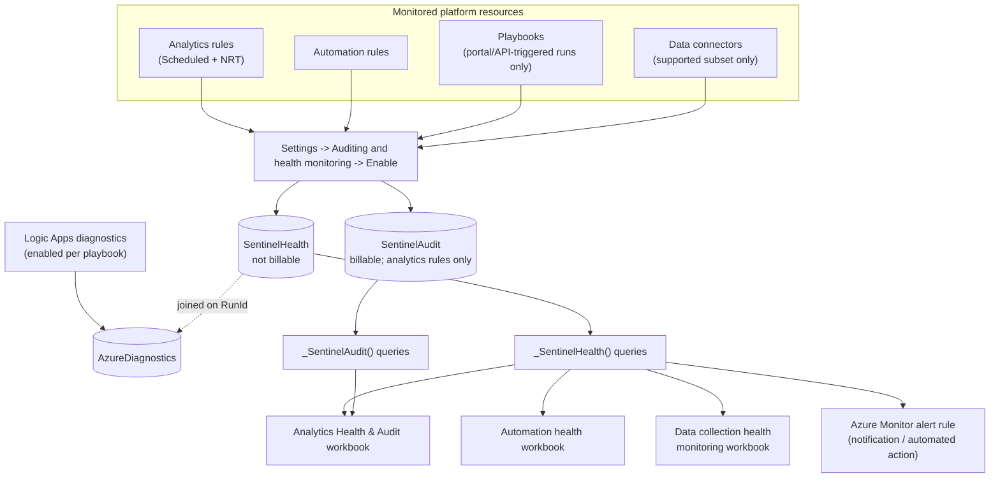
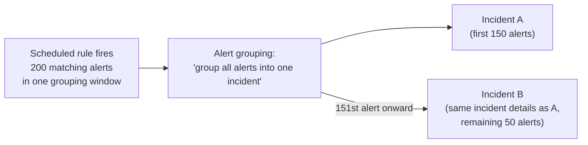

# Part 18 — Sentinel-Specific Tuning, Health Monitoring, and Troubleshooting

## Why this part exists

**[CONCEPT]** DEH Part 25 §8 already names the failure mode this part exists to answer: Advanced Hunting and Sentinel table and field names are a Microsoft-controlled schema that changes over time, and a field renamed, moved, or retired produces a query that still compiles, still runs, and returns zero rows — with no ingest error anywhere to flag that anything broke. Zero rows is indistinguishable from "the technique genuinely isn't happening" without a separate mechanism confirming the rule still fires against a known-good event on some cadence. DEH Part 37 (Detection Testing) and DEH Part 39 (False Negative Engineering) teach why that confirmation has to be deliberate rather than assumed. What none of those three parts covers is what Sentinel specifically does, or doesn't do, to surface that failure on its own — whether the platform's own health telemetry would catch a silently broken rule, and what else can go wrong between a validated query and an incident an analyst sees that has nothing to do with the query's logic at all.

This part covers four things, in order: Sentinel's own classification of why a rule stops running (transient versus permanent failure, and what "permanent" actually triggers); the `SentinelHealth` and `SentinelAudit` tables as the queryable record of that classification, and the real limits on what they cover; ingestion delay as a failure class that affects a fixed-cadence Near-real-time (NRT) rule (fixed one-minute evaluation cadence, limited subset of scheduled-rule features) differently than it affects a Scheduled rule (the most configurable rule type — engineer-set query frequency and lookback window, full entity mapping and alert-grouping control); and incident-merge and correlation-engine behavior as a troubleshooting category distinct from anything a query's correctness can fix. It closes by tying all four back to DEH Part 25 §8's own warning: Sentinel's health telemetry — real, free, and genuinely useful — does not by itself solve the schema-drift problem DEH names. A canary-query discipline still has to sit on top of it, and this part states why.

---

## 1. Two failure classes: transient and permanent

**[SENTINEL ENGINEER]** Microsoft's own troubleshooting documentation for scheduled analytics rules sorts every rule-execution failure into one of two classes before deciding what to do about it, and the distinction is the single most useful thing to know before diagnosing a rule that has stopped producing incidents.

A **transient failure** is one Microsoft's platform expects to resolve on its own: a query that times out, a temporary connectivity break between a data source and the workspace (or between the workspace and Sentinel itself), or — by design — any new or unrecognized failure type, which Sentinel defaults to treating as transient. A rule experiencing a transient failure retries at increasing intervals for a while, then falls back to its next normal scheduled run. A rule is never disabled for a transient failure alone, no matter how many times it recurs, as long as each occurrence keeps getting classified as transient.

A **permanent failure** is one Microsoft's platform judges cannot self-resolve without a human changing something: the target workspace or table was deleted, Sentinel was removed from the workspace, a function the query calls was modified or removed, permissions on one of the query's data sources changed, or a data source was deleted outright. A separate permanent-failure category covers a query that consumes excessive compute relative to what Sentinel allows for a scheduled run — an engineering problem with the query itself, not an external dependency breaking. When a rule accumulates a predetermined number of consecutive permanent failures of the same type, Sentinel disables the rule, prepends the words **"AUTO DISABLED"** to the beginning of its name, and appends the failure reason to its description (Microsoft Learn, "Troubleshooting analytics rules in Microsoft Sentinel," learn.microsoft.com/azure/sentinel/troubleshoot-analytics-rules, retrieved 2026-09-15). Microsoft doesn't publish the exact number of consecutive failures that crosses that line — only that the count is "predetermined" — so treat the threshold itself as unpublished rather than something to reverse-engineer and rely on.

> **PRODUCT VERSION NOTE (as of 2026-09-15)**
> The same troubleshooting page carries a banner steering readers toward Custom Detections — "now the best way to create new rules across Microsoft Sentinel SIEM Microsoft Defender XDR" [Microsoft Learn's own wording, not this book's] — as the unified rule-authoring surface (Part 5 owns this in full). The transient/permanent classification and `AUTO DISABLED` naming behavior described here are documented specifically for classic Scheduled and NRT analytics rules. Whether an equivalent auto-disable mechanism applies identically to a rule authored through Custom Detections is not something this book confirms — this book has no tenant to test it against. Re-check Microsoft Learn's current Custom Detections documentation before assuming this section's mechanics transfer unchanged.

One permanent-failure case is worth naming on its own, because it lands squarely on the cross-tenant access pattern Part 2 already covers. When an analytics rule is created, Sentinel applies an access-permissions token to it so it can keep querying its target workspace even after the creator loses their own access — with one documented exception: a rule created to query a workspace in a different subscription or tenant (the scenario a Managed Security Service Provider, MSSP, distributed-workspace architecture produces, per Part 2 §2) carries the creating user's own credentials instead of an independent token. If that user later loses access to the target tenant — offboarded, role changed, guest access revoked — the rule fails with a health-monitoring message describing "insufficient access to resource," and gets auto-disabled through the same permanent-failure procedure as any other permission change (same source as above). Part 2 §6 already flags that Azure Lighthouse delegated access isn't supported for Sentinel data once viewed through the Microsoft Defender portal, and that Microsoft Entra B2B guest access is the documented alternative; this is the failure mode that fact produces when the substitution hasn't happened yet.

> **Engineering Reality**
> The transient/permanent split matters operationally because it changes what "the rule looks broken" should make an engineer do first. A rule showing scattered, non-consecutive failures with varying reason text is very likely riding out transient noise on its own — the correct response is usually to wait and confirm via `SentinelHealth` (§2) that the failures aren't accumulating into a consecutive run of the same permanent-failure type. A rule that has actually gone `AUTO DISABLED` needs a person: the underlying condition (a deleted table, a revoked permission, a broken function) has to be fixed before re-enabling the rule does anything except set up the next disable cycle. Confusing the two — re-enabling an auto-disabled rule without touching the underlying cause, or panicking over a transient blip that was already self-healing — wastes exactly the kind of engineering time this section exists to save.

The table below separates the failure classes by what actually causes them and where the evidence of each shows up, as a first triage reference rather than an exhaustive list.

| Failure class | Example causes | Sentinel's response | Where the evidence lands |
|---|---|---|---|
| Transient | Query timeout; temporary connectivity break between a data source and the workspace, or between the workspace and Sentinel; any new/unclassified failure type | Retries at increasing intervals, then resumes at the next scheduled run; rule stays enabled | `SentinelHealth`, `Status == "Failure"`, with a transient-type reason string |
| Permanent — configuration change | Target workspace or table deleted; Sentinel removed from the workspace; a function the query calls was modified or removed; a data source's permissions changed or the source was deleted | After a predetermined run of consecutive same-type failures: rule disabled, `AUTO DISABLED` prepended to the rule's name, reason appended to its description | Rule list sorted by name; `SentinelHealth` `Reason` field; the rule's own description text |
| Permanent — resource drain | An improperly built query consumes excessive compute for a scheduled run | Same three-step auto-disable response, triggered by cost/performance rather than a hard dependency break | Same as above; requires rewriting the query before re-enabling does anything durable |
| Permanent — cross-tenant token loss | A rule queries a workspace in another subscription/tenant (the MSSP case above); the creating user later loses access to that tenant | "Insufficient access to resource" health message, then auto-disable under the same procedure | `SentinelHealth`; Part 2 §2 and §6's cross-tenant/MSSP RBAC coverage for the broader access model this sits inside |

---

## 2. `SentinelHealth` and `SentinelAudit`: the free, queryable audit trail

**[ENGINEERING]** Everything in §1 is diagnosable after the fact because Sentinel writes its own health telemetry into two ordinary Log Analytics tables — `SentinelHealth` and `SentinelAudit` — once an engineer turns the feature on. Neither exists by default; both are opt-in, enabled from Microsoft Sentinel's Settings page under **Auditing and health monitoring**, either as one "Enable" toggle covering every supported resource type, or through the underlying diagnostic settings for finer-grained control (Microsoft Learn, "Turn on auditing and health monitoring in Microsoft Sentinel," learn.microsoft.com/azure/sentinel/enable-monitoring, retrieved 2026-09-15). Once enabled, each table is created at the first eligible success or failure event — there's no backfill from before the feature was turned on.

The two tables split cleanly by what they answer. `SentinelHealth` answers "did this resource run, and did it succeed" — one row per execution event. `SentinelAudit` answers "did someone change this resource's configuration" — who, from where, and what the setting looked like before and after. That split matters for cost too: `SentinelHealth` is not billable, so health monitoring adds no ingestion cost regardless of scale; `SentinelAudit` is billable like any other ingested table, and its coverage is narrower — auditing today covers only analytics rules, not automation rules, playbooks, or connectors (same source as above).

Microsoft's own documentation is worth quoting rather than paraphrasing: build queries against these tables using the prebuilt `_SentinelHealth()` and `_SentinelAudit()` functions instead of querying the raw tables directly, because those functions "ensure the maintenance of your queries' backward compatibility in the event of changes being made to the schema of the tables themselves" (Microsoft Learn, "Auditing and health monitoring in Microsoft Sentinel," learn.microsoft.com/azure/sentinel/health-audit, retrieved 2026-09-15). That's Microsoft's own health layer hedging against exactly the schema-drift risk DEH Part 25 §8 names for ordinary detection queries — a concrete sign the risk this part opened with isn't a hypothetical this book invented.

| Resource type | What `SentinelHealth`/`SentinelAudit` records | Coverage caveat |
|---|---|---|
| Analytics rules (Scheduled, NRT) | Per-run success/failure, event count, whether the alert threshold was crossed; separately, `SentinelAudit` records create/update/delete changes to the rule itself | Full coverage once the feature is enabled — the only resource type with both health and audit coverage |
| Automation rules | Per-run status (`Success`, `Partial success`, `Failure`) and the list of playbooks the run invoked | Tells you the automation rule fired and what it called, not what happened inside a called playbook |
| Playbooks | Success/failure of a playbook triggered manually from the portal or via API | Does not, by itself, record a playbook invoked automatically by an automation rule's own action — that shows up on the automation-rule side instead |
| Data connectors | Data-fetch status changes and an hourly aggregated failure summary, per connector, per workspace | Supported for a named subset only — Amazon Web Services, Dynamics 365, Office 365, Microsoft Defender for Endpoint, Threat Intelligence–TAXII, Threat Intelligence Platforms, and any connector built on the Codeless Connector Framework; most other connectors have no `SentinelHealth` row at all and need the Data collection health monitoring workbook's `Heartbeat`-based view instead |

**[SENTINEL ENGINEER]** The query behind §1's auto-disabled-rule check is a direct payoff of this table existing — the fastest way to answer "which of my rules are currently disabled, and why" without manually sorting the Active rules list.

```kql
// Adapted directly from Microsoft Learn, "Monitor the health and audit the
// integrity of your Microsoft Sentinel analytics rules"
// (learn.microsoft.com/azure/sentinel/monitor-analytics-rule-integrity),
// retrieved 2026-09-15. This book has no tenant to run the query against —
// treat the field and literal-string match below as documented, not
// independently verified, and re-check the source page if it returns
// nothing on a real workspace.
_SentinelHealth()
| where SentinelResourceType == "Analytics Rule"
| where Reason == "The analytics rule is disabled and was not executed."
```

A second query from the same source answers a related question — how failures break down by reason across every rule, the starting point for deciding whether a spike in transient failures is isolated or systemic:

```kql
// Adapted directly from the same Microsoft Learn page cited above.
_SentinelHealth()
| where SentinelResourceType == "Analytics Rule"
| summarize Occurrence = count(), Unique_rule = dcount(SentinelResourceId) by Status, Reason
```

Microsoft ships three purpose-built Content hub workbooks that wrap this data in a dashboard: **Analytics Health & Audit** (rule success/failure trends and audit activity by rule and caller), **Automation health** (automation-rule and playbook run status, correlated with Logic Apps diagnostics), and **Data collection health monitoring** (connector ingestion volume, latency, and anomaly detection via `series_decompose_anomalies()`). None substitutes for the underlying table — Part 8's framing of a workbook as "not a quality program" applies here too — but each is a reasonable first stop before writing a query from scratch.






**Figure 18.1 — Health and audit data flow, from platform resource to queryable table to dashboard.** *CONCEPTUAL.* Illustrates how four resource types feed the `SentinelHealth`/`SentinelAudit` opt-in toggle, how the resulting tables are queried through the recommended `_SentinelHealth()`/`_SentinelAudit()` functions, and how that data surfaces in Microsoft's own built-in workbooks and (optionally) an Azure Monitor alert rule. Built from this part's own reading of the Microsoft Learn pages cited throughout §2 — not a capture of any Sentinel UI screen, and not a reproduction of an official Microsoft architecture diagram.

---

## 3. Ingestion delay: the gap between generated and queryable

**[ENGINEERING]** A scheduled rule's lookback and run frequency being independent settings — the fact DEH Part 25 §3's Engineering Reality box covers, and this book's Part 1 leans on directly — has a concrete platform-level cause: an event's `TimeGenerated` timestamp reflects when it happened at the source, not when it became queryable in the workspace, and the gap between the two is ingestion delay. Microsoft's own worked example matches the failure this book has already described in the abstract: a rule running every five minutes with a five-minute lookback, against a source with a two-minute ingestion delay, misses an event outright — it lands after the run that should have caught it, and by the next run the time filter has already aged it out of the window (Microsoft Learn, "Handle Ingestion Delay in Microsoft Sentinel," learn.microsoft.com/azure/sentinel/ingestion-delay, retrieved 2026-09-15). The rule doesn't error and shows no failure in `SentinelHealth`. It runs successfully, finds nothing, and produces no alert for an event that genuinely happened inside the window its settings would seem to cover.

Microsoft's documented fix is the one DEH already frames generically: widen the lookback beyond the known or estimated delay for the slowest source the query depends on. Widening alone introduces duplication — once lookback windows overlap, the same event can be evaluated, and alerted on, by more than one run. Microsoft's answer is to anchor the filter to `ingestion_time()` instead of the lookback window alone, so each event is attributed to exactly one run regardless of how wide the lookback grows:

```kql
// Adapted directly from Microsoft Learn, "Handle Ingestion Delay in
// Microsoft Sentinel" (learn.microsoft.com/azure/sentinel/ingestion-delay),
// retrieved 2026-09-15. Not run against a live tenant by this book —
// treat as documented, and re-verify ingestion_time() behavior against
// the current source table before relying on it in production.
let ingestion_delay = 2min;
let rule_look_back = 5min;
CommonSecurityLog
| where TimeGenerated >= ago(ingestion_delay + rule_look_back)
| where ingestion_time() > ago(rule_look_back)
```

> **False Positive Trap**
> Widening a rule's lookback to compensate for ingestion delay, without also anchoring to `ingestion_time()`, is a platform-behavior false positive in exactly the sense this book's STYLE-GUIDE flags as distinct from a legitimate user tripping a threshold: the same real event, correctly matched twice by two overlapping lookback windows, produces two alerts for one occurrence. An analyst working the incident queue who doesn't know the rule was recently widened has no way to tell "this is a duplicate of yesterday's alert on the same event" from "this is a second, independent occurrence" without manually correlating timestamps — and a rule that starts double-alerting right after a well-intentioned lookback fix reads, to everyone downstream of the engineer who made the change, exactly like a rule that broke.

**[SENTINEL ENGINEER]** NRT rules inherit the same ingestion-delay mechanism but have no lookback knob to widen, because their evaluation window is tied to a fixed one-minute cadence rather than an engineer-set setting. Microsoft's health-monitoring documentation describes the retry behavior this produces: if an NRT rule's run fails, the system reconsiders that same failed window on the next run one minute later, continuing for up to sixty consecutive failures — one hour — before the pattern counts as sustained rather than a blip (Microsoft Learn, "Monitor the health and audit the integrity of your Microsoft Sentinel analytics rules," learn.microsoft.com/azure/sentinel/monitor-analytics-rule-integrity, retrieved 2026-09-15). That window covers outright run failures, not ordinary ingestion lag — but a source whose typical delay routinely exceeds roughly a minute puts an NRT rule in a structurally worse position than a scheduled rule facing the same delay: a scheduled rule's lookback can simply be set wider, while an NRT rule has no equivalent lever, and the only real fixes are a tighter-latency source or accepting systematically stale data on every run. Scheduled rules get an analogous but distinct retry behavior for ordinary query failures — up to five additional attempts on the exact same window before Sentinel treats it as fully skipped — a different mechanism aimed at run failures rather than lateness, but with the same lesson: a rule's own retry logic can mask a delay problem before it becomes visible as a real gap.

> **PRODUCT VERSION NOTE (as of 2026-09-15)**
> Scheduled rules currently support a query interval ("Run query every") and lookback period ("Lookup data from the last") each ranging from five minutes to fourteen days, lookback required to be at least as long as the interval, with a default lookback of five minutes for a new rule (Microsoft Learn, "Create scheduled analytics rules in Microsoft Sentinel," learn.microsoft.com/azure/sentinel/create-analytics-rules, and "Handle Ingestion Delay in Microsoft Sentinel," both retrieved 2026-09-15). These are exactly the kind of published numeric limits Microsoft can revise without a retirement-style announcement — re-check the current wizard's stated ranges directly if a rule's tuning depends on being close to either boundary. The retry-count figures earlier in this section (five additional attempts for a Scheduled rule, sixty consecutive failures for an NRT rule) are the same class of Microsoft Learn-published number and carry the same caveat, even though this book states them without repeating the hedge inline every time.

---

## 4. Incident-merge and correlation-engine surprises: a troubleshooting category of their own

**[ANALYST]** Everything covered so far explains why a rule might not run, or might run against incomplete data. This section covers a different kind of "wrong": the rule ran, the query was correct, the threshold was crossed, an alert was generated — and the incident an analyst sees still doesn't match what the rule's own configuration would predict. That gap is a troubleshooting category distinct from a broken query, because no amount of rewriting the KQL fixes it; the mismatch lives one layer up, in how alerts become incidents.

The first mechanism is a rule's own alert-grouping setting, which controls whether multiple alerts from one rule land in one incident or several. Microsoft documents a hard ceiling here that's easy to miss until it's hit: up to 150 alerts can be grouped into a single incident. If a run generates more matches than that under a grouping configuration, Sentinel doesn't drop the excess or force one oversized incident — it creates a second incident carrying the same incident details as the original, and routes everything past the 150th alert into that new incident instead (Microsoft Learn, "Create scheduled analytics rules in Microsoft Sentinel," learn.microsoft.com/azure/sentinel/create-analytics-rules, retrieved 2026-09-15). An engineer who configured "group all alerts into a single incident" and then sees two identical-looking incidents on a high-volume day hasn't found a bug — they've found the documented cap.






**Figure 18.2 — The 150-alert grouping cap forking one rule's output into two incidents.** *CONCEPTUAL.* Illustrates the documented behavior when a single rule run's alert count exceeds Sentinel's per-incident grouping cap — not a capture of a real incident queue, and not a claim that 200 and 150 are anything but illustrative round numbers for this sketch.

The second mechanism is specific to a workspace onboarded to the Microsoft Defender portal, and it's a different kind of surprise because it isn't a cap — it's a documented loss of authority. Microsoft states this directly: once onboarded, a rule's alert-grouping settings "take effect only at the moment that the incident is created," because the Defender portal's own correlation engine owns alert correlation from that point on, and that engine "also might make decisions about alert correlation that don't take these settings into account" — with the consequence, in Microsoft's own words, that "the way alerts are grouped into incidents might often be different than you would expect based on these settings" (same source as above). A related, narrower difference: "Re-open closed matching incidents" — letting a closed incident reopen for a new matching alert rather than spawning a separate one — isn't available in the Defender portal. Part 13 already treats correlation-engine behavior as a first-class operational hazard; this section's point is narrower and diagnostic — when an incident's shape doesn't match a rule's configuration, ask which portal created it before assuming the rule is broken.

| Azure portal (retiring 2027-03-31) | Defender portal |
|---|---|
| A rule's alert-grouping settings directly and persistently determine how its alerts group into incidents | Alert-grouping settings apply only as an initial instruction at incident-creation time; the Defender XDR correlation engine can group differently afterward |
| "Re-open closed matching incidents" is available as a rule setting | This option is not available |

> **PRODUCT VERSION NOTE (as of 2026-09-15)**
> The 150-alert grouping cap, the Defender portal's alert-grouping settings applying only as an initial instruction at incident-creation time, and the unavailability of "Re-open closed matching incidents" in the Defender portal are all documented on Microsoft Learn, "Create scheduled analytics rules in Microsoft Sentinel" (learn.microsoft.com/azure/sentinel/create-analytics-rules), retrieved 2026-09-15. All three are exactly the kind of numeric limit and portal-parity behavior Microsoft can revise without a retirement-style announcement, and the second two sit directly on top of the Azure-portal retirement this book's Part 2 already treats as its own single most consequential version note — re-check the Incident settings section of the current rule wizard before assuming any of the three still hold on a live workspace.

> **Blind Spot**
> `SentinelHealth`'s analytics-rule health record answers "did this run succeed, and how many alerts did it generate" — it does not record which incident, or how many incidents, those alerts ended up grouped into, and it has no visibility at all into a Defender-portal correlation decision that overrides a rule's own grouping configuration. A rule can show `Status == "Success"` with a healthy alert count in `SentinelHealth` while the incident queue tells a completely different story about how those alerts landed. Diagnosing an incident-shape surprise means looking at the incident and investigation graph directly (Part 6) or the Defender-portal-specific behavior Part 16 catalogs — not re-running the health query from §2 and expecting it to explain something it was never built to answer.

**[SENTINEL ENGINEER]** The diagnostic table below separates "the rule is unhealthy" symptoms from "the rule is healthy but the incident-formation layer did something unexpected" symptoms — the split this section exists to draw.

| Symptom | Likely layer | Where to check |
|---|---|---|
| Rule shows `Success` in health telemetry, but no new incident appears | Alert threshold wasn't crossed, or incident creation is disabled on the rule | `SentinelHealth` reason text; the rule's own Incident settings tab |
| One rule produces more separate incidents than its grouping setting implies | The 150-alert grouping cap (§4), or a grouping mode narrower than expected | Count alerts per incident; re-check the rule's Alert grouping configuration |
| Incident title, severity, or provider field doesn't match the rule's own alert details | Defender-portal correlation engine treating grouping settings as an initial instruction only | Part 13 (automation-rule behavior differences) and Part 16 (portal parity gaps) |
| Rule is missing from Active rules, or its name now starts with `AUTO DISABLED` | Permanent failure and consecutive-failure auto-disable (§1) | §1's failure-class table; the rule's own description field |
| Alert fires later than expected, or misses a real event entirely | Ingestion delay exceeding the rule's lookback, or (for NRT) its fixed cadence (§3) | §3; the Workspace Usage Report's end-to-end latency view |

---

## 5. Canary queries: the operational answer to schema drift

**[THREAT HUNTER]** Return to the failure mode this part opened with. DEH Part 25 §8 names it precisely: a table or field renamed, moved, or retired produces a query that keeps compiling and running, returns zero rows, and generates no ingest error — indistinguishable, from the outside, from "the technique genuinely isn't occurring." §2 already showed why Sentinel's own health telemetry doesn't rescue an engineer from this: Microsoft's documented rule-status descriptions list "Rule executed successfully, but didn't reach the threshold required to generate an alert" as a `Success` state, not a `Failure` (Microsoft Learn, "Monitor the health and audit the integrity of your Microsoft Sentinel analytics rules," retrieved 2026-09-15). A rule silently returning zero rows because a field it depends on was quietly renamed logs that same `Success` status as a rule that's genuinely finding nothing suspicious — from `SentinelHealth`'s point of view the two are identical. Nothing covered so far distinguishes "correctly found zero because the world is quiet" from "incorrectly found zero because the schema moved."

> **Detection Test**
> DEH Part 25 §7's worked LSASS-memory-access detection anchors what a canary looks like as a platform object. The base query depends on specific columns from `DeviceProcessEvents` and `DeviceFileEvents` — exactly what a schema change could rename or relocate without warning. A canary for that detection isn't a copy of the detection logic; it's a simpler, separately scheduled query against the same base tables and load-bearing columns, checking only that they still exist and return non-null values for ordinary, high-volume activity every host generates constantly. If the canary itself returns zero rows, that's a fast signal the production rule's silence is a schema problem, not a quiet day — caught on a cadence measured in hours, not discovered weeks later.

**[ENGINEERING]** A canary belongs in the platform as its own scheduled rule, workbook query, or Azure Monitor alert rule reading the same base table, with a deliberately low bar: it should fire whenever a source that reliably produces events over any short window goes quiet at the field level the production detection depends on, not whenever anything resembling an attack technique occurs. That's the general discipline DEH Part 37 and DEH Part 39 already teach — a detection's silence needs its own explicit test, because "no alerts" is not, on its own, evidence that nothing happened. This part's contribution is narrower: the canary has to be built and scheduled as an ordinary platform object, because nothing covered here — not `SentinelHealth`, not the auto-disable mechanism, not the retry logic — was built to catch a schema-drift-induced silent failure, and none of them will start catching it without a human adding a second query whose entire job is noticing the silence.

> **Engineering Reality**
> Everything in Parts 1 through 17 of this book exists to turn a correct query into durable production infrastructure. This part's real argument is that "correct" and "durably operating in production" are not the same claim, and the gap is exactly the four things covered here: a permanent failure the platform will eventually disable the rule for, an ingestion delay it will never flag as an error, a correlation-engine decision it documents but doesn't warn on, and a schema change its own health telemetry can't distinguish from a quiet day. None are query-logic bugs; all four still leave a SOC believing it's covered by a detection that, in practice, is not — and a canary-query habit catches all four with one question asked on a schedule: did a known-good signal still produce a known-good result today.

> **What Would Change My Mind**
> This part treats a manually built, separately scheduled canary query as a necessary compensating control, on the grounds that nothing in Sentinel's current health-monitoring layer distinguishes "found nothing because nothing happened" from "found nothing because the schema moved." If Microsoft shipped a native coverage-staleness signal — something in `SentinelHealth`, or in whatever health surface a Custom Detections-based rule eventually gets, that flags a rule whose result count has dropped to zero against its own historical baseline, distinct from a rule that's merely running successfully — that would shift the canary from a necessary compensating control to a redundant one for any rule already covered by that native signal, and the honest update to this part would say so rather than keep recommending manual canaries out of habit once the platform closes the gap itself.

---

## 6. A recurring health-review discipline, not a one-time setup step

**[SOC MANAGEMENT]** Every mechanism in this part shares one operational property worth stating plainly to whoever owns the platform-operations budget: turning on health monitoring costs nothing in ingestion (`SentinelHealth` isn't billable), and every check this part describes is a query or a workbook view, not new infrastructure to provision. The cost that actually matters is analyst and engineer time spent looking — which is exactly the kind of recurring, unglamorous review work that's easy to schedule once and then quietly stop doing once nothing looks broken for a few weeks. The table below is a minimum cadence, not an exhaustive program.

| Cadence | Check | Query or surface |
|---|---|---|
| Once, at onboarding | Confirm auditing and health monitoring is actually turned on for the workspace | Settings → Auditing and health monitoring |
| Weekly | Scan for rules whose names now start with `AUTO DISABLED` | Active rules list sorted by name, or the §2 `_SentinelHealth()` disabled-rule query |
| Weekly | Review failure reasons across all rules, not just the disabled ones | §2's `Status`/`Reason` summary query |
| Monthly | Re-check whether ingestion delay for any source has drifted since it was last measured | Workspace Usage Report's end-to-end latency view |
| Monthly | Confirm each production rule's paired canary query is still firing as expected | §5's canary pattern |
| Per Defender-portal onboarding event | Re-verify alert-grouping and incident-shape behavior for every rule with a non-default grouping setting | Part 16's portal-parity coverage; §4's diagnostic table |

> **SOC Management View**
> The recurring cost of this review is genuinely small relative to the cost of discovering a silently disabled or silently schema-drifted rule only when an incident it should have caught surfaces some other way — during an audit, a tabletop exercise, or, worse, an actual intrusion. Framing this as a standing weekly/monthly cadence owned by a named role, rather than a best-effort habit any engineer does "when there's time," is the practical difference between this part's mechanisms actually protecting a SOC and this part's mechanisms existing in documentation that nobody consults until something has already gone wrong.

**[CONCEPT]** This part closes the loop this book opened in Part 1: a validated query is the starting line, not the finish line, and the six layers between a query and an incident an analyst can act on each have their own way of quietly failing without producing an error. `SentinelHealth` and `SentinelAudit` make most of those failures queryable, for free, once turned on — but they were built to answer "did this resource run and succeed," not "is this rule's silence meaningful," and the second question is the one a canary-query habit exists to answer instead. A SOC that treats Part 18's checklist as a recurring discipline, not a one-time setup task, is the practical difference between a platform that looks operated and one that actually is.

---

**Cross-references:** DEH Part 25 §3 (lookback-vs-frequency Engineering Reality, extended here to ingestion delay) and §8 (the Advanced Hunting schema-drift warning this part's canary discipline directly answers); DEH Part 37 (Detection Testing — the general discipline behind §5's canary pattern); DEH Part 39 (False Negative Engineering — why a detection's silence needs its own explicit test); Part 1 §3 (the six-layer query-to-incident pipeline this part closes); Part 2 §2 and §6 (workspace RBAC, cross-tenant/MSSP access patterns, and the Lighthouse/Entra B2B distinction behind §1's cross-tenant token case); Part 5 (Custom Detections as the newer unified rule-authoring surface flagged in §1's PRODUCT VERSION NOTE); Part 6 (entity mapping and the investigation graph, for diagnosing an incident-shape surprise directly); Part 8 (workbooks as a visualization layer, not a validated quality signal, echoed in §2); Part 13 (automation-rule behavior differences on Defender-portal onboarding, extended here to alert grouping); Part 16 (Defender-portal migration and parity gaps, the full treatment behind §4's portal-comparison table).
